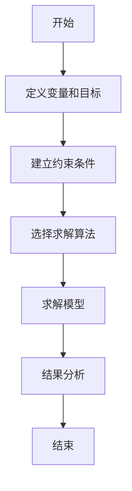
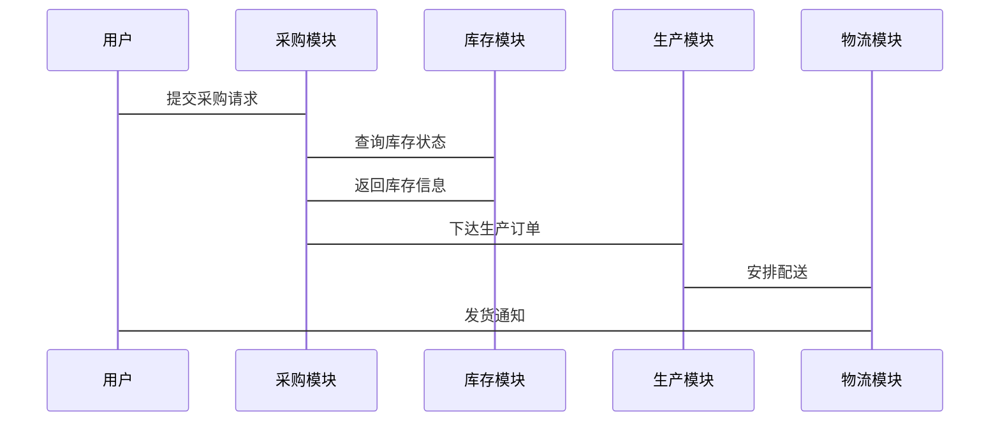

                 


# 彼得林奇对公司供应链管理的看法

## 关键词

供应链管理，彼得·林奇，投资策略，库存优化，供应商管理

## 摘要

本文探讨了彼得·林奇的投资理念如何应用于供应链管理，分析了供应链管理的核心要素，对比了传统方法与彼得·林奇策略的差异，并通过数学模型和案例分析，展示了彼得·林奇方法对供应链优化的积极影响。文章还总结了最佳实践和未来研究方向。

---

# 第1章：供应链管理概述

## 1.1 供应链管理的基本概念

### 1.1.1 供应链管理的定义与目标

供应链管理（Supply Chain Management，SCM）是通过对供应商、制造商、分销商、零售商和消费者等节点的协调与优化，以最小化成本、提高效率和增强灵活性为目标的系统化管理过程。其核心在于整合供应链上下游资源，实现从原材料采购到最终产品交付的高效运作。

### 1.1.2 供应链管理的核心要素

| 核心要素 | 描述 |
|----------|------|
| 供应商管理 | 选择和评估供应商，建立长期合作关系 |
| 库存管理 | 控制库存水平，减少浪费 |
| 生产计划 | 协调生产与需求，避免过剩或短缺 |
| 物流管理 | 优化运输和仓储，降低成本 |
| 信息流管理 | 确保数据准确流通，支持决策 |

### 1.1.3 供应链管理的目标

- **降低成本**：通过优化采购、生产和物流减少开支。
- **提高效率**：加快产品交付速度，满足客户需求。
- **增强灵活性**：快速响应市场变化，调整供应链策略。

## 1.2 彼得·林奇的投资理念

### 1.2.1 彼得·林奇的投资哲学

彼得·林奇是全球著名投资家，强调价值投资，注重企业基本面分析，寻找具有持续增长潜力的公司。他认为，投资者应深入研究企业，选择那些管理优秀、财务健康、行业地位稳固的企业进行投资。

### 1.2.2 投资者的视角看供应链管理

从投资者角度看，供应链管理是企业运营的核心部分，直接影响成本、效率和风险。优秀的供应链管理能提升企业的盈利能力和抗风险能力，从而增加企业价值。

### 1.2.3 供应链管理对企业的价值

- **降低成本**：通过优化供应链减少浪费。
- **提升效率**：加快产品交付，提高客户满意度。
- **增强竞争力**：通过高效供应链赢得市场优势。

## 1.3 供应链管理的重要性

### 1.3.1 供应链管理对企业运营的影响

供应链管理直接影响企业的生产效率、库存水平和成本控制。高效的供应链管理能缩短交货时间，降低库存压力，提升企业运营效率。

### 1.3.2 供应链管理对成本控制的作用

通过优化采购、生产和物流，供应链管理能显著降低企业的运营成本，提升利润率。

### 1.3.3 供应链管理对风险控制的意义

供应链管理能帮助企业识别和 mitigate 供应风险，如供应商延迟或质量问题，确保供应链的稳定性。

---

# 第2章：供应链管理的核心概念与彼得·林奇的观点

## 2.1 供应商管理

### 2.1.1 供应商选择标准

| 标准 | 描述 |
|------|------|
| 质量 | 产品符合标准，质量稳定 |
| 成本 | 价格合理，具有竞争力 |
| 可靠性 | 交货及时，信誉良好 |
| 地理位置 | 位置便利，降低物流成本 |

### 2.1.2 供应商关系管理

- **长期合作**：建立战略伙伴关系，确保供应链稳定性。
- **定期评估**：定期评估供应商表现，及时调整合作关系。
- **信息共享**：与供应商共享需求信息，优化供应链运作。

### 2.1.3 彼得·林奇视角下的供应商评估

彼得·林奇认为，优秀的供应商是企业成功的关键因素之一。他建议投资者关注供应商的财务健康状况、行业地位和管理能力，选择那些具有竞争力且稳定的供应商。

## 2.2 库存管理

### 2.2.1 库存控制策略

- **经济订单量（EOQ）模型**：通过公式计算最优订货量，平衡订货成本和存储成本。
  $$ EOQ = \sqrt{\frac{2DS}{H}} $$
  其中，D为年需求量，S为订货成本，H为存储成本。

- **安全库存**：为应对需求波动，设置安全库存水平，通常基于历史数据和置信水平计算。

### 2.2.2 安全库存的设置

- **需求波动分析**：通过历史销售数据和季节性因素，评估需求波动。
- **服务水平目标**：设定目标服务水平，如95%的订单按时交付，计算对应的安全库存。

### 2.2.3 彼得·林奇对库存管理的看法

彼得·林奇认为，过多的库存是企业资源的浪费，可能导致资金积压和成本增加。他建议企业采用EOQ模型和JIT（准时制）生产，以减少库存压力。

## 2.3 物流管理

### 2.3.1 物流网络设计

- **设施选址**：通过优化模型确定最佳仓库和配送中心位置，降低物流成本。
  $$ \text{总成本} = \text{运输成本} + \text{存储成本} + \text{设施成本} $$

- **运输优化**：采用车辆路径规划（VRP）模型，优化配送路线，减少运输时间。

### 2.3.2 物流成本控制

- **运输模式选择**：比较不同运输方式的成本和时间，选择最优组合。
- **合作运输**：与多家企业共享运输资源，降低固定成本。

### 2.3.3 彼得·林奇的物流管理观点

彼得·林奇强调物流效率的重要性，认为高效的物流网络能显著降低成本，提升企业竞争力。他建议企业采用第三方物流（3PL）服务，专业化管理物流过程。

---

# 第3章：供应链优化的算法原理

## 3.1 线性规划模型

### 3.1.1 优化目标

- 最小化总成本： $$ \text{Minimize } \sum (C_i \cdot x_i) $$
  其中，\( C_i \) 为第i项的成本，\( x_i \) 为数量。

- 满足约束条件： $$ \sum (x_i) \geq D $$ 其中，D为需求量。

### 3.1.2 数学模型

供应链优化的线性规划模型如下：

$$
\begin{align*}
\text{Minimize } & \sum_{i=1}^{n} C_i x_i \\
\text{Subject to } & \sum_{i=1}^{n} x_i \geq D \\
& x_i \geq 0
\end{align*}
$$

其中，\( n \) 为变量数量，\( D \) 为需求量。

### 3.1.3 流程图



---

# 第4章：系统架构设计

## 4.1 系统功能设计

### 4.1.1 领域模型

```mermaid
classDiagram
    class 供应链管理系统 {
        +供应商信息
        +库存数据
        +订单信息
        +物流详情
        -优化算法
        -数据接口
    }
    class 采购模块 {
        +采购计划
        +供应商评估
        -生成采购订单
    }
    class 生产模块 {
        +生产计划
        +原材料需求
        -安排生产
    }
    class 库存模块 {
        +库存监控
        +库存预警
        -优化库存
    }
    class 物流模块 {
        +运输计划
        +配送安排
        -管理物流
    }
    供应链管理系统 <--| 采购模块
    供应链管理系统 <--| 生产模块
    供应链管理系统 <--| 库存模块
    供应链管理系统 <--| 物流模块
```

### 4.1.2 系统架构


## 4.2 接口设计

### 4.2.1 API接口

- **采购模块接口**：提供供应商评估和采购订单生成的API。
- **库存模块接口**：提供库存监控和预警的API。
- **物流模块接口**：提供运输计划和配送安排的API。

### 4.2.2 数据交互流程



---

# 第5章：项目实战

## 5.1 案例分析

### 5.1.1 项目背景

某电子产品制造公司面临库存积压和交货延迟的问题，希望通过优化供应链管理提高效率。

### 5.1.2 优化过程

1. **需求预测**：使用历史销售数据和市场分析预测未来需求。
2. **供应商评估**：评估现有供应商，选择优质供应商。
3. **库存优化**：应用EOQ模型计算最优订货量，减少库存压力。
4. **物流优化**：优化配送路线，降低运输成本。

### 5.1.3 实施结果

- **库存成本降低**：库存水平下降30%，资金周转率提高。
- **交货时间缩短**：平均交货时间减少20%，客户满意度提升。
- **生产效率提升**：生产计划更合理，减少停工待料情况。

---

# 第6章：总结与展望

## 6.1 总结

彼得·林奇的投资理念为供应链管理提供了新的视角，强调供应商选择、库存优化和物流效率的重要性。通过优化供应链管理，企业可以降低成本、提高效率，增强竞争力。

## 6.2 小结

供应链管理是企业运营的核心，彼得·林奇的策略为我们提供了优化供应链的有效方法。未来，随着人工智能和大数据技术的发展，供应链管理将更加智能化和数据驱动。

## 6.3 注意事项

- **数据质量**：确保数据准确，支持决策。
- **模型局限**：线性规划模型假设条件严格，实际应用中需考虑多种因素。
- **持续改进**：供应链优化是一个持续过程，需定期评估和调整。

## 6.4 拓展阅读

- 《供应链管理：战略、规划与实施》
- 彼得·林奇的《选股的艺术》

---

通过本文的分析，我们可以看到，彼得·林奇的投资理念对供应链管理有着重要的启示。未来，随着技术的进步，供应链管理将更加智能化和高效，为企业创造更大的价值。

