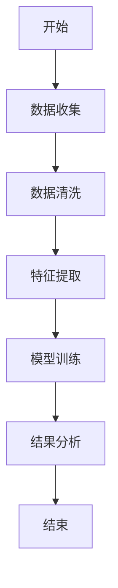
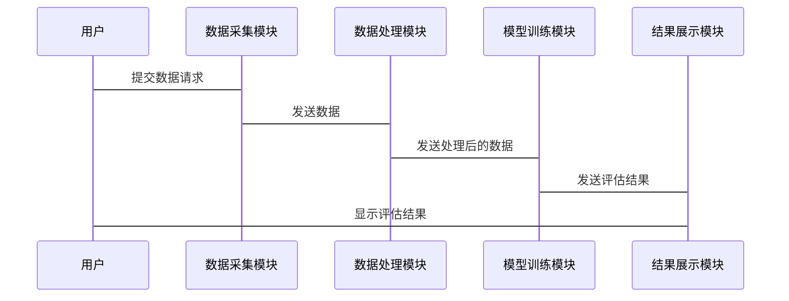

                 


# 彼得·林奇对公司供应链韧性的定量评估方法

## 关键词：
- 供应链韧性
- 定量评估
- 彼得·林奇
- 供应链管理
- 供应链优化

## 摘要：
本文详细探讨了彼得·林奇的投资哲学及其在供应链韧性评估中的应用，通过定量方法分析供应链的韧性，结合数学模型和系统架构，提供了一套完整的评估方法，并通过实际案例分析展示了如何在企业中应用这些方法。

---

# 第一部分: 供应链韧性与定量评估概述

## 第1章: 供应链韧性与定量评估的背景

### 1.1 供应链韧性的定义与重要性

#### 1.1.1 供应链的基本概念
供应链是指从供应商到消费者的整个价值链，包括原材料采购、生产、物流、分销和零售等环节。供应链的稳定性直接影响企业的运营效率和成本控制。

#### 1.1.2 供应链韧性的定义
供应链韧性是指在面对突发事件（如自然灾害、疫情、供应链中断等）时，企业能够迅速恢复并维持供应链正常运作的能力。它是企业在复杂环境中的生存和发展的关键能力。

#### 1.1.3 供应链韧性的重要性
供应链韧性是企业应对不确定性的关键因素。在当今全球化和信息化的背景下，供应链中断的风险日益增加，企业需要通过提升供应链韧性来降低风险，确保业务的连续性。

---

### 1.2 定量评估的必要性

#### 1.2.1 定量评估的定义
定量评估是指通过数学模型和数据分析的方法，对供应链的各个环节进行量化分析，以评估其韧性的过程。

#### 1.2.2 定量评估在供应链管理中的作用
定量评估能够帮助企业识别供应链中的薄弱环节，优化资源配置，提高供应链的整体效率和抗风险能力。

#### 1.2.3 定量评估的边界与外延
定量评估的边界包括供应链的各个节点和关键环节，而外延则涉及企业内外部环境的综合影响，如市场需求波动、政策变化等。

---

### 1.3 彼得·林奇的供应链评估方法

#### 1.3.1 彼得·林奇的投资哲学
彼得·林奇是美国著名的投资专家，他强调通过深入分析企业的基本面，寻找那些具有持续增长潜力的企业进行投资。他的投资哲学注重长期价值和风险管理。

#### 1.3.2 林奇方法在供应链评估中的应用
林奇方法的核心是通过分析企业的财务数据和市场表现，评估其供应链的稳定性和韧性。这种方法可以用于识别供应链中的潜在风险，并制定相应的应对策略。

#### 1.3.3 林奇方法的核心要素
- 财务数据分析：通过企业的财务报表，评估其供应链的健康状况。
- 市场表现分析：通过企业的股价波动，判断市场对供应链韧性的认可程度。
- 风险管理：通过识别潜在风险点，制定应对策略。

---

## 第2章: 供应链韧性评估的核心概念

### 2.1 核心概念与属性

#### 2.1.1 供应链韧性评估的关键指标
- 供应链中断概率：评估供应链在特定情况下中断的可能性。
- 恢复时间：评估供应链在中断后恢复所需的时间。
- 成本影响：评估供应链中断对企业成本和利润的影响。

#### 2.1.2 供应链韧性评估的属性特征对比表

| 属性       | 韧性高 | 韧性低 |
|------------|--------|--------|
| 中断概率   | 低     | 高     |
| 恢复时间   | 短     | 长     |
| 成本影响   | 小     | 大     |

#### 2.1.3 供应链韧性评估的ER实体关系图

```mermaid
erd
    supplier
    product
    order
    customer
    inventory
    ship
    公司
    原材料
    加工环节
    终端消费者
    link: 公司 --> 原材料
    link: 原材料 --> 加工环节
    link: 加工环节 --> 终端消费者
```

---

### 2.2 核心概念的联系与结构

#### 2.2.1 供应链韧性评估的概念结构
供应链韧性评估是一个多维度的系统工程，涉及企业内部的生产、物流、库存管理，以及外部的供应商、客户和市场环境。

#### 2.2.2 核心要素的组成与关系
供应链韧性评估的核心要素包括：
- 供应商的稳定性
- 生产能力的弹性
- 物流网络的多样性
- 库存管理的灵活性
- 市场需求的预测能力

这些要素相互关联，共同构成了供应链韧性的整体结构。

#### 2.2.3 概念之间的相互作用
供应商的稳定性直接影响企业的生产能力，而生产能力的弹性又影响企业的库存管理和物流网络。市场需求的预测能力则是供应链韧性评估的重要外部因素。

---

## 第3章: 供应链韧性评估的数学模型与算法原理

### 3.1 算法原理讲解

#### 3.1.1 供应链韧性评估的算法流程


#### 3.1.2 算法的数学模型与公式
供应链韧性评估的数学模型如下：
$$
R = \sum_{i=1}^{n} w_i \cdot x_i
$$
其中，R是供应链韧性的综合评分，w_i是各个评估指标的权重，x_i是各个指标的具体得分。

#### 3.1.3 算法的实现步骤
1. 数据收集：收集供应链各环节的运营数据，包括供应商稳定性、生产效率、物流成本等。
2. 数据清洗：去除异常数据，确保数据的准确性和完整性。
3. 特征提取：提取关键特征，如供应商的响应时间、物流网络的覆盖范围等。
4. 模型训练：使用机器学习算法（如线性回归或决策树）对数据进行建模，计算各个指标的权重和得分。
5. 结果分析：根据模型输出的结果，评估供应链的韧性，并制定相应的优化策略。

---

### 3.2 算法的详细实现

#### 3.2.1 供应链韧性评估的Python实现代码

```python
import pandas as pd
from sklearn.linear_model import LinearRegression
from sklearn.metrics import mean_squared_error

# 数据加载
data = pd.read_csv('supply_chain.csv')

# 特征提取
X = data[['supplier_stability', 'production_capacity', 'logistics_cost']]
y = data['resilience_score']

# 模型训练
model = LinearRegression()
model.fit(X, y)

# 模型预测
y_pred = model.predict(X)

# 模型评估
mse = mean_squared_error(y, y_pred)
print(f"均方误差: {mse}")
```

#### 3.2.2 代码的功能与作用
- 数据加载：读取供应链相关数据。
- 特征提取：选择影响供应链韧性的关键特征。
- 模型训练：使用线性回归模型对数据进行拟合。
- 模型预测：对测试数据进行预测，并计算模型的均方误差。

---

## 第4章: 供应链韧性评估的系统架构与设计

### 4.1 系统分析与架构设计

#### 4.1.1 系统的功能模块划分
- 数据采集模块：负责收集供应链各环节的数据。
- 数据处理模块：对数据进行清洗和预处理。
- 模型训练模块：使用机器学习算法对数据进行建模。
- 结果展示模块：将评估结果以可视化的方式呈现给用户。

#### 4.1.2 系统的架构设计图


#### 4.1.3 系统的接口设计
- 数据采集接口：接收来自传感器、数据库或手动输入的数据。
- 数据处理接口：对数据进行清洗和预处理，确保数据的可用性。
- 模型训练接口：接收处理后的数据，调用机器学习算法进行模型训练。
- 结果展示接口：将模型输出的结果以图表或报告的形式展示给用户。

---

### 4.2 系统的交互设计

#### 4.2.1 系统的交互流程


#### 4.2.2 系统的交互序列图


---

## 第5章: 项目实战与案例分析

### 5.1 项目环境的安装与配置

#### 5.1.1 环境搭建的步骤
1. 安装Python：建议使用最新版本的Python 3.x。
2. 安装必要的库：包括Pandas、Scikit-learn、Matplotlib等。
3. 下载数据集：从可靠的来源获取供应链相关数据。

#### 5.1.2 环境搭建的注意事项
- 确保所有库的版本兼容。
- 数据集的格式应与代码一致。

---

### 5.2 项目核心代码的实现

#### 5.2.1 核心代码的编写
```python
import pandas as pd
from sklearn.linear_model import LinearRegression
from sklearn.metrics import mean_squared_error

# 数据加载
data = pd.read_csv('supply_chain.csv')

# 特征提取
X = data[['supplier_stability', 'production_capacity', 'logistics_cost']]
y = data['resilience_score']

# 模型训练
model = LinearRegression()
model.fit(X, y)

# 模型预测
y_pred = model.predict(X)

# 模型评估
mse = mean_squared_error(y, y_pred)
print(f"均方误差: {mse}")
```

#### 5.2.2 代码的功能与作用
- 数据加载：读取供应链相关数据。
- 特征提取：选择影响供应链韧性的关键特征。
- 模型训练：使用线性回归模型对数据进行拟合。
- 模型预测：对测试数据进行预测，并计算模型的均方误差。

---

### 5.3 案例分析与详细解读

#### 5.3.1 案例背景介绍
假设某企业是一家制造型企业，其供应链包括原材料采购、生产加工和物流分销三个环节。企业希望通过对供应链的韧性评估，优化其运营效率和抗风险能力。

#### 5.3.2 案例的分析与解决
1. 数据收集：收集原材料供应商的稳定性数据、生产加工能力数据和物流分销成本数据。
2. 数据处理：对数据进行清洗和预处理，确保数据的准确性和完整性。
3. 模型训练：使用线性回归模型对数据进行建模，计算供应链韧性评估的综合得分。
4. 结果分析：根据模型输出的结果，识别供应链中的薄弱环节，并制定相应的优化策略。

#### 5.3.3 案例的结果与意义
通过案例分析，企业可以识别出供应链中的潜在风险点，如供应商的不稳定性或物流成本的高昂，并通过优化供应商选择或增加物流网络的多样性来提升供应链的韧性。

---

## 第6章: 总结与展望

### 6.1 最佳实践 tips
- 定期评估供应链的韧性，及时发现并解决问题。
- 与供应商建立长期合作关系，提升供应链的稳定性。
- 投资于技术手段，如大数据和人工智能，提高供应链管理的效率和准确性。

### 6.2 小结
本文详细探讨了彼得·林奇的投资哲学及其在供应链韧性评估中的应用，通过定量方法分析供应链的韧性，结合数学模型和系统架构，提供了一套完整的评估方法，并通过实际案例分析展示了如何在企业中应用这些方法。

### 6.3 注意事项
- 在实际应用中，应根据企业的实际情况调整模型的参数和权重。
- 数据的准确性和完整性是模型评估的重要前提，需特别注意数据的采集和处理。

### 6.4 拓展阅读
- 供应链管理的相关书籍和文献。
- 机器学习在供应链管理中的应用案例。

---

通过以上步骤，我们可以系统地评估和优化供应链的韧性，为企业在复杂多变的市场环境中提供有力的支持。

