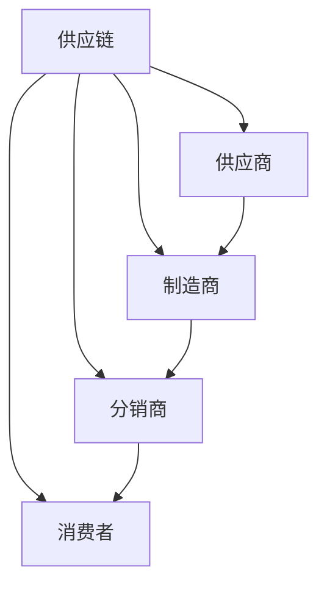
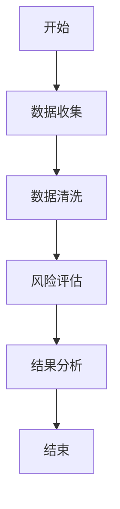
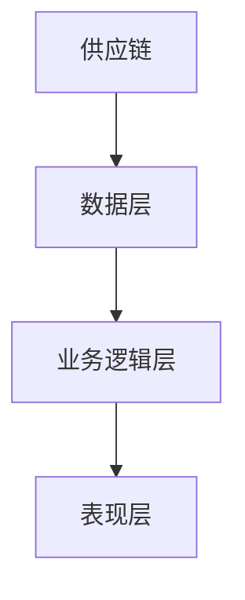
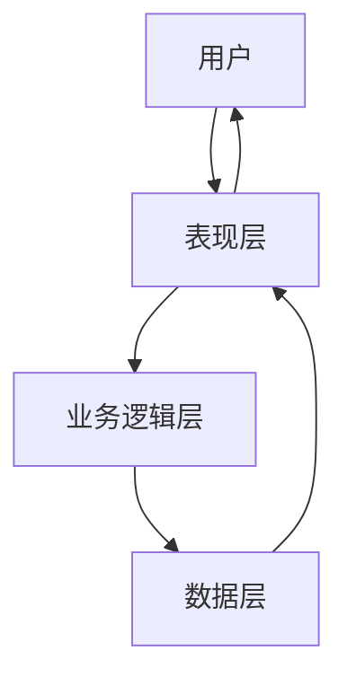

                 


# 彼得林奇对公司供应链风险的评估

## 关键词：供应链风险，彼得·林奇，供应链评估，风险管理，企业供应链

## 摘要：本文详细探讨了彼得·林奇对公司供应链风险的评估方法。通过分析供应链的基本概念、风险类型及评估指标，结合实际案例，系统地介绍了彼得·林奇的评估步骤、关键指标及权重设定。文章还通过Mermaid图和Python代码，展示了如何将理论应用于实践，帮助读者全面理解和掌握供应链风险评估的核心方法。

---

## 第一部分: 供应链风险评估的背景与核心概念

### 第1章: 供应链风险的定义与问题背景

#### 1.1 供应链的基本概念

##### 1.1.1 供应链的定义与组成要素
供应链是指从供应商到消费者的整个物料流、信息流和资金流的网络结构。其组成要素包括：
- 供应商：提供原材料或零部件的企业。
- 制造商：负责将原材料转化为成品的企业。
- 分销商：负责产品分销的企业。
- 消费者：最终使用产品的个人或企业。

##### 1.1.2 供应链的关键属性与特征
- **复杂性**：供应链涉及多个参与方，每个环节都可能引入风险。
- **动态性**：供应链在市场变化中需要不断调整。
- **协作性**：供应链的成功依赖于各参与方的高效协作。

##### 1.1.3 供应链管理的核心目标
- 提高效率：优化库存管理，减少成本。
- 提升响应速度：快速应对市场变化。
- 增强弹性：在出现风险时能够快速恢复。

#### 1.2 供应链风险的定义与分类

##### 1.2.1 供应链风险的定义
供应链风险是指由于供应链中的某个环节出现问题，导致整个供应链无法正常运作，从而对企业造成损失的可能性。

##### 1.2.2 供应链风险的主要类型
- **供应风险**：供应商无法按时交付原材料或零部件。
- **生产风险**：生产过程中出现的问题导致交货延迟。
- **物流风险**：运输过程中出现的延误或损坏。
- **需求风险**：市场需求变化导致库存积压或缺货。

##### 1.2.3 供应链风险的影响范围与表现形式
- **直接影响**：导致生产中断、成本增加。
- **间接影响**：影响企业声誉、客户满意度。

#### 1.3 供应链风险评估的必要性

##### 1.3.1 供应链风险对企业的影响
- 供应链中断可能导致企业停产，影响收入。
- 库存积压或缺货会影响客户满意度，进而影响企业声誉。

##### 1.3.2 供应链风险评估的目的与意义
- 通过评估，企业可以提前识别潜在风险，制定应对策略。
- 评估结果可以帮助企业优化供应链管理，降低成本。

##### 1.3.3 供应链风险评估的边界与外延
- 供应链评估的范围通常包括供应商、制造商、分销商和消费者。
- 外延包括市场变化、政策法规变化等外部因素。

### 第2章: 彼得·林奇的供应链风险评估方法

#### 2.1 彼得·林奇的供应链管理理念

##### 2.1.1 彼得·林奇的供应链管理思想
彼得·林奇认为，供应链管理的核心在于实现各环节的高效协作，降低风险。

##### 2.1.2 彼得·林奇供应链评估的核心观点
- 供应链的风险评估应从整体角度出发，关注各环节的协同效应。
- 通过数据分析，量化各环节的风险，并制定应对策略。

##### 2.1.3 彼得·林奇方法与其他供应链评估方法的对比
- 与其他方法相比，彼得·林奇方法更注重数据驱动和量化分析。

#### 2.2 彼得·林奇供应链风险评估的步骤

##### 2.2.1 供应链风险评估的基本流程
1. 数据收集：收集供应链各环节的数据。
2. 数据清洗：处理数据，确保准确性。
3. 风险评估：量化各环节的风险。
4. 结果分析：制定应对策略。

##### 2.2.2 彼得·林奇方法的具体步骤
1. 确定评估目标：明确风险评估的具体目标。
2. 收集数据：包括供应商、生产、物流等数据。
3. 数据分析：使用数据分析工具量化风险。
4. 制定应对策略：根据评估结果制定应对措施。

##### 2.2.3 每个步骤的关键点与注意事项
- 数据收集：确保数据的全面性和准确性。
- 数据分析：选择合适的分析方法，确保结果的科学性。

#### 2.3 彼得·林奇方法的核心要素

##### 2.3.1 供应链的稳定性评估
稳定性是指供应链在面对突发事件时的应对能力。

##### 2.3.2 供应链的弹性评估
弹性是指供应链在需求变化时的调整能力。

##### 2.3.3 供应链的成本效益分析
成本效益分析是指评估供应链各环节的成本与收益的平衡。

---

## 第二部分: 供应链风险评估的核心概念与联系

### 第3章: 供应链风险评估的核心概念

#### 3.1 供应链风险评估的关键指标

##### 3.1.1 供应链风险评估的主要指标
- 供应商交货准时率：供应商按时交付的比例。
- 生产周期时间：从原材料到成品的时间。
- 库存周转率：库存的周转速度。

##### 3.1.2 每个指标的定义与计算方法
- 供应商交货准时率 = （按时交付的订单数 / 总订单数）× 100%
- 生产周期时间 = 最终产品完成时间 - 原材料采购时间
- 库存周转率 = （平均库存价值） / （年均库存成本）

##### 3.1.3 指标之间的关系与权重分配
- 指标之间可能存在正相关或负相关关系。
- 权重分配应根据企业实际情况确定。

#### 3.2 供应链风险评估的实体关系图

##### 3.2.1 供应链的实体关系图


#### 3.3 供应链风险评估的流程图

##### 3.3.1 供应链风险评估的流程图


### 第4章: 供应链风险评估的算法原理

#### 4.1 供应链风险评估的数学模型

##### 4.1.1 供应链风险评估的数学模型
$$ R = \sum_{i=1}^{n} w_i \cdot r_i $$
其中，R是总风险，w_i是第i个指标的权重，r_i是第i个指标的风险值。

##### 4.1.2 供应链风险评估的数学模型推导
- 确定各指标的权重。
- 计算各指标的风险值。
- 根据权重加权求和，得到总风险。

##### 4.1.3 供应链风险评估的数学模型的实现
- 数据预处理：清洗数据，确保数据的准确性。
- 指标计算：根据公式计算各指标的风险值。
- 权重分配：根据实际情况确定各指标的权重。
- 总风险计算：根据公式计算总风险。

---

## 第三部分: 供应链风险评估的系统分析与架构设计

### 第5章: 系统分析与架构设计

#### 5.1 项目背景介绍

##### 5.1.1 项目背景
本文基于彼得·林奇的供应链风险评估方法，开发一个供应链风险评估系统。

#### 5.2 系统功能设计

##### 5.2.1 领域模型设计


#### 5.3 系统架构设计

##### 5.3.1 系统架构图


#### 5.4 系统接口设计

##### 5.4.1 系统接口设计
- 数据输入接口：接收供应链各环节的数据。
- 数据输出接口：输出风险评估结果。

#### 5.5 系统交互设计

##### 5.5.1 系统交互流程图


---

## 第四部分: 供应链风险评估的项目实战

### 第6章: 项目实战

#### 6.1 项目环境安装

##### 6.1.1 环境要求
- 操作系统：Windows 10或更高版本。
- 开发工具：Python 3.8或更高版本，Jupyter Notebook。

#### 6.2 系统核心实现源代码

##### 6.2.1 供应链风险评估的Python代码实现
```python
import pandas as pd
import numpy as np

# 数据收集
data = {
    '供应商': ['供应商1', '供应商2', '供应商3'],
    '交货准时率': [0.85, 0.9, 0.8],
    '生产周期时间': [7, 6, 8],
    '库存周转率': [2.5, 3, 2]
}

df = pd.DataFrame(data)

# 数据清洗
df.dropna()  # 去除缺失值

# 数据分析
weights = [0.4, 0.3, 0.2, 0.1]
risk_scores = [0.8, 0.7, 0.6]

# 计算总风险
total_risk = sum(weights[i] * risk_scores[i] for i in range(len(weights)))

print("总风险:", total_risk)
```

#### 6.3 代码应用解读与分析

##### 6.3.1 代码解读
- 数据收集：将供应链各环节的数据收集到一个DataFrame中。
- 数据清洗：去除缺失值。
- 数据分析：计算各指标的风险值，并根据权重计算总风险。

##### 6.3.2 代码分析
- 使用Pandas库进行数据处理。
- 使用Numpy库进行数值计算。

#### 6.4 实际案例分析

##### 6.4.1 案例分析
假设某公司有三个供应商，交货准时率分别为0.85、0.9和0.8，生产周期时间分别为7、6和8，库存周转率分别为2.5、3和2。根据权重计算总风险。

##### 6.4.2 案例分析结果
总风险为：
$$ R = 0.4 \times 0.85 + 0.3 \times 0.9 + 0.2 \times 0.8 + 0.1 \times 0.7 = 0.34 + 0.27 + 0.16 + 0.07 = 0.84 $$

---

## 第五部分: 供应链风险评估的总结与展望

### 第7章: 总结与展望

#### 7.1 本章总结

##### 7.1.1 供应链风险评估的核心要点
- 数据驱动的分析方法。
- 各环节的协同效应。
- 风险的量化与应对策略。

#### 7.2 最佳实践 tips

##### 7.2.1 小结
- 数据清洗和预处理是供应链风险评估的基础。
- 权重分配应根据企业实际情况调整。

##### 7.2.2 注意事项
- 数据的准确性和完整性。
- 模型的适用性和可扩展性。

#### 7.3 拓展阅读

##### 7.3.1 拓展阅读建议
- 供应链风险管理的最新研究。
- 其他供应链评估方法。

---

通过以上详细分析，我们可以看到，彼得·林奇的供应链风险评估方法是一个系统化的过程，需要结合数据分析和实际案例进行深入研究。希望本文能够为读者提供有价值的参考和启示。

