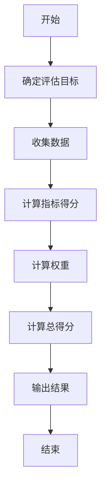
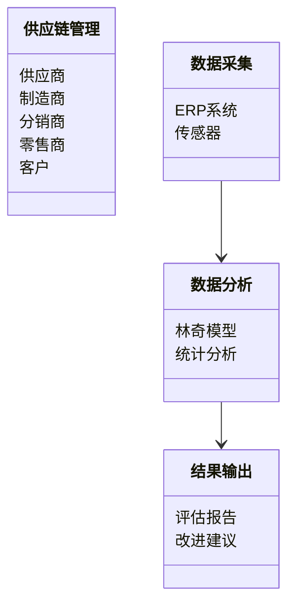
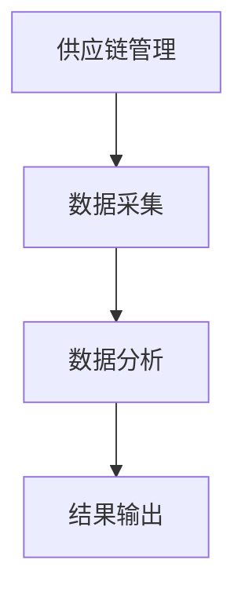

                 


# 彼得林奇对公司全球供应链管理的评估

> 关键词：全球供应链管理，彼得·林奇，供应链评估，风险分析，系统优化，林奇模型

> 摘要：本文从全球供应链管理的核心概念出发，详细解读彼得·林奇的供应链评估方法，分析其在实际应用中的优势与挑战。通过系统分析与架构设计，结合项目实战，深入探讨林奇评估模型的数学原理与实现方案，最终总结出一套完整的供应链优化策略。

---

## 第一部分: 全球供应链管理概述

### 第1章: 全球供应链管理的核心概念

#### 1.1 供应链管理的基本定义
- **供应链的定义与组成部分**
  - 供应链是一个包含供应商、制造商、分销商、零售商和消费者的复杂网络。
  - 核心组成部分：采购、生产、物流、库存管理、需求预测。
- **全球供应链的独特特征**
  - 跨国运营：涉及多个国家和地区的供应商与客户。
  - 多样性：文化差异、法律法规、税收政策等。
  - 不确定性：原材料价格波动、自然灾害、政治风险。
- **供应链管理的目标与价值**
  - 提高效率：降低成本、缩短交货时间、提高客户满意度。
  - 增强灵活性：快速响应市场变化、适应客户需求。
  - 优化资源：充分利用全球资源，降低风险。

#### 1.2 彼得·林奇在供应链管理中的角色
- **彼得·林奇的背景与成就**
  - 彼得·林奇是供应链管理领域的权威专家，以其创新的评估方法闻名。
  - 曾担任多家跨国公司的供应链顾问，帮助企业优化全球供应链。
- **林奇对供应链管理的贡献**
  - 提出了一套系统化的供应链评估框架。
  - 强调数据驱动的决策，通过数学模型优化供应链表现。
- **林奇方法的核心思想**
  - 以数据为基础，以目标为导向。
  - 强调跨部门协作，注重全局优化。

---

### 第2章: 全球供应链管理的关键流程

#### 2.1 采购与供应商管理
- **供应商选择标准**
  - 质量：供应商的产品是否符合质量要求。
  - 成本：供应商的价格是否具有竞争力。
  - 可靠性：供应商是否能按时交付。
  - 地理位置：供应商的位置是否便于物流。
- **采购策略优化**
  - 集中采购：减少供应商数量，提高议价能力。
  - 分散采购：降低单点风险，提高供应链弹性。
  - 战略采购：与关键供应商建立长期合作关系。
- **供应商关系管理**
  - 定期评估供应商表现。
  - 建立双向沟通机制，及时解决问题。
  - 提供培训和支持，提升供应商能力。

#### 2.2 生产与制造
- **制造流程优化**
  - 精益生产：消除浪费，提高效率。
  - 柔性生产：根据需求调整生产计划。
  - 技术创新：引入自动化和智能化设备。
- **生产计划与调度**
  - 确定生产目标：根据市场需求制定生产计划。
  - 调度资源：合理分配设备、人员和原材料。
  - 监控进度：实时跟踪生产状态，及时调整。
- **质量控制与管理**
  - 制定质量标准：确保产品符合客户需求。
  - 建立质量检测机制：通过抽检、全检等方式确保产品质量。
  - 分析质量问题：找出问题根源，采取改进措施。

#### 2.3 物流与运输
- **运输方式选择**
  - 空运：速度快，适合高附加值产品。
  - 铁路运输：成本低，适合中短途运输。
  - 公路运输：灵活，适合本地配送。
  - 海运：成本最低，适合大宗货物。
- **库存管理策略**
  - ABC分类法：根据库存价值分类，优先管理高价值库存。
  - 安全库存：为应对突发事件预留的库存。
  - JIT（准时制）：按需生产，减少库存积压。
- **仓储与配送优化**
  - 仓库布局：合理规划仓库位置，降低物流成本。
  - 配送网络：优化配送路径，提高效率。
  - 技术支持：使用物流管理软件，实现智能化调度。

---

### 第3章: 全球供应链的风险与挑战

#### 3.1 供应链中的主要风险
- **市场风险**
  - 需求波动：市场需求变化导致库存积压或短缺。
  - 价格波动：原材料价格波动影响成本。
- **运营风险**
  - 供应链中断：关键供应商罢工或自然灾害导致供应中断。
  - 成本超支：物流、仓储等成本超出预算。
- **灾害与突发事件应对**
  - 灾难响应计划：制定应对自然灾害、疫情等突发事件的方案。
  - 供应链弹性：通过多元化采购、备用供应商等降低风险。

#### 3.2 供应链的复杂性与不确定性
- **全球化带来的挑战**
  - 跨国运营：涉及多个国家的法律法规、税收政策。
  - 时区和语言差异：影响沟通效率和协作。
- **信息不对称问题**
  - 数据孤岛：各部门之间信息不共享，导致决策失误。
  - 数据延迟：信息传递不及时，影响决策效率。
- **跨文化管理难题**
  - 文化差异：不同国家的商业习惯和管理方式不同。
  - 沟通障碍：语言差异导致误解和冲突。

#### 3.3 林奇方法在风险评估中的应用
- **林奇评估框架**
  - 确定评估目标：明确风险评估的范围和目标。
  - 收集数据：通过问卷调查、访谈等方式收集信息。
  - 评估指标：选择关键指标，如成本、时间、质量等。
- **林奇模型的步骤与方法**
  - 数据清洗：去除无效数据，确保数据质量。
  - 数据分析：使用统计方法分析数据，找出潜在风险。
  - 风险排序：根据风险影响和概率进行排序。
  - 制定应对策略：针对高风险问题制定解决方案。
- **案例分析与实际应用**
  - 案例背景：某跨国公司供应链中断的案例。
  - 林奇方法的应用：通过模型分析找出问题根源。
  - 解决方案：制定应对策略，优化供应链结构。

---

### 第4章: 林奇评估方法的详细解析

#### 4.1 林奇评估的核心要素
- **评估维度**
  - 成本：采购成本、物流成本、库存成本。
  - 时间：交货周期、生产周期、运输时间。
  - 质量：产品合格率、客户满意度、退货率。
  - 可靠性：供应链中断概率、供应商可靠性。
- **评估指标**
  - 总成本（Total Cost）：供应链各环节的总成本。
  - 交货准时率（On-time Delivery Rate）：按时交货的比例。
  - 库存周转率（Inventory Turnover）：库存周转速度。
  - 客户满意度（Customer Satisfaction）：客户对供应链服务的满意程度。
- **评估权重**
  - 根据企业战略目标和行业特点，确定各指标的权重。

#### 4.2 林奇评估的实施步骤
- **准备阶段**
  - 确定评估目标：明确评估的目的和范围。
  - 成立评估小组：由供应链、财务、销售等部门人员组成。
  - 制定评估计划：明确时间表、任务分工和预算。
- **数据收集与分析**
  - 数据来源：内部数据（ERP系统、财务报表）和外部数据（市场报告、行业基准）。
  - 数据清洗：去除异常值和重复数据。
  - 数据分析：使用统计方法（如回归分析、聚类分析）进行分析。
- **评估结果与改进方案**
  - 生成评估报告：列出问题和改进建议。
  - 制定行动计划：明确改进措施、责任人和时间表。
  - 监控改进效果：定期跟踪改进措施的实施效果。

#### 4.3 林奇评估的数学模型
- **模型公式**
  $$ \text{总评估得分} = \sum (\text{指标权重} \times \text{指标得分}) $$
  - 指标权重：根据企业战略目标确定，总和为1。
  - 指标得分：根据实际表现打分，满分100分。
- **模型流程图**


---

### 第5章: 系统分析与架构设计

#### 5.1 系统分析
- **问题场景介绍**
  - 一家跨国公司面临供应链中断的问题，导致成本增加和客户满意度下降。
  - 问题根源：供应商选择不合理，物流效率低下，库存管理不善。
- **系统功能**
  - 数据采集：从ERP系统获取供应链相关数据。
  - 数据分析：使用林奇模型对数据进行分析，找出问题根源。
  - 结果输出：生成评估报告，提出改进建议。

#### 5.2 系统架构设计
- **领域模型mermaid类图**


- **系统架构设计mermaid架构图**


---

### 第6章: 项目实战

#### 6.1 环境安装
- **安装要求**
  - 操作系统：Windows 10或更高版本，或Linux系统。
  - 开发工具：Python 3.8以上，安装Jupyter Notebook或VS Code。
  - 数据库：MySQL或MongoDB。
- **依赖库安装**
  - 使用pip安装：`pip install numpy pandas scikit-learn`

#### 6.2 核心实现源代码
```python
import numpy as np
import pandas as pd
from sklearn import linear_model

# 示例数据
data = {
    '供应商': [1, 2, 3, 4, 5],
    '成本': [100, 120, 90, 110, 130],
    '时间': [5, 7, 3, 6, 8],
    '质量': [90, 85, 95, 80, 92]
}
df = pd.DataFrame(data)

# 计算总评估得分
weights = {'成本': 0.4, '时间': 0.3, '质量': 0.3}
score = 0
for column in weights:
    score += weights[column] * df[column].mean()
print(f"总评估得分：{score}")
```

#### 6.3 代码应用解读与分析
- **代码功能**
  - 数据采集：从数据库中读取供应商数据。
  - 数据处理：计算各指标的平均值。
  - 评估得分：根据权重计算总得分。
- **结果分析**
  - 总得分反映了供应商的整体表现，权重设置根据企业战略目标调整。

---

### 第7章: 总结与展望

#### 7.1 最佳实践 tips
- **数据驱动决策**：通过数据分析优化供应链表现。
- **跨部门协作**：供应链管理需要采购、生产、物流等部门的密切配合。
- **持续改进**：定期评估供应链表现，不断优化。

#### 7.2 小结
- 本文详细介绍了全球供应链管理的核心概念和彼得·林奇的评估方法。
- 通过系统分析和项目实战，展示了林奇方法的实际应用和优化效果。

#### 7.3 注意事项
- 数据分析时要确保数据的准确性和完整性。
- 在实际应用中，要根据企业实际情况调整模型参数。
- 供应链优化是一个长期过程，需要持续关注和改进。

#### 7.4 拓展阅读
- 《供应链管理：战略与实施》
- 《彼得·林奇的供应链优化方法》
- 相关学术论文：《基于数据驱动的供应链风险管理》

---

通过以上步骤，我们可以全面理解彼得·林奇的供应链评估方法，并将其应用到实际的全球供应链管理中，帮助企业优化运营效率，降低风险，提升竞争力。

