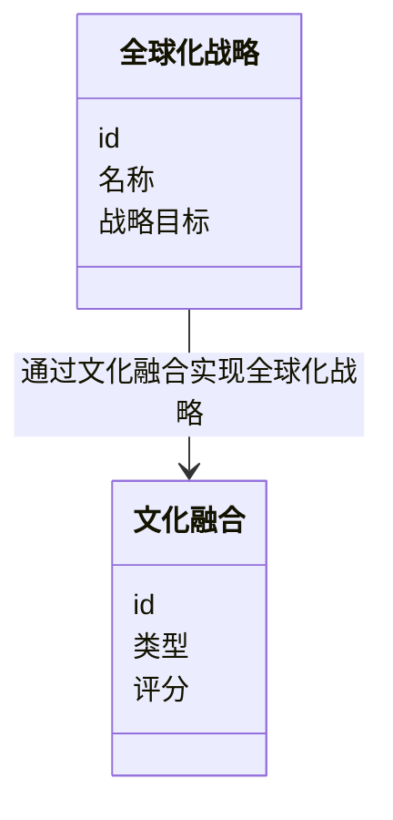
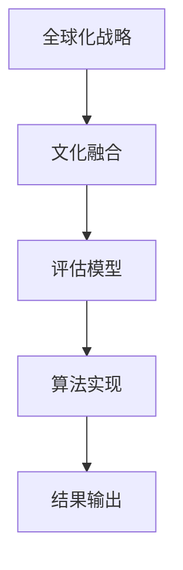

                 


# 彼得林奇对公司全球化战略的文化融合评估

## 关键词
- 彼得林奇
- 全球化战略
- 文化融合
- 并购评估
- 跨文化管理

## 摘要
本书以彼得林奇的并购案例为基础，探讨全球化战略中的文化融合问题。通过分析文化融合对企业发展的影响，提出一套系统的评估方法，帮助企业在全球化进程中实现文化融合，提升企业绩效。

## 目录大纲

### 第一章：全球化战略的背景与重要性

#### 1.1 全球化战略的定义与特点
- 1.1.1 全球化战略的定义
- 1.1.2 全球化战略的核心特点
- 1.1.3 全球化战略对企业的影响

#### 1.2 文化融合的重要性
- 1.2.1 文化在企业全球化中的作用
- 1.2.2 文化冲突与协同效应
- 1.2.3 文化融合对企业绩效的影响

### 第二章：彼得林奇的并购与文化融合案例

#### 2.1 彼得林奇并购案例分析
- 2.1.1 彼得林奇并购策略概述
- 2.1.2 典型并购案例分析
- 2.1.3 并购中的文化融合挑战

#### 2.2 彼得林奇的文化融合评估方法
- 2.2.1 评估方法的背景
- 2.2.2 评估指标的选择
- 2.2.3 评估方法的实施步骤

### 第三章：全球化战略与文化融合的核心概念

#### 3.1 全球化战略的核心要素
- 3.1.1 企业战略目标
- 3.1.2 跨文化管理
- 3.1.3 全球化团队建设

#### 3.2 文化融合的核心要素
- 3.2.1 企业文化认同
- 3.2.2 跨文化沟通
- 3.2.3 文化冲突管理

### 第四章：全球化战略与文化融合的关联分析

#### 4.1 全球化战略与文化融合的属性对比
- 4.1.1 属性维度
- 4.1.2 属性特征
- 4.1.3 属性对比表格

#### 4.2 全球化战略与文化融合的ER实体关系图
```mermaid
er
    entity 全球化战略 {
        id 全球化战略ID
        名称 战略名称
    }
    entity 文化融合 {
        id 文化融合ID
        类型 文化类型
    }
    relationship 全球化战略与文化融合 {
        全球化战略 -> 文化融合 : 通过文化融合实现全球化战略
    }
```

### 第五章：全球化战略与文化融合的评估模型

#### 5.1 评估模型的构建
- 5.1.1 评估指标的选择
- 5.1.2 评估权重的确定
- 5.1.3 评估模型的建立

#### 5.2 评估算法的实现
- 5.2.1 算法原理
- 5.2.2 算法流程
- 5.2.3 算法实现的Python代码示例
```python
def cultural_fusion_assessment(strategies):
    weights = [0.4, 0.3, 0.3]
    scores = []
    for strategy in strategies:
        score = sum(weights[i] * strategy[i] for i in range(len(weights)))
        scores.append(score)
    return scores

strategies = [
    [0.8, 0.7, 0.6],
    [0.6, 0.8, 0.7],
    [0.7, 0.6, 0.8]
]

print(cultural_fusion_assessment(strategies))
```

### 第六章：全球化战略与文化融合的系统分析

#### 6.1 系统功能设计
- 6.1.1 领域模型类图


#### 6.2 系统架构设计
- 6.2.1 系统架构图


### 第七章：全球化战略与文化融合的项目实战

#### 7.1 项目环境安装
- 7.1.1 安装Python
- 7.1.2 安装必要的库
- 7.1.3 配置开发环境

#### 7.2 核心代码实现
- 7.2.1 评估模型的代码实现
- 7.2.2 算法实现的代码解读
- 7.2.3 项目案例分析

### 第八章：全球化战略与文化融合的最佳实践

#### 8.1 小结
- 8.1.1 全球化战略的核心要点
- 8.1.2 文化融合的关键因素
- 8.1.3 评估方法的总结

#### 8.2 注意事项
- 8.2.1 并购中的文化风险
- 8.2.2 文化融合的挑战
- 8.2.3 评估方法的应用建议

#### 8.3 拓展阅读
- 8.3.1 相关书籍推荐
- 8.3.2 学术论文推荐
- 8.3.3 行业报告推荐

---

通过以上目录结构，文章将系统地介绍彼得林奇对公司全球化战略的文化融合评估，从理论到实践，从案例分析到系统实现，为读者提供全面且深入的指导。

