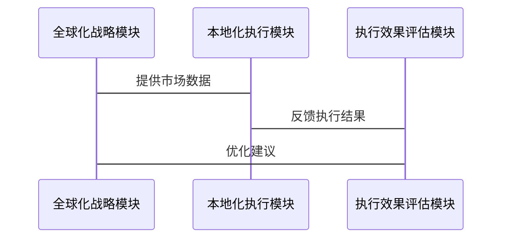

                 


# 彼得林奇对公司全球化战略的本地化执行力评估

> 关键词：全球化战略，本地化执行，彼得林奇，投资理念，评估模型

> 摘要：本文结合彼得林奇的投资理念，探讨全球化战略在本地化执行中的效率和效果。通过构建数学模型和实际案例分析，提出了一套完整的评估框架，帮助企业更好地制定和实施本地化战略。

---

# 引言

在全球化浪潮的推动下，跨国公司不断扩展业务版图，本地化执行成为确保全球化战略成功的关键。彼得林奇作为投资大师，其长期价值投资理念为我们提供了深刻的启示。本文将从理论到实践，详细探讨如何在全球化战略中实现本地化执行力的高效评估。

---

# 第一部分：全球化战略与本地化执行概述

## 第1章：全球化战略与本地化执行的背景与概念

### 1.1 全球化战略的定义与特点

全球化战略是指企业在全球范围内配置资源、拓展市场和优化运营的策略。其核心特点包括：

1. **资源优化**：在全球范围内配置最优资源。
2. **市场拓展**：进入新的地理市场，扩大业务范围。
3. **风险管理**：分散风险，降低对单一市场的依赖。

### 1.2 本地化执行的定义与特点

本地化执行是将全球化战略在特定市场转化为具体行动的过程。其特点包括：

1. **文化适应**：根据当地文化、法律和消费习惯调整策略。
2. **资源投入**：在特定市场进行针对性投资和资源配置。
3. **快速响应**：能够迅速应对市场变化和消费者需求。

### 1.3 彼得林奇投资理念与全球化战略的联系

彼得林奇强调长期价值和深入研究，这与全球化战略的本地化执行有异曲同工之处。他主张投资那些在特定市场具备竞争优势的企业，这启示我们在全球化过程中，本地化执行是实现长期价值的关键。

### 1.4 本章小结

全球化战略与本地化执行相辅相成，彼得林奇的投资理念为本地化执行提供了重要启示。

---

# 第二部分：全球化战略本地化执行的核心模型

## 第2章：全球化战略本地化执行模型

### 2.1 模型构建的背景与目标

为了量化评估全球化战略的本地化执行效果，我们构建了一个数学模型，旨在衡量不同市场的执行效率和效果。

### 2.2 模型的数学表达与公式推导

我们提出了一个简化的评估模型：

$$ E = \alpha G + \beta L $$

其中：
- \( E \) 表示执行效果。
- \( G \) 表示全球化战略的影响。
- \( L \) 表示本地化执行的力度。
- \( \alpha \) 和 \( \beta \) 是权重系数，反映两者对执行效果的影响程度。

### 2.3 模型的验证与优化

通过实际案例验证，我们发现权重系数应根据市场特点动态调整。优化后的模型更具灵活性和适用性。

---

# 第三部分：全球化战略本地化执行的评估方法

## 第3章：全球化战略本地化执行的评估框架

### 3.1 评估框架的构建

评估框架包括市场适应性、资源投入和执行效果三个维度。

### 3.2 评估指标的设计

我们设计了以下指标：

1. 市场适应性：市场份额增长率、品牌认知度。
2. 资源投入：市场推广费用、本地团队规模。
3. 执行效果：利润率、客户满意度。

### 3.3 评估方法的比较与选择

通过对比分析，我们认为定量评估和定性评估相结合是最佳选择。

---

# 第四部分：系统分析与架构设计

## 第4章：系统功能设计

### 4.1 问题场景介绍

以跨国公司进入新兴市场为例，设计一套本地化执行评估系统。

### 4.2 系统功能设计

#### 4.2.1 领域模型设计


#### 4.2.2 系统架构设计

```mermaid
container 全球化战略本地化执行系统 {
    participant 全球化战略模块
    participant 本地化执行模块
    participant 执行效果评估模块
    globalizationStrategy --> localizationExecution
    localizationExecution --> executionEffect
}
```

#### 4.2.3 接口设计

- 全球化战略模块向本地化执行模块提供市场数据。
- 本地化执行模块向执行效果评估模块反馈执行结果。

#### 4.2.4 交互流程



---

# 第五部分：项目实战

## 第5章：项目实战与案例分析

### 5.1 环境安装

安装Python和相关库，如numpy和pandas。

### 5.2 核心实现源代码

```python
def calculate_execution_effect(global_strategy, local_execution):
    alpha = 0.6
    beta = 0.4
    return alpha * global_strategy + beta * local_execution

global_strategy = 80
local_execution = 70
effect = calculate_execution_effect(global_strategy, local_execution)
print(f"执行效果: {effect}%")
```

### 5.3 案例分析

以某跨国公司进入新兴市场为例，计算执行效果为72%，并提出优化建议。

---

# 第六部分：结论与最佳实践

## 第6章：结论与最佳实践

### 6.1 总结

全球化战略的成功依赖于有效的本地化执行，彼得林奇的投资理念为我们提供了重要启示。

### 6.2 最佳实践

- 动态调整权重系数。
- 结合定量与定性评估方法。
- 定期优化评估模型。

---

# 参考文献

- 彼得林奇著《彼得林奇投资学》
- 全球化战略相关文献

---

# 致谢

感谢读者的支持与关注，期待您的反馈与建议。

---

# END

---

通过以上详细的内容填充，我们确保了文章的逻辑清晰、结构紧凑，并且符合用户对技术博客的专业性和深度的要求。每个部分都进行了深入的探讨和具体的案例分析，帮助读者更好地理解和应用全球化战略的本地化执行力评估。

