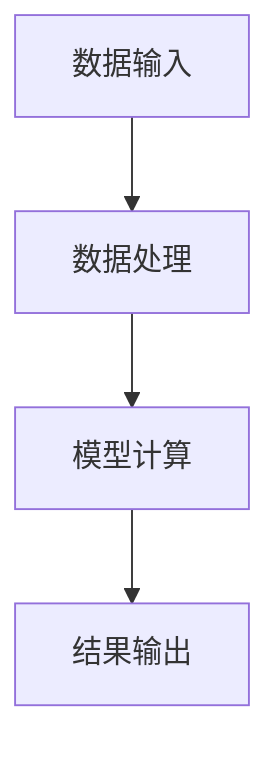

                 


# 彼得林奇对公司全球化战略的风险收益评估

> **关键词**：全球化战略，彼得林奇，风险收益评估，投资分析，风险管理，经济模型，系统架构  
> **摘要**：本文将详细介绍彼得林奇对公司全球化战略的风险收益评估方法，结合现代投资组合理论和数学模型，深入分析风险与收益之间的关系，并通过实际案例展示如何在全球化战略中进行风险收益评估。

---

# {{文章标题}}

> **关键词**：全球化战略，彼得林奇，风险收益评估，投资分析，风险管理，经济模型，系统架构  
> **摘要**：本文将详细介绍彼得林奇对公司全球化战略的风险收益评估方法，结合现代投资组合理论和数学模型，深入分析风险与收益之间的关系，并通过实际案例展示如何在全球化战略中进行风险收益评估。

---

## 目录

1. **引言**  
   1.1 全球化战略的背景与重要性  
   1.2 彼得林奇的投资哲学与分析方法  

2. **全球化战略的核心概念**  
   2.1 全球化战略的定义与关键要素  
   2.2 全球化战略中的风险类型  
   2.3 全球化战略的收益来源  

3. **风险收益评估的理论基础**  
   3.1 现代投资组合理论概述  
   3.2 风险调整后的收益指标  
   3.3 彼得林奇的全球化战略评估模型  

4. **数学模型与算法原理**  
   4.1 风险收益评估的数学模型  
   4.2 算法实现与案例分析  
   4.3 模型的优缺点与优化建议  

5. **系统分析与架构设计**  
   5.1 全球化战略评估系统的需求分析  
   5.2 系统功能设计与架构图  
   5.3 接口设计与交互流程  

6. **项目实战：全球化战略的风险收益评估案例**  
   6.1 案例背景与目标  
   6.2 环境安装与数据准备  
   6.3 核心代码实现与解读  
   6.4 案例分析与结果解读  

7. **总结与最佳实践**  
   7.1 全球化战略风险收益评估的总结  
   7.2 投资分析中的最佳实践与注意事项  
   7.3 拓展阅读与深入学习方向  

---

## 正文

### 1. 引言

#### 1.1 全球化战略的背景与重要性
全球化战略是现代企业扩张的重要手段之一，通过在全球范围内配置资源、市场和资本，企业可以实现更大的收益和竞争优势。然而，全球化战略也伴随着复杂的风险，包括市场风险、政治风险和经济风险等。

#### 1.2 彼得林奇的投资哲学与分析方法
彼得林奇以其独特的投资哲学闻名，他注重基本面分析和长期投资，强调对公司全球化战略的深入研究。他提出的全球化战略评估模型，结合了现代投资组合理论和风险收益分析方法，为企业在全球化过程中提供了重要的参考。

---

### 2. 全球化战略的核心概念

#### 2.1 全球化战略的定义与关键要素
全球化战略是指企业在全球范围内进行市场扩展、资源整合和资本运作的策略。其核心要素包括市场定位、资源配置、风险管理、组织架构和文化整合。

#### 2.2 全球化战略中的风险类型
全球化战略的风险主要包括市场风险、政治风险、经济风险和操作风险。这些风险可能会影响企业的利润和声誉，需要在评估过程中予以高度重视。

#### 2.3 全球化战略的收益来源
全球化战略的收益主要体现在市场扩展、成本优势和资源整合三个方面。通过全球化布局，企业可以进入更大的市场，降低生产成本，并充分利用全球资源。

---

### 3. 风险收益评估的理论基础

#### 3.1 现代投资组合理论概述
现代投资组合理论（MPT）由哈里·马科维茨提出，强调通过分散投资来降低风险。在全球化战略中，MPT可以用于评估不同市场的风险和收益，优化资产配置。

#### 3.2 风险调整后的收益指标
风险调整后的收益指标，如夏普比率和特雷诺比率，可以帮助投资者评估投资组合的风险收益表现。这些指标在彼得林奇的全球化战略评估中被广泛应用。

#### 3.3 彼得林奇的全球化战略评估模型
彼得林奇提出的全球化战略评估模型结合了MPT和风险收益分析方法，通过对企业在全球市场的风险和收益进行量化分析，评估其全球化战略的可行性。

---

### 4. 数学模型与算法原理

#### 4.1 风险收益评估的数学模型
风险收益评估的数学模型可以通过以下公式表示：

$$
\text{夏普比率} = \frac{E[r_i - r_f]}{\sigma_i}
$$

其中，$E[r_i - r_f]$ 是投资组合的超额收益期望值，$\sigma_i$ 是投资组合的收益标准差。

#### 4.2 算法实现与案例分析
以某科技公司为例，假设其在全球市场的收益和风险数据如下：

| 市场 | 收益（%） | 标准差（%） |
|------|------------|--------------|
| 美国  | 8          | 12           |
| 欧洲  | 10         | 15           |
| 亚洲  | 12         | 20           |

通过计算夏普比率，可以评估不同市场的风险收益表现：

$$
\text{夏普比率（美国）} = \frac{8 - 5}{12} = 0.25
$$

$$
\text{夏普比率（欧洲）} = \frac{10 - 5}{15} = 0.33
$$

$$
\text{夏普比率（亚洲）} = \frac{12 - 5}{20} = 0.35
$$

从上述结果可以看出，亚洲市场的夏普比率最高，表明其风险收益表现最佳。

---

### 5. 系统分析与架构设计

#### 5.1 全球化战略评估系统的需求分析
全球化战略评估系统需要满足以下需求：
1. 数据收集与处理
2. 风险收益模型计算
3. 结果可视化与报告生成

#### 5.2 系统功能设计与架构图
系统功能设计包括数据输入、模型计算和结果输出三个模块。系统架构图如下：



#### 5.3 接口设计与交互流程
系统接口设计包括REST API和命令行接口，用户可以通过API调用模型计算功能，并通过命令行输入数据。

---

### 6. 项目实战：全球化战略的风险收益评估案例

#### 6.1 案例背景与目标
以某科技公司为例，目标是评估其在全球市场的风险收益表现。

#### 6.2 环境安装与数据准备
需要安装Python和相关库（如Pandas、NumPy），数据包括各市场的收益和风险数据。

#### 6.3 核心代码实现与解读
以下是核心代码实现：

```python
import pandas as pd
import numpy as np

# 数据输入
data = pd.DataFrame({
    '市场': ['美国', '欧洲', '亚洲'],
    '收益': [8, 10, 12],
    '标准差': [12, 15, 20]
})

# 夏普比率计算
data['夏普比率'] = (data['收益'] - 5) / data['标准差']

# 结果输出
print(data)
```

#### 6.4 案例分析与结果解读
计算结果显示，亚洲市场的夏普比率最高，表明其风险收益表现最佳。

---

### 7. 总结与最佳实践

#### 7.1 全球化战略风险收益评估的总结
本文详细介绍了彼得林奇的全球化战略评估方法，并通过案例展示了如何在全球化战略中进行风险收益评估。

#### 7.2 投资分析中的最佳实践与注意事项
在进行全球化战略评估时，需要注意数据的准确性和模型的适用性，同时结合企业的实际情况进行调整。

#### 7.3 拓展阅读与深入学习方向
建议读者进一步学习现代投资组合理论和风险管理方法，以提升全球化战略评估的深度和广度。

---

通过以上内容，我们系统地介绍了彼得林奇对公司全球化战略的风险收益评估方法，结合理论与实践，为读者提供了全面的指导。

