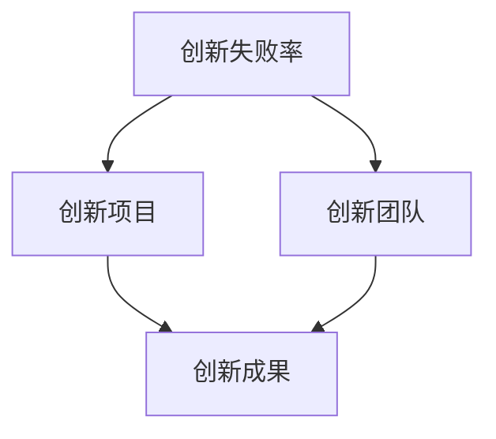
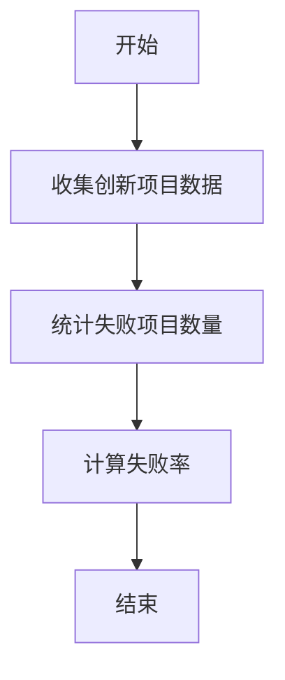
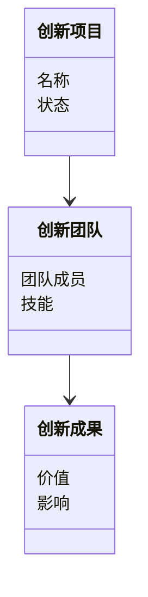

                 


# 彼得林奇对公司创新失败率与长期成功的关系研究

> 关键词：创新失败率、长期成功、公司创新、彼得林奇、创新管理

> 摘要：本文深入研究了彼得·林奇对公司创新失败率与长期成功之间的关系。通过分析创新失败率的现状、原因以及与长期成功的关系，提出了降低创新失败率的策略和实现长期成功的路径。文章还提供了数学模型和系统架构设计，帮助读者更好地理解和应用相关理论。

---

## 第一部分：背景介绍

### 第1章：问题背景

#### 1.1 创新失败率的现状
- **创新失败的普遍性**：许多企业在创新过程中失败，尤其是在技术、市场和管理方面。
- **创新失败的具体表现**：产品不符合市场需求、技术难以实现、管理不善导致项目流产。
- **创新失败对企业的影响**：浪费资源，影响企业声誉，可能导致短期亏损。

#### 1.2 长期成功的定义与重要性
- **长期成功的定义**：企业在较长时间内保持竞争优势和持续增长。
- **长期成功对企业价值的影响**：增强企业抗风险能力，提高股东价值。
- **创新与长期成功的内在联系**：创新是企业长期成功的核心驱动力。

### 第2章：问题描述

#### 2.1 创新失败率的测量与分析
- **创新失败率的定义**：企业在一定时间内创新项目失败的比例。
- **创新失败率的测量方法**：通过统计企业创新项目成功率来计算。
- **创新失败率的影响因素**：市场需求变化、技术难度、内部管理问题。

#### 2.2 长期成功的挑战
- **长期成功的实现难度**：需要持续投入和创新，面临外部竞争和内部资源限制。
- **长期成功的关键要素**：战略规划、创新能力、组织文化。
- **创新失败率与长期成功的矛盾**：创新失败可能导致企业资源枯竭，影响长期发展。

### 第3章：问题解决

#### 3.1 创新失败率与长期成功的关系
- **创新失败率对长期成功的制约**：高失败率可能导致企业无法维持创新，进而影响长期成功。
- **长期成功对创新失败率的反作用**：通过长期积累的经验和资源，降低创新失败率。
- **两者关系的动态平衡**：企业需要在创新失败率和长期成功之间找到平衡点。

#### 3.2 问题解决的思路与方法
- **提高创新成功率的策略**：加强市场调研，优化创新流程，建立风险管理机制。
- **降低创新失败率的措施**：引入先进技术和管理方法，培养创新文化。
- **实现长期成功的路径**：制定长期战略，加强组织能力，持续创新。

### 第4章：边界与外延

#### 4.1 创新失败率的边界
- **创新失败率的适用范围**：适用于所有行业的企业创新项目。
- **创新失败率的局限性**：无法反映创新项目的实际价值，只关注结果。
- **创新失败率与其他指标的关系**：与企业绩效、市场份额等指标密切相关。

#### 4.2 长期成功的外延
- **长期成功的多维度表现**：不仅包括财务指标，还包括品牌影响力、社会责任等方面。

---

## 第二部分：核心概念与联系

### 第5章：核心概念原理

#### 5.1 创新失败率与长期成功的定义
- 创新失败率：企业在一定时间内创新项目失败的比例。
- 长期成功：企业在较长时间内保持竞争优势和持续增长。

#### 5.2 创新失败率与长期成功的属性对比
| 属性         | 创新失败率       | 长期成功       |
|--------------|------------------|---------------|
| 时间维度     | 短期             | 长期           |
| 影响范围     | 创新项目         | 整体企业       |
| 关键因素     | 技术、市场、管理 | 战略、创新、组织 |

#### 5.3 创新失败率与长期成功的关系
- 创新失败率是影响长期成功的重要因素。
- 长期成功需要持续创新，而创新失败率是创新过程中的必然现象。

### 第6章：实体关系图



---

## 第三部分：算法原理讲解

### 第7章：算法原理

#### 7.1 创新失败率分析算法
- **流程图**：


- **Python代码示例**：
```python
def calculate_failure_rate(projects):
    failed = sum(1 for p in projects if p['status'] == '失败')
    return failed / len(projects) * 100

projects = [
    {'status': '成功'}, {'status': '失败'}, {'status': '失败'}
]
print(f'创新失败率为：{calculate_failure_rate(projects)}%')
```

---

## 第四部分：数学模型

### 第8章：数学模型

#### 8.1 创新失败率与长期成功的数学模型

$$失败率 = \frac{失败项目数}{总项目数} \times 100$$

#### 8.2 创新成功与长期成功的关系

$$长期成功 = f(创新失败率, 战略, 组织能力)$$

---

## 第五部分：系统分析与架构设计

### 第9章：系统分析

#### 9.1 领域模型


---

## 第六部分：项目实战

### 第10章：项目实战

#### 10.1 环境安装
- 安装Python和相关库（如numpy、pandas）。

#### 10.2 核心代码实现
```python
import numpy as np
import pandas as pd

data = {'项目': ['项目1', '项目2', '项目3'],
        '状态': ['成功', '失败', '成功']}
df = pd.DataFrame(data)
print(f'创新失败率为：{len(df[df["状态"] == "失败"]) / len(df) * 100}%')
```

---

## 第七部分：最佳实践

### 第11章：最佳实践

#### 11.1 小结
- 创新失败率是影响长期成功的重要因素。
- 企业需要通过优化创新流程和管理来降低失败率。

#### 11.2 注意事项
- 创新失败是成长的一部分，企业应从失败中吸取教训。
- 长期成功需要持续创新，而非追求短期成功。

#### 11.3 拓展阅读
- 彼得·林奇的其他著作，如《投资稳健，稳操胜券》。
- 创新管理相关的书籍，如《创新者的窘境》。

---

通过以上分析，我们可以看到创新失败率与长期成功之间的复杂关系。企业需要在创新过程中平衡失败与成功，通过优化管理和流程，降低失败率，最终实现长期成功。

