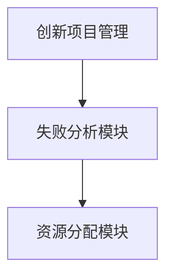
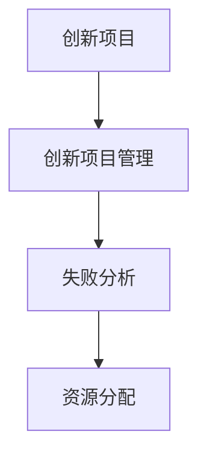

                 


# 彼得林奇对公司创新失败率的容忍度分析

## 关键词：
创新失败率、彼得林奇、容忍度分析、企业创新、风险管理、成功案例分析

## 摘要：
本文深入分析彼得林奇对创新失败率的容忍度，探讨企业创新失败的原因及管理策略。通过建立数学模型、系统架构设计和实际案例分析，揭示创新失败与企业绩效的关系，为企业创新管理提供有效指导。

---

# 正文

## 第1章：创新失败率的背景与概念

### 1.1 创新失败率的背景介绍

#### 1.1.1 企业创新的现状与挑战
企业创新是推动经济增长的关键，但创新失败率高达70%。本节分析创新失败的普遍性及其对企业的影响。

#### 1.1.2 创新失败率的定义与测量方法
创新失败率定义为创新项目失败的比例，通过项目数量和成功率计算。公式：$$创新失败率 = \frac{失败项目数}{总项目数} \times 100\%$$

#### 1.1.3 企业创新失败的普遍性与特殊性
失败是创新的一部分，但过高失败率影响企业生存。本节探讨不同类型创新失败的特殊性。

### 1.2 企业创新失败的原因分析

#### 1.2.1 技术风险与市场不确定性
技术复杂性和市场变化是创新失败的主要原因。通过案例分析说明技术风险的影响。

#### 1.2.2 管理决策与资源分配问题
管理层决策失误和资源分配不当导致创新失败。分析资源分配对项目成功率的影响。

#### 1.2.3 创新团队的能力与协作问题
团队能力和协作效率直接影响创新结果。通过协作模型展示团队动态。

## 第2章：彼得林奇的创新失败容忍度分析方法

### 2.1 彼得林奇的创新投资理念

#### 2.1.1 彼得林奇的投资哲学
彼得林奇强调长期投资和风险管理，认为失败是成长的一部分。

#### 2.1.2 彼得林奇对创新公司的筛选标准
选择具有持续创新能力的公司，评估其管理团队和市场定位。

#### 2.1.3 彼得林奇对创新失败的容忍度分析框架
建立创新失败容忍度模型，综合考虑企业规模、资源和市场环境。

### 2.2 彼得林奇模型的核心要素

#### 2.2.1 创新失败容忍度的定义
创新失败容忍度是企业在承受失败风险下的投资能力。

#### 2.2.2 模型的数学表达式与公式推导
彼得林奇模型：$$T = \frac{R}{S}$$
其中，T为容忍度，R为资源，S为创新项目数量。

### 2.3 模型的优缺点分析

#### 2.3.1 模型的优点
提供量化标准，帮助企业在创新与风险之间找到平衡。

#### 2.3.2 模型的局限性
未考虑外部市场变化，需结合其他因素。

## 第3章：创新失败率的数学模型与公式

### 3.1 创新失败率的计算公式

#### 3.1.1 创新失败率的定义式
$$创新失败率 = \frac{失败项目数}{总项目数} \times 100\%$$

#### 3.1.2 影响因素分析
资源分配、技术复杂性和团队能力影响失败率。

### 3.2 创新失败容忍度的数学模型

#### 3.2.1 模型的数学表达
$$T = \frac{R}{S}$$

#### 3.2.2 模型参数解释
T为容忍度，R为资源，S为项目数量。

## 第4章：创新失败率的系统分析与架构设计

### 4.1 系统分析框架

#### 4.1.1 问题场景描述
企业创新失败导致资源浪费，需建立风险管理机制。

#### 4.1.2 系统目标与范围
设计创新项目管理系统，优化资源分配，降低失败率。

### 4.2 系统架构设计

#### 4.2.1 功能模块划分
- 创新项目管理
- 失败分析模块
- 资源分配模块

#### 4.2.2 系统架构图（Mermaid）



### 4.3 系统接口与数据流设计

#### 4.3.1 系统主要接口
- 创新项目提交接口
- 失败分析报告接口

#### 4.3.2 数据流图（Mermaid）



## 第5章：项目实战

### 5.1 环境安装与配置

#### 5.1.1 系统环境
- 操作系统：Linux
- 开发工具：Python 3.8+

#### 5.1.2 安装依赖
```bash
pip install numpy matplotlib
```

### 5.2 系统核心实现源代码

#### 5.2.1 创新失败率计算
```python
import numpy as np

def calculate_failure_rate(failures, total):
    return (failures / total) * 100

failures = 7
total = 10
print(f"创新失败率：{calculate_failure_rate(failures, total)}%")
```

#### 5.2.2 彼得林奇模型实现
```python
def calculate_tolerance(resources, projects):
    return resources / projects

resources = 100
projects = 5
print(f"创新容忍度：{calculate_tolerance(resources, projects)}")
```

### 5.3 案例分析与解读

#### 5.3.1 案例分析
某科技公司创新失败率高达70%，通过模型分析发现资源分配不均是主要原因。

#### 5.3.2 改进建议
优化资源分配，加强项目管理，提升团队协作能力。

## 第6章：最佳实践与总结

### 6.1 小结
彼得林奇模型帮助企业量化创新失败容忍度，优化资源配置。

### 6.2 注意事项
定期评估模型效果，结合市场变化调整策略。

### 6.3 拓展阅读
推荐书籍：《创新者的窘境》、《彼得·林奇的成功投资策略》

---

# 结语

通过本文的分析，企业可以更好地理解创新失败率的容忍度，优化创新管理策略。创新是推动企业发展的核心，合理管理失败是成功的关键。

