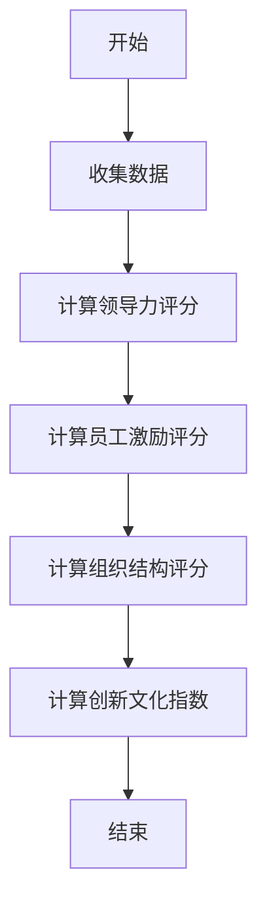
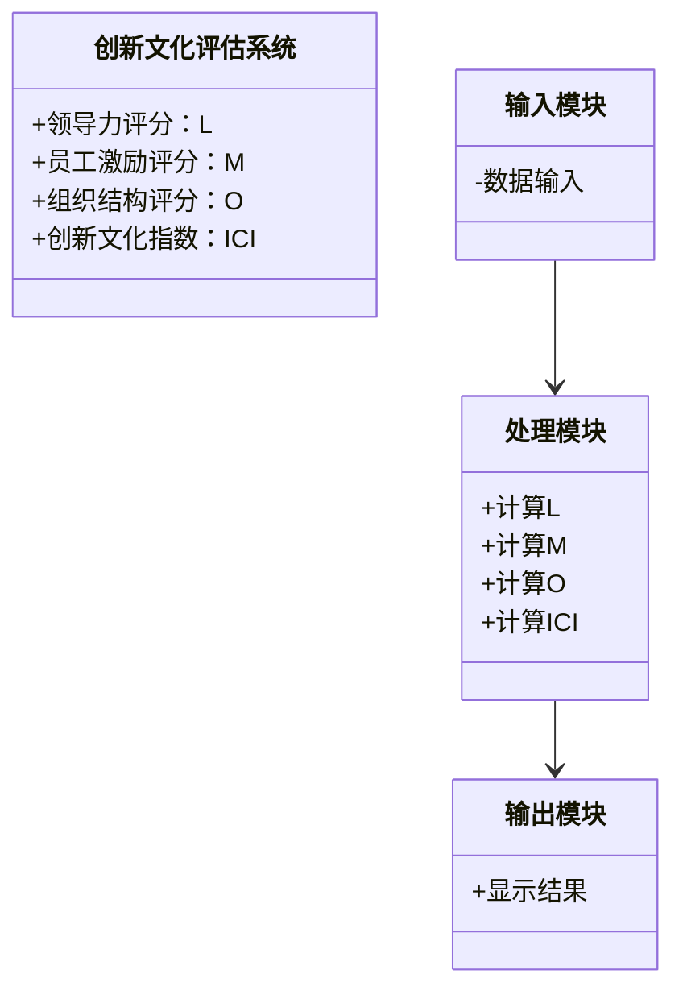

                 


# 彼得林奇对公司创新文化的定性分析

> 关键词：创新文化，彼得林奇，定性分析，企业价值，文化评估

> 摘要：本文从彼得林奇的投资理念出发，探讨创新文化在企业中的核心作用，分析如何通过定性方法评估创新文化，为企业价值提升提供新视角。

---

## 第1章：背景介绍

### 1.1 创新文化的定义与内涵

创新文化是企业的灵魂，涉及员工思维模式、行为习惯和价值观，是推动企业持续发展的动力。创新文化包括领导力、员工激励、组织结构等核心要素，企业需通过构建开放包容的环境，激发员工创造力，保持竞争优势。

### 1.2 彼得林奇的分析框架

彼得林奇是著名的投资专家，强调企业文化和创新的重要性。他提出，创新文化影响企业长期价值，需要从领导力、组织结构、员工激励等方面进行定性分析，以识别高成长潜力的企业。

### 1.3 定性分析的重要性

定性分析帮助识别创新文化的关键因素，如领导风格、员工激励机制和组织结构。这些因素直接影响企业的创新能力和市场竞争力，是企业价值评估的重要组成部分。与定量分析相比，定性分析更关注非量化因素，为企业提供更全面的评估视角。

---

## 第2章：创新文化的构成要素

### 2.1 创新文化的属性特征对比

| 属性        | 领导力       | 员工激励       | 组织结构       |
|-------------|--------------|---------------|---------------|
| 定义        | 领导者的决策和风格 | 激励机制 | 组织架构和分工 |
| 影响因素    | 战略目标、价值观 | 薪酬、晋升 | 部门划分、职责 |
| 创新作用    | 指导创新方向 | 提高积极性 | 促进跨部门协作 |

### 2.2 创新文化评估的ER实体关系图

```mermaid
erDiagram
    innovation_culture {
        +id : integer
        +name : string
        +description : string
    }
    leadership_style {
        +id : integer
        +name : string
        +approach : string
    }
    employee_motivation {
        +id : integer
        +metric : string
        +score : integer
    }
    organization_structure {
        +id : integer
        +type : string
        +responsibility : string
    }
    innovation_culture --> leadership_style : 由 ... 决定
    innovation_culture --> employee_motivation : 取决于 ...
    innovation_culture --> organization_structure : 受 ... 影响
```

---

## 第3章：创新文化评估的数学模型

### 3.1 模型构建

创新文化评估模型综合领导力、员工激励和组织结构三个维度，权重分别为0.4、0.3和0.3。

$$创新文化指数 = 0.4 \times L + 0.3 \times M + 0.3 \times O$$

其中，L为领导力评分（1-5分），M为员工激励评分（1-5分），O为组织结构评分（1-5分）。

### 3.2 算法流程



---

## 第4章：系统架构设计

### 4.1 领域模型



---

## 第5章：项目实战

### 5.1 案例分析

以科技公司为例，评估其创新文化：

1. **数据收集**：收集领导力、员工激励和组织结构评分。
2. **计算创新文化指数**：
   $$ICI = 0.4 \times 4 + 0.3 \times 3.5 + 0.3 \times 3.8 = 3.73$$
3. **结果分析**：指数为3.73，属于较高水平，表明公司创新文化较强，具备较大发展潜力。

---

## 第6章：总结与展望

创新文化是企业发展的关键因素，彼得林奇的定性分析提供了新的视角。通过系统评估创新文化，企业可以识别优势与不足，制定改进策略。未来，结合定量分析和AI技术，创新文化评估将更加精准，为企业创造更大价值。

---

## 推荐阅读

1. [彼得林奇的投资哲学](#)
2. [企业创新文化的构建](#)
3. [定性分析方法论](#)

