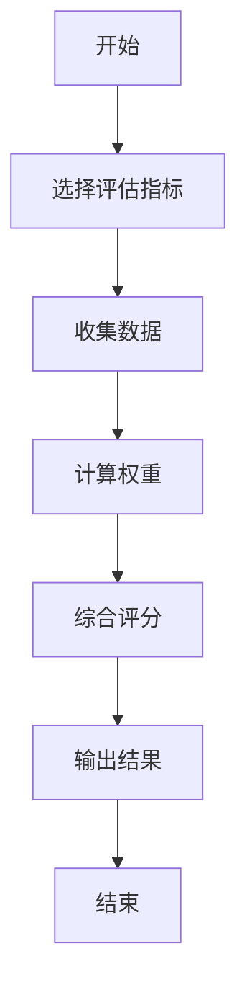
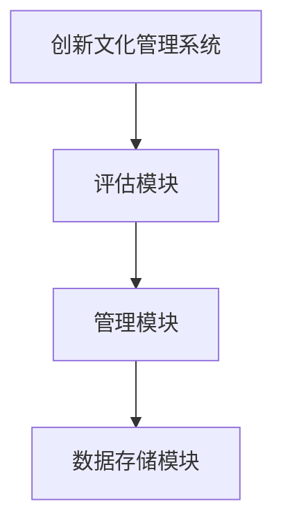

                 


# 彼得·林奇对公司创新文化的看法

> 关键词：彼得·林奇，创新文化，企业文化，管理策略，创新管理

> 摘要：本文探讨了彼得·林奇对企业创新文化的深刻见解，分析了创新文化的核心要素，结合实际案例，展示了如何在企业中建立和维护创新文化，以提升企业的竞争力和可持续发展能力。

---

## 第一部分：背景介绍

### 第1章：创新文化的定义与背景

#### 1.1 问题背景
创新文化是企业在竞争激烈的市场环境中保持活力的关键因素。彼得·林奇在其投资管理生涯中，强调了公司文化对企业长期成功的重要性，尤其是创新文化。本文将探讨创新文化的核心概念、其对企业绩效的影响，以及如何在企业中有效实施。

#### 1.2 问题描述
创新文化涉及企业的各个方面，包括员工的创新意识、管理层的支持以及整体组织结构的适应性。本文将详细分析创新文化的定义、边界及其与企业战略的关系。

#### 1.3 问题解决
通过彼得·林奇的视角，本文将探讨创新文化的结构和核心要素，并展示其与企业绩效之间的紧密联系，从而为企业提供有效的管理策略。

---

## 第二部分：核心概念与联系

### 第2章：创新文化的核心要素

#### 2.1 核心概念原理
创新文化的核心要素包括创新意识、员工参与度、管理层支持和组织结构。这些要素相互作用，构成了企业创新文化的基石。

#### 2.2 核心要素对比表
以下表格展示了创新文化与其他管理概念的对比：

| 概念        | 创新文化 | 传统管理 | 创新与战略 |
|-------------|----------|----------|------------|
| 核心目标    | 鼓励创新 | 优化流程 | 战略驱动   |
| 参与主体    | 全体员工 | 管理层   | 各部门      |
| 变化速度    | 快速     | 缓慢     | 灵活        |

#### 2.3 实体关系图
创新文化与企业绩效的关系可以通过ER图展示：

```mermaid
er
  actor 创新文化
  actor 企业绩效
  relationship 关联
  创新文化 --> 关联 --> 企业绩效
```

---

## 第三部分：算法原理讲解

### 第3章：创新文化评估算法

#### 3.1 算法原理
创新文化评估算法基于关键指标，通过权重分配和综合评分，量化企业的创新文化强度。指标包括员工创新参与度、管理层支持度和创新成果等。

#### 3.2 算法流程图
以下为创新文化评估的流程图：



#### 3.3 算法实现代码
以下为创新文化评估的Python代码示例：

```python
def calculate_innovation_culture_score(criteria_scores, weights):
    # 计算加权平均
    weighted_scores = [score * weight for score, weight in zip(criteria_scores, weights)]
    total = sum(weighted_scores)
    return total / sum(weights)

# 示例数据
criteria_scores = [8, 7, 9]
weights = [0.4, 0.3, 0.3]

score = calculate_innovation_culture_score(criteria_scores, weights)
print(f"创新文化综合评分为: {score}")
```

---

## 第四部分：系统分析与架构设计

### 第4章：创新文化管理系统设计

#### 4.1 问题场景介绍
创新文化管理系统旨在帮助企业评估和管理创新文化，优化创新流程。系统包括评估模块、管理模块和数据存储模块。

#### 4.2 系统功能设计
- **评估模块**：收集和分析创新文化相关数据。
- **管理模块**：制定和实施创新文化策略。
- **数据存储模块**：存储和管理评估数据。

#### 4.3 系统架构图


#### 4.4 接口设计
- **评估模块接口**：收集员工反馈和创新成果数据。
- **管理模块接口**：提供策略制定和执行功能。

---

## 第五部分：项目实战

### 第5章：创新文化管理项目实战

#### 5.1 环境安装
需要安装Python和相关数据处理库（如Pandas、NumPy）。

#### 5.2 核心代码实现
以下是创新文化评估的核心代码：

```python
import pandas as pd

# 数据预处理
data = pd.read_csv('innovation_scores.csv')
data['综合评分'] = data.apply(lambda x: calculate_innovation_culture_score(x[['员工参与度', '管理层支持', '创新成果']], [0.4, 0.3, 0.3]), axis=1)
print(data.head())
```

#### 5.3 案例分析
以一家科技公司为例，通过数据处理和分析，展示如何利用创新文化评估算法优化企业创新管理。

#### 5.4 项目小结
本项目展示了如何将创新文化评估算法应用于实际企业，帮助企业识别和改进创新管理中的不足。

---

## 第六部分：最佳实践

### 第6章：创新文化管理的实践经验

#### 6.1 小结
创新文化是企业成功的关键因素，彼得·林奇的管理理念为企业提供了宝贵的指导。

#### 6.2 注意事项
- 创新文化需要全员参与。
- 管理层支持是关键。
- 创新文化评估应定期进行。

#### 6.3 拓展阅读
推荐阅读彼得·林奇的《投资之道》及相关创新管理书籍，深入了解创新文化的实践应用。

---

通过以上结构和内容，本文系统地探讨了彼得·林奇对企业创新文化的看法，结合实际案例和算法分析，为企业的创新管理提供了深入的指导和实践方案。

