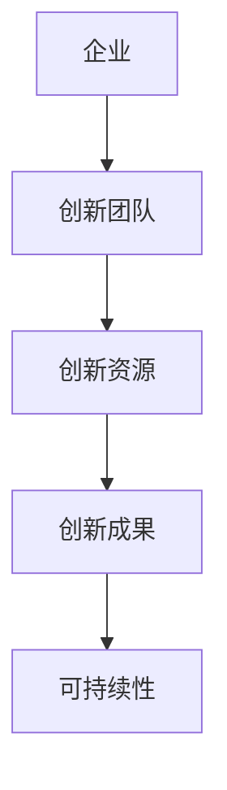
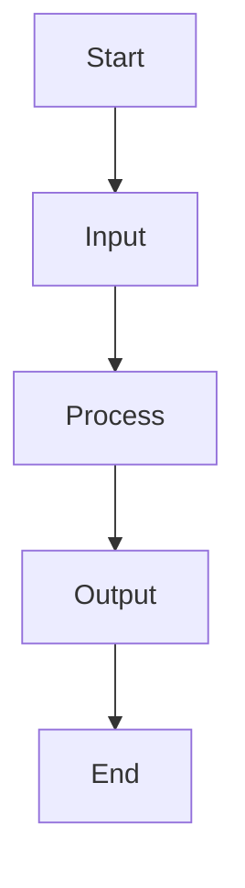
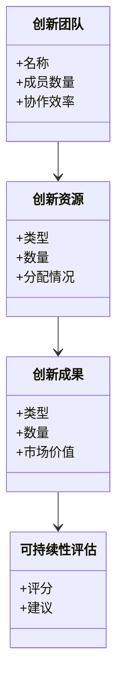
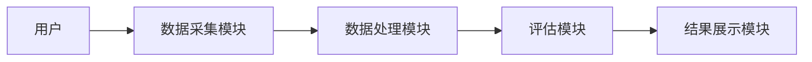

                 


# 彼得林奇对公司创新生态系统的可持续性评估

> 关键词：彼得林奇，创新生态系统，可持续性评估，企业创新，评估模型

> 摘要：本文详细探讨了彼得林奇对公司创新生态系统进行可持续性评估的方法。通过分析创新生态系统的构成要素、评估模型的构建与算法原理，结合实际案例和系统架构设计，为企业提供一套科学、系统的评估体系。本文旨在帮助企业在复杂多变的市场环境中，通过创新生态系统实现可持续发展。

---

## 第1章 创新生态系统与可持续性评估概述

### 1.1 创新生态系统的基本概念

#### 1.1.1 创新生态系统的定义
创新生态系统是指由企业、创新团队、创新资源、创新成果等多个要素构成的动态系统。该系统通过各要素之间的协同作用，推动企业的持续创新与进化。

#### 1.1.2 创新生态系统的核心要素
- **企业创新的核心驱动力**：企业的战略目标、文化氛围、组织结构等。
- **创新团队**：由研发人员、产品经理、数据科学家等组成的团队。
- **创新资源**：包括技术、资金、数据、人才等。
- **创新成果**：如新产品、新技术、新服务等。

#### 1.1.3 创新生态系统与企业可持续发展的关系
创新生态系统是企业实现可持续发展的重要基础。通过优化创新生态系统，企业能够不断推出符合市场需求的产品，提升竞争力，实现长期发展。

### 1.2 可持续性评估的背景与意义

#### 1.2.1 可持续性评估的定义
可持续性评估是通过量化指标，对企业创新生态系统在经济、社会和环境等方面的影响进行综合评价。

#### 1.2.2 可持续性评估的重要性
- 企业通过可持续性评估，可以识别创新生态系统中的优势与不足。
- 为企业的战略决策提供数据支持。
- 促进企业与利益相关者之间的透明沟通。

#### 1.2.3 创新生态系统中可持续性评估的必要性
创新生态系统是一个复杂系统，其健康状况直接影响企业的创新能力。通过可持续性评估，可以及时发现问题，优化系统结构。

### 1.3 彼得林奇的创新生态系统评估方法

#### 1.3.1 彼得林奇的背景与投资理念
彼得林奇是美国著名基金经理，以其独特的投资理念闻名。他注重分析企业的基本面，尤其是企业的创新能力和持续发展能力。

#### 1.3.2 彼得林奇对创新生态系统的研究
彼得林奇认为，企业的创新生态系统是其核心竞争力的重要组成部分。他通过分析企业的创新团队、资源分配、创新成果等，评估企业的创新能力。

#### 1.3.3 彼得林奇评估方法的核心思想
- 以企业创新成果为核心，关注创新团队的协作效率。
- 强调创新资源的合理配置与利用。
- 通过量化指标，评估创新生态系统的可持续性。

### 1.4 本章小结
本章介绍了创新生态系统的基本概念、可持续性评估的重要性和彼得林奇的评估方法。企业只有通过科学的评估，才能优化创新生态系统，实现可持续发展。

---

## 第2章 创新生态系统的核心要素

### 2.1 创新生态系统的构成要素

#### 2.1.1 企业创新的核心驱动力
企业的战略目标和文化氛围是推动创新的核心驱动力。例如，企业文化是否鼓励创新，战略目标是否清晰。

#### 2.1.2 创新生态系统中的关键角色
- **创新团队**：包括技术研发人员、产品经理、数据科学家等。
- **创新领导者**：企业的高层管理者，负责制定创新战略。
- **创新支持者**：包括HR、财务部门等，负责提供资源支持。

#### 2.1.3 创新生态系统与外部环境的互动
企业创新生态系统与外部环境（如市场、政策、技术）密切相关。例如，市场需求的变化会影响企业的创新方向。

### 2.2 可持续性评估的关键指标

#### 2.2.1 企业创新的可持续性评估指标
- **创新成果的数量与质量**：如每年推出的新产品数量、技术创新水平。
- **创新团队的协作效率**：如团队成员之间的沟通效率、协作效果。
- **创新资源的利用率**：如资金投入与创新产出的比例。

#### 2.2.2 创新生态系统中各要素的评估维度
- **创新团队**：团队成员的专业能力、协作能力。
- **创新资源**：资源的充足性、分配的合理性。
- **创新成果**：成果的市场价值、技术领先性。

#### 2.2.3 指标之间的关联性分析
创新团队的协作效率高，通常会带来更多的创新成果；创新资源的合理分配，能够提高资源利用率。

### 2.3 核心概念的ER实体关系图



---

## 第3章 可持续性评估的算法原理

### 3.1 可持续性评估模型的构建

#### 3.1.1 模型构建的基本思路
- 确定评估指标：如创新成果数量、团队协作效率、资源利用率。
- 确定权重：根据指标的重要性，赋予不同的权重。
- 数据收集与处理：收集相关数据，进行预处理。

#### 3.1.2 模型的输入与输出
- **输入**：创新团队的协作效率、创新资源的利用率、创新成果的数量。
- **输出**：创新生态系统的可持续性评分（如A、B、C三个等级）。

#### 3.1.3 模型的评估标准
- 模型的准确性：预测结果与实际结果的偏差率。
- 模型的可解释性：模型的输出是否易于理解。

### 3.2 算法原理与流程图



### 3.3 算法的数学模型与公式

#### 3.3.1 线性回归模型
创新生态系统可持续性评分（S）与创新成果数量（N）、团队协作效率（T）、资源利用率（R）之间的关系可以用线性回归模型表示：

$$S = \beta_0 + \beta_1N + \beta_2T + \beta_3R + \epsilon$$

其中：
- $$\beta_0$$ 是截距项。
- $$\beta_1, \beta_2, \beta_3$$ 是回归系数。
- $$\epsilon$$ 是误差项。

#### 3.3.2 评分系统
根据回归模型的输出结果，对创新生态系统进行评分：

$$
\text{评分} = \begin{cases}
\text{A} & \text{if } S > 0.8 \\
\text{B} & \text{if } 0.6 \leq S \leq 0.8 \\
\text{C} & \text{if } S < 0.6
\end{cases}
$$

---

## 第4章 系统分析与架构设计

### 4.1 系统功能设计

#### 4.1.1 领域模型
创新生态系统评估系统的领域模型如下：



#### 4.1.2 系统架构设计
创新生态系统评估系统的架构如下：



---

## 第5章 项目实战

### 5.1 环境安装

#### 5.1.1 安装Python
```bash
python --version
pip install numpy pandas scikit-learn
```

### 5.2 系统核心实现源代码

#### 5.2.1 数据预处理代码
```python
import pandas as pd
from sklearn.model_selection import train_test_split

# 加载数据
data = pd.read_csv('innovation.csv')

# 数据分割
X = data[['创新成果数量', '团队协作效率', '资源利用率']]
y = data['可持续性评分']

X_train, X_test, y_train, y_test = train_test_split(X, y, test_size=0.2, random_state=42)
```

#### 5.2.2 评估模型实现代码
```python
from sklearn.linear_model import LinearRegression
from sklearn.metrics import mean_squared_error

# 模型训练
model = LinearRegression()
model.fit(X_train, y_train)

# 模型预测
y_pred = model.predict(X_test)

# 模型评估
mse = mean_squared_error(y_test, y_pred)
print(f'Mean Squared Error: {mse}')
```

### 5.3 案例分析与详细解读

#### 5.3.1 案例分析
假设某企业创新团队的协作效率为0.7，资源利用率为0.6，创新成果数量为5。根据模型预测，其可持续性评分为0.75，属于B级。

#### 5.3.2 代码应用解读
通过上述代码，我们可以训练模型并预测企业的可持续性评分。企业可以根据评分结果，优化创新生态系统。

---

## 第6章 最佳实践与小结

### 6.1 最佳实践 tips
- 定期评估创新生态系统的可持续性。
- 根据评估结果，优化创新团队的协作效率和资源分配。
- 关注创新成果的数量与质量，确保企业的持续创新能力。

### 6.2 小结
通过本文的分析与实践，我们了解了彼得林奇的创新生态系统可持续性评估方法，并通过实际案例展示了如何应用这些方法。企业可以利用这些方法，优化创新生态系统，实现可持续发展。

### 6.3 注意事项
- 数据的准确性和完整性是模型预测的基础。
- 模型的评估标准需要根据企业的实际情况进行调整。
- 创新生态系统是一个动态系统，需要持续关注和优化。

### 6.4 拓展阅读
- 彼得林奇的《投资之道》
- 《创新管理》

---

通过以上内容，我们详细探讨了彼得林奇对公司创新生态系统可持续性评估的方法，从理论到实践，为企业提供了一套科学、系统的评估体系。希望本文能够为企业的创新管理提供有价值的参考。

