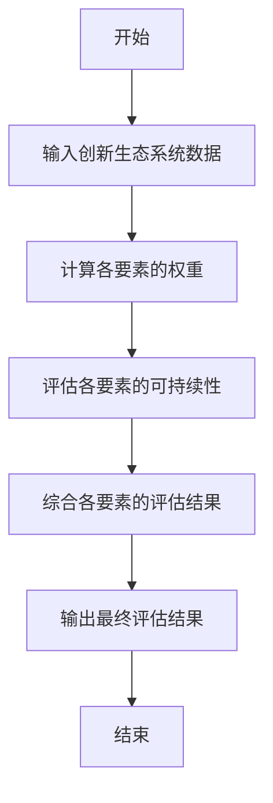
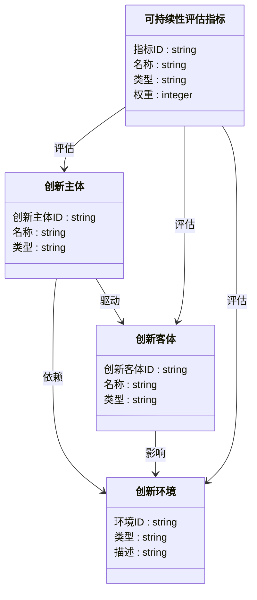
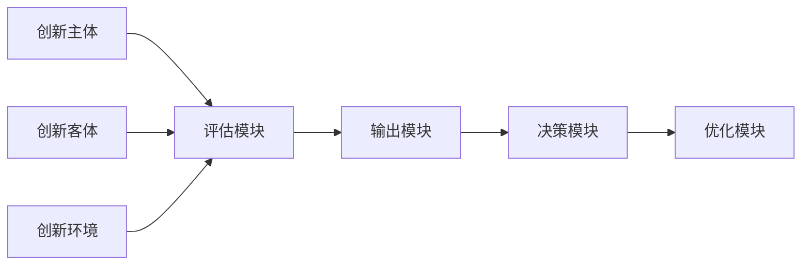

                 


# 彼得林奇对公司创新生态系统可持续性评估框架

## 关键词
- 创新生态系统
- 可持续性评估
- 彼得林奇
- 评估框架
- 企业创新

## 摘要
本文探讨了彼得·林奇对公司创新生态系统可持续性评估框架的系统性分析。通过详细阐述创新生态系统的核心概念、评估框架的算法原理、系统架构设计以及项目实战，本文旨在为企业提供一套全面的评估方法，以确保创新的可持续性。文章结合理论与实践，通过图表和数学模型，深入剖析了创新生态系统的关键要素及其相互关系，为企业构建和优化创新生态系统提供了有价值的参考。

---

## 第1章：创新生态系统与可持续性评估的背景

### 1.1 创新生态系统的基本概念

#### 1.1.1 创新生态系统的定义
创新生态系统是由企业、研究机构、供应商、合作伙伴、客户等多方参与者共同构成的网络，通过协作与竞争推动持续创新。它强调系统内各要素的互动与协同，以实现整体价值的最大化。

#### 1.1.2 可持续性评估的必要性
在快速变化的商业环境中，企业需要确保创新的持续性，以应对市场波动和技术变革。可持续性评估能够帮助企业识别创新生态系统中的薄弱环节，优化资源配置，降低风险。

#### 1.1.3 创新生态系统与企业发展的关系
创新生态系统是企业发展的核心驱动力。通过构建和优化创新生态系统，企业能够提升创新能力，增强竞争力，实现长期可持续发展。

### 1.2 问题背景与描述

#### 1.2.1 当前企业创新面临的挑战
当前企业创新面临的主要挑战包括：技术更新换代快、市场竞争加剧、资源分配不均、创新成果难以商业化等。

#### 1.2.2 可持续性评估的现实意义
可持续性评估能够帮助企业全面了解创新生态系统的健康状况，识别潜在风险，并采取相应的优化措施。

#### 1.2.3 创新生态系统中的关键问题
创新生态系统中的关键问题包括：创新主体的积极性、创新客体的多样性、创新环境的支持性等。

### 1.3 问题解决与边界

#### 1.3.1 创新生态系统评估的核心目标
评估的核心目标是识别创新生态系统中的关键问题，优化资源配置，提升创新效率。

#### 1.3.2 可持续性评估的边界与外延
可持续性评估的边界包括企业内部创新活动和外部创新环境，外延则涉及创新生态系统的动态变化。

#### 1.3.3 创新生态系统中的关键要素
创新生态系统中的关键要素包括：创新主体、创新客体、创新环境等。

### 1.4 框架的核心要素组成

#### 1.4.1 创新生态系统的组成结构
创新生态系统由创新主体、创新客体、创新环境三个主要部分构成。

#### 1.4.2 可持续性评估的关键指标
可持续性评估的关键指标包括：创新效率、创新成果的商业化能力、创新环境的支持性等。

#### 1.4.3 框架的逻辑关系与整体架构
创新生态系统中的各要素通过相互作用，形成一个动态平衡的整体架构，确保创新的可持续性。

---

## 第2章：创新生态系统的核心概念与联系

### 2.1 核心概念原理

#### 2.1.1 创新生态系统的动态平衡
创新生态系统需要在创新主体的驱动下，通过不断调整和优化，实现动态平衡。

#### 2.1.2 可持续性评估的多维度特性
可持续性评估需要从多个维度进行考量，包括创新效率、创新成果的可持续性等。

#### 2.1.3 创新与可持续性的相互作用
创新是可持续性的源泉，而可持续性是创新的保障。

### 2.2 概念属性特征对比

#### 2.2.1 创新性与可持续性的对比分析
| 特性 | 创新性 | 可持续性 |
|------|--------|----------|
| 定义 | 新颖的解决方案或产品 | 长期维持和发展 |

#### 2.2.2 不同创新模式下的可持续性特征
- **渐进式创新**：注重细节改进，可持续性较高。
- **破坏性创新**：可能引发市场动荡，可持续性较低。

#### 2.2.3 创新生态系统中各要素的属性特征
- **创新主体**：主动性和创造性。
- **创新客体**：多样性和复杂性。
- **创新环境**：支持性和稳定性。

### 2.3 ER实体关系图

```mermaid
erDiagram
    actor 创新主体 {
        key string 创新主体ID;
        string 名称;
        string 类型;
    }
    actor 创新客体 {
        key string 创新客体ID;
        string 名称;
        string 类型;
    }
    actor 创新环境 {
        key string 环境ID;
        string 类型;
        string 描述;
    }
    创新主体 -> 创新客体 : "驱动"
    创新主体 -> 创新环境 : "依赖"
    创新客体 -> 创新环境 : "影响"
```

---

## 第3章：创新生态系统可持续性评估框架的算法原理

### 3.1 算法原理概述

#### 3.1.1 框架的基本原理
通过评估创新生态系统中的各要素，综合考虑其权重和影响，得出整体的可持续性评分。

#### 3.1.2 算法的核心思想
算法的核心思想是通过加权计算，量化各要素的贡献，综合评估创新生态系统的可持续性。

#### 3.1.3 算法的输入与输出
- **输入**：创新生态系统中各要素的数据。
- **输出**：整体可持续性评分。

### 3.2 算法流程图



### 3.3 数学模型与公式

#### 3.3.1 可持续性评估的综合指标
$$ 
\text{综合评分} = \sum_{i=1}^{n} w_i \times s_i 
$$
其中，\( w_i \) 是第 \( i \) 个要素的权重，\( s_i \) 是第 \( i \) 个要素的可持续性评分。

---

## 第4章：创新生态系统可持续性评估框架的系统分析与架构设计

### 4.1 系统分析

#### 4.1.1 问题场景介绍
企业需要评估其创新生态系统的可持续性，以优化资源配置，提升创新效率。

#### 4.1.2 项目介绍
本项目旨在开发一个创新生态系统可持续性评估框架，帮助企业识别关键问题并优化创新过程。

### 4.2 系统功能设计

#### 4.2.1 领域模型设计



### 4.3 系统架构设计

#### 4.3.1 系统架构图



---

## 第5章：创新生态系统可持续性评估框架的项目实战

### 5.1 环境安装

#### 5.1.1 系统环境
- 操作系统：Linux/Windows/MacOS
- 开发工具：Python 3.8+, PyCharm/VSCode
- 第三方库：numpy, pandas, matplotlib

### 5.2 系统核心实现源代码

```python
import numpy as np
import pandas as pd
import matplotlib.pyplot as plt

def assess_sustainability(innovation_subjects, innovation_objects, innovation_environment):
    # 计算各要素的权重
    weights = np.array([0.4, 0.3, 0.3])
    
    # 评估各要素的可持续性
    subject_score = np.mean(innovation_subjects)
    object_score = np.mean(innovation_objects)
    environment_score = np.mean(innovation_environment)
    
    # 综合评分
    total_score = np.dot(weights, [subject_score, object_score, environment_score])
    
    return total_score

# 示例数据
innovation_subjects = np.array([0.8, 0.7, 0.9])
innovation_objects = np.array([0.6, 0.8, 0.7])
innovation_environment = np.array([0.7, 0.6, 0.8])

score = assess_sustainability(innovation_subjects, innovation_objects, innovation_environment)
print("综合评分:", score)
```

### 5.3 案例分析与详细解读

#### 5.3.1 案例分析
假设某企业创新生态系统中，创新主体的评分为0.8，创新客体的评分为0.6，创新环境的评分为0.7。综合评分为：
$$ 
\text{综合评分} = 0.4 \times 0.8 + 0.3 \times 0.6 + 0.3 \times 0.7 = 0.32 + 0.18 + 0.21 = 0.71 
$$
综合评分为0.71，属于中等偏上。

#### 5.3.2 详细解读
根据评分结果，企业需要进一步优化创新环境，以提升整体可持续性。

---

## 第6章：总结与展望

### 6.1 最佳实践 tips
- 定期评估创新生态系统，及时优化资源配置。
- 重视创新环境的建设，提供良好的支持条件。
- 鼓励创新主体的主动性和创造性。

### 6.2 小结
本文详细探讨了彼得·林奇对公司创新生态系统可持续性评估框架的系统性分析，结合理论与实践，为企业提供了一套全面的评估方法。

### 6.3 注意事项
- 数据采集的准确性会影响评估结果，需谨慎处理。
- 创新生态系统具有动态性，需持续关注和优化。

### 6.4 拓展阅读
- 《创新管理》
- 《可持续性评估方法论》
- 《彼得·林奇投资策略》

---

通过以上内容，我们系统地分析了彼得·林奇的创新生态系统可持续性评估框架，为企业提供了理论支持和实践指导。希望本文能为企业优化创新生态系统提供有价值的参考。

