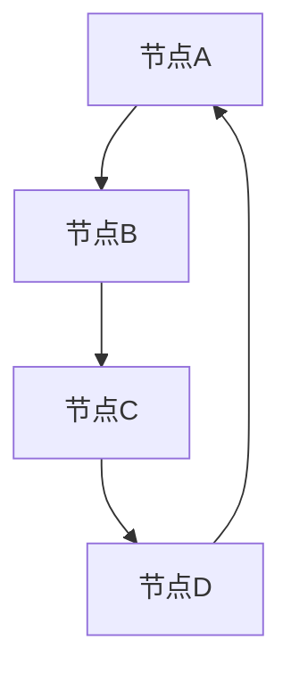
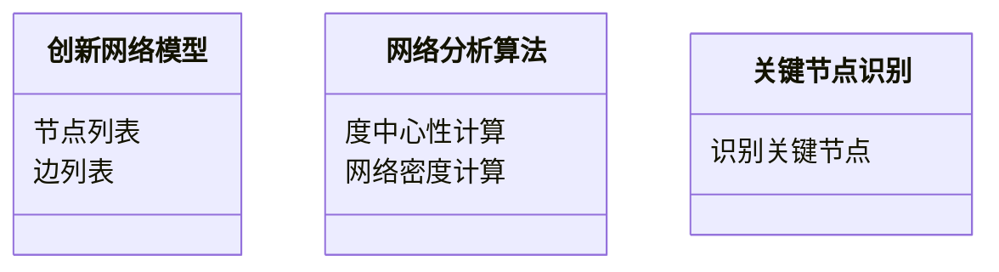
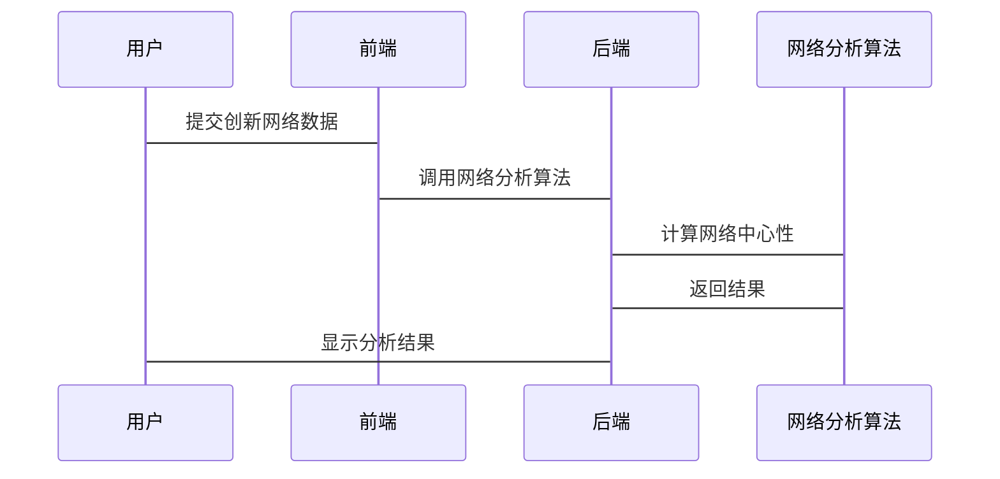

                 


# 彼得林奇对公司创新生态系统网络分析方法

## 关键词：创新生态系统、网络分析、彼得林奇、公司战略、算法原理

## 摘要：本文深入分析了彼得林奇对公司创新生态系统网络分析方法的理论基础、算法原理及其在实际应用中的表现。通过详细阐述创新生态系统的网络结构、网络分析的核心算法、数学模型以及系统架构设计，结合实际案例和项目实战，帮助读者全面理解并掌握彼得林奇网络分析方法在公司创新管理中的应用。

---

# 第1章: 创新生态系统与网络分析的背景

## 1.1 创新生态系统的基本概念

### 1.1.1 创新生态系统的定义

创新生态系统是指由公司内外部各种创新主体（如企业、供应商、合作伙伴、客户、学术机构等）共同构成的网络系统。该系统通过各主体之间的互动与协作，推动创新资源的流动、整合和价值创造。

### 1.1.2 创新生态系统的核心要素

| 核心要素 | 描述 |
|----------|------|
| 创新主体 | 包括企业、供应商、合作伙伴、客户、学术机构等 |
| 创新资源 | 包括技术、知识、资金、人才等 |
| 创新网络 | 各创新主体之间的连接关系和互动机制 |
| 创新价值 | 创新资源通过网络互动产生的最终价值 |

### 1.1.3 创新生态系统与公司战略的关系

创新生态系统是公司战略的重要组成部分，它通过优化创新网络的结构和功能，提升公司的创新能力和竞争优势。

## 1.2 网络分析方法的引入

### 1.2.1 网络分析的基本概念

网络分析是一种通过构建网络模型来研究系统内部结构和关系的方法。其核心在于分析网络中的节点、边以及它们之间的关系。

### 1.2.2 网络分析在公司创新中的应用

- **识别关键创新主体**：通过分析网络中的关键节点，确定对公司创新最重要的合作伙伴或部门。
- **优化创新网络结构**：通过调整网络的连接方式，提升创新资源的流动效率。
- **预测创新趋势**：通过网络分析，预测未来可能的创新方向和潜在机会。

### 1.2.3 彼得林奇分析框架的背景与目标

彼得林奇是著名的投资专家，他在分析公司创新生态系统时，提出了一种基于网络分析的方法。其目标是通过量化分析公司创新网络的结构特征，评估公司的创新能力和竞争优势。

## 1.3 本章小结

本章主要介绍了创新生态系统的基本概念、核心要素，以及网络分析方法在公司创新管理中的应用。彼得林奇的分析框架为后续的网络分析提供了理论基础。

---

# 第2章: 公司创新生态系统的网络结构

## 2.1 创新生态系统的网络模型

### 2.1.1 创新生态系统的网络构成

创新生态系统的网络模型由节点（创新主体）和边（连接关系）构成。节点之间的连接强度反映了它们之间的合作频率、资源共享程度等。

### 2.1.2 创新生态系统的网络属性

| 网络属性 | 描述 |
|----------|------|
| 网络密度 | 网络中边的数量与可能存在的边数的比率 |
| 连接强度 | 节点之间的连接强度，反映合作关系的紧密程度 |
| 网络中心性 | 网络中关键节点的影响力和控制能力 |

### 2.1.3 创新生态系统的网络特征

创新生态系统的网络特征包括：开放性、动态性、复杂性等。

## 2.2 网络分析的核心概念

### 2.2.1 网络节点与边的定义

- **节点**：代表创新主体（如公司、供应商、合作伙伴等）。
- **边**：代表节点之间的连接关系（如合作、资源共享等）。

### 2.2.2 网络密度与连接强度

网络密度反映网络中连接的紧密程度，而连接强度则反映节点之间关系的强度。

### 2.2.3 网络中心性与影响力

网络中心性是衡量节点在网络中的影响力和控制能力的重要指标。

## 2.3 彼得林奇网络分析框架

### 2.3.1 框架的核心思想

彼得林奇的网络分析框架强调通过量化分析创新网络的结构特征，评估公司的创新能力和竞争优势。

### 2.3.2 框架的主要步骤

1. 构建创新网络模型
2. 计算网络密度和连接强度
3. 识别关键节点
4. 分析网络中心性

### 2.3.3 框架的适用场景

- 评估公司创新网络的健康程度
- 优化创新网络的结构
- 预测创新趋势

## 2.4 本章小结

本章详细介绍了创新生态系统的网络结构，包括网络模型、网络属性以及彼得林奇网络分析框架的核心思想和步骤。

---

# 第3章: 网络分析算法原理

## 3.1 社会网络分析算法

### 3.1.1 常见网络分析算法概述

- **中心性分析**：用于识别网络中的关键节点。
- **社区发现**：用于发现网络中的社区结构。

### 3.1.2 中心性分析算法

中心性分析算法包括度中心性、接近中心性和中间中心性等。

### 3.1.3 社区发现算法

社区发现算法包括Louvain算法、K-means算法等。

## 3.2 彼得林奇网络分析算法

### 3.2.1 算法的基本原理

彼得林奇算法基于社会网络分析，通过计算网络密度、连接强度和节点中心性，评估公司的创新能力。

### 3.2.2 算法的实现步骤

1. 构建创新网络模型
2. 计算网络密度
3. 计算节点中心性
4. 识别关键节点

### 3.2.3 算法的优缺点分析

优点：能够量化分析创新网络的结构特征。缺点：依赖于高质量的数据输入。

## 3.3 算法实现的代码示例

### 3.3.1 Python代码实现

```python
import networkx as nx

# 创建网络图
G = nx.Graph()

# 添加节点
G.add_nodes_from(['A', 'B', 'C', 'D'])

# 添加边
G.add_edges_from([('A', 'B'), ('B', 'C'), ('C', 'D'), ('D', 'A')])

# 计算度中心性
degree_center = nx.degree_centrality(G)
print(degree_center)
```

### 3.3.2 算法流程图（mermaid）



## 3.4 本章小结

本章详细介绍了社会网络分析算法的基本原理和彼得林奇网络分析算法的实现步骤，通过代码示例和流程图帮助读者理解算法的实现过程。

---

# 第4章: 数学模型与公式

## 4.1 创新生态系统网络的数学模型

### 4.1.1 网络模型的构建

创新生态系统网络的数学模型可以用图论中的图表示，节点代表创新主体，边代表它们之间的关系。

### 4.1.2 网络模型的参数化

网络模型的参数化包括节点的度数、边的权重等。

### 4.1.3 网络模型的验证

通过比较实际网络和模型的相似性来验证模型的准确性。

## 4.2 网络分析的核心公式

### 4.2.1 度中心性公式

$$ \text{度中心性} = \frac{\sum_{j} a_{ij}}{n-1} $$

其中，$a_{ij}$ 是节点 $i$ 和节点 $j$ 之间的边数，$n$ 是网络中的节点总数。

### 4.2.2 网络密度公式

$$ \text{网络密度} = \frac{\sum_{i<j} a_{ij}}{\frac{n(n-1)}{2}} $$

### 4.2.3 网络中心性公式

$$ \text{网络中心性} = \frac{\sum_{j} \text{距离}(i,j)}{\text{最大距离}} $$

---

# 第5章: 系统分析与架构设计

## 5.1 问题场景介绍

### 5.1.1 问题描述

本文将从一个实际的公司创新网络分析项目出发，详细描述如何通过彼得林奇网络分析方法来优化公司的创新生态系统。

### 5.1.2 项目介绍

本项目旨在通过构建公司创新网络模型，分析网络结构，识别关键节点，优化网络连接，提升公司的创新能力和竞争优势。

## 5.2 系统功能设计

### 5.2.1 领域模型（mermaid类图）



### 5.2.2 系统架构设计（mermaid架构图）


### 5.2.3 系统接口设计

系统接口包括数据输入接口、算法调用接口和结果输出接口。

### 5.2.4 系统交互（mermaid序列图）



## 5.3 本章小结

本章详细描述了系统分析与架构设计，包括领域模型、系统架构、接口设计和系统交互。

---

# 第6章: 项目实战

## 6.1 环境安装

### 6.1.1 安装Python环境

使用Anaconda或Pyenv安装Python 3.8及以上版本。

### 6.1.2 安装网络分析库

安装NetworkX和Matplotlib库：

```bash
pip install networkx matplotlib
```

## 6.2 系统核心实现源代码

### 6.2.1 创新网络模型构建

```python
import networkx as nx
import matplotlib.pyplot as plt

# 创建网络图
G = nx.Graph()

# 添加节点
G.add_nodes_from(['A', 'B', 'C', 'D'])

# 添加边
G.add_edges_from([('A', 'B'), ('B', 'C'), ('C', 'D'), ('D', 'A')])

# 可视化网络图
nx.draw(G, with_labels=True, node_color='red', edge_color='blue')
plt.show()
```

### 6.2.2 网络分析算法实现

```python
# 计算度中心性
degree_center = nx.degree_centrality(G)
print("度中心性:", degree_center)

# 计算网络密度
density = nx.density(G)
print("网络密度:", density)
```

## 6.3 代码应用解读与分析

通过上述代码，我们可以构建创新网络模型并计算其度中心性和网络密度。

## 6.4 实际案例分析

以某公司创新网络为例，分析其网络结构并识别关键节点。

## 6.5 项目小结

本章通过实际案例分析，展示了彼得林奇网络分析方法在公司创新生态系统中的应用。

---

# 第7章: 最佳实践与总结

## 7.1 小结

本文详细介绍了彼得林奇网络分析方法在公司创新生态系统中的应用，包括理论基础、算法原理、系统架构设计和项目实战。

## 7.2 注意事项

- 数据质量对分析结果影响重大，需确保数据的准确性和完整性。
- 网络分析结果需结合实际业务背景进行解读。

## 7.3 未来趋势

未来，随着人工智能和大数据技术的发展，网络分析在公司创新生态系统中的应用将更加广泛和深入。

## 7.4 拓展阅读

推荐阅读彼得林奇的相关著作，深入了解网络分析的更多细节。

---

# 附录: 术语表

- **创新生态系统**：由公司内外部创新主体构成的网络系统。
- **网络分析**：通过构建网络模型分析系统内部结构和关系的方法。
- **彼得林奇分析框架**：基于网络分析的公司创新能力评估方法。

---

通过以上步骤，我们可以全面理解并掌握彼得林奇网络分析方法在公司创新生态系统中的应用。

