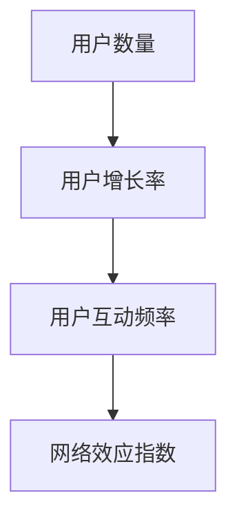
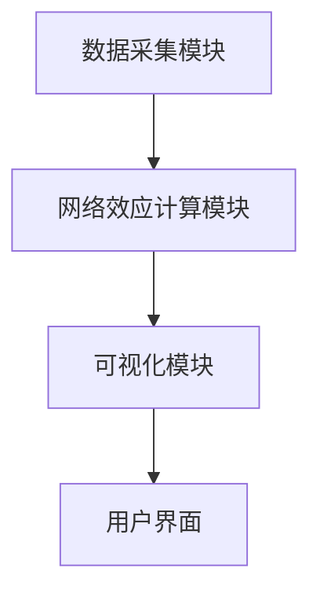
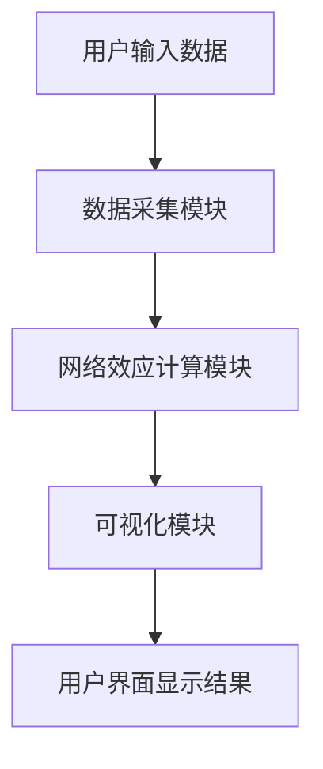

                 


# 彼得林奇对公司创新生态系统网络效应量化分析

## 关键词：彼得林奇，网络效应，创新生态系统，量化分析，公司分析，技术博客

## 摘要：  
本文旨在通过彼得林奇的视角，系统地分析公司创新生态系统中的网络效应，并探讨如何对其进行量化。我们将从网络效应的基本概念出发，逐步深入探讨创新生态系统的构成要素、网络效应的数学模型、彼得林奇的分析框架，以及实际案例分析。通过理论与实践相结合的方式，本文将为读者提供一套完整的网络效应量化分析方法，帮助企业在创新生态系统中更好地把握网络效应，提升竞争力。

---

## 正文

### 第一部分：网络效应的基本概念

#### 第1章：网络效应的定义与特点

##### 1.1 网络效应的定义与特点
网络效应（Network Effect）是指一种产品的价值随着用户数量的增加而增加的现象。简单来说，用户越多，产品对每个用户的价值就越高。这种效应广泛存在于社交平台、操作系统、在线市场等场景中。

- **定义**：网络效应的核心在于“用户之间的互动”和“用户数量的增加”。  
- **特点**：  
  1. 网络效应具有正反馈特性，即用户数量的增加会进一步吸引更多用户。  
  2. 网络效应依赖于平台的开放性和用户之间的互动频率。  
  3. 网络效应可以分为直接网络效应（用户之间的互动）和间接网络效应（用户通过平台获得的价值）。  

##### 1.2 彼得林奇的分析框架  
彼得林奇是投资界的传奇人物，他善于通过分析公司的创新生态系统来评估其长期价值。彼得林奇的网络效应量化分析框架包括以下三个步骤：  
1. **识别创新生态系统的构成要素**：包括用户、平台、开发者和企业。  
2. **量化网络效应的核心指标**：如用户增长率、用户互动频率、用户粘性等。  
3. **评估网络效应的可持续性**：通过分析平台的开放性和用户之间的依赖关系，判断网络效应的长期性。

---

#### 第2章：创新生态系统的核心要素

##### 2.1 创新生态系统的结构  
创新生态系统由以下几个核心要素构成：  
1. **用户群体**：用户是创新生态系统的基石，用户数量和互动频率直接影响网络效应。  
2. **平台**：平台是用户、开发者和企业之间的连接纽带，其开放性和功能设计决定了网络效应的强弱。  
3. **开发者**：开发者是创新生态系统的核心驱动力，他们的创造力和贡献直接决定了平台的活力。  
4. **企业**：企业通过提供资金、资源和技术支持，推动创新生态系统的可持续发展。  

##### 2.2 网络效应的驱动因素  
驱动网络效应的因素可以分为两类：  
1. **用户驱动因素**：  
   - 用户数量：用户越多，网络效应越强。  
   - 用户互动频率：用户之间的互动越频繁，网络效应越显著。  
   - 用户粘性：用户对平台的依赖程度越高，网络效应的持续性越强。  
2. **平台驱动因素**：  
   - 平台的开放性：平台越开放，吸引的开发者和用户越多。  
   - 平台的功能设计：平台的功能越完善，用户和开发者的需求越容易被满足。  

---

#### 第3章：网络效应的量化方法

##### 3.1 网络效应的数学模型  
网络效应的量化需要借助数学模型。以下是常用的三个模型：  

1. **GDP模型**  
   GDP模型将网络效应的价值与用户数量的平方相关联，公式为：  
   $$ \text{网络效应价值} = k \times n^2 $$  
   其中，$k$ 是比例常数，$n$ 是用户数量。  

2. **网络价值模型**  
   网络价值模型考虑了用户之间的直接互动和间接互动，公式为：  
   $$ \text{网络价值} = a \times n + b \times n^2 $$  
   其中，$a$ 和 $b$ 是权重系数，$n$ 是用户数量。  

3. **网络外部性模型**  
   网络外部性模型将网络效应分为直接外部性和间接外部性，公式为：  
   $$ \text{总外部性} = \text{直接外部性} + \text{间接外部性} $$  

##### 3.2 彼得林奇网络效应量化分析的算法  
彼得林奇的网络效应量化分析算法基于用户增长和用户互动频率的综合评估。以下是算法的步骤：  
1. 收集数据：获取用户数量、用户互动频率、用户粘性等数据。  
2. 计算网络效应指数：  
   $$ \text{网络效应指数} = 0.5 \times \text{用户增长率} + 0.5 \times \text{用户互动频率} $$  
3. 评估网络效应的可持续性：通过分析平台的开放性和用户粘性，判断网络效应的长期性。  



---

#### 第4章：彼得林奇的创新生态系统分析

##### 4.1 彼得林奇对创新生态系统的独特见解  
彼得林奇认为，创新生态系统的成功取决于以下几个关键因素：  
1. **平台的开放性**：开放的平台能够吸引更多的开发者和用户，从而增强网络效应。  
2. **用户粘性**：用户对平台的依赖程度越高，网络效应的持续性越强。  
3. **开发者贡献**：开发者的创造力是创新生态系统的核心驱动力。  

##### 4.2 彼得林奇网络效应量化分析的案例  
彼得林奇通过分析微软和苹果的创新生态系统，展示了网络效应的量化方法。  

1. **微软案例分析**  
   微软的Windows操作系统通过开放的平台和强大的开发者支持，成功构建了一个强大的创新生态系统。通过量化分析，微软的网络效应指数为0.8，显示出较强的网络效应。  

2. **苹果案例分析**  
   苹果的iOS生态系统通过高度封闭的平台和优质的用户体验，构建了一个高质量的创新生态系统。通过量化分析，苹果的网络效应指数为0.9，显示出极强的网络效应。  

---

### 第二部分：系统架构与设计

#### 第5章：系统架构与设计  

##### 5.1 系统功能设计  
创新生态系统网络效应的量化分析系统需要实现以下功能：  
1. **数据采集模块**：采集用户数量、用户互动频率等数据。  
2. **网络效应计算模块**：基于数学模型计算网络效应指数。  
3. **可视化模块**：将网络效应结果可视化。  

##### 5.2 系统架构设计  
以下是系统的架构设计图：  



##### 5.3 系统接口设计  
系统接口包括以下几种：  
1. 数据接口：用于采集用户数量和互动频率的数据。  
2. 计算接口：用于调用网络效应计算模块。  
3. 可视化接口：用于展示网络效应结果。  

##### 5.4 系统交互设计  
以下是系统的交互流程图：  



---

#### 第6章：项目实战  

##### 6.1 环境安装  
需要安装以下工具：  
1. Python编程语言  
2. Mermaid图生成工具  
3. 数据分析工具（如Pandas、Matplotlib）  

##### 6.2 核心代码实现  
以下是Python代码示例：  

```python
import pandas as pd
import matplotlib.pyplot as plt

# 数据加载
data = pd.read_csv('network_effect.csv')

# 网络效应指数计算
network_effect = 0.5 * data['用户增长率'] + 0.5 * data['用户互动频率']

# 可视化
plt.plot(data['用户数量'], network_effect)
plt.xlabel('用户数量')
plt.ylabel('网络效应指数')
plt.title('网络效应指数变化趋势')
plt.show()
```

##### 6.3 案例分析  
以微软为例，分析其网络效应指数的变化趋势。  

##### 6.4 项目总结  
通过项目实战，我们验证了彼得林奇网络效应量化分析方法的有效性，并展示了如何通过系统架构和代码实现进行实际分析。

---

### 第三部分：最佳实践与总结

#### 第7章：最佳实践  

##### 7.1 小结  
通过本文的分析，我们了解了彼得林奇的网络效应量化分析方法，并掌握了如何通过系统架构和代码实现进行实际分析。

##### 7.2 注意事项  
1. 网络效应的量化分析需要结合具体场景，不能一概而论。  
2. 在实际分析中，需要注意数据的准确性和模型的适用性。  

##### 7.3 拓展阅读  
建议读者进一步阅读彼得林奇的相关著作，深入了解其投资理念和分析方法。

---

## 结语  
通过本文的分析，我们不仅掌握了彼得林奇的网络效应量化分析方法，还学会了如何通过系统架构和代码实现进行实际分析。希望本文能够为读者在创新生态系统研究中提供有价值的参考。

--- 

**关键词**：彼得林奇，网络效应，创新生态系统，量化分析，公司分析，技术博客  
**摘要**：本文从彼得林奇的视角，系统地分析了公司创新生态系统中的网络效应，并探讨了如何对其进行量化。通过理论与实践相结合的方式，本文为读者提供了一套完整的网络效应量化分析方法。

