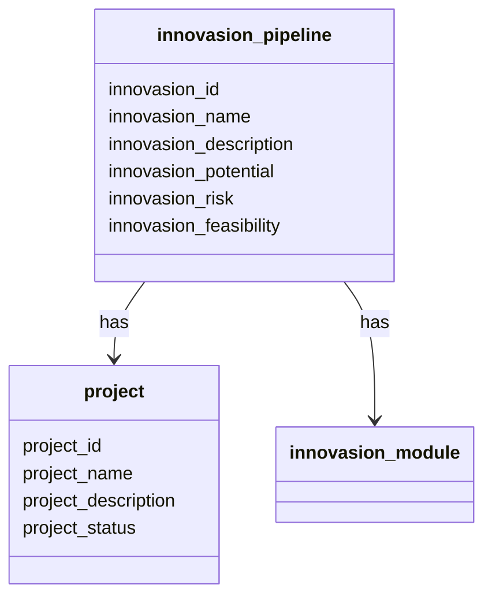
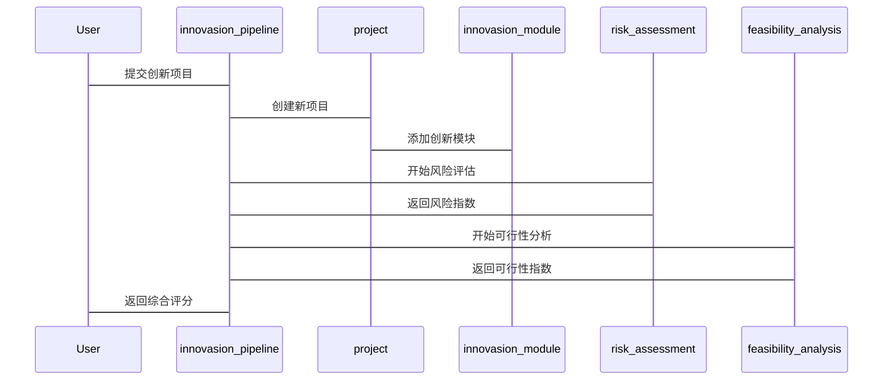

                 


## 《彼得林奇对公司创新管道的质量评估》

### 关键词：彼得林奇，创新管道，质量评估，投资策略，企业创新，评估模型

### 摘要：本文基于彼得·林奇的投资理念，系统地分析了公司创新管道的质量评估方法。通过构建创新管道质量评估模型，详细讲解了模型的算法原理、系统架构设计和项目实战案例，为企业的创新管理提供了实践指导和理论支持。

---

# 彼得林奇对公司创新管道的质量评估

## 引言

### 1.1 彼得·林奇与投资理念

彼得·林奇是美国著名投资家，以其独特的投资哲学闻名。他强调长期投资和深入分析企业基本面，尤其是企业的创新能力和未来发展潜力。创新管道作为企业核心竞争力的体现，是彼得·林奇评估企业价值的重要指标。

### 1.2 创新管道的质量评估背景

在快速变化的商业环境中，创新是企业生存和发展的关键。创新管道的质量评估能够帮助企业识别高潜力项目，优化资源配置，降低投资风险。

---

## 创新管道质量评估的核心概念与联系

### 2.1 创新管道质量评估模型

创新管道质量评估模型由创新潜力、风险评估和可行性分析三个模块组成。各模块通过权重分配进行综合评分，权重基于历史数据和专家意见。

#### 创新潜力评估

创新潜力通过市场需求、技术可行性和团队能力三个维度进行评分，每个维度的权重分别为40%、30%和30%。

#### 风险评估

风险评估包括技术风险、市场风险和管理风险，权重分别为30%、40%和30%。

#### 可行性分析

可行性分析涵盖技术可行性、经济可行性和时间可行性，权重分别为30%、40%和30%。

### 2.2 模型的ER实体关系图

```mermaid
erDiagram
    innovasion_pipeline{}{
        innovasion_id
        innovasion_name
        innovasion_description
        innovasion_potential
        innovasion_risk
        innovasion_feasibility
    }
    project{}{
        project_id
        project_name
        project_description
        project_status
        innovasion_pipeline(innovasion_id)
    }
    innovasion_module{}{
        module_id
        module_name
        module_description
        innovasion_pipeline(innovasion_id)
    }
    risk_assessment{}{
        risk_id
        risk_description
        risk_level
        innovasion_pipeline(innovasion_id)
    }
    feasibility_analysis{}{
        feasibility_id
        feasibility_description
        feasibility_level
        innovasion_pipeline(innovasion_id)
    }
```

---

## 创新管道质量评估的算法原理

### 3.1 算法原理概述

创新管道质量评估模型采用加权评分系统，通过数学模型计算每个项目的综合得分。算法步骤包括：数据收集、权重分配、评分计算和结果分析。

### 3.2 算法的数学模型与公式

创新潜力评分公式：
$$ \text{创新潜力} = 0.4 \times \text{市场需求} + 0.3 \times \text{技术可行性} + 0.3 \times \text{团队能力} $$

风险评估公式：
$$ \text{风险指数} = 0.3 \times \text{技术风险} + 0.4 \times \text{市场风险} + 0.3 \times \text{管理风险} $$

综合评分公式：
$$ \text{综合评分} = (\text{创新潜力} \times 0.5) + (\text{风险指数} \times 0.3) + (\text{可行性分析} \times 0.2) $$

### 3.3 算法实现与案例

使用Python实现创新潜力评分：

```python
def calculate_innovation_potential(market_demand, technical_feasibility, team_capability):
    return 0.4 * market_demand + 0.3 * technical_feasibility + 0.3 * team_capability
```

案例分析：某公司开发的新产品，市场需求为85，技术可行性和团队能力均为90。计算创新潜力：
$$ \text{创新潜力} = 0.4 \times 85 + 0.3 \times 90 + 0.3 \times 90 = 85.4 $$

---

## 系统分析与架构设计方案

### 4.1 系统功能设计

使用Mermaid绘制的领域模型类图：



### 4.2 系统架构设计

使用Mermaid绘制的系统架构图：

```mermaid
containerDiagram
    container Database {
        innovasion_pipeline
    }
    container Analysis {
        project
        innovasion_module
    }
    container Risk-Assessment {
        risk_assessment
    }
    container Feasibility-Assessment {
        feasibility_analysis
    }
```

### 4.3 系统交互设计

使用Mermaid绘制的系统交互序列图：



---

## 项目实战

### 5.1 环境安装

安装Python和相关库（如pandas、numpy）。

### 5.2 核心代码实现

实现创新潜力评分的Python代码：

```python
import pandas as pd

def calculate_innovation_potential(data):
    data['创新潜力'] = 0.4 * data['市场需求'] + 0.3 * data['技术可行性'] + 0.3 * data['团队能力']
    return data

# 示例数据
data = pd.DataFrame({
    '项目名称': ['项目A', '项目B'],
    '市场需求': [85, 70],
    '技术可行性': [90, 80],
    '团队能力': [90, 85]
})

result = calculate_innovation_potential(data)
print(result)
```

### 5.3 案例分析与解读

使用上述代码计算项目A和项目B的创新潜力，结果分别为85.4和75.5。结合风险指数和可行性分析，综合评分可以进一步计算，帮助企业做出投资决策。

---

## 最佳实践

### 6.1 小结

彼得·林奇的创新管道质量评估模型为企业提供了科学的评估方法，帮助识别高潜力创新项目，降低投资风险。

### 6.2 注意事项

在实际应用中，需结合企业实际情况调整权重和评估指标，确保模型的有效性和准确性。

### 6.3 拓展阅读

推荐阅读彼得·林奇的《投资最重要的事情》，深入理解其投资哲学和创新管理策略。

---

## 结论

创新管道的质量评估是企业创新管理的核心工具，彼得·林奇的方法为企业提供了系统的评估框架。通过本文的分析和实践，企业可以更好地管理和优化创新项目，提升竞争力。

