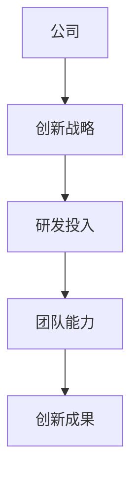
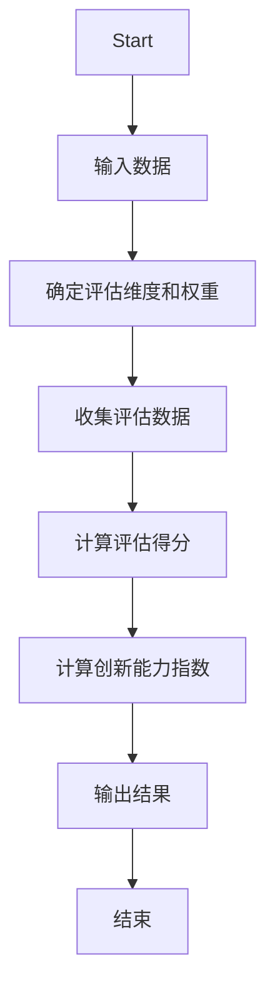
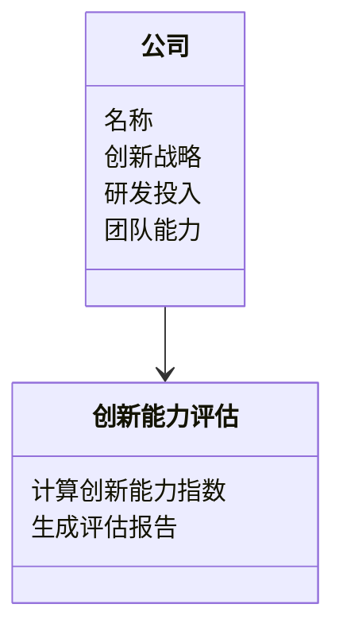
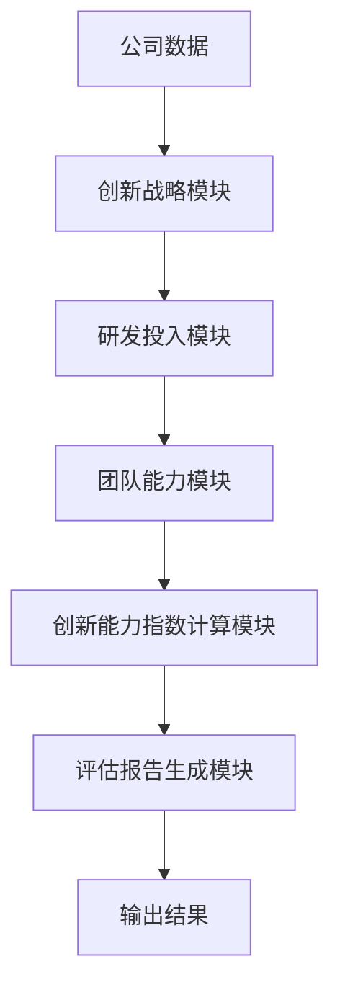

                 


# 彼得林奇对公司创新能力的评估体系

## 关键词：公司创新能力，彼得林奇，评估体系，创新战略，研发投入，团队能力

## 摘要：本文详细阐述了彼得林奇提出的公司创新能力评估体系，从背景介绍、核心概念、算法原理到系统架构和项目实战，全面分析了该体系的构建与应用。文章通过详细的步骤分析和实例说明，展示了如何通过该体系有效评估和提升企业的创新能力。

---

# 第一部分: 背景介绍

## 第1章: 公司创新能力评估体系的背景与问题

### 1.1 问题背景

#### 1.1.1 创新能力对企业发展的核心作用
创新能力是企业在市场竞争中保持竞争优势的关键因素。随着技术的快速发展，企业需要不断创新以适应市场变化，提升产品和服务质量，从而在激烈的竞争中立于不败之地。

#### 1.1.2 当前企业创新评估的痛点与挑战
传统的公司评估体系往往侧重于财务指标、市场份额和短期绩效，而忽视了创新能力这一关键因素。许多企业在面对市场变化时，由于缺乏有效的创新能力评估，难以及时调整战略，导致竞争力下降。

#### 1.1.3 彼得·林奇评估体系的提出动机
彼得·林奇（Peter Lynch）作为投资界的传奇人物，以其精准的选股能力和对公司的深刻理解闻名。他提出的创新能力评估体系，旨在帮助投资者和企业管理者更全面地评估公司的创新潜力，从而做出更明智的投资和管理决策。

### 1.2 问题描述

#### 1.2.1 创新能力的定义与外延
创新能力是指公司在技术研发、产品设计、商业模式等方面进行创新的能力。它不仅包括技术创新，还涵盖管理创新、市场创新等多个方面。

#### 1.2.2 传统企业评估体系的局限性
传统评估体系主要关注财务指标和短期绩效，忽视了创新能力对长期发展的关键作用。这种评估方式难以准确反映公司的创新潜力和竞争优势。

#### 1.2.3 林奇评估体系的目标与价值
林奇评估体系的目标是通过多维度评估公司的创新能力，帮助投资者和管理者识别具有持续创新能力的公司，从而在长期投资和管理中获得更好的回报。

### 1.3 问题解决路径

#### 1.3.1 林奇评估体系的核心思路
林奇评估体系以创新能力为核心，结合财务指标和市场表现，构建了一个全面的评估框架。通过分析公司的创新战略、研发投入、团队能力和市场反馈等多个维度，全面评估公司的创新能力。

#### 1.3.2 从传统评估到创新评估的转变
传统评估体系侧重于财务指标，而林奇评估体系则更加关注公司的创新能力。这种转变需要从企业的战略规划、资源配置和组织结构等多个方面进行调整。

#### 1.3.3 林奇评估体系的适用场景与边界
林奇评估体系适用于所有类型的公司，尤其是那些需要长期竞争优势的企业。然而，对于一些处于初创阶段或资源有限的公司，可能需要根据实际情况调整评估指标和权重。

---

## 第2章: 林奇评估体系的核心概念与联系

### 2.1 核心概念原理

#### 2.1.1 创新能力的构成要素
创新能力的构成要素包括创新战略、研发投入、团队能力、市场反馈和创新成果。这些要素相互作用，共同构成了公司的创新能力。

#### 2.1.2 林奇评估体系的三大维度
林奇评估体系主要从创新战略、研发投入和团队能力三个维度进行评估。这三个维度涵盖了公司创新活动的主要方面，能够全面反映公司的创新能力。

#### 2.1.3 创新能力与企业绩效的关系
创新能力与企业绩效密切相关。创新能力较强的公司通常能够更快地适应市场变化，推出更具竞争力的产品，从而获得更好的财务绩效和市场表现。

### 2.2 核心概念属性特征对比

#### 2.2.1 创新能力维度的特征对比表

| 维度         | 特征                   |
|--------------|------------------------|
| 创新战略     | 战略的清晰性和可行性   |
| 研发投入     | 投入的规模和结构       |
| 团队能力     | 团队的专业性和协作性   |

#### 2.2.2 林奇评估体系与其他评估方法的对比
与传统的财务评估体系相比，林奇评估体系更加注重公司的创新能力。与一些仅关注技术创新的评估体系相比，林奇评估体系更加全面，涵盖了创新战略、研发投入和团队能力等多个方面。

### 2.3 实体关系图



---

# 第二部分: 算法原理讲解

## 第3章: 林奇创新能力评估算法

### 3.1 算法原理

#### 3.1.1 林奇评估体系的评分模型
林奇评估体系通过多维度评估公司的创新能力，每个维度的权重不同，最终计算出创新能力指数。

#### 3.1.2 创新能力指数的计算公式
$$创新能力指数 = \sum_{i=1}^{n} (权重_i \times 评估得分_i)$$

其中，权重_i 是第i个维度的权重，评估得分_i 是第i个维度的评估得分。

#### 3.1.3 算法的步骤与流程
1. 确定评估维度和权重；
2. 收集各维度的评估数据；
3. 计算每个维度的评估得分；
4. 根据权重计算创新能力指数；
5. 分析结果并提出改进建议。

### 3.2 算法流程图



### 3.3 Python实现代码

```python
def lynch_innovation_score(dimensions):
    score = 0
    for dim in dimensions:
        weight = dim['weight']
        score += weight * dim['score']
    return score

# 示例数据
dimensions = [
    {'name': '创新战略', 'weight': 0.3, 'score': 8},
    {'name': '研发投入', 'weight': 0.4, 'score': 7},
    {'name': '团队能力', 'weight': 0.3, 'score': 9}
]

score = lynch_innovation_score(dimensions)
print("创新能力指数:", score)
```

### 3.4 数学模型

#### 3.4.1 创新能力指数模型
$$创新能力指数 = \sum_{i=1}^{n} (w_i \times s_i)$$
其中，w_i 是第i个维度的权重，s_i 是第i个维度的评估得分。

#### 3.4.2 示例计算
假设某公司创新战略得分为8，研发投入得分为7，团队能力得分为9，权重分别为0.3、0.4和0.3。则创新能力指数为：
$$创新能力指数 = 0.3 \times 8 + 0.4 \times 7 + 0.3 \times 9 = 2.4 + 2.8 + 2.7 = 7.9$$

---

## 第4章: 系统分析与架构设计方案

### 4.1 问题场景介绍
为了实现林奇创新能力评估体系的系统化应用，我们需要设计一个基于该体系的企业创新能力评估系统。

### 4.2 系统功能设计

#### 4.2.1 领域模型类图


#### 4.2.2 系统架构设计


#### 4.2.3 系统接口设计
系统接口设计包括数据输入接口、评估计算接口和结果输出接口。

#### 4.2.4 系统交互序列图
```mermaid
graph TD
    User --> 系统: 输入公司数据
    系统 --> 创新战略模块: 计算创新战略得分
    创新战略模块 --> 研发投入模块: 计算研发投入得分
    研发投入模块 --> 团队能力模块: 计算团队能力得分
    团队能力模块 --> 计算模块: 计算创新能力指数
    计算模块 --> 生成报告模块: 生成评估报告
    生成报告模块 --> User: 输出评估报告
```

---

## 第5章: 项目实战

### 5.1 环境安装
需要安装Python和相关库，如Pandas和Matplotlib。

### 5.2 核心实现代码

```python
import pandas as pd
import matplotlib.pyplot as plt

def calculate_innovation_score(company_data):
    score = 0
    for i in range(len(company_data)):
        score += company_data.iloc[i]['weight'] * company_data.iloc[i]['score']
    return score

# 示例数据
data = {
    '维度': ['创新战略', '研发投入', '团队能力'],
    'weight': [0.3, 0.4, 0.3],
    'score': [8, 7, 9]
}
company_data = pd.DataFrame(data)

score = calculate_innovation_score(company_data)
print("创新能力指数:", score)

# 可视化展示
plt.bar(company_data['维度'], company_data['score'], label='评估得分')
plt.ylabel('得分')
plt.title('创新能力评估')
plt.legend()
plt.show()
```

### 5.3 案例分析与解读
以某科技公司为例，分析其创新能力，并使用代码计算其创新能力指数，最后生成可视化报告。

### 5.4 项目小结
通过实际案例分析，验证了林奇创新能力评估体系的有效性和实用性。

---

## 第6章: 最佳实践、小结、注意事项、拓展阅读

### 6.1 最佳实践 tips
- 定期更新评估指标和权重，以适应市场变化。
- 结合公司实际情况调整评估体系。

### 6.2 小结
本文详细介绍了彼得·林奇创新能力评估体系的构建与应用，通过理论分析和实际案例，展示了该体系在企业管理和投资决策中的重要性。

### 6.3 注意事项
- 在实际应用中，需结合公司具体情况调整评估指标和权重。
- 数据的准确性和完整性对评估结果有直接影响，需高度重视数据质量管理。

### 6.4 拓展阅读
- 《彼得·林奇的成功投资法则》
- 《创新管理：理论与实践》

---

通过以上章节的详细分析和讲解，我们全面了解了彼得·林奇创新能力评估体系的核心内容和实际应用。希望本文能为读者在企业创新管理和投资决策中提供有价值的参考和指导。

