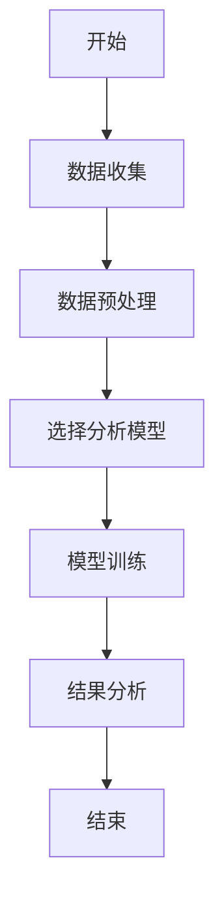
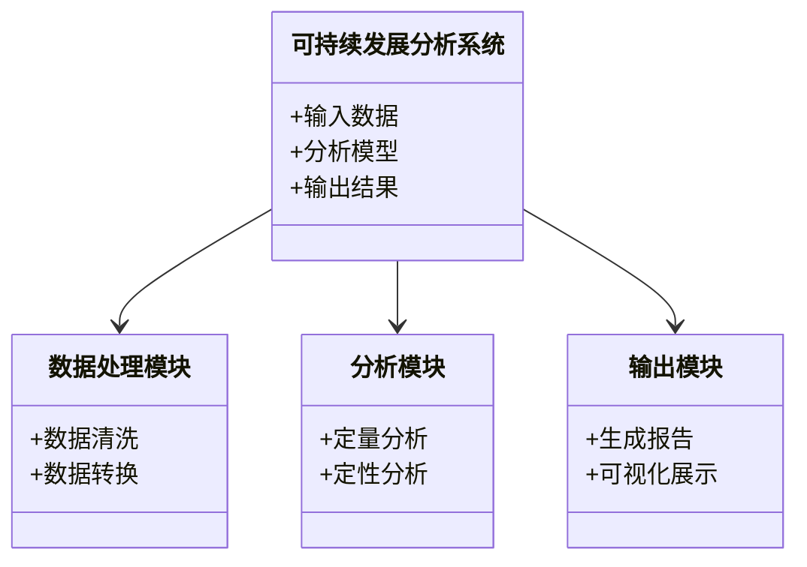
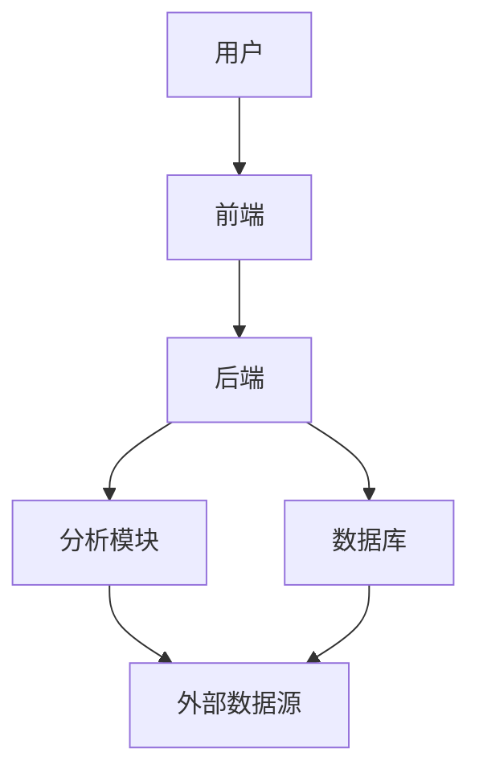
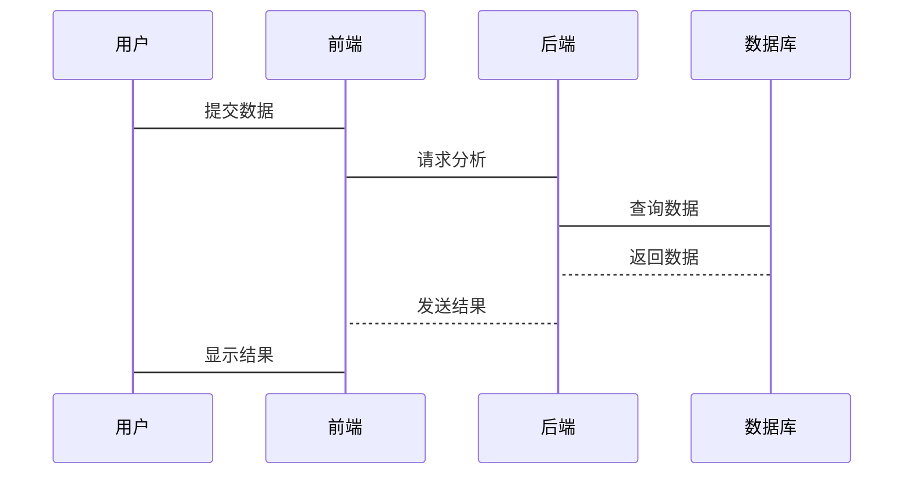

                 


# 彼得林奇对公司可持续发展的分析

## 关键词：可持续发展，彼得林奇，分析框架，定量分析，系统架构

## 摘要：本文系统地分析了彼得林奇对公司可持续发展的分析方法，探讨了其核心概念、分析工具和系统架构设计，结合实际案例，提供了详细的实现方案和解读。

---

# 第1章：公司可持续发展的定义与重要性

## 1.1 可持续发展的概念与背景

### 1.1.1 可持续发展的定义与内涵

可持续发展是指在满足当前需求的同时，不损害后代满足其需求的能力。它涵盖经济、社会和环境三个方面，强调三者的协调与平衡。

### 1.1.2 可持续发展的重要性与意义

企业通过可持续发展，不仅提升社会形象，还能优化运营，降低成本，增强竞争力。同时，它帮助企业在长期发展中规避风险，确保稳定增长。

### 1.1.3 可持续发展与企业社会责任的关系

企业社会责任（CSR）是可持续发展的重要组成部分，涉及公平劳动、环境保护等方面。企业通过履行社会责任，提升品牌价值，获得竞争优势。

## 1.2 彼得林奇的分析框架

### 1.2.1 彼得林奇的投资哲学与方法

彼得林奇以基本面分析著称，注重长期投资，寻找具有持续增长潜力的企业。他强调企业基本面分析，包括财务状况、管理层能力、市场地位等。

### 1.2.2 彼得林奇分析框架的核心要素

彼得林奇的分析框架包含对企业财务状况、行业地位、管理层能力和市场前景的全面评估。他特别关注企业的竞争优势和成长潜力。

### 1.2.3 可持续发展在彼得林奇分析框架中的地位

彼得林奇将企业的可持续性视为长期竞争力的关键因素，认为具备良好可持续性的企业更有可能实现持续增长。

## 1.3 本章小结

本章介绍了可持续发展的概念、重要性及其与企业社会责任的关系，详细阐述了彼得林奇的分析框架及其在可持续发展中的应用。

---

# 第2章：彼得林奇的分析方法

## 2.1 彼得林奇的分析步骤

### 2.1.1 明确分析目标

明确分析目标，如评估企业的环境表现或社会责任履行情况，是彼得林奇分析的第一步。

### 2.1.2 数据收集与整理

收集企业财务报表、社会责任报告、环境数据等，整理并分类，为后续分析奠定基础。

### 2.1.3 数据分析与建模

运用定量分析工具，构建模型，评估企业的可持续发展表现。

## 2.2 彼得林奇的核心分析工具

### 2.2.1 财务指标分析工具

包括净利润率、ROE等财务指标，评估企业的盈利能力。

### 2.2.2 非财务指标分析工具

如员工满意度、碳排放量等，衡量企业的社会责任和环境表现。

### 2.2.3 综合分析工具与方法

结合财务与非财务指标，构建综合评价体系，全面评估企业的可持续发展能力。

## 2.3 本章小结

本章详细介绍了彼得林奇的分析步骤及其核心工具，强调了定量与定性分析的结合。

---

# 第3章：定量分析方法与模型

## 3.1 定量分析的核心概念

### 3.1.1 财务指标分析

分析企业财务健康状况，评估其盈利能力、偿债能力等。

### 3.1.2 非财务指标分析

评估企业在社会责任和环境方面的表现，如员工福利、环保投入等。

### 3.1.3 综合指标分析

综合财务与非财务指标，全面评估企业的可持续发展能力。

## 3.2 数学模型与公式

### 3.2.1 财务指标分析模型

例如，ROE（净资产收益率）计算公式为：

$$ROE = \frac{\text{净利润}}{\text{股东权益}}$$

### 3.2.2 非财务指标分析模型

例如，碳排放强度计算公式为：

$$\text{碳排放强度} = \frac{\text{总碳排放}}{\text{总收入}}$$

### 3.2.3 综合分析模型

综合指标模型：

$$\text{综合得分} = \sum (\text{权重}_i \times \text{指标值}_i)$$

## 3.3 算法原理与流程图

### 3.3.1 算法流程图（Mermaid）



## 3.4 本章小结

本章通过数学模型和流程图，详细讲解了定量分析的方法及其在彼得林奇分析框架中的应用。

---

# 第4章：系统架构设计

## 4.1 系统功能设计

### 4.1.1 领域模型（Mermaid 类图）



## 4.2 系统架构设计

### 4.2.1 系统架构图（Mermaid）



## 4.3 接口设计与交互流程

### 4.3.1 系统接口设计

用户输入企业数据，系统调用分析模块进行处理，输出结果。

### 4.3.2 交互流程（Mermaid 序列图）



## 4.4 本章小结

本章通过系统架构设计和交互流程图，展示了如何构建一个完整的可持续发展分析系统。

---

# 第5章：项目实战

## 5.1 环境安装与配置

安装Python、数据分析库（如Pandas）和可视化工具（如Matplotlib）。

## 5.2 核心功能实现

### 5.2.1 数据处理

```python
import pandas as pd

# 读取数据
data = pd.read_csv('input.csv')

# 数据清洗
data.dropna(inplace=True)
data = data[~data['销售额'].isnull()]
```

### 5.2.2 模型训练

```python
from sklearn.linear_model import LinearRegression

model = LinearRegression()
model.fit(X_train, y_train)
```

### 5.2.3 结果分析

```python
import matplotlib.pyplot as plt

plt.plot(model.predict(X_test), label='预测值')
plt.scatter(y_test, label='实际值')
plt.xlabel('样本编号')
plt.ylabel('预测值')
plt.legend()
plt.show()
```

## 5.3 案例分析

以某企业为例，展示数据分析过程，评估其可持续发展表现。

## 5.4 本章小结

本章通过实际案例，展示了系统的安装、实现和应用过程。

---

# 第6章：最佳实践与注意事项

## 6.1 最佳实践

定期更新数据，选择合适的分析模型，注重数据质量。

## 6.2 小结

彼得林奇的分析框架在公司可持续发展评估中具有重要价值，值得深入研究和应用。

## 6.3 注意事项

确保数据的准确性和完整性，合理选择分析工具，避免片面结论。

## 6.4 拓展阅读

推荐相关书籍和文献，供进一步学习。

---

# 附录

## 附录A：术语表

列出文中出现的专业术语及其解释。

## 附录B：代码库

提供完整的Python代码和数据集，供读者参考。

---

# 结语

通过本文的详细分析，读者可以全面了解彼得林奇的分析方法及其在公司可持续发展评估中的应用，掌握系统的构建和实战技巧，为实际工作提供指导。

