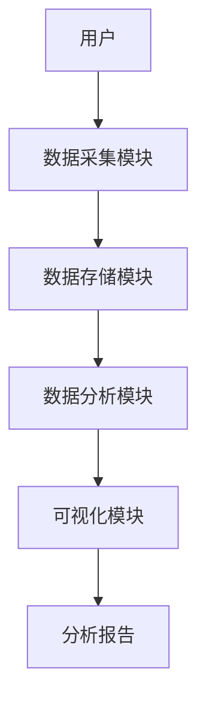

                 


# 彼得林奇对公司品牌价值贡献率的分析

## 关键词：彼得林奇，品牌价值，贡献率，投资分析，企业价值评估

## 摘要：  
本文从彼得·林奇的投资视角出发，深入分析品牌价值对企业发展和投资决策的影响，提出品牌价值贡献率的计算模型和分析方法。通过定量与定性相结合的方式，探讨如何量化品牌对企业的贡献，并为企业价值评估和投资决策提供新的思路。

---

# 第1章：品牌价值贡献率的理论基础

## 1.1 品牌价值的定义与背景

### 1.1.1 品牌价值的核心概念  
- 品牌价值是企业核心竞争力的体现，反映了品牌在市场中的影响力和盈利能力。  
- 品牌价值不仅包括直接的经济收益，还包括品牌认知度、品牌忠诚度和品牌联想等无形资产。  

### 1.1.2 贡献率的定义与意义  
- 贡献率是衡量品牌对企业整体价值贡献程度的重要指标。  
- 通过计算品牌价值贡献率，可以量化品牌对企业发展和投资回报的影响力。  

## 1.2 彼得林奇的品牌价值分析方法

### 1.2.1 彼得林奇的投资哲学  
- 彼得林奇强调基本面分析和长期投资，认为品牌价值是企业长期竞争优势的核心。  
- 他关注企业的财务健康、市场地位和管理团队，这些因素共同决定了品牌价值的贡献率。  

### 1.2.2 品牌价值贡献率的分析框架  
- 从企业收入、利润、市场份额和品牌认知度等多维度出发，构建品牌价值贡献率的分析模型。  
- 通过定量分析和定性评估相结合，全面衡量品牌对企业的贡献。  

---

# 第2章：品牌价值贡献率的计算模型

## 2.1 品牌价值贡献率的公式

### 2.1.1 核心公式  
$$ \text{品牌价值贡献率} = \frac{\text{品牌相关收入}}{\text{总收入}} \times 100\% $$  

### 2.1.2 公式的扩展与优化  
- 品牌相关收入包括品牌溢价收入、品牌授权收入和品牌衍生收入。  
- 总收入为企业所有收入的总和，包括产品销售收入和其他收入。  

## 2.2 影响品牌价值贡献率的因素

### 2.2.1 品牌知名度  
- 品牌知名度越高，品牌相关收入的比例越大，贡献率也越高。  
- 通过市场调研和数据分析，量化品牌知名度对贡献率的影响。  

### 2.2.2 品牌忠诚度  
- 品牌忠诚度高的消费者更愿意选择品牌产品，从而提高品牌相关收入。  
- 通过顾客满意度调查和复购率分析，评估品牌忠诚度对贡献率的影响。  

### 2.2.3 品牌联想与形象  
- 品牌联想是消费者对品牌的认知和情感联系，直接影响品牌价值。  
- 通过品牌联想分析，优化品牌形象，提升品牌价值贡献率。  

---

# 第3章：品牌价值贡献率的算法原理

## 3.1 品牌价值贡献率的数学模型

### 3.1.1 模型构建  
- 基于品牌价值贡献率的公式，构建数学模型，量化品牌对企业的贡献。  
- 使用线性回归分析，将品牌价值贡献率与其他变量（如收入、利润）进行关联分析。  

### 3.1.2 数据处理与分析  
- 收集企业财务数据和市场数据，进行清洗和预处理。  
- 使用Python进行数据分析，计算品牌价值贡献率的数值。  

## 3.2 品牌价值贡献率的算法实现

### 3.2.1 数据分析工具的选择  
- 使用Python的Pandas库进行数据清洗和处理。  
- 使用Matplotlib或Seaborn库进行数据可视化。  

### 3.2.2 算法实现步骤  
1. 收集企业数据，包括收入、利润、市场份额等。  
2. 计算品牌相关收入，确定品牌价值贡献率。  
3. 通过可视化工具，展示品牌价值贡献率的变化趋势。  

### 3.2.3 代码实现  
```python
import pandas as pd
import matplotlib.pyplot as plt

# 数据加载
data = pd.read_csv('brand_data.csv')

# 计算品牌价值贡献率
brand_contribution = (data['品牌相关收入'] / data['总收入']) * 100

# 可视化
plt.figure(figsize=(10, 6))
plt.plot(data['年份'], brand_contribution, marker='o', linestyle='-', label='品牌价值贡献率')
plt.title('品牌价值贡献率变化趋势')
plt.xlabel('年份')
plt.ylabel('贡献率 (%)')
plt.legend()
plt.show()
```

---

# 第4章：品牌价值贡献率的系统分析与架构设计

## 4.1 系统功能设计

### 4.1.1 系统目标  
- 构建品牌价值贡献率分析系统，帮助企业在投资决策中量化品牌价值。  

### 4.1.2 功能模块  
- 数据采集模块：收集企业财务数据和市场数据。  
- 数据分析模块：计算品牌价值贡献率，生成分析报告。  
- 可视化模块：展示品牌价值贡献率的变化趋势和关键指标。  

## 4.2 系统架构设计

### 4.2.1 系统架构图  


### 4.2.2 接口设计  
- 数据采集接口：支持CSV和Excel格式的数据导入。  
- 数据分析接口：提供API服务，支持第三方调用。  

---

# 第5章：品牌价值贡献率的项目实战

## 5.1 项目背景与目标

### 5.1.1 项目背景  
- 某企业希望量化品牌价值贡献率，优化投资决策。  

### 5.1.2 项目目标  
- 计算品牌价值贡献率，分析品牌对企业的贡献。  

## 5.2 项目实施步骤

### 5.2.1 数据收集  
- 收集企业过去五年的财务数据和市场数据。  

### 5.2.2 数据分析  
- 使用Python进行数据分析，计算品牌价值贡献率。  

### 5.2.3 结果解读  
- 分析品牌价值贡献率的变化趋势，提出优化建议。  

## 5.3 项目小结

### 5.3.1 项目成果  
- 得到品牌价值贡献率的数值，量化品牌对企业的贡献。  

### 5.3.2 经验总结  
- 数据质量对分析结果影响较大，需确保数据准确性和完整性。  

---

# 第6章：最佳实践与注意事项

## 6.1 最佳实践

### 6.1.1 数据分析的关键点  
- 数据清洗与预处理是数据分析的基础，需重视数据质量。  

### 6.1.2 可视化的重要性  
- 通过可视化工具，直观展示品牌价值贡献率的变化趋势，便于理解和分析。  

## 6.2 小结与展望

### 6.2.1 小结  
- 本文从理论和实践两个方面，深入分析了品牌价值贡献率的计算方法和应用。  

### 6.2.2 展望  
- 未来可以进一步研究品牌价值贡献率与其他企业绩效指标的关系，为企业投资决策提供更全面的依据。  

---

# 结语

通过彼得林奇的品牌价值贡献率分析，企业可以更好地量化品牌对自身价值的贡献，优化投资决策。本文结合理论与实践，为企业提供了一套完整的分析方法和工具，帮助企业在竞争激烈的市场中保持优势。

