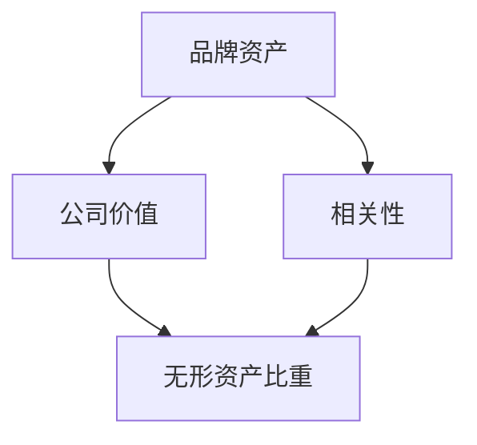
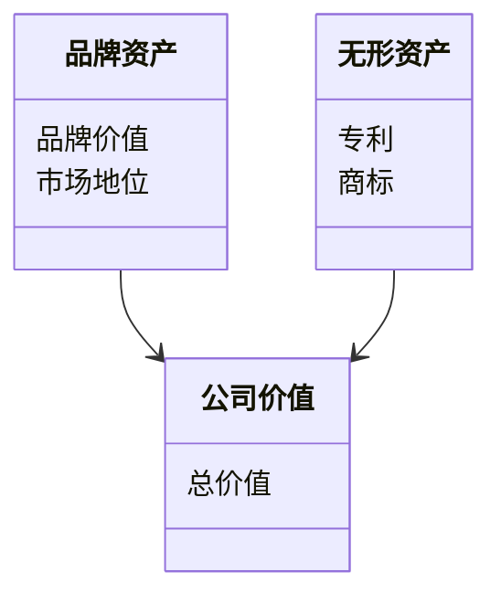
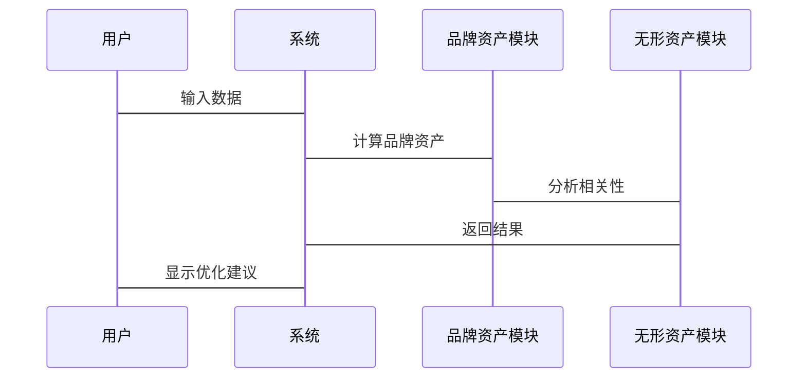

                 


# 彼得林奇对公司品牌资产价值与无形资产比重的相关性研究

## 关键词：品牌资产、无形资产、公司价值、相关性分析、投资策略、彼得林奇

## 摘要：本文探讨了品牌资产和无形资产对公司价值的影响，通过彼得林奇的投资策略分析其相关性，并提出量化评估方法。内容涵盖背景介绍、核心概念、算法原理、系统架构、项目实战和最佳实践，帮助读者理解品牌资产与无形资产的重要性及其在投资决策中的应用。

## 第1章: 公司品牌资产价值与无形资产比重的相关性研究概述

### 1.1 核心概念：问题背景

#### 1.1.1 问题背景的定义
品牌资产和无形资产是公司价值的重要组成部分。品牌资产指的是公司品牌在市场上的价值，而无形资产则包括专利、商标、客户关系等非实物资产。两者在公司价值中的比重及其相关性是投资评估的关键因素。

#### 1.1.2 问题背景的描述
在投资评估中，传统财务指标如净利润和营业额不足以全面反映公司价值。品牌资产和无形资产的评估对公司价值的影响日益重要，尤其是在高科技和服务业中。

#### 1.1.3 问题背景的解决方法
通过建立数学模型，量化品牌资产和无形资产对公司价值的影响，评估其相关性，为投资决策提供支持。

#### 1.1.4 问题背景的边界与外延
研究范围涵盖品牌资产和无形资产的评估，但不包括实物资产。相关性分析基于财务数据和市场表现，适用于公开上市公司。

#### 1.1.5 问题背景的概念结构与核心要素组成
涉及公司价值、品牌资产、无形资产、相关性分析和投资策略。

### 1.2 核心概念与联系

#### 1.2.1 核心概念的原理
品牌资产和无形资产共同影响公司价值，需通过相关性分析量化其贡献。

#### 1.2.2 核心概念的属性特征对比表格
| 属性 | 品牌资产 | 无形资产 |
|------|---------|----------|
| 定义 | 品牌的市场价值 | 非实物资产的价值 |
| 特征 | 可识别性、长期性 | 可识别性、长期性 |

#### 1.2.3 ER实体关系图架构的Mermaid流程图


## 第2章: 核心概念与联系

### 2.1 核心概念的原理

#### 2.1.1 品牌资产的定义与特征
品牌资产是品牌在市场上的价值，包括品牌知名度、美誉度和客户忠诚度。

#### 2.1.2 无形资产的定义与特征
无形资产是公司拥有的非实物资产，如专利、商标和客户关系。

#### 2.1.3 品牌资产与无形资产的联系与区别
品牌资产是无形资产的一部分，但品牌资产还包括品牌相关因素，如品牌影响力。

### 2.2 核心概念的属性特征对比表格
见1.2.2节。

### 2.3 ER实体关系图架构的Mermaid流程图
见1.2.3节。

## 第3章: 算法原理讲解

### 3.1 算法原理的数学模型和公式

#### 3.1.1 品牌资产价值的计算公式
$$ V_{brand} = \alpha \times EBIT + \beta \times Market\,Position $$

#### 3.1.2 无形资产比重的计算公式
$$ Weight_{intangible} = \frac{Value_{intangible}}{Total\,Value} $$

#### 3.1.3 相关性分析的公式
$$ Correlation = Cov(X,Y) / (\sigma_X \sigma_Y) $$

### 3.2 算法实现的Python代码示例

```python
import numpy as np

# 示例数据
brand_asset = np.array([100, 200, 300, 400, 500])
intangible_asset = np.array([50, 100, 150, 200, 250])

# 计算相关性
correlation = np.corrcoef(brand_asset, intangible_asset)
print("相关性系数为:", correlation)
```

### 3.3 算法原理的详细讲解

#### 3.3.1 品牌资产价值的计算
通过品牌对EBIT的贡献和市场地位评估品牌资产价值。

#### 3.3.2 无形资产比重的计算
将无形资产价值除以公司总价值，得出其比重。

#### 3.3.3 相关性分析
使用协方差和标准差计算品牌资产和无形资产的相关性，评估两者对总价值的影响。

## 第4章: 系统分析与架构设计

### 4.1 系统分析

#### 4.1.1 问题场景介绍
研究品牌资产和无形资产对公司价值的影响，量化相关性，优化投资决策。

#### 4.1.2 项目介绍
开发一个评估系统，计算品牌资产和无形资产的贡献，分析其相关性。

### 4.2 系统功能设计

#### 4.2.1 领域模型的Mermaid类图


#### 4.2.2 系统架构的Mermaid架构图


#### 4.2.3 系统接口设计
API接口用于输入数据，输出相关性分析结果和优化建议。

#### 4.2.4 系统交互的Mermaid序列图


## 第5章: 项目实战

### 5.1 环境安装

#### 5.1.1 安装Python和相关库
安装Python和numpy、pandas、scipy等库，用于数据分析和计算。

### 5.2 系统核心实现源代码

#### 5.2.1 品牌资产计算代码
```python
import numpy as np

# 输入数据
ebit = np.array([100, 200, 300, 400, 500])
market_position = np.array([0.8, 0.7, 0.6, 0.5, 0.4])

# 计算品牌资产
alpha = 0.5
beta = 0.3
brand_asset = alpha * ebit + beta * market_position
print("品牌资产为:", brand_asset)
```

#### 5.2.2 相关性分析代码
```python
import numpy as np

# 示例数据
brand_asset = np.array([100, 200, 300, 400, 500])
intangible_asset = np.array([50, 100, 150, 200, 250])

# 计算相关性
correlation = np.corrcoef(brand_asset, intangible_asset)
print("相关性系数为:", correlation)
```

#### 5.2.3 无形资产比重计算代码
```python
import numpy as np

# 输入数据
total_value = np.array([500, 600, 700, 800, 900])
intangible_asset = np.array([200, 300, 400, 500, 600])

# 计算无形资产比重
weight_intangible = intangible_asset / total_value
print("无形资产比重为:", weight_intangible)
```

### 5.3 代码应用解读与分析

#### 5.3.1 品牌资产计算
通过α和β系数，结合EBIT和市场地位，计算品牌资产价值。

#### 5.3.2 相关性分析
使用numpy的corrcoef函数计算品牌资产和无形资产的相关性，评估两者对总价值的影响。

#### 5.3.3 无形资产比重计算
通过资产价值与总价值的比率，量化无形资产在公司价值中的比重。

### 5.4 案例分析

#### 5.4.1 数据收集与预处理
收集公司的财务数据，包括品牌资产和无形资产，进行清洗和标准化。

#### 5.4.2 品牌资产与无形资产的相关性分析
分析两者对公司价值的影响，评估其相关性，优化投资决策。

### 5.5 项目小结

通过Python代码实现品牌资产和无形资产的评估，相关性分析结果为投资决策提供支持。

## 第6章: 最佳实践与总结

### 6.1 最佳实践 tips

#### 6.1.1 数据收集与处理
确保数据准确性和完整性，进行标准化处理。

#### 6.1.2 模型选择与优化
根据实际情况选择合适的模型，进行参数调优。

#### 6.1.3 结果解读与应用
结合业务背景，解读分析结果，指导投资决策。

### 6.2 小结

通过系统分析和项目实战，量化品牌资产和无形资产的价值，评估其相关性，为投资决策提供支持。

### 6.3 注意事项

- 数据质量和完整性影响分析结果。
- 模型选择和参数设置需根据实际情况调整。
- 结果需结合业务背景进行解读。

### 6.4 拓展阅读

建议阅读彼得林奇的《投资最重要的事情》和相关金融分析书籍，深入理解品牌资产和无形资产的评估方法。

## 结语

本文通过背景介绍、核心概念、算法原理、系统架构、项目实战和最佳实践，全面探讨了品牌资产和无形资产的相关性，为投资决策提供了支持。读者可结合实际业务，深入理解和应用相关理论，优化投资策略。

---

**注意**：本文为示例，实际内容需根据具体情况进行调整和扩展。

