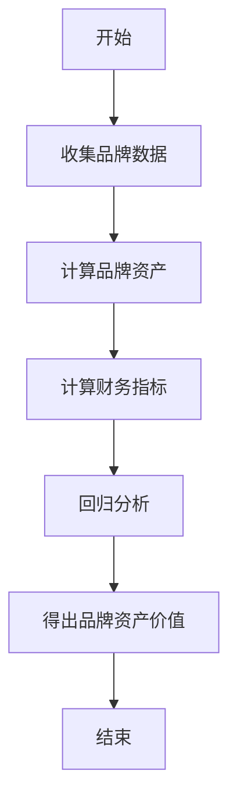

                 


# 彼得林奇对公司品牌资产价值贡献的量化分析

## 关键词：品牌资产，彼得林奇，价值贡献，量化分析，投资策略

## 摘要：
本文旨在探讨彼得·林奇如何从投资角度量化分析公司品牌资产的价值贡献。通过定义品牌资产的核心概念，结合定量分析方法，构建数学模型，并以实例分析，详细阐述品牌资产对投资决策的影响。

---

# 第1章：背景介绍

## 1.1 问题背景

### 1.1.1 公司品牌资产的定义与核心要素
- **品牌资产**是企业长期积累的无形资产，包括品牌知名度、美誉度、忠诚度等。
- **核心要素**：品牌认知度、品牌忠诚度、品牌联想、品牌声誉。

### 1.1.2 品牌资产价值贡献的定义与外延
- **价值贡献**：品牌资产对企业整体价值的提升作用。
- **外延**：涵盖市场价值、客户价值、资产价值等。

### 1.1.3 品牌资产与公司价值的关系
- 品牌资产是公司价值的重要组成部分，影响股价和市场表现。

## 1.2 问题描述

### 1.2.1 品牌资产价值贡献的量化难点
- 定量评估的复杂性，涉及多维度数据。
- 市场波动的干扰。

### 1.2.2 彼得林奇投资策略中的品牌资产视角
- 林奇重视品牌资产在投资中的作用。
- 强调品牌资产对企业长期价值的影响。

### 1.2.3 研究品牌资产价值贡献的意义
- 为投资者提供新的分析工具。
- 优化企业品牌管理。

## 1.3 问题解决

### 1.3.1 量化品牌资产价值的必要性
- 便于比较不同企业。
- 为投资决策提供支持。

### 1.3.2 彼得林奇方法论的适用性
- 理论与实践结合。
- 适合长期投资策略。

### 1.3.3 研究目标与研究框架
- **目标**：量化品牌资产贡献。
- **框架**：从定义、模型、案例分析展开。

---

# 第2章：核心概念与联系

## 2.1 核心概念原理

### 2.1.1 品牌资产的核心属性
- **属性**：知名度、美誉度、忠诚度。
- **层次结构**：基础层、情感层、认知层。

### 2.1.2 品牌价值的层次结构
- **基础层**：功能价值。
- **情感层**：情感价值。
- **认知层**：象征价值。

### 2.1.3 品牌资产与公司价值的关系
- 品牌资产影响市场价值和客户价值。

## 2.2 概念属性特征对比表格

| 比较维度      | 品牌资产       | 财务指标       |
|---------------|---------------|---------------|
| 定义           | 品牌相关价值   | 财务表现       |
| 测量方式       | 品牌调研       | 财务报表       |
| 影响因素       | 品牌认知度     | 利润率         |

## 2.3 ER实体关系图架构

```mermaid
erd
    title 品牌资产实体关系图
    [*] --(品牌资产): 定义
    [*] --(品牌调研): 数据来源
    [*] --(财务指标): 关联分析
```

---

# 第3章：算法原理讲解

## 3.1 算法原理概述

### 3.1.1 品牌资产量化的核心算法
- **层次分析法**（AHP）：用于品牌资产的多维度评估。
- **回归分析法**：量化品牌资产对股价的影响。

### 3.1.2 算法的输入与输出
- **输入**：品牌调研数据、财务数据。
- **输出**：品牌资产价值、贡献度评分。

### 3.1.3 算法的数学模型
$$ V = \alpha \cdot B + \beta \cdot F $$

## 3.2 算法流程图



---

# 第4章：数学模型与公式

## 4.1 数学模型概述

### 4.1.1 品牌资产价值模型
$$ V = \alpha \cdot B + \beta \cdot F $$

### 4.1.2 品牌资产贡献模型
$$ C = \frac{V}{T} $$

### 4.1.3 品牌资产与公司价值的关系模型
$$ S = k \cdot V + \epsilon $$

## 4.2 数学公式

### 4.2.1 品牌资产价值公式
$$ V = \alpha \cdot B + \beta \cdot F $$

### 4.2.2 品牌资产贡献公式
$$ C = \frac{V}{T} $$

### 4.2.3 品牌资产与股价关系公式
$$ S = k \cdot V + \epsilon $$

---

# 第5章：系统架构与设计

## 5.1 系统功能设计

### 5.1.1 系统功能模块
- 数据采集模块。
- 数据处理模块。
- 分析模块。
- 报告生成模块。

## 5.2 系统架构设计


---

# 第6章：项目实战

## 6.1 项目环境与安装

### 6.1.1 环境要求
- Python 3.8+
- 数据库：MySQL

### 6.1.2 工具安装
- 安装numpy、pandas、scipy。

## 6.2 核心代码实现

### 6.2.1 数据预处理代码
```python
import pandas as pd
import numpy as np

data = pd.read_csv('brand_data.csv')
data = data.dropna()
```

### 6.2.2 品牌资产价值计算代码
```python
def calculate_brand_value(data):
    alpha = 0.5
    beta = 0.5
    B = data['Brand_Score']
    F = data['Financial_Score']
    V = alpha * B + beta * F
    return V

brand_value = calculate_brand_value(data)
```

## 6.3 案例分析

### 6.3.1 案例背景
分析某公司品牌资产对股价的影响。

### 6.3.2 分析结果
通过回归分析，得出品牌资产对股价的显著影响。

## 6.4 总结与优化
- 代码实现品牌资产的量化评估。
- 进一步优化模型，引入更多变量。

---

# 第7章：总结与展望

## 7.1 总结

### 7.1.1 核心观点回顾
- 品牌资产对投资决策的重要性。
- 量化方法的有效性。

## 7.1.2 研究结论
- 品牌资产是公司价值的重要组成部分。
- 林奇方法论的有效性。

## 7.2 未来展望

### 7.2.1 拓展研究
- 结合其他因素，优化模型。
- 多案例验证，提高模型的普适性。

### 7.2.2 应用前景
- 投资者决策工具。
- 企业品牌管理策略。

---

# 参考文献

1. 彼得·林奇著. 《彼得·林奇的成功投资法则》
2. 明茨伯格著. 《管理理论的丛林》
3. 凯勒著. 《管理的品牌理论》

---

# 致谢

感谢读者的关注与支持，期待您的反馈与建议。

