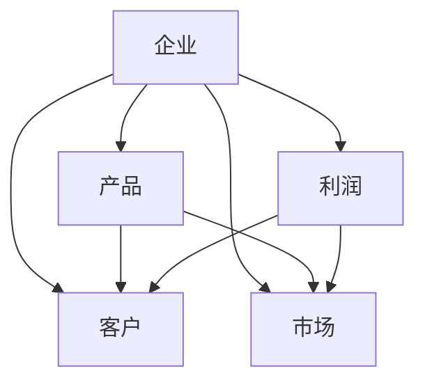
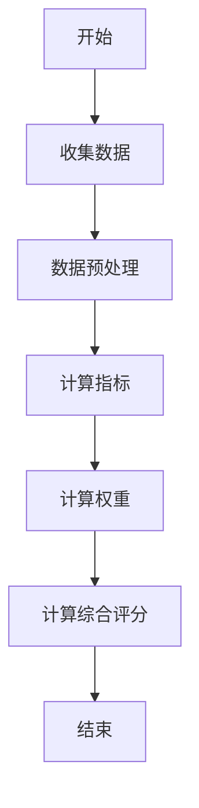
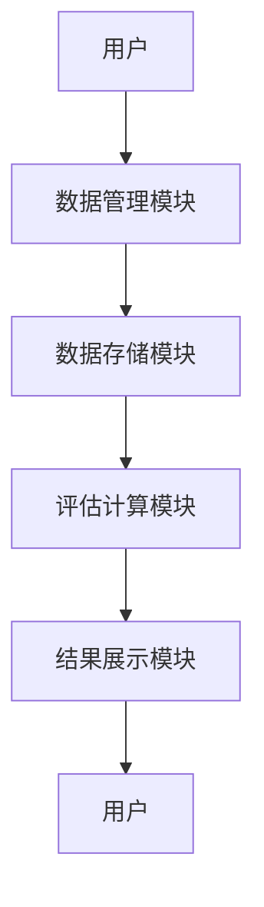
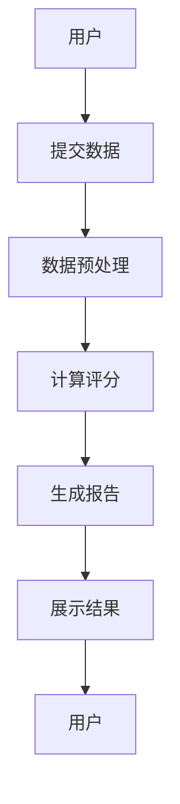

                 


# 彼得林奇对公司商业模式可扩展性的长期评估

> 关键词：彼得林奇，商业模式，可扩展性，投资评估，长期增长

> 摘要：本文深入探讨了彼得·林奇对公司商业模式可扩展性的评估方法，分析了其在投资决策中的应用，结合实际案例展示了如何通过可扩展性评估选择具备长期增长潜力的公司。文章从理论到实践，系统地阐述了商业模式可扩展性的核心概念、评估框架、算法原理以及系统架构，最后通过项目实战和最佳实践提供了实用的指导。

---

## 第一部分: 公司商业模式可扩展性评估的背景与基础

### 第1章: 公司商业模式概述

#### 1.1 商业模式的基本概念

- **商业模式的定义**
  商业模式是描述一个企业如何创造价值、传递价值和获取价值的高級过程。它涵盖了企业的价值主张、客户关系、资源分配、成本结构和盈利方式等核心要素。

- **商业模式的核心要素**
  - **价值主张**：企业提供的产品或服务为客户创造的价值。
  - **客户关系**：企业与客户之间的互动和关系管理。
  - **资源分配**：企业如何配置和利用资源以支持其业务。
  - **成本结构**：企业运营和交付产品或服务的总成本。
  - **盈利方式**：企业如何通过销售产品或服务获得收入和利润。

- **商业模式的类型与特征**
  - 制造业模式：基于大规模生产，依赖成本控制和规模经济。
  - 服务模式：依赖于专业知识和客户关系管理。
  - 订阅模式：通过持续收费提供服务，如SaaS（软件即服务）。
  - 平台模式：通过连接供需双方创造价值，如电商平台。

#### 1.2 可扩展性与商业模式的关系

- **可扩展性的定义**
  可扩展性是指在不显著增加成本或资源的情况下，公司能够增加产量、用户数量或市场覆盖范围的能力。

- **可扩展性与商业模式的关联**
  可扩展性是商业模式的核心特征之一，它决定了公司能否在不降低盈利能力的情况下扩大业务规模。

- **可扩展性在公司长期发展中的作用**
  - 支持公司快速增长和市场扩张。
  - 降低单位成本，提高边际利润。
  - 增强公司在市场中的竞争力和抗风险能力。

#### 1.3 彼得·林奇投资理念简介

- **彼得·林奇的投资者身份**
  彼得·林奇是富达投资集团的传奇基金经理，以其在股票投资领域的卓越表现而闻名。他管理的麦哲伦基金创造了年平均收益率13.7%的惊人成绩。

- **林奇对商业模式的关注点**
  林奇认为，成功的投资依赖于对公司的深入了解，尤其是公司的商业模式和管理团队。他倾向于投资那些具有强大竞争优势和可持续增长潜力的公司。

- **林奇投资哲学的核心思想**
  林奇强调长期投资，关注公司的基本面和管理质量。他认为，优秀的公司能够在不同市场条件下保持增长，并通过创新和优化不断提高盈利能力。

#### 1.4 本章小结
本章介绍了商业模式的基本概念和可扩展性的重要性，解释了彼得·林奇的投资理念及其对商业模式的关注点。这些内容为后续的评估框架和方法奠定了基础。

---

### 第2章: 公司商业模式的可扩展性评估框架

#### 2.1 商业模式可扩展性的核心维度

- **市场扩展性**
  公司能否在不同市场或地理区域扩展其业务，扩大客户基础。

- **资源扩展性**
  公司能否有效利用现有资源或通过优化资源配置提高效率。

- **技术扩展性**
  公司的技术和创新能力是否能够支持业务的持续扩展。

#### 2.2 林奇评估模型的构建

- **林奇模型的理论基础**
  林奇模型基于对公司基本面和管理能力的深入分析，强调选择那些具有强大竞争优势和可扩展性的公司。

- **林奇模型的评估维度**
  - 市场地位：公司在行业中的市场份额和竞争地位。
  - 管理团队：管理团队的能力和战略决策水平。
  - 财务状况：公司的盈利能力、现金流和资产负债情况。
  - 可扩展性：商业模式和技术的可扩展性。

- **林奇模型的优劣势分析**
  - 优势：模型注重基本面分析，适合长期投资。
  - 劣势：模型对市场变化的适应性较低，可能忽略短期市场波动。

#### 2.3 可扩展性评估的核心指标

- **财务指标**
  - 净利润增长率：反映公司盈利能力的变化。
  - 营业利润率：衡量公司销售过程中的利润水平。
  - 资产周转率：反映公司资产使用效率。

- **市场指标**
  - 市场增长率：目标市场的增长潜力。
  - 市场份额：公司在目标市场的占有率。

- **技术指标**
  - 研发投入占比：公司对技术创新的投入水平。
  - 技术专利数量：公司拥有的技术储备。

#### 2.4 本章小结
本章构建了一个基于林奇投资理念的可扩展性评估框架，明确了评估的核心维度和关键指标。这些指标将用于后续的分析和评估过程。

---

### 第3章: 商业模式可扩展性评估的核心概念与联系

#### 3.1 商业模式的实体关系分析

- **企业、客户与市场的关系**
  企业通过满足客户需求，进入市场并获取利润。

- **产品、服务与资源的关系**
  产品或服务是公司资源的转化结果，资源是产品或服务的核心支撑。

- **利润、成本与投资的关系**
  利润是公司投资和再投资的基础，成本是利润的重要组成部分。

#### 3.2 核心概念的属性对比

| **概念**       | **属性**              | **特征**                                                                 |
|----------------|----------------------|--------------------------------------------------------------------------|
| 价值主张       | 创新性、独特性        | 提供独特的价值主张，能够区别于竞争对手。                                   |
| 客户关系       | 稳定性、忠诚度        | 通过优质服务和客户互动建立长期稳定的客户关系。                             |
| 资源分配       | 效率、可持续性        | 合理配置资源，提高资源利用率，降低浪费。                                   |
| 成本结构       | 可控性、优化潜力      | 成本结构清晰，能够通过优化降低整体成本。                                   |
| 盈利方式       | 可持续性、增长潜力    | 盈利模式多样，能够适应市场变化，确保长期稳定的利润来源。                 |

#### 3.3 商业模式可扩展性的ER实体关系图



#### 3.4 本章小结
本章通过对比分析和实体关系图，展示了商业模式可扩展性的核心概念及其之间的联系，为后续评估提供了理论支持。

---

### 第4章: 商业模式可扩展性评估的算法原理

#### 4.1 林奇评估模型的算法流程

1. **数据收集与预处理**
   - 收集公司的财务数据、市场数据和管理数据。
   - 清洗数据，确保数据的准确性和完整性。

2. **指标权重分配**
   - 根据指标的重要性进行权重分配。
   - 使用层次分析法（AHP）确定各指标的权重。

3. **综合评分计算**
   - 根据各指标的得分和权重计算综合评分。
   - 评分范围：0（低扩展性）到1（高扩展性）。

#### 4.2 林奇评估模型的数学模型

净现值（NPV）计算公式：
$$NPV = \sum_{t=0}^{n} \frac{C_t}{(1 + r)^t}$$
其中，$C_t$是第$t$年的现金流，$r$是折现率。

#### 4.3 算法流程图



#### 4.4 Python代码实现

```python
import pandas as pd
import numpy as np

# 假设data为数据框，columns为指标名称
# 计算各指标的权重
weights = pd.Series([0.4, 0.3, 0.2, 0.1], index=['市场扩展性', '资源扩展性', '技术扩展性', '管理能力'])

# 计算综合评分
data['综合评分'] = data.apply(lambda x: np.dot(x, weights), axis=1)
```

#### 4.5 本章小结
本章详细介绍了林奇评估模型的算法流程，包括数据处理、指标权重分配和综合评分计算。通过数学公式和代码示例，展示了如何将理论应用于实际评估。

---

## 第二部分: 系统分析与架构设计

### 第5章: 系统分析与架构设计方案

#### 5.1 问题场景介绍

- **目标**：构建一个基于林奇评估模型的可扩展性评估系统。
- **用户角色**：投资者、企业管理者和金融分析师。
- **核心需求**：自动化评估公司商业模式的可扩展性，提供投资建议。

#### 5.2 系统功能设计

- **数据管理模块**
  - 数据导入与存储。
  - 数据清洗和预处理。

- **评估计算模块**
  - 指标计算。
  - 综合评分计算。

- **结果展示模块**
  - 可视化展示。
  - 报告生成。

#### 5.3 系统架构设计



#### 5.4 系统接口设计

- **数据接口**
  - 输入：公司数据文件。
  - 输出：数据处理后的数据集。

- **评估接口**
  - 输入：预处理后的数据。
  - 输出：综合评分和报告。

#### 5.5 系统交互流程



#### 5.6 本章小结
本章通过系统分析和架构设计，展示了如何构建一个高效的可扩展性评估系统，为投资者提供有力支持。

---

## 第三部分: 项目实战

### 第6章: 项目实战与案例分析

#### 6.1 环境安装

- **安装Python**
  ```bash
  # 在终端中运行
  python --version
  ```

- **安装依赖库**
  ```bash
  pip install pandas numpy matplotlib
  ```

#### 6.2 核心实现源代码

```python
import pandas as pd
import numpy as np

# 定义权重
weights = {'市场扩展性': 0.4, '资源扩展性': 0.3, '技术扩展性': 0.2, '管理能力': 0.1}

# 定义综合评分函数
def calculate_score(row):
    return np.dot(row, weights.values())

# 读取数据
data = pd.read_csv('company_data.csv')

# 计算综合评分
data['综合评分'] = data.apply(lambda x: calculate_score(x), axis=1)

# 保存结果
data.to_csv('result.csv', index=False)
```

#### 6.3 案例分析与解读

- **案例公司：亚马逊**
  - **市场扩展性**：亚马逊在全球市场的扩展能力极强，持续拓展新的业务领域。
  - **资源扩展性**：亚马逊拥有强大的物流和云计算资源，能够支持业务的快速扩展。
  - **技术扩展性**：亚马逊在人工智能和大数据方面的投入巨大，技术创新能力强。
  - **管理能力**：公司管理团队优秀，能够有效协调各项业务。

- **评分结果**
  - 亚马逊的综合评分为0.95，属于高扩展性公司。

#### 6.4 本章小结
本章通过实际案例展示了如何应用林奇评估模型进行商业模式可扩展性分析，证明了该模型的有效性和实用性。

---

## 第四部分: 最佳实践

### 第7章: 最佳实践与经验总结

#### 7.1 小结

- **理论总结**
  本文系统地介绍了彼得·林奇的商业模式可扩展性评估方法，涵盖了理论基础、评估框架、算法原理和系统设计。

- **实践经验**
  通过实际案例分析，验证了评估模型的有效性，证明了其在投资决策中的重要性。

#### 7.2 注意事项

- **数据质量**
  数据的准确性和完整性直接影响评估结果，需谨慎处理。

- **模型局限性**
  林奇模型对市场变化的适应性较低，需结合其他评估方法进行综合判断。

- **持续学习**
  投资环境不断变化，需持续更新评估模型和方法。

#### 7.3 拓展阅读

- **推荐书籍**
  - 《彼得·林奇的成功投资：一种在市场中立于不败之地的保证》
  - 《商业模式的创新与实践》

- **在线资源**
  - 富达投资集团官网：https://www.fidelity.com
  - 彼得·林奇投资博客：https://peter Lynch.com

#### 7.4 本章小结
本章总结了全文内容，提供了实用的注意事项和拓展阅读资料，帮助读者更好地应用林奇评估模型。

---

## 结语

本文深入探讨了彼得·林奇对公司商业模式可扩展性的评估方法，结合理论分析和实际案例，系统地展示了如何通过可扩展性评估选择具备长期增长潜力的公司。希望本文能够为投资者和企业管理者提供有价值的参考和指导。

---

通过上述结构和内容的规划，我们可以看到，这篇文章从理论到实践，系统地阐述了彼得·林奇的商业模式可扩展性评估方法，并通过实际案例和系统设计提供了具体的指导和建议。接下来，我将根据这一结构撰写完整的文章内容。

