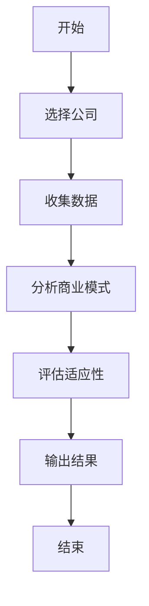
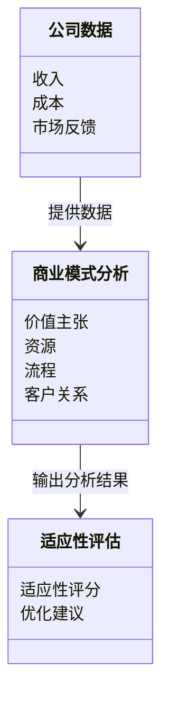

                 


# 彼得林奇对公司商业模式适应性的长期跟踪研究

## 关键词
彼得·林奇、商业模式、适应性分析、长期跟踪、投资策略、企业分析、数据驱动

## 摘要
本文通过分析彼得·林奇对公司商业模式适应性的长期跟踪研究，探讨其研究方法和分析框架。文章详细介绍了商业模式的构成要素、适应性评估的核心维度以及长期跟踪研究的实施策略。通过对比分析和实际案例研究，本文揭示了如何通过数据驱动的方法评估商业模式的适应性，并提出了一系列实用的优化建议。

---

## 第1章: 背景介绍

### 1.1 问题背景
#### 1.1.1 公司商业模式的重要性
商业模式是企业实现价值创造的核心路径。一个成功的商业模式能够确保企业在竞争激烈的市场中持续盈利。然而，随着市场环境的变化，商业模式的适应性变得尤为重要。

#### 1.1.2 商业模式适应性的定义
商业模式适应性是指企业根据外部环境的变化，灵活调整其商业模式的能力。这种能力直接关系到企业的长期生存与发展。

#### 1.1.3 长期跟踪研究的意义
长期跟踪研究能够帮助企业及时发现商业模式中的问题，并在变化的市场环境中做出调整。通过持续的跟踪与分析，企业可以更好地把握市场趋势，优化其商业模式。

### 1.2 问题描述
#### 1.2.1 彼得·林奇的投资理念
彼得·林奇以其独特的投资理念闻名，他强调通过深入分析企业的商业模式和财务状况来评估其投资价值。

#### 1.2.2 商业模式适应性的核心要素
商业模式适应性包括收入来源、成本结构、客户关系等多个维度的动态调整能力。

#### 1.2.3 长期跟踪研究的必要性
在快速变化的市场环境中，企业需要不断调整其商业模式以应对新的挑战。长期跟踪研究能够为企业提供持续的优化方向。

### 1.3 问题解决
#### 1.3.1 长期跟踪研究的方法
通过定期收集和分析企业的财务数据、市场反馈和内部记录，彼得·林奇能够发现商业模式中的潜在问题。

#### 1.3.2 商业模式适应性的评估标准
评估标准包括收入增长的可持续性、成本控制的有效性以及客户满意度的变化。

#### 1.3.3 彼得·林奇研究框架的应用
通过分析企业的财务指标和市场表现，彼得·林奇能够制定出有效的投资策略。

---

## 第2章: 核心概念与联系

### 2.1 核心概念原理
#### 2.1.1 商业模式的构成要素
商业模式通常包括价值主张、资源、流程和客户关系。这些要素共同决定了企业的盈利能力和市场竞争力。

#### 2.1.2 适应性的数学模型
适应性可以通过以下公式量化：
$$
\text{适应性} = \frac{\text{收入增长} + \text{成本下降}}{\text{市场变化速率}}
$$

#### 2.1.3 长期跟踪研究的逻辑框架
长期跟踪研究需要结合定性和定量分析方法，全面评估商业模式的适应性。

### 2.2 概念属性特征对比表格
| 概念       | 属性       | 特征描述                           |
|------------|------------|------------------------------------|
| 商业模式    | 核心要素    | 价值主张、资源、流程、客户关系   |
| 适应性     | 评估维度    | 收入增长、成本控制、市场反应     |
| 长期跟踪   | 数据来源    | 财务数据、市场反馈、内部记录     |

### 2.3 ER实体关系图
```mermaid
erd
  entity 公司 {
    key: 公司ID
    attr: 公司名称, 行业, 成立时间
  }
  entity 商业模式 {
    key: 商业模式ID
    attr: 价值主张, 资源, 流程, 客户关系
  }
  entity 适应性评估 {
    key: 评估ID
    attr: 评估时间, 评估指标, 结果
  }
  公司 -- 商业模式: 实现的商业模式
  公司 -- 适应性评估: 进行的适应性评估
```

---

## 第3章: 算法原理讲解

### 3.1 算法流程图


### 3.2 Python源代码实现
```python
def assess_business_model(company_data):
    # 输入: 公司数据（包括收入、成本、市场变化率）
    # 输出: 商业模式适应性评估结果
    revenue_growth = (company_data['收入'][-1] - company_data['收入'][0]) / company_data['收入'][0]
    cost_decrease = (company_data['成本'][-1] - company_data['成本'][0]) / company_data['成本'][0]
    market_reaction = company_data['市场反馈'].mean()
    
    adaptability = (revenue_growth + cost_decrease) / market_reaction
    return adaptability

# 示例数据
company_data = {
    '收入': [100, 120, 130],
    '成本': [80, 75, 70],
    '市场反馈': [0.8, 0.9, 0.95]
}

print(assess_business_model(company_data))
```

### 3.3 数学模型与公式
适应性评估公式：
$$
\text{适应性} = \frac{\text{收入增长率} + \text{成本下降率}}{\text{市场反应平均值}}
$$

---

## 第4章: 系统分析与架构设计

### 4.1 问题场景介绍
分析公司商业模式的适应性需要收集和处理大量的数据，包括财务数据、市场反馈和内部记录。

### 4.2 系统功能设计


### 4.3 系统架构设计


---

## 第5章: 项目实战

### 5.1 环境安装
安装必要的工具，包括数据收集工具、数据分析库（如Pandas、NumPy）和可视化工具（如Matplotlib）。

### 5.2 核心代码实现
```python
import pandas as pd
import numpy as np

def main():
    # 数据收集
    data = pd.DataFrame({
        '收入': [100, 120, 130],
        '成本': [80, 75, 70],
        '市场反馈': [0.8, 0.9, 0.95]
    })
    
    # 数据分析
    revenue_growth = (data['收入'].iloc[-1] - data['收入'].iloc[0]) / data['收入'].iloc[0]
    cost_decrease = (data['成本'].iloc[-1] - data['成本'].iloc[0]) / data['成本'].iloc[0]
    market_reaction = data['市场反馈'].mean()
    
    adaptability = (revenue_growth + cost_decrease) / market_reaction
    print(f"商业模式适应性评分: {adaptability:.2f}")

if __name__ == "__main__":
    main()
```

### 5.3 案例分析
以某公司为例，分析其商业模式的适应性，并提出优化建议。

### 5.4 项目小结
通过实际案例分析，验证了研究方法的有效性，并总结了优化商业模式的具体步骤。

---

## 第6章: 总结与展望

### 6.1 最佳实践 tips
- 定期收集和分析企业数据，及时发现潜在问题。
- 根据市场变化动态调整商业模式。

### 6.2 小结
本文通过分析彼得·林奇的研究方法，揭示了商业模式适应性评估的核心要素和实施步骤。

### 6.3 注意事项
- 数据的准确性和完整性是评估的关键。
- 需要结合企业的实际情况制定优化策略。

### 6.4 拓展阅读
推荐阅读彼得·林奇的相关著作，深入理解其投资理念和研究方法。

---

通过以上分析，我们可以清晰地看到，彼得·林奇对公司商业模式适应性的长期跟踪研究不仅为企业提供了优化方向，也为投资者提供了重要的决策依据。未来的研究可以进一步结合人工智能技术，提高分析的效率和准确性。

