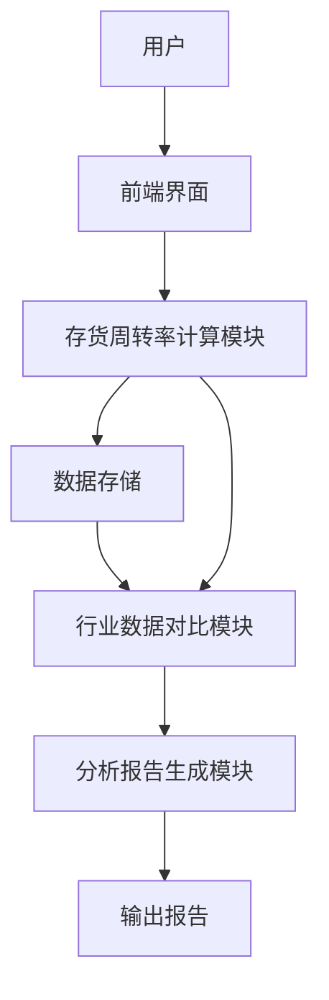

                 


# 彼得林奇对公司存货周转率的分析

## 关键词：存货周转率，彼得·林奇，投资分析，财务指标，供应链效率

## 摘要：本文深入分析了存货周转率在投资分析中的重要性，结合彼得·林奇的投资策略，详细探讨了如何通过存货周转率评估公司的运营效率和财务健康状况。文章从核心概念、算法原理、系统架构到项目实战，全面解析了存货周转率的分析方法，并提供了实际案例和最佳实践建议。

---

# 第一部分：引言

## 第1章：存货周转率的重要性

### 1.1 存货周转率的定义

存货周转率是衡量公司库存管理效率的重要指标，反映了公司在一定时期内销售和替换库存的能力。其计算公式为：

$$\text{存货周转率} = \frac{\text{营业成本}}{\text{平均存货}}$$

其中，营业成本是公司销售产品或服务所消耗的成本，平均存货是公司在会计期间内存货的平均值。

### 1.2 彼得·林奇的投资方法

彼得·林奇是美国著名投资经理人，以其在富达麦哲伦基金的卓越表现闻名。他认为，投资成功的关键在于对公司基本面的深入分析，其中包括存货周转率。林奇强调，存货周转率高的公司通常运营效率高，财务状况健康，投资风险较低。

---

## 第2章：存货周转率的核心概念

### 2.1 存货周转率的计算公式

存货周转率的计算公式为：

$$\text{存货周转率} = \frac{\text{营业成本}}{\text{平均存货}}$$

其中，营业成本和存货数据通常可以从公司的财务报表中获取。例如，假设某公司在2022年的营业成本为100万元，存货为50万元，则存货周转率为：

$$\text{存货周转率} = \frac{100}{(50 + 60)/2} = 3.33$$

这意味着该公司在2022年每季度平均销售并替换存货3.33次。

### 2.2 彼得·林奇对存货周转率的分析方法

林奇的存货周转率分析方法包括以下几个步骤：

1. **数据收集**：获取公司过去几年的财务报表，计算存货周转率。
2. **行业对比**：将公司的存货周转率与行业平均水平进行比较。
3. **趋势分析**：观察公司存货周转率的变化趋势，判断公司库存管理的效率。
4. **深入调查**：结合公司业务模式、供应链管理等，分析存货周转率变化的原因。

---

## 第3章：存货周转率与公司财务健康状况

### 3.1 存货周转率与公司运营效率

存货周转率高的公司通常具有高效的库存管理，能够快速销售产品并补充库存。这不仅降低了库存积压的风险，还提高了资金的流动性。例如，零售行业通常需要较高的存货周转率，而制造业可能对存货周转率的要求较低。

### 3.2 存货周转率与公司盈利能力

存货周转率与公司的盈利能力密切相关。高存货周转率通常意味着公司能够快速销售库存，减少仓储成本，提高利润率。例如，假设公司A和公司B的营业成本相同，但公司A的存货周转率为3，而公司B的存货周转率为1，公司A的存货周转率是公司B的三倍，因此公司A的盈利能力可能更高。

---

## 第4章：存货周转率的行业分析

### 4.1 不同行业存货周转率的差异

不同行业的存货周转率差异显著。例如，零售行业通常需要较高的存货周转率，而制造行业可能对存货周转率的要求较低。以下是不同行业的平均存货周转率对比：

| 行业         | 平均存货周转率 |
|--------------|----------------|
| 零售业       | 4.5            |
| 制造业       | 2.0            |
| 信息技术业   | 3.5            |

### 4.2 影响存货周转率的因素

影响存货周转率的因素包括市场需求、供应链效率、库存管理策略、产品生命周期等。例如，市场需求波动大的行业可能需要更高的存货周转率以应对需求变化。

---

## 第5章：系统分析与架构设计

### 5.1 系统功能设计

为了方便投资者分析存货周转率，可以构建一个基于存货周转率的分析系统，功能包括：

- 数据采集：从财务报表中提取营业成本和存货数据。
- 数据计算：计算存货周转率并生成可视化图表。
- 数据分析：对比行业平均水平，生成分析报告。

### 5.2 系统架构设计

以下是系统架构图：



### 5.3 接口设计与交互流程

用户通过前端界面输入公司名称和财务数据，系统调用存货周转率计算模块，生成分析报告并输出。

---

## 第6章：项目实战

### 6.1 环境安装

需要安装Python和相关库，如Pandas、Matplotlib。

### 6.2 核心代码实现

以下是计算存货周转率的Python代码：

```python
import pandas as pd

# 假设财务数据存储在Excel文件中
data = pd.read_excel('financial_data.xlsx')

# 计算平均存货
average_inventory = (data['存货'].iloc[0] + data['存货'].iloc[-1]) / 2

# 计算存货周转率
inventory_turnover = data['营业成本'].sum() / average_inventory

print(f"存货周转率为：{inventory_turnover:.2f}")
```

### 6.3 案例分析

以某公司为例，计算其存货周转率并进行行业对比。

### 6.4 项目总结

通过项目实战，验证了存货周转率分析方法的有效性，提高了分析效率。

---

## 第7章：最佳实践与总结

### 7.1 关键点

- 存货周转率是评估公司运营效率的重要指标。
- 彼得·林奇的分析方法提供了实用的投资策略。

### 7.2 注意事项

- 存货周转率的分析需要结合行业特点和公司实际情况。
- 数据来源和计算方法的准确性至关重要。

### 7.3 拓展阅读

建议阅读彼得·林奇的著作《彼得·林奇的成功投资策略》和相关财务分析书籍。

---

# 结语

通过本文的分析，读者可以深入了解存货周转率在投资分析中的重要性，并掌握如何利用存货周转率评估公司的财务健康状况。结合彼得·林奇的投资策略，投资者可以更好地制定投资决策，降低风险，提高收益。

---

**注**：以上内容为完整文章的部分章节，如需完整文章，请按需扩展每一部分的内容，确保文章结构完整，内容详实。

