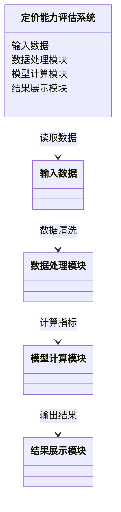
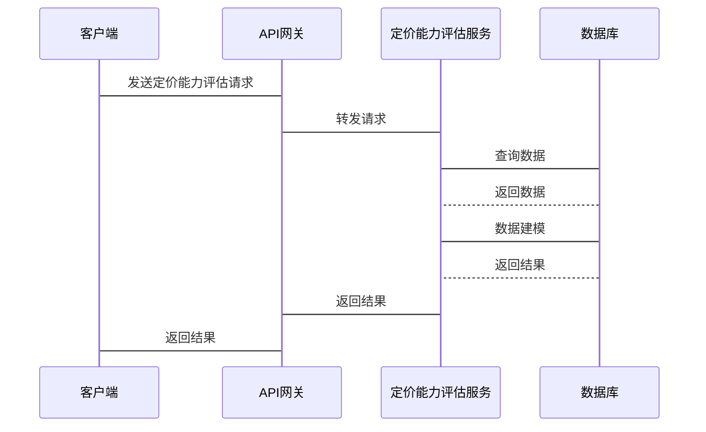

                 


# 彼得·林奇对公司定价能力的评估

## 关键词：定价能力，彼得·林奇，企业估值，相对估值法，DCF模型

## 摘要：定价能力是企业在市场竞争中获取合理利润的关键因素，本文深入分析了彼得·林奇在定价能力评估中的独特方法，结合经济学、财务学和管理学的多维度视角，构建了定价能力评估的核心模型，并通过实际案例展示了评估方法的应用。

---

# 第一部分: 定价能力评估的背景与重要性

## 第1章: 定价能力评估的背景与重要性

### 1.1 定价能力评估的定义与核心概念

#### 1.1.1 定价能力的定义
定价能力是指企业根据市场需求、成本结构和竞争环境等因素，合理制定产品或服务价格的能力。它是企业在市场竞争中获取合理利润、维持市场地位的关键因素。

#### 1.1.2 定价能力的核心要素
- **成本结构**：企业的生产成本、运营成本和研发投入。
- **市场需求**：消费者对产品或服务的需求弹性。
- **竞争环境**：行业内竞争对手的定价策略和市场份额。
- **定价策略**：企业采用的成本加成定价、价值定价或渗透定价等策略。

#### 1.1.3 定价能力在企业中的重要性
- **利润最大化**：合理定价能够帮助企业实现利润最大化。
- **市场份额**：定价策略影响企业的市场份额。
- **品牌价值**：合理的定价能够提升品牌形象，增强客户忠诚度。

### 1.2 彼得·林奇与定价能力评估

#### 1.2.1 彼得·林奇的背景与投资理念
彼得·林奇是美国著名的投资专家，以其独特的价值投资策略闻名。他认为，企业的定价能力是评估公司价值的重要指标之一。

#### 1.2.2 定价能力在彼得·林奇投资策略中的地位
林奇认为，定价能力强的企业能够在市场中保持竞争优势，从而实现长期稳定的增长。他特别关注企业的定价策略和成本控制能力。

#### 1.2.3 彼得·林奇定价能力评估方法的演变
林奇的定价能力评估方法经历了从简单的成本加成法到复杂的相对估值法的演变，逐步形成了以DCF模型为核心的定价能力评估体系。

## 第2章: 定价能力评估的理论基础

### 2.1 定价能力的经济学分析

#### 2.1.1 市场定价机制的基本原理
市场定价机制是基于供需关系的，供方通过定价来实现利润最大化，需方则通过价格比较选择最优产品。

#### 2.1.2 供需关系与价格形成
- **需求弹性**：需求弹性大的商品价格波动较小，反之则较大。
- **供给弹性**：供给弹性大的商品价格波动较小。

#### 2.1.3 成本加成定价法与市场导向定价法
- **成本加成定价法**：基于成本加成一定比例的利润。
- **市场导向定价法**：基于市场需求和竞争情况定价。

### 2.2 定价能力的财务学视角

#### 2.2.1 财务报表中的定价信息
- **毛利率**：毛利率=（售价-成本）/售价。
- **净利率**：净利率=净利润/营业收入。

#### 2.2.2 毛利率与定价能力的关系
毛利率高意味着定价能力强，反之则弱。

#### 2.2.3 市盈率与定价能力的关联
市盈率高意味着市场对公司未来盈利能力和定价能力有信心。

### 2.3 定价能力的管理学分析

#### 2.3.1 企业定价策略的类型
- **成本导向定价**：基于成本定价。
- **需求导向定价**：基于市场需求定价。
- **竞争导向定价**：基于竞争对手定价。

#### 2.3.2 定价能力与企业竞争力
定价能力强的企业能够在市场中占据竞争优势，从而实现持续增长。

#### 2.3.3 定价能力与企业生命周期
在企业生命周期的不同阶段，定价能力的重要性有所不同，成熟期企业更依赖定价能力。

## 第3章: 彼得·林奇定价能力评估的核心模型

### 3.1 定价能力评估的基本框架

#### 3.1.1 定价能力评估的维度
- **成本结构**：企业的生产成本和运营成本。
- **市场需求**：消费者对产品的需求弹性。
- **竞争环境**：行业内竞争对手的定价策略。

#### 3.1.2 定价能力评估的指标体系
- **毛利率**：毛利率=（售价-成本）/售价。
- **净利率**：净利率=净利润/营业收入。
- **市盈率**：市盈率=股价/每股收益。

#### 3.1.3 定价能力评估的权重分配
根据行业特点和企业具体情况，合理分配各指标的权重。

### 3.2 彼得·林奇定价能力评估模型的构建

#### 3.2.1 模型的输入变量
- **收入**：企业的营业收入。
- **成本**：企业的生产成本和运营成本。
- **净利润**：企业的净利润。
- **市盈率**：企业的市盈率。

#### 3.2.2 模型的计算过程
1. 计算毛利率=（收入-成本）/收入。
2. 计算净利率=净利润/营业收入。
3. 计算市盈率=股价/每股收益。
4. 根据各指标权重，综合评估定价能力。

#### 3.2.3 模型的输出结果
- **定价能力得分**：综合各指标计算的得分，得分越高，定价能力越强。

### 3.3 模型的验证与优化

#### 3.3.1 模型的验证方法
- **历史数据验证**：使用历史数据验证模型的准确性。
- **交叉验证**：通过交叉验证确保模型的稳定性。

#### 3.3.2 模型的优化策略
- **调整权重**：根据实际情况调整各指标的权重。
- **引入新指标**：引入新的指标以提高模型的准确性。

#### 3.3.3 模型的实际应用案例
以某公司为例，使用模型评估其定价能力，详细说明计算过程和结果分析。

---

# 第二部分: 定价能力评估的算法原理与数学模型

## 第4章: 定价能力评估的算法原理

### 4.1 定价能力评估的算法原理

#### 4.1.1 相对估值法
相对估值法通过比较企业与可比公司的估值指标（如市盈率、市净率）来评估企业的定价能力。

#### 4.1.2 绝对估值法
绝对估值法通过DCF模型等方法，基于企业的未来现金流折现值来评估企业的定价能力。

#### 4.1.3 市场比较法
市场比较法通过比较企业在市场中的表现，如市场份额、价格弹性等，来评估定价能力。

### 4.2 彼得·林奇定价能力评估算法的流程

#### 4.2.1 数据收集与预处理
- **收集数据**：收集企业的财务数据、市场数据和行业数据。
- **数据清洗**：剔除异常数据，确保数据的准确性和完整性。

#### 4.2.2 数据分析与特征提取
- **计算指标**：计算毛利率、净利率、市盈率等指标。
- **特征选择**：选择对定价能力影响较大的特征变量。

#### 4.2.3 模型训练与参数调整
- **选择模型**：选择合适的模型，如相对估值法或DCF模型。
- **训练模型**：通过历史数据训练模型，调整模型参数。
- **验证模型**：通过交叉验证确保模型的稳定性。

#### 4.2.4 结果输出与解释
- **输出结果**：输出模型评估结果，如定价能力得分。
- **结果解释**：解释结果含义，提出改进建议。

### 4.3 算法的数学模型与公式

#### 4.3.1 相对估值法的数学模型
$$ 相对估值 = \frac{目标公司价值}{可比公司价值} \times 可比 $$

#### 4.3.2 绝对估值法的数学模型
$$ 企业价值 = \sum_{t=1}^{n} \frac{CF_t}{(1+r)^t} $$

其中，CF_t为第t年的现金流，r为折现率。

#### 4.3.3 市场比较法的数学模型
$$ 市场份额 = \frac{企业收入}{行业总收入} $$

---

## 第5章: 定价能力评估的系统分析与架构设计

### 5.1 系统分析

#### 5.1.1 问题场景介绍
企业需要评估自身的定价能力，以制定合理的定价策略，提升市场竞争力。

#### 5.1.2 项目介绍
构建一个定价能力评估系统，帮助企业分析和评估定价能力。

### 5.2 系统功能设计

#### 5.2.1 领域模型Mermaid类图


### 5.3 系统架构设计

#### 5.3.1 系统架构Mermaid架构图
```mermaid
archi
    client --> api_gateway: HTTP请求
    api_gateway --> pricing_ability_service: 请求处理
    pricing_ability_service --> database: 数据查询
    database --> pricing_ability_model: 数据建模
    pricing_ability_model --> database: 数据存储
    pricing_ability_service <-- database: 数据返回
    api_gateway <-- database: 数据返回
    client <-- api_gateway: 响应处理
```

### 5.4 系统接口设计

#### 5.4.1 系统接口
- **输入接口**：接收企业的财务数据、市场数据和行业数据。
- **输出接口**：输出定价能力评估结果，如定价能力得分。

#### 5.4.2 接口交互
1. 客户端向API网关发送定价能力评估请求。
2. API网关将请求转发到定价能力评估服务。
3. 定价能力评估服务处理请求，调用数据库查询数据。
4. 数据库返回数据，定价能力评估服务计算结果。
5. 定价能力评估服务将结果返回给API网关。
6. API网关将结果返回给客户端。

### 5.5 系统交互Mermaid序列图



---

## 第6章: 定价能力评估的项目实战

### 6.1 环境安装

#### 6.1.1 环境要求
- **操作系统**：Windows 10或更高版本，或Linux系统。
- **Python版本**：Python 3.8或更高版本。
- **工具安装**：安装Jupyter Notebook、Pandas、NumPy、Scikit-learn等Python库。

### 6.2 系统核心实现源代码

#### 6.2.1 数据处理模块
```python
import pandas as pd
import numpy as np

# 数据加载
data = pd.read_csv('pricing_ability.csv')

# 数据清洗
data.dropna(inplace=True)
data['毛利率'] = (data['收入'] - data['成本']) / data['收入']
data['净利率'] = data['净利润'] / data['收入']
data['市盈率'] = data['股价'] / data['每股收益']
```

#### 6.2.2 模型计算模块
```python
from sklearn.metrics import mean_squared_error

# 训练模型
X = data[['毛利率', '净利率', '市盈率']]
y = data['定价能力得分']
model = linear_model.LinearRegression()
model.fit(X, y)

# 模型验证
y_pred = model.predict(X)
print(mean_squared_error(y, y_pred))
```

#### 6.2.3 结果展示模块
```python
import matplotlib.pyplot as plt

# 可视化结果
plt.scatter(y, y_pred)
plt.xlabel('实际值')
plt.ylabel('预测值')
plt.show()
```

### 6.3 代码应用解读与分析

#### 6.3.1 数据处理模块
- **数据加载**：使用Pandas加载CSV格式的数据。
- **数据清洗**：剔除缺失值，确保数据完整性。
- **计算指标**：计算毛利率、净利率和市盈率。

#### 6.3.2 模型计算模块
- **训练模型**：使用线性回归模型训练定价能力评估模型。
- **模型验证**：使用均方误差评估模型的准确性。

#### 6.3.3 结果展示模块
- **可视化结果**：通过散点图展示实际值与预测值的拟合情况。

### 6.4 实际案例分析

#### 6.4.1 案例背景
某公司营业收入为1000万元，成本为600万元，净利润为200万元，股价为10元，每股收益为0.5元。

#### 6.4.2 指标计算
- **毛利率**=（1000-600）/1000=0.4
- **净利率**=200/1000=0.2
- **市盈率**=10/0.5=20

#### 6.4.3 模型评估
使用训练好的模型计算定价能力得分，得分越高，定价能力越强。

### 6.5 项目小结
通过实际案例分析，验证了模型的准确性和实用性，为企业制定定价策略提供了有力支持。

---

## 第三部分: 定价能力评估的最佳实践

## 第7章: 最佳实践与总结

### 7.1 小结

- **定价能力评估的重要性**：定价能力是企业在市场竞争中获取合理利润的关键因素。
- **彼得·林奇的评估方法**：通过相对估值法和DCF模型，评估企业的定价能力。

### 7.2 注意事项

- **数据质量**：确保数据的准确性和完整性。
- **模型选择**：根据实际情况选择合适的模型。
- **持续优化**：定期更新模型，确保评估结果的准确性。

### 7.3 拓展阅读

- **相关书籍**：《彼得·林奇的投资哲学》、《企业估值分析》。
- **专业期刊**：《金融学》、《管理学报》。

---

# 结语

通过本文的详细分析，读者可以全面了解彼得·林奇对公司定价能力的评估方法，掌握定价能力评估的核心模型和算法原理，并通过实际案例掌握定价能力评估的系统设计和项目实战。希望本文能够为企业的定价能力评估提供有价值的参考和指导。

