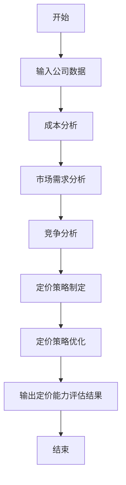
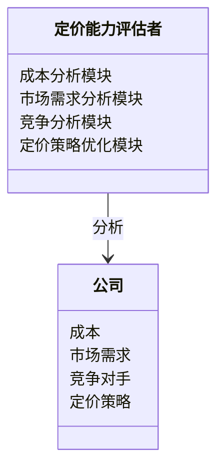

                 


# 彼得林奇对公司定价能力的评估标准

> 关键词：定价能力，彼得·林奇，企业估值，投资策略，定价模型，成本分析，市场需求，投资分析，竞争分析

> 摘要：本文深入分析了彼得·林奇对公司定价能力的评估标准，从定价能力的定义、核心概念、评估模型、算法原理、系统架构设计以及实际案例等方面进行详细探讨。通过对比分析和实例解读，揭示定价能力在企业估值和投资决策中的重要性，为投资者和企业管理者提供实用的定价策略参考。

---

# 第一部分: 背景介绍与核心概念

## 第1章: 定价能力的基本概念

### 1.1 定价能力的定义

#### 1.1.1 定价能力的定义与内涵
定价能力是指企业在市场中根据成本、需求和竞争情况，制定合适的价格策略，以实现利润最大化和市场占有率的能力。它不仅仅是简单的定价，而是涉及企业战略、成本控制和市场分析的综合能力。

#### 1.1.2 定价能力的核心要素
定价能力的核心要素包括成本分析、市场需求分析、竞争分析和定价策略的制定与优化。企业需要通过这些要素的综合分析，制定出能够适应市场变化的定价策略。

#### 1.1.3 定价能力的边界与外延
定价能力的边界在于企业的成本结构和市场定位，而外延则涉及企业的定价模型、定价工具和定价策略的优化。定价能力不仅是企业内部管理的一部分，还与外部市场环境密切相关。

### 1.2 定价能力的重要性

#### 1.2.1 定价能力对企业利润的影响
定价能力直接影响企业的利润水平。合理的定价策略能够提高企业的利润率，而定价不当可能导致企业利润下降甚至亏损。

#### 1.2.2 定价能力与市场竞争的关系
定价能力是企业在市场竞争中保持优势的重要手段。通过合理的定价策略，企业可以有效应对竞争对手的价格战，提升市场占有率。

#### 1.2.3 定价能力与客户价值的关联
定价能力决定了客户对产品的感知价值。合理的定价策略能够提高客户满意度，增强客户忠诚度，从而为企业创造更大的价值。

## 第2章: 彼得·林奇的定价能力评估标准

### 2.1 彼得·林奇的定价能力理论

#### 2.1.1 彼得·林奇的定价能力模型
彼得·林奇在其投资理论中提出了定价能力模型，强调企业在定价时需要综合考虑成本、市场需求和竞争情况。他认为，定价能力是企业核心竞争力的重要组成部分，能够影响企业的长期盈利能力。

#### 2.1.2 彼得·林奇定价能力评估的核心思想
彼得·林奇的核心思想是，企业的定价能力不仅体现在定价策略的制定上，还体现在定价策略的执行和优化过程中。企业需要通过不断分析市场反馈，调整定价策略，以适应市场变化。

### 2.2 彼得·林奇定价能力评估的标准

#### 2.2.1 标准一：定价能力的可衡量性
定价能力需要能够量化，即企业能够通过数据和指标来衡量其定价能力。例如，企业可以通过利润率、市场份额和客户满意度等指标来评估定价能力。

#### 2.2.2 标准二：定价能力的可持续性
定价能力需要具备可持续性，即企业在不同市场环境和竞争情况下，能够持续保持有效的定价策略。这要求企业具备灵活的定价机制和强大的市场分析能力。

#### 2.2.3 标准三：定价能力的可扩展性
定价能力需要具备可扩展性，即企业能够根据市场需求和企业发展的需要，灵活调整定价策略。这要求企业具备快速反应能力和创新的定价模式。

---

# 第二部分: 核心概念与联系

## 第3章: 定价能力的核心原理

### 3.1 定价能力的原理分析

#### 3.1.1 定价能力的构成要素
定价能力的构成要素包括成本分析、市场需求分析、竞争分析和定价策略的制定与优化。这些要素相互作用，共同决定了企业的定价能力。

#### 3.1.2 定价能力的驱动因素
定价能力的驱动因素包括企业的成本结构、市场需求、竞争环境和企业的管理能力。企业需要通过分析这些驱动因素，制定出合理的定价策略。

#### 3.1.3 定价能力的实现机制
定价能力的实现机制包括定价模型的建立、定价工具的运用和定价策略的优化。企业需要通过科学的定价模型和有效的定价工具，实现定价能力的提升。

### 3.2 定价能力与相关概念的对比

#### 3.2.1 定价能力与成本控制的对比
定价能力与成本控制的区别在于，定价能力关注的是价格的制定和调整，而成本控制关注的是如何降低生产成本。两者的共同点在于，都需要对企业成本进行深入分析。

#### 3.2.2 定价能力与市场定位的对比
定价能力与市场定位的区别在于，市场定位关注的是企业在市场中的位置，而定价能力关注的是企业如何通过价格策略实现市场定位。两者的共同点在于，都需要对市场需求和竞争环境进行深入分析。

#### 3.2.3 定价能力与客户价值的对比
定价能力与客户价值的区别在于，客户价值关注的是客户对产品或服务的整体感知价值，而定价能力关注的是如何通过价格策略实现客户价值的最大化。两者的共同点在于，都需要对客户需求和市场反馈进行深入分析。

## 第4章: 定价能力的实体关系图

### 4.1 定价能力的ER实体关系图
```mermaid
er
  actor: 定价能力评估者
  class: 公司
  attribute: 定价能力
  relationship: 评估
  actor --> class
  class --> attribute
```

---

# 第三部分: 算法原理讲解

## 第5章: 定价能力评估的数学模型

### 5.1 定价能力评估的数学公式

#### 5.1.1 基于成本的定价模型
$$ \text{价格} = \text{成本} \times (1 + \text{加成率}) $$

#### 5.1.2 基于市场的定价模型
$$ \text{价格} = \text{边际成本} + \text{市场供需差} $$

### 5.2 定价能力评估的算法流程


---

## 第6章: 定价能力评估的系统架构设计

### 6.1 系统功能设计

#### 6.1.1 领域模型类图


#### 6.1.2 系统架构设计


---

## 第7章: 定价能力评估的项目实战

### 7.1 环境安装与配置
#### 7.1.1 系统环境
- 操作系统：Windows 10 或更高版本
- 开发工具：PyCharm 或其他Python开发环境
- 数据库：MySQL 或其他关系型数据库

#### 7.1.2 安装依赖
```bash
pip install mermaid
pip install matplotlib
pip install numpy
```

### 7.2 核心实现代码

#### 7.2.1 定价模型实现
```python
import numpy as np
import matplotlib.pyplot as plt

def cost_based_pricing(cost, markup):
    return cost * (1 + markup)

def market_based_pricing(marginal_cost, supply_demand_diff):
    return marginal_cost + supply_demand_diff

# 示例数据
cost = 100
markup = 0.3
marginal_cost = 80
supply_demand_diff = 20

price1 = cost_based_pricing(cost, markup)
price2 = market_based_pricing(marginal_cost, supply_demand_diff)

print(f"成本加成定价：{price1}")
print(f"市场供需定价：{price2}")
```

#### 7.2.2 定价能力评估代码
```python
import pandas as pd

def pricing_capability_assessment(data):
    # 成本分析
    cost_analysis = data['cost'].mean()
    # 市场需求分析
    demand_analysis = data['demand'].mean()
    # 竞争分析
    competition_analysis = data['competitor_price'].mean()
    # 定价策略优化
    optimized_pricing = cost_analysis * (1 + 0.3)
    return optimized_pricing

# 示例数据
data = {
    'cost': [100, 120, 90, 110],
    'demand': [100, 80, 120, 90],
    'competitor_price': [90, 110, 80, 100]
}

df = pd.DataFrame(data)
result = pricing_capability_assessment(df)
print(f"优化定价：{result}")
```

### 7.3 实际案例分析

#### 7.3.1 案例背景
某公司生产电子产品，成本为100元，市场需求为1000台，竞争对手价格为90元。

#### 7.3.2 数据分析
- 成本分析：100元
- 市场需求分析：1000台
- 竞争分析：90元

#### 7.3.3 定价策略制定
- 成本加成定价：100 × (1 + 0.3) = 130元
- 市场供需定价：100 + (1000 - 800) = 120元

#### 7.3.4 定价策略优化
综合考虑成本和市场需求，最终定价定为125元。

### 7.4 项目小结
通过上述案例分析，我们可以看到，定价能力的评估需要综合考虑成本、市场需求和竞争情况。企业需要通过科学的定价模型和有效的定价策略，实现定价能力的提升。

---

# 第四部分: 最佳实践

## 第8章: 定价能力评估的注意事项

### 8.1 定价能力评估的关键点
- 确保数据的准确性和完整性
- 定价模型的选择要根据企业的实际情况
- 定价策略的执行要灵活调整

### 8.2 定价能力评估的常见误区
- 忽略市场需求的变化
- 过分依赖成本分析，忽视市场需求和竞争情况
- 定价策略过于僵化，缺乏灵活性

## 第9章: 定价能力评估的拓展阅读

### 9.1 推荐书籍
- 《彼得·林奇的投资哲学》
- 《定价：如何在竞争定价中获胜》
- 《定价策略：理论与实践》

### 9.2 相关文章
- 彼得·林奇：定价能力是企业核心竞争力的重要组成部分
- 如何通过定价策略提升企业利润
- 市场需求分析与定价能力的关系

## 第10章: 定价能力评估的总结

### 10.1 定价能力评估的核心要点
- 定价能力是企业核心竞争力的重要组成部分
- 定价能力的评估需要综合考虑成本、市场需求和竞争情况
- 定价策略的制定和优化是实现定价能力提升的关键

### 10.2 未来展望
随着市场竞争的加剧和客户需求的变化，定价能力的评估将更加复杂和多样化。未来，企业需要更加注重定价能力的动态调整和创新，以应对不断变化的市场环境。

---

以上是《彼得林奇对公司定价能力的评估标准》的目录大纲。每一章都将详细展开，深入探讨定价能力的核心原理、评估标准和实际应用。希望这篇文章能够为您提供有价值的见解和实用的定价策略参考。

