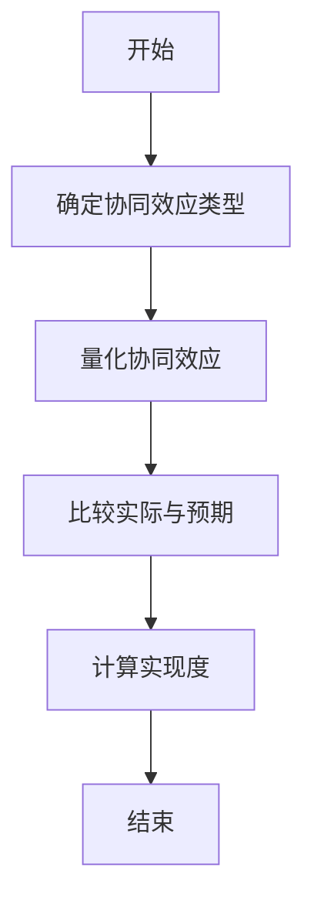
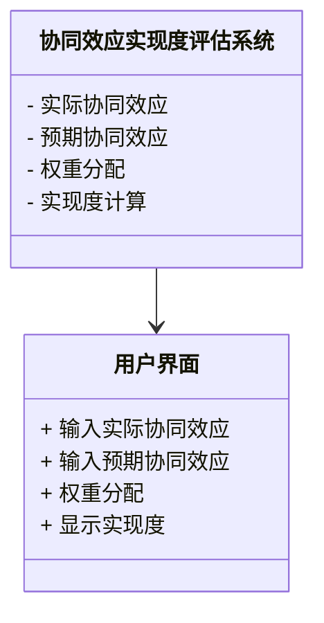
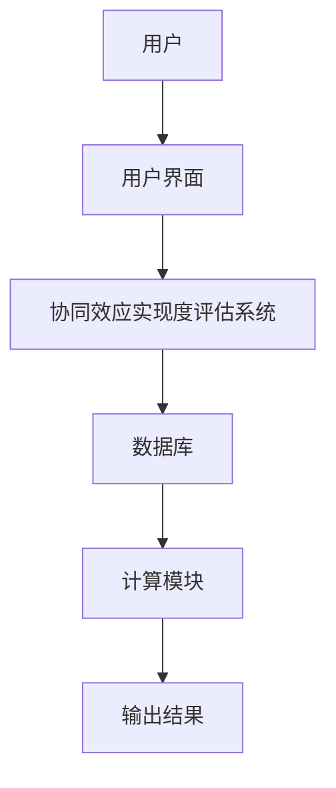
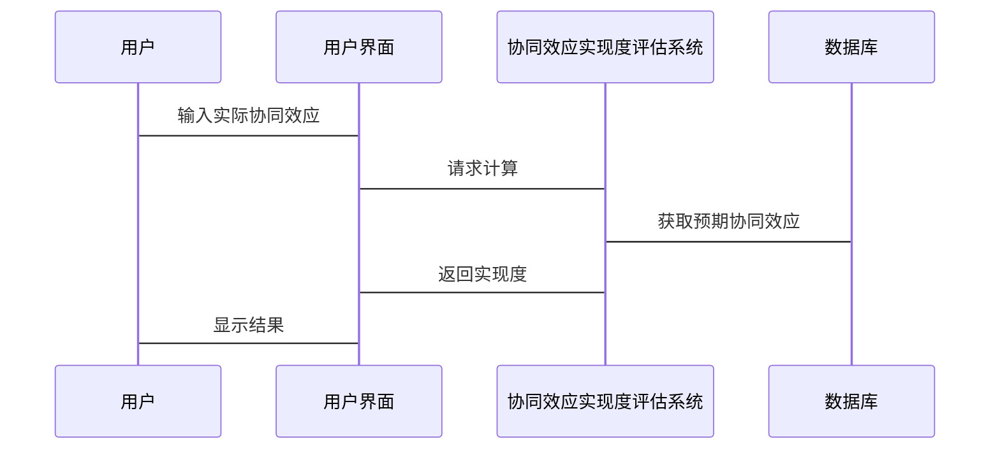

                 


# 彼得林奇对公司并购协同效应实现度的评估

## 关键词：公司并购、协同效应、实现度评估、彼得林奇、战略整合

## 摘要：本文深入探讨了彼得林奇在公司并购中的协同效应实现度评估方法，从背景、概念、算法原理到实际应用，系统地分析了协同效应的实现过程和关键影响因素，提出了具体的评估框架和实现步骤。

---

# 第一部分：公司并购协同效应实现度的背景与概念

## 第1章：公司并购与协同效应概述

### 1.1 公司并购的基本概念
#### 1.1.1 公司并购的定义与类型
公司并购是指一家企业通过购买另一家企业的一部分或全部股权，以实现战略扩张或业务整合的过程。常见的并购类型包括横向并购、纵向并购和混合并购。

- **横向并购**：同一行业内的企业合并，旨在扩大市场份额或消除竞争。
- **纵向并购**：产业链上下游的企业合并，以提高供应链效率。
- **混合并购**：与主业无关的业务合并，通常用于多元化发展。

#### 1.1.2 协同效应的定义与内涵
协同效应是指并购后的企业通过资源整合，实现成本降低、效率提升或新业务拓展所产生的额外价值。协同效应的核心在于“1+1>2”的效果。

#### 1.1.3 协同效应在并购中的重要性
协同效应是并购成功的关键因素之一。通过协同效应，企业可以更快地实现战略目标，提升市场竞争力，并优化资源配置。

### 1.2 协同效应的实现度评估背景
#### 1.2.1 公司并购中的常见问题
- **战略不匹配**：并购双方的业务模式或发展战略不一致，导致协同效应难以实现。
- **文化冲突**：企业文化和管理风格差异，影响整合效果。
- **管理问题**：整合过程中的管理不善，导致资源浪费。

#### 1.2.2 协同效应未实现的后果
- **投资损失**：并购失败可能导致企业资产减值或投资损失。
- **市场信任度下降**：多次并购失败会影响企业的市场信誉。
- **竞争优势丧失**：未能实现协同效应可能导致企业在市场中失去竞争优势。

#### 1.2.3 协同效应实现度评估的必要性
- **优化并购决策**：通过评估协同效应实现度，企业可以更科学地进行并购决策。
- **降低并购风险**：评估实现度可以帮助企业识别潜在风险，制定应对策略。
- **提升整合效率**：通过评估实现度，企业可以更好地规划整合步骤，提高整合效率。

---

## 第2章：协同效应的类型与影响因素

### 2.1 协同效应的分类
协同效应可以分为以下几种类型：

#### 2.1.1 营销与销售协同
- **客户资源共享**：通过合并客户资源，减少营销成本。
- **销售渠道整合**：整合销售渠道，扩大销售网络。

#### 2.1.2 生产与运营协同
- **生产资源共享**：共享生产设备和生产能力，降低成本。
- **供应链优化**：整合供应链资源，提高效率。

#### 2.1.3 管理与组织协同
- **管理团队整合**：优化管理层结构，提升管理效率。
- **组织架构优化**：通过调整组织结构，提高运营效率。

#### 2.1.4 财务协同
- **成本节约**：通过规模效应降低成本。
- **资产优化**：优化资产配置，提高资产利用率。

### 2.2 协同效应实现的影响因素
#### 2.2.1 企业战略匹配度
- **战略一致性**：并购双方的战略目标是否一致，直接影响协同效应的实现。
- **管理风格匹配**：管理风格和企业文化是否匹配，影响整合效果。

#### 2.2.2 文化与组织整合难度
- **文化冲突**：文化差异可能导致整合过程中的摩擦，影响协同效应的实现。
- **组织结构复杂度**：复杂的组织结构可能导致整合难度增加，影响协同效应。

#### 2.2.3 人力资源管理
- **员工接受度**：员工对并购的接受度影响整合效果。
- **人才保留**：关键员工的流失可能影响协同效应的实现。

#### 2.2.4 外部环境影响
- **行业竞争状况**：行业竞争状况影响并购后的市场表现。
- **政策环境**：政策法规的变化可能影响并购后的协同效应。

---

## 第3章：协同效应实现度的评估框架

### 3.1 协同效应实现度的核心要素
#### 3.1.1 协同效应的量化指标
- **成本节约**：通过整合实现的成本降低金额。
- **收入增长**：通过协同效应带来的收入增长。
- **效率提升**：通过整合实现的效率提升指标。

#### 3.1.2 协同效应的实现路径
- **战略规划**：制定清晰的整合战略，明确协同效应的实现路径。
- **资源整合**：优化资源配置，实现协同效应。
- **风险管理**：制定风险管理策略，降低整合风险。

#### 3.1.3 协同效应的评估维度
- **财务指标**：如EBITDA、净利润等。
- **非财务指标**：如市场份额、客户满意度等。

### 3.2 协同效应实现度的评估模型
#### 3.2.1 协同效应实现度的数学模型
协同效应实现度的计算公式如下：

$$
\text{协同效应实现度} = \frac{\text{实际实现的协同效应}}{\text{预期的协同效应}} \times 100\%
$$

其中，实际实现的协同效应可以通过以下步骤计算：

1. **确定协同效应的来源**：如成本节约、收入增长等。
2. **量化协同效应**：通过具体数据计算协同效应的金额。
3. **比较实际与预期**：将实际实现的协同效应与预期的协同效应进行比较。

#### 3.2.2 协同效应实现度的权重分配
为了更好地评估协同效应实现度，可以将不同类型的协同效应赋予不同的权重。例如：

| 协同效应类型 | 权重 |
|--------------|------|
| 营销与销售协同 | 30% |
| 生产与运营协同 | 40% |
| 管理与组织协同 | 20% |
| 财务协同       | 10% |

#### 3.2.3 协同效应实现度的综合评估方法
综合评估方法包括以下步骤：

1. **确定协同效应的类型**：根据并购项目的特点，确定协同效应的主要来源。
2. **量化协同效应**：根据实际数据计算协同效应的金额。
3. **比较实际与预期**：将实际实现的协同效应与预期的协同效应进行比较。
4. **计算实现度**：使用上述公式计算协同效应实现度。

---

## 第4章：协同效应实现度的定性与定量分析

### 4.1 协同效应的定性分析
#### 4.1.1 企业战略匹配度分析
- **战略一致性**：并购双方的战略目标是否一致。
- **管理风格匹配**：管理风格和企业文化是否匹配。

#### 4.1.2 文化与组织整合分析
- **文化冲突**：并购双方的文化差异是否会导致整合困难。
- **组织结构复杂度**：组织结构是否复杂，影响整合效率。

#### 4.1.3 管理层决策分析
- **管理层支持度**：管理层是否支持整合工作。
- **决策透明度**：决策过程是否透明，影响员工接受度。

### 4.2 协同效应的定量分析
#### 4.2.1 协同效应的财务指标分析
- **成本节约**：通过整合实现的成本降低金额。
- **收入增长**：通过协同效应带来的收入增长。

#### 4.2.2 协同效应的风险评估
- **风险识别**：识别整合过程中可能遇到的风险。
- **风险量化**：通过定量分析，评估风险的影响程度。

---

## 第5章：协同效应实现度的算法原理

### 5.1 协同效应实现度的数学模型
协同效应实现度的数学模型可以表示为：

$$
\text{协同效应实现度} = \frac{\sum (\text{实际实现的协同效应}_i \times \text{权重}_i)}{\sum (\text{预期的协同效应}_i \times \text{权重}_i)} \times 100\%
$$

其中，$\text{权重}_i$ 是第 $i$ 种协同效应类型的权重。

### 5.2 协同效应实现度的算法流程图


### 5.3 协同效应实现度的代码实现
以下是一个简单的Python代码示例，用于计算协同效应实现度：

```python
# 协同效应实现度计算函数
def calculate_synergy_realization(actual_synergy, expected_synergy):
    realization = (actual_synergy / expected_synergy) * 100
    return realization

# 示例数据
actual_synergy = 100  # 实际实现的协同效应
expected_synergy = 150  # 预期的协同效应

# 计算实现度
realization = calculate_synergy_realization(actual_synergy, expected_synergy)
print(f"协同效应实现度为：{realization}%")
```

---

## 第6章：协同效应实现度的系统分析与架构设计

### 6.1 系统分析
#### 6.1.1 问题场景介绍
协同效应实现度的评估需要考虑多个因素，包括财务指标、非财务指标、内部管理、外部环境等。

#### 6.1.2 项目介绍
本项目旨在开发一个协同效应实现度评估系统，帮助企业在并购过程中更好地评估协同效应的实现度。

### 6.2 系统功能设计
#### 6.2.1 领域模型


#### 6.2.2 系统架构设计


### 6.3 系统接口设计
- **输入接口**：用户输入实际协同效应和预期协同效应。
- **输出接口**：系统输出协同效应实现度。

### 6.4 系统交互设计


---

## 第7章：协同效应实现度的项目实战

### 7.1 环境安装
- **操作系统**：Windows 10 或更高版本，macOS 10.15 或更高版本，Linux（支持的发行版）。
- **Python**：Python 3.6 或更高版本。
- **依赖库**：安装 `mermaid`, `graphviz`, `numpy` 等。

### 7.2 系统核心实现源代码
```python
# 协同效应实现度评估系统代码
import os

class SynergyRealizationCalculator:
    def __init__(self, actual_synergy, expected_synergy):
        self.actual_synergy = actual_synergy
        self.expected_synergy = expected_synergy

    def calculate_realization(self):
        realization = (self.actual_synergy / self.expected_synergy) * 100
        return realization

    def display_result(self):
        print(f"协同效应实现度为：{self.calculate_realization()}%")

# 使用示例
if __name__ == "__main__":
    actual_synergy = float(input("请输入实际实现的协同效应："))
    expected_synergy = float(input("请输入预期的协同效应："))
    calculator = SynergyRealizationCalculator(actual_synergy, expected_synergy)
    calculator.display_result()
```

### 7.3 代码应用解读与分析
- **代码结构**：代码分为类和主程序两部分，类 `SynergyRealizationCalculator` 用于计算协同效应实现度，主程序读取用户输入并显示结果。
- **实现细节**：通过输入实际协同效应和预期协同效应，计算实现度，并通过 `print` 语句显示结果。

### 7.4 实际案例分析
假设某企业并购后实现了120万元的协同效应，预期的协同效应为150万元。计算实现度如下：

$$
\text{协同效应实现度} = \frac{120}{150} \times 100\% = 80\%
$$

这表明协同效应实现了80%，低于预期，可能需要进一步优化整合策略。

---

## 第8章：协同效应实现度的总结与展望

### 8.1 总结
协同效应实现度的评估是公司并购成功的关键因素之一。通过定性与定量分析，结合算法模型和系统设计，可以更科学地评估协同效应的实现度，优化并购决策，降低并购风险。

### 8.2 注意事项
- **数据准确性**：评估协同效应实现度时，数据的准确性至关重要。
- **模型适用性**：选择合适的模型，确保模型适用于具体并购项目。
- **持续监控**：并购后的协同效应可能随时间变化，需要持续监控和调整。

### 8.3 拓展阅读
- **《并购的艺术》**：深入探讨并购策略和协同效应。
- **《彼得林奇的成功投资法则》**：学习彼得林奇的投资理念和方法。

### 8.4 小结
协同效应实现度的评估是一个复杂但重要的过程，需要综合考虑多种因素。通过本文的分析，读者可以更好地理解协同效应的实现过程，并在实际并购中应用这些方法。

---

# 结语

公司并购中的协同效应实现度评估是一个复杂但关键的过程，直接影响并购的成败。通过本文的系统分析和详细解读，读者可以更好地理解协同效应的实现过程，并在实际并购中应用这些方法。未来，随着技术的进步和管理理念的创新，协同效应实现度的评估方法将更加精细化和智能化，为企业并购提供更有力的支持。

