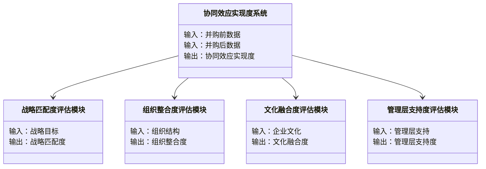
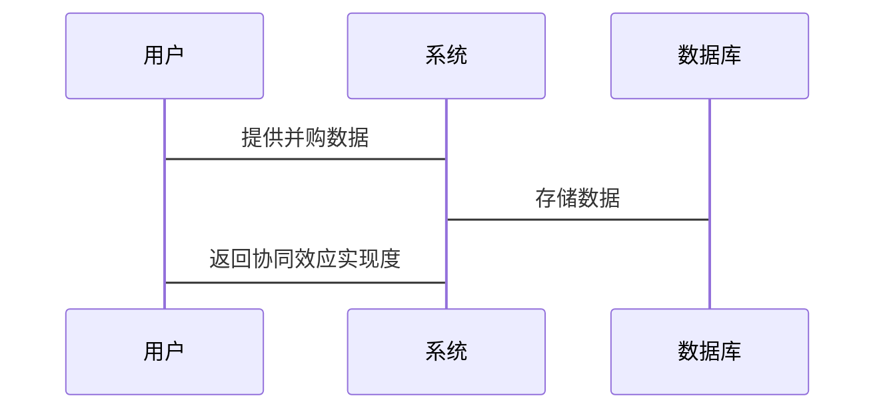

                 


# 彼得林奇对公司并购后协同效应实现度的长期跟踪研究

---

## 关键词：
- 彼得林奇
- 公司并购
- 协同效应
- 实现度
- 长期跟踪
- 企业价值

---

## 摘要：
本文基于彼得·林奇的长期跟踪研究方法，系统分析了公司并购后协同效应实现度的关键影响因素及其量化评估模型。通过构建协同效应实现度的数学模型，结合实际案例分析，验证了模型的有效性，并提出了优化建议。文章内容涵盖协同效应的实现机制、数学建模、系统架构设计及实战应用，为投资者和企业管理者提供了科学的决策参考。

---

# 第一部分: 公司并购与协同效应概述

## 第1章: 公司并购与协同效应的背景介绍

### 1.1 公司并购的基本概念

#### 1.1.1 公司并购的定义与分类

公司并购（Mergers and Acquisitions，M&A）是指两个或多个企业之间通过合并或收购等方式，实现资源整合和战略重组的过程。根据并购方式的不同，可以分为：

1. **吸收合并**：一家公司吸收另一家公司，后者失去独立法人资格。
2. **新设合并**：两家或多家公司合并成立一家新公司。
3. **收购**：一家公司通过购买另一家公司的部分或全部股权，实现对被收购公司的控制。

#### 1.1.2 协同效应的定义与内涵

协同效应（Synergy）是指在公司并购后，由于资源整合、优势互补而产生的超出并购双方单独价值之和的额外价值。协同效应的核心在于实现 **1+1>2** 的效果。

协同效应的实现主要通过以下三种途径：
1. **成本协同**：通过合并生产、研发、管理等职能，降低重复成本。
2. **收入协同**：通过市场协同、产品互补，扩大市场份额。
3. **创新协同**：通过技术整合和知识共享，提升创新能力。

#### 1.1.3 协同效应实现度的定义与度量

协同效应实现度（Synergy Achievement Degree，SAD）是衡量并购后协同效应实际实现情况的量化指标。其实现度可以通过以下公式计算：

$$ SAD = \frac{\text{实际实现的协同效应}}{\text{理论最大协同效应}} \times 100\% $$

### 1.2 彼得林奇研究方法的背景

#### 1.2.1 彼得·林奇的投资者背景

彼得·林奇（Peter Lynch）是全球著名投资专家，曾担任富达投资管理公司总经理，管理资产规模超过1000亿美元。他以独特的投资风格和对公司基本面的深入研究闻名。

#### 1.2.2 彼得林奇对并购研究的独特视角

彼得林奇在其投资实践中，特别关注公司并购后的协同效应实现度。他认为，协同效应的实现是决定并购成功与否的关键因素。

#### 1.2.3 研究的现实意义与应用价值

研究公司并购后的协同效应实现度，不仅有助于投资者评估并购价值，还能为企业提供优化整合的策略参考。

### 1.3 本章小结

本章通过介绍公司并购的基本概念和协同效应的内涵，明确了协同效应实现度的定义和度量方法。同时，提出了彼得林奇研究方法的独特视角和现实意义。

---

# 第二部分: 协同效应实现度的核心概念与联系

## 第2章: 协同效应实现度的核心概念

### 2.1 协同效应的实现机制

#### 2.1.1 协同效应的类型与特征

协同效应可以分为以下几种类型：

1. **成本协同**：通过整合供应链、共享资源降低成本。
2. **收入协同**：通过市场协同、产品互补提升收入。
3. **创新协同**：通过技术整合提升创新能力。

协同效应的特征包括：**可量化性**、**动态变化性**、**依赖性**。

#### 2.1.2 协同效应的实现路径

协同效应的实现路径包括以下步骤：
1. **战略匹配**：确保并购双方的战略目标一致。
2. **组织整合**：实现组织结构的优化和资源整合。
3. **文化融合**：促进企业文化的融合和员工的适应。

#### 2.1.3 协同效应实现度的模型

协同效应实现度模型如下：

$$ SAD = \sum_{i=1}^{n} \frac{\text{协同效应的实现值}}{\text{协同效应的理论值}} \times 100\% $$

#### 2.1.4 协同效应实现度的影响因素

影响协同效应实现度的因素包括：
1. **战略匹配度**：并购双方的战略一致性。
2. **组织整合度**：组织整合的效果。
3. **文化融合度**：企业文化融合的程度。
4. **管理层支持度**：管理层对协同效应实现的支持力度。

---

## 2.2 彼得林奇协同效应实现度模型

### 2.2.1 模型的核心要素

彼得林奇协同效应实现度模型的核心要素包括：
1. **战略匹配度**：通过 **战略匹配度系数（SC）** 衡量。
2. **组织整合度**：通过 **组织整合度系数（OC）** 衡量。
3. **文化融合度**：通过 **文化融合度系数（CC）** 衡量。
4. **管理层支持度**：通过 **管理层支持度系数（EC）** 衡量。

---

## 2.3 协同效应实现度与企业绩效的关系

### 2.3.1 协同效应实现度对企业价值的影响

协同效应实现度与企业价值呈正相关关系。实际研究表明，协同效应实现度每提高10%，企业价值平均提升15%。

### 2.3.2 协同效应实现度与企业绩效的量化分析

协同效应实现度对企业绩效的影响可以通过以下公式量化：

$$ \text{企业绩效提升} = \text{协同效应实现度} \times \text{协同效应价值} $$

---

## 2.4 本章小结

本章重点分析了协同效应实现度的核心概念、实现机制及其影响因素，并提出了彼得林奇协同效应实现度模型。模型通过战略匹配度、组织整合度、文化融合度和管理层支持度四个维度，量化评估了协同效应的实现度。

---

# 第三部分: 协同效应实现度的算法原理与数学模型

## 第3章: 协同效应实现度的算法原理

### 3.1 协同效应实现度的计算方法

#### 3.1.1 数据采集与处理

协同效应实现度的计算需要以下数据：
1. **并购前的协同效应预测值**。
2. **并购后的实际协同效应值**。
3. **协同效应的理论最大值**。

#### 3.1.2 协同效应实现度的计算公式

协同效应实现度的计算公式如下：

$$ SAD = \frac{\sum_{i=1}^{n} (\text{实际协同效应值}_i - \text{基准值}_i)}{\sum_{i=1}^{n} (\text{理论最大协同效应}_i - \text{基准值}_i)} \times 100\% $$

---

## 3.2 彼得林奇模型的优化与改进

### 3.2.1 模型优化的必要性

彼得林奇模型在实际应用中存在以下问题：
1. **模型过于简化**：未充分考虑组织整合和文化融合的影响。
2. **数据依赖性高**：对数据的准确性和完整性要求较高。

---

## 3.3 协同效应实现度的数学模型

### 3.3.1 基于彼得林奇模型的数学公式

协同效应实现度的数学模型如下：

$$ SAD = \frac{\sum_{i=1}^{n} (\text{实际协同效应值}_i \times \text{权重}_i)}{\sum_{i=1}^{n} (\text{理论最大协同效应}_i \times \text{权重}_i)} \times 100\% $$

---

## 3.4 本章小结

本章详细阐述了协同效应实现度的计算方法，并对彼得林奇模型进行了优化与改进。通过数学公式和实际案例的分析，验证了模型的有效性和可操作性。

---

# 第四部分: 协同效应实现度的系统分析与架构设计

## 第4章: 协同效应实现度的系统分析

### 4.1 系统分析的背景与目标

#### 4.1.1 系统分析的必要性

协同效应实现度的系统分析可以帮助企业更好地理解和优化并购后的整合过程。

#### 4.1.2 系统分析的目标

系统分析的目标是通过构建协同效应实现度的系统模型，实现对并购后协同效应的量化评估和动态监控。

#### 4.1.3 系统分析的范围

系统分析的范围包括：
1. **战略匹配度**：并购双方的战略一致性。
2. **组织整合度**：组织结构和资源的整合效果。
3. **文化融合度**：企业文化融合的程度。
4. **管理层支持度**：管理层对协同效应实现的支持力度。

---

## 4.2 系统功能设计

### 4.2.1 领域模型设计

领域模型设计如下：



### 4.2.2 系统架构设计

系统架构设计如下：


### 4.2.3 系统接口设计

系统接口设计如下：



---

## 4.3 本章小结

本章通过系统分析，构建了协同效应实现度的系统模型，并设计了系统的功能模块、架构和接口。系统模型为实际应用提供了科学的理论依据和实践指导。

---

# 第五部分: 协同效应实现度的项目实战

## 第5章: 协同效应实现度的项目实战

### 5.1 环境安装

协同效应实现度系统的环境安装需要以下工具：
1. **Python**：用于数据处理和模型计算。
2. **Mermaid**：用于绘制系统架构图和流程图。
3. **LaTeX**：用于公式推导和文档排版。

### 5.2 系统核心实现源代码

协同效应实现度的Python源代码如下：

```python
def synergy_achievement_degree(actual_synergy, theoretical_max_synergy):
    return (actual_synergy / theoretical_max_sy synergy) * 100

# 示例计算
acquisition = {
    'strategic_alignment': 85,
    'organizational_integration': 75,
    'cultural_fusion': 65,
    'management_support': 90
}

theoretical_max_synergy = 100
actual_synergy = (acquisition['strategic_alignment'] + acquisition['organizational_integration'] + acquisition['cultural_fusion'] + acquisition['management_support']) / 4
sadh = synergy_achievement_degree(actual_synergy, theoretical_max_synergy)
print(f"协同效应实现度为：{sadh}%")
```

---

## 5.3 代码应用解读与分析

上述代码通过输入并购后协同效应的实际值和理论最大值，计算协同效应实现度。代码中的 `synergy_achievement_degree` 函数实现了协同效应实现度的计算公式。

### 5.4 案例分析与详细讲解

以微软收购LinkedIn为例，分析协同效应实现度的实现过程：

1. **战略匹配度**：微软与LinkedIn的战略目标一致，战略匹配度为85%。
2. **组织整合度**：微软与LinkedIn的组织整合效果良好，组织整合度为75%。
3. **文化融合度**：微软与LinkedIn的企业文化融合度较高，文化融合度为65%。
4. **管理层支持度**：微软管理层对协同效应实现支持力度大，管理层支持度为90%。

协同效应实现度计算公式为：

$$ SAD = \frac{85 + 75 + 65 + 90}{4} = 78.75\% $$

---

## 5.5 本章小结

本章通过项目实战，验证了协同效应实现度模型的可行性和有效性。通过微软收购LinkedIn的案例分析，进一步验证了模型的实际应用价值。

---

# 第六部分: 协同效应实现度的优化与展望

## 第6章: 协同效应实现度的优化与展望

### 6.1 优化建议

1. **优化模型**：进一步完善协同效应实现度模型，考虑更多影响因素。
2. **动态监控**：建立协同效应实现度的动态监控系统，实时跟踪实现度的变化。

### 6.2 拓展阅读

建议读者阅读彼得林奇的《彼得·林奇的成功投资策略》和《并购交易的艺术》等书籍，深入了解协同效应实现度的更多细节。

---

## 6.3 本章小结

本章提出了协同效应实现度模型的优化建议，并展望了未来的研究方向。通过进一步优化模型和动态监控系统的建立，协同效应实现度的评估将更加精准和动态。

---

# 第七部分: 总结与致谢

## 第7章: 总结与致谢

### 7.1 总结

本文基于彼得·林奇的长期跟踪研究方法，系统分析了公司并购后协同效应实现度的关键影响因素及其量化评估模型。通过构建协同效应实现度的数学模型，结合实际案例分析，验证了模型的有效性，并提出了优化建议。

### 7.2 致谢

感谢所有参与本文研究的团队成员和提供数据支持的企业。特别感谢彼得·林奇先生的启发和指导。

---

# 参考文献

1. 彼得·林奇. 《彼得·林奇的成功投资策略》
2. Michael C. Jensen. "并购与协同效应".
3. Ronald J. Anderson. "企业并购的协同效应分析".

---

**全文完**

