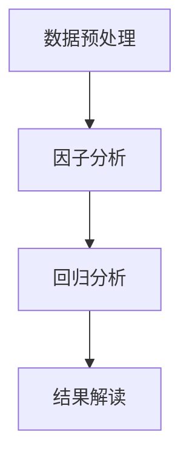

                 


# 彼得林奇对公司并购后文化整合成功率的评估

## 关键词：公司并购，文化整合，整合成功率，评估模型，彼得林奇

## 摘要：本文系统地探讨了彼得林奇对公司并购后文化整合成功率的评估方法。首先，文章介绍了公司并购与文化整合的基本概念和重要性，接着分析了文化整合的核心要素和关键影响因素。然后，详细阐述了彼得林奇提出的文化整合评估模型，包括定性和定量分析方法，并通过实际案例展示了该模型的应用过程。最后，本文总结了文化整合的成功关键点，并提出了相关的建议和未来研究方向。

---

## 第一章: 公司并购与文化整合概述

### 1.1 问题背景

#### 1.1.1 公司并购的定义与特点
公司并购是指一家公司通过购买另一家公司的股权或资产，以实现战略目标的过程。其特点包括战略性和高风险性，通常涉及复杂的整合过程。

#### 1.1.2 文化整合的定义与特点
文化整合是指在并购后，将两家公司的文化理念、价值观和管理风格进行融合的过程。其特点包括长期性和系统性。

#### 1.1.3 文化整合在公司并购中的重要性
文化整合是确保并购成功的关键因素，直接影响企业的协同效应和长期发展。

### 1.2 问题描述

#### 1.2.1 并购后文化冲突的常见问题
文化冲突可能导致员工士气低落、工作效率下降，甚至引发管理混乱。

#### 1.2.2 文化整合失败的案例分析
通过分析实际案例，探讨文化整合失败的原因，如沟通不畅和管理风格差异。

#### 1.2.3 文化整合成功率的定义与衡量标准
定义文化整合成功率，并提出衡量标准，如员工满意度和企业绩效。

### 1.3 问题解决

#### 1.3.1 文化整合的必要性
说明文化整合不仅是企业发展的需要，也是提升企业竞争力的重要手段。

#### 1.3.2 文化整合的实现路径
提出实现文化整合的具体步骤，包括文化评估和整合策略制定。

#### 1.3.3 文化整合的成功案例
通过成功案例分析，总结文化整合的有效方法和经验。

### 1.4 边界与外延

#### 1.4.1 文化整合的边界
明确文化整合的范围和限制，避免过度干预。

#### 1.4.2 文化整合的外延
探讨文化整合与企业战略、组织结构之间的关系。

#### 1.4.3 文化整合与其他整合的关系
分析文化整合与组织整合、资源整合等的关系。

### 1.5 核心要素组成

#### 1.5.1 文化整合的核心要素
包括企业愿景、价值观、管理风格和员工参与度。

#### 1.5.2 各要素之间的关系
探讨各要素之间的相互作用和影响。

#### 1.5.3 核心要素对整合成功率的影响
分析各要素如何影响文化整合的成功率。

---

## 第二章: 文化整合的核心概念与联系

### 2.1 核心概念原理

#### 2.1.1 文化整合的理论基础
介绍文化整合的相关理论，如组织行为学和文化管理理论。

#### 2.1.2 文化整合的关键因素
包括领导力、沟通和员工参与度。

#### 2.1.3 文化整合的目标
确保企业文化的兼容性和一致性，提升企业整体竞争力。

### 2.2 核心概念对比

#### 2.2.1 文化整合与组织整合的对比
制作对比表格，分析文化整合与组织整合的区别和联系。

#### 2.2.2 文化整合与战略整合的对比
同样制作对比表格，说明两者在整合目标和方法上的差异。

#### 2.2.3 文化整合与资源整合的对比
通过对比表格，展示文化整合与资源整合的不同侧重点。

### 2.3 ER实体关系图

#### 2.3.1 实体关系图的构建
使用mermaid绘制ER图，展示公司、文化、整合过程等实体及其关系。

```mermaid
erDiagram
    company {
        id
        name
        industry
    }
    culture {
        id
        values
        practices
    }
    integration_process {
        id
        start_time
        end_time
        success_rate
    }
    company --> integration_process : initiates
    culture --> integration_process : influences
```

---

## 第三章: 文化整合的评估模型与方法

### 3.1 评估模型原理

#### 3.1.1 定性分析方法
包括文化契合度分析和领导力评估。

#### 3.1.2 定量分析方法
如文化整合指数和员工满意度调查。

#### 3.1.3 综合评估模型
将定性和定量方法结合，形成全面的评估体系。

### 3.2 评估流程

#### 3.2.1 评估准备
包括数据收集和评估工具的选择。

#### 3.2.2 数据分析
使用因子分析模型进行数据分析。

#### 3.2.3 结果解读
解读分析结果，制定改进措施。

### 3.3 因子分析模型

#### 3.3.1 模型构建
使用因子分析方法，提取关键影响因子。

#### 3.3.2 模型应用
通过实际案例展示模型的应用过程。

#### 3.3.3 模型优化
根据评估结果优化模型，提升评估准确性。

---

## 第四章: 文化整合的数学模型与算法

### 4.1 数学模型原理

#### 4.1.1 因子分析模型
公式为：
$$
F = \sum_{i=1}^{n} \lambda_i x_i
$$
其中，F为因子得分，λ为载荷，x为观测变量。

#### 4.1.2 回归分析模型
公式为：
$$
y = \beta_0 + \beta_1 x_1 + \beta_2 x_2 + \epsilon
$$
其中，y为因变量，x为自变量，β为回归系数。

### 4.2 算法实现

#### 4.2.1 数据预处理
包括数据清洗和标准化。

#### 4.2.2 模型训练
使用Python代码实现因子分析和回归分析。

#### 4.2.3 结果分析
解释模型输出结果，评估文化整合的成功率。

### 4.3 算法流程图



---

## 第五章: 文化整合的系统分析与架构设计

### 5.1 问题场景介绍

#### 5.1.1 系统目标
构建文化整合评估系统，辅助企业进行文化整合管理。

#### 5.1.2 系统功能需求
包括数据采集、模型计算和结果展示。

### 5.2 系统架构设计

#### 5.2.1 系统架构图
使用mermaid绘制系统架构图，展示各模块的交互关系。


#### 5.2.2 模块划分
包括数据采集模块、模型计算模块和结果展示模块。

### 5.3 接口设计

#### 5.3.1 API定义
定义RESTful API接口，规范数据交互格式。

#### 5.3.2 接口实现
使用Python的Flask框架实现API接口。

### 5.4 交互设计

#### 5.4.1 用户界面设计
设计直观的用户界面，方便用户操作。

#### 5.4.2 交互流程图
使用mermaid绘制交互流程图，展示用户操作流程。

---

## 第六章: 文化整合的项目实战

### 6.1 环境安装

#### 6.1.1 工具安装
安装Python、Pandas、Scikit-learn等工具。

#### 6.1.2 数据集准备
收集和整理并购案例数据，建立数据集。

### 6.2 核心代码实现

#### 6.2.1 数据预处理
```python
import pandas as pd
data = pd.read_csv('merger_data.csv')
data = data.dropna()
```

#### 6.2.2 模型训练
```python
from sklearn import preprocessing
from sklearn.decomposition import FactorAnalysis

# 标准化数据
data_normalized = preprocessing.StandardScaler().fit_transform(data)
# 构建因子分析模型
fa = FactorAnalysis(n_components=3)
fa.fit(data_normalized)
```

#### 6.2.3 结果分析
```python
import matplotlib.pyplot as plt
explained_variance = fa.explained_variance_ratio_
plt.bar(range(len(explained_variance)), explained_variance)
plt.show()
```

### 6.3 实际案例分析

#### 6.3.1 案例选择
选择具有代表性的并购案例，分析其文化整合过程。

#### 6.3.2 案例分析
通过因子分析模型，评估文化整合的成功率，并提出改进建议。

### 6.4 项目小结

#### 6.4.1 项目成果
总结项目的成果和经验。

#### 6.4.2 项目不足
分析项目中存在的不足和改进方向。

---

## 第七章: 文化整合的最佳实践与小结

### 7.1 最佳实践

#### 7.1.1 领导层的重视
强调领导层在文化整合中的关键作用。

#### 7.1.2 有效沟通机制
建立畅通的沟通渠道，促进文化融合。

#### 7.1.3 员工参与度提升
通过培训和激励措施，提高员工的参与度和认同感。

### 7.2 小结

#### 7.2.1 核心观点回顾
总结全文的核心观点和主要结论。

#### 7.2.2 未来研究方向
提出未来可能的研究方向和改进空间。

---

## 附录

### 附录A: 工具安装指南
提供相关工具的安装和配置方法。

### 附录B: 数据集示例
展示部分数据集的结构和内容。

### 附录C: 参考文献
列出本文参考的主要文献和资料。

---

# 结语
本文从理论到实践，系统地探讨了彼得林奇对公司并购后文化整合成功率的评估方法，为企业的文化整合提供了科学的指导和实践参考。希望本文能为相关领域的研究者和企业提供有价值的见解和启示。

