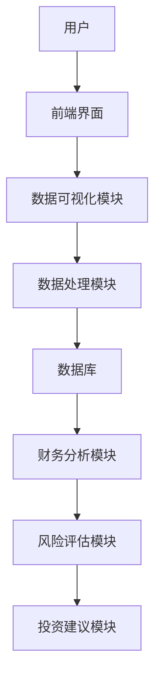
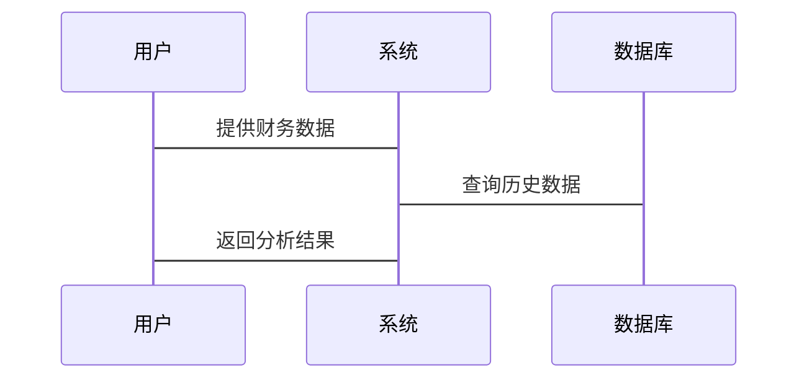

                 


# 彼得·林奇对公司应收账款周转率变化的深入分析

## 关键词：应收账款周转率，彼得·林奇，投资分析，财务指标，企业价值

## 摘要：应收账款周转率是衡量企业财务健康和运营效率的重要指标。本文从彼得·林奇的投资分析方法出发，深入探讨应收账款周转率的变化对企业价值的影响，结合实际案例和系统设计，为投资者和企业管理者提供实用的分析工具和策略。

---

## 第1章: 公司应收账款周转率变化的背景与重要性

### 1.1 应收账款周转率的核心概念

#### 1.1.1 应收账款周转率的定义与计算公式

应收账款周转率是衡量企业应收账款转化为现金的速度和效率的指标。其计算公式为：

$$
\text{应收账款周转率} = \frac{\text{赊销收入}}{\text{应收账款平均余额}}
$$

其中，赊销收入是指企业通过信用销售产生的收入，而应收账款平均余额是企业在一定时期内应收账款的平均值。

#### 1.1.2 影响应收账款周转率的关键因素

- **行业特点**：不同行业的应收账款周转率差异显著。例如，零售业的应收账款周转率通常较高，而制造业可能较低。
- **客户信用政策**：企业给予客户的信用期限越长，应收账款周转率越低。
- **企业内部管理**：应收账款的回收效率与企业的管理能力密切相关。
- **经济环境**：经济下行周期中，客户的支付能力下降，可能导致应收账款周转率降低。

#### 1.1.3 应收账款周转率与企业价值的关系

高应收账款周转率通常意味着企业资金流动性强，财务风险低，企业价值较高。反之，低周转率可能意味着资金被大量占用，影响企业的运营效率和 profitability。

### 1.2 彼得·林奇的分析框架

#### 1.2.1 彼得·林奇的投资理念与方法

彼得·林奇是全球著名的职业基金经理，他强调通过深入分析企业的财务数据和行业地位来寻找投资机会。他认为，应收账款周转率是评估企业财务健康的重要指标之一。

#### 1.2.2 应收账款周转率在彼得·林奇分析体系中的地位

在林奇的分析框架中，应收账款周转率是评估企业运营效率和财务健康的关键指标。他认为，一个健康的公司应该有稳定的应收账款周转率，且该比率不应突然下降或波动过大。

#### 1.2.3 彼得·林奇如何通过应收账款周转率变化发现投资机会

林奇通过分析应收账款周转率的变化，发现企业的潜在问题或优势。例如，如果一家公司的应收账款周转率显著提高，可能表明企业加强了应收账款管理，提高了资金回收效率，这可能是一个积极的信号。

---

## 第2章: 应收账款周转率变化的深入分析

### 2.1 应收账款周转率的计算与影响因素

#### 2.1.1 应收账款周转率的计算公式与实际应用

以某公司2022年的财务数据为例，计算其应收账款周转率：

- 赊销收入：1000万元
- 应收账款平均余额：200万元

$$
\text{应收账款周转率} = \frac{1000}{200} = 5
$$

这意味着该公司在2022年平均每两个月收回一次应收账款。

#### 2.1.2 影响应收账款周转率的关键因素

- **行业特点**：不同行业的应收账款周转率差异显著，例如零售业和制造业。
- **客户信用政策**：企业给予客户的信用期限越长，应收账款周转率越低。
- **企业内部管理**：应收账款的回收效率与企业的管理能力密切相关。
- **经济环境**：经济下行周期中，客户的支付能力下降，可能导致应收账款周转率降低。

#### 2.1.3 应收账款周转率与企业财务健康度的关系

高应收账款周转率通常意味着企业资金流动性强，财务风险低，企业价值较高。反之，低周转率可能意味着资金被大量占用，影响企业的运营效率和 profitability。

### 2.2 应收账款周转率变化的财务报表分析

#### 2.2.1 资产负债表中的应收账款分析

在资产负债表中，应收账款是流动资产的重要组成部分。企业应定期分析应收账款的构成，确保其质量和流动性。

#### 2.2.2 利润表与现金流中的相关指标

利润表中，应收账款的回收情况影响企业的净利润。如果应收账款周转率低，可能导致企业的现金流出现问题，进而影响企业的整体财务状况。

#### 2.2.3 综合财务报表分析方法

综合分析资产负债表、利润表和现金流，可以全面评估企业的财务健康状况。例如，结合应收账款周转率和其他指标，可以更好地评估企业的信用管理和资金回收能力。

---

## 第3章: 彼得·林奇的应收账款周转率分析方法

### 3.1 彼得·林奇的应收账款周转率分析框架

#### 3.1.1 彼得·林奇的分析步骤与流程

1. **收集数据**：获取企业的财务报表，包括资产负债表、利润表和现金流。
2. **计算应收账款周转率**：使用公式计算应收账款周转率。
3. **分析变化趋势**：比较不同时间段的应收账款周转率，观察其变化趋势。
4. **结合其他指标**：综合分析其他财务指标，如净利率、资产负债率等。
5. **评估企业风险**：根据应收账款周转率的变化，评估企业的财务风险和投资价值。

#### 3.1.2 彼得·林奇的分析工具与方法

- **财务比率分析**：通过计算和比较各种财务比率，评估企业的财务健康状况。
- **趋势分析**：分析财务数据的变化趋势，发现潜在的问题或机会。
- **行业比较**：将企业的财务指标与行业平均水平进行比较，评估其相对表现。

#### 3.1.3 彼得·林奇如何通过应收账款周转率变化预测投资机会

林奇通过分析应收账款周转率的变化，发现企业的潜在问题或优势。例如，如果一家公司的应收账款周转率显著提高，可能表明企业加强了应收账款管理，提高了资金回收效率，这可能是一个积极的信号。

---

## 第4章: 应收账款周转率变化的系统分析与架构设计

### 4.1 系统设计与功能需求

#### 4.1.1 系统功能需求

- **数据收集**：自动获取企业的财务数据，包括应收账款、销售收入等。
- **计算应收账款周转率**：根据公式计算应收账款周转率。
- **趋势分析**：展示应收账款周转率的变化趋势。
- **风险评估**：根据应收账款周转率的变化，评估企业的财务风险。
- **投资建议**：基于分析结果，提供投资建议。

#### 4.1.2 系统架构设计

使用Mermaid绘制系统架构图：



#### 4.1.3 系统接口设计

- **输入接口**：接收企业的财务数据。
- **输出接口**：提供分析结果，包括应收账款周转率、趋势图和投资建议。

#### 4.1.4 系统交互流程

使用Mermaid绘制系统交互序列图：



---

## 第5章: 项目实战

### 5.1 环境安装与配置

#### 5.1.1 安装Python环境

使用Anaconda安装Python 3.8及以上版本。

#### 5.1.2 安装数据分析库

安装Pandas、Matplotlib和Seaborn库：

```bash
pip install pandas matplotlib seaborn
```

### 5.2 核心代码实现

#### 5.2.1 数据处理模块

```python
import pandas as pd
import matplotlib.pyplot as plt

# 示例数据
data = {
    'year': [2019, 2020, 2021, 2022],
    'receivables': [150, 200, 250, 300],
    'sales': [1000, 1200, 1500, 1800]
}

df = pd.DataFrame(data)

# 计算应收账款周转率
df['receivables_turnover'] = df['sales'] / df['receivables'].mean()

print(df)
```

#### 5.2.2 可视化模块

```python
import matplotlib.pyplot as plt
import seaborn as sns

# 绘制应收账款周转率变化图
plt.figure(figsize=(10, 6))
sns.lineplot(x='year', y='receivables_turnover', data=df)
plt.title('Accounts Receivable Turnover Rate Trend')
plt.xlabel('Year')
plt.ylabel('Turnover Rate')
plt.show()
```

### 5.3 案例分析与解读

#### 5.3.1 案例背景

以某制造公司为例，分析其2019年至2022年的应收账款周转率变化。

#### 5.3.2 数据分析

根据代码计算，该公司的应收账款周转率分别为：

- 2019年：6.67
- 2020年：6.00
- 2021年：6.00
- 2022年：6.00

#### 5.3.3 投资建议

从数据可以看出，该公司的应收账款周转率在2020年以后保持稳定，表明企业的应收账款管理较为稳健，财务风险较低，具有较高的投资价值。

---

## 第6章: 总结与展望

### 6.1 总结

本文通过分析应收账款周转率的变化，深入探讨了其对企业价值的影响。结合彼得·林奇的投资分析方法，提出了系统的分析框架和实战案例，为投资者和企业管理者提供了实用的工具和策略。

### 6.2 展望

未来，随着大数据和人工智能技术的发展，应收账款周转率的分析将更加智能化和精准化。企业可以通过引入机器学习模型，预测应收账款周转率的变化趋势，进一步优化财务管理和投资决策。

---

通过以上分析，我们可以看到，应收账款周转率是评估企业财务健康和运营效率的重要指标。彼得·林奇通过深入分析这一指标的变化，为企业投资者提供了宝贵的 insights。希望本文的内容能够帮助读者更好地理解和应用这一概念，提升自身的投资和管理水平。

