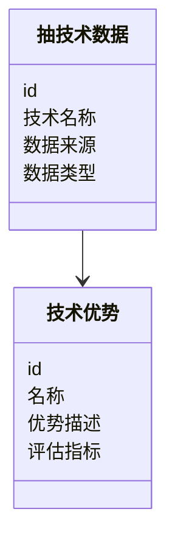
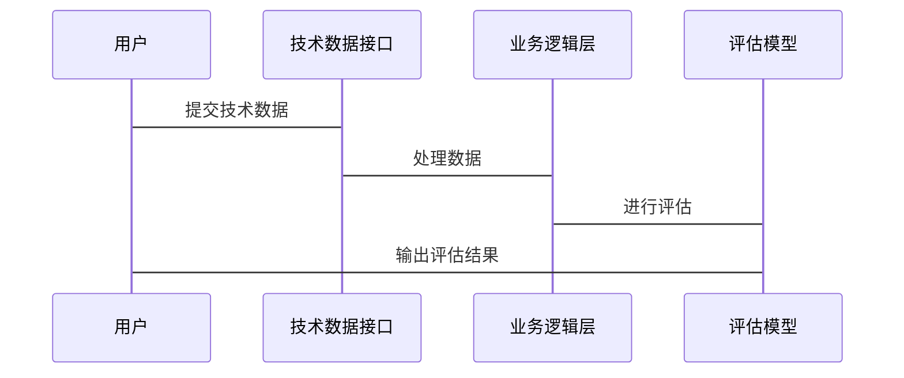

                 


# 彼得林奇对公司技术优势的评估

## 关键词：技术优势，彼得林奇，公司评估，投资策略，竞争优势

## 摘要：  
本文详细探讨了彼得·林奇在其投资策略中对公司技术优势的评估方法。通过分析技术优势的核心概念、评估方法、系统架构及实际案例，本文为投资者提供了一套全面的技术优势评估框架，帮助其做出更明智的投资决策。文章结合理论与实践，深入剖析了技术优势在公司价值中的作用，并提出了具体的实施建议。

---

# 第一部分: 技术优势的核心概念与背景

## 第1章: 背景介绍

### 1.1 问题背景
#### 1.1.1 投资者如何评估公司价值
投资者在评估公司价值时，通常关注财务指标、市场地位和竞争优势等因素。其中，技术优势是决定公司长期竞争力的关键因素之一。

#### 1.1.2 技术优势的定义
技术优势是指公司在技术开发、创新能力、知识产权等方面相对于竞争对手的显著优势。这种优势可以体现在产品性能、生产效率或成本控制等方面。

#### 1.1.3 技术优势的特点
- 独特性：技术的独特性决定了其竞争优势。
- 可持续性：技术的可持续性影响其长期价值。
- 可扩展性：技术的可扩展性决定其应用场景。
- 可复制性：技术的可复制性影响其市场壁垒。

#### 1.1.4 技术优势与传统竞争优势的对比
传统的竞争优势可能源于市场份额、品牌影响力或成本控制，而技术优势则是公司长期增长的核心驱动力。

#### 1.1.5 技术优势的应用前景
随着技术的快速迭代，技术优势的评估需要考虑其动态变化，尤其是在人工智能、大数据等新兴领域。

### 1.2 问题描述
#### 1.2.1 技术优势的评估目标
技术优势的评估目标是帮助投资者识别具有长期竞争优势的公司，从而做出更明智的投资决策。

#### 1.2.2 技术优势的评估标准
- 技术创新性
- 技术成熟度
- 技术的商业化潜力
- 技术的市场竞争力

#### 1.2.3 技术优势的评估挑战
- 技术优势的量化难度
- 技术动态变化的不确定性
- 市场环境的复杂性

### 1.3 问题解决
#### 1.3.1 技术优势的评估方法
- 基于技术生命周期的评估
- 基于市场竞争力的评估
- 基于财务指标的评估

#### 1.3.2 技术优势的量化指标
- 技术研发投入占比
- 技术专利数量
- 技术的市场应用情况

#### 1.3.3 技术优势的动态变化
技术优势并非一成不变，需要定期评估和更新。

### 1.4 边界与外延
#### 1.4.1 技术优势的边界条件
- 技术优势仅适用于技术驱动型行业
- 技术优势的评估需结合行业特点

#### 1.4.2 技术优势的外延领域
- 产品优势
- 服务优势
- 品牌优势

#### 1.4.3 技术优势与其他竞争优势的关系
技术优势是公司整体竞争优势的重要组成部分，但并非唯一因素。

### 1.5 概念结构与核心要素
#### 1.5.1 技术优势的核心要素
- 技术创新性
- 技术成熟度
- 技术的商业化潜力

#### 1.5.2 技术优势的评估框架
- 技术优势的构成要素
- 技术优势的评估维度
- 技术优势的评估方法

---

# 第二部分: 技术优势的核心概念与联系

## 第2章: 核心概念与联系

### 2.1 核心概念原理
#### 2.1.1 技术优势的构成要素
- 技术创新性
- 技术成熟度
- 技术的商业化潜力

#### 2.1.2 技术优势的评估维度
- 技术的市场竞争力
- 技术的可持续性
- 技术的可扩展性

#### 2.1.3 技术优势的评估方法
- 基于技术生命周期的评估
- 基于市场竞争力的评估
- 基于财务指标的评估

### 2.2 概念属性特征对比
| 特性        | 描述 |
|-------------|------|
| 独特性      | 技术的独特性决定了其竞争优势 |
| 可持续性      | 技术的可持续性影响其长期价值 |
| 可扩展性      | 技术的可扩展性决定其应用场景 |
| 可复制性      | 技术的可复制性影响其市场壁垒 |

### 2.3 ER实体关系图
```mermaid
entity 技术优势 {
  id
  名称
  优势描述
  评估指标
}
```

---

# 第三部分: 技术优势的评估方法与流程

## 第3章: 技术优势的评估方法与流程

### 3.1 评估方法
#### 3.1.1 基于技术生命周期的评估
技术生命周期包括引入期、成长期、成熟期和衰退期。在不同阶段，技术优势的评估方法和重点有所不同。

#### 3.1.2 基于市场竞争力的评估
从市场竞争的角度，评估技术优势是否能够为公司带来市场份额和竞争优势。

#### 3.1.3 基于财务指标的评估
结合财务指标（如研发投入占比、专利数量等）对技术优势进行量化评估。

### 3.2 评估流程
#### 3.2.1 确定评估目标
明确评估的目的是什么，是用于投资决策还是内部优化。

#### 3.2.2 收集技术数据
收集与技术优势相关的数据，包括专利数量、研发投入、技术应用情况等。

#### 3.2.3 分析技术优势
从技术创新性、市场竞争力、可持续性等方面分析技术优势。

#### 3.2.4 评估技术价值
结合技术优势的评估结果，评估其对公司的整体价值贡献。

#### 3.2.5 输出评估结果
将评估结果整理成报告，供决策者参考。

### 3.3 评估模型
#### 3.3.1 技术优势评估模型
$$\text{技术优势价值} = f(\text{技术创新性, 市场竞争力, 可持续性})$$

#### 3.3.2 模型输入与输出
- 输入：技术创新性评分（0-10分）、市场竞争力评分（0-10分）、可持续性评分（0-10分）
- 输出：技术优势价值评分（0-100分）

#### 3.3.3 模型验证与优化
通过实际案例验证模型的有效性，并根据反馈进行优化。

---

# 第四部分: 系统分析与架构设计方案

## 第4章: 系统分析与架构设计方案

### 4.1 问题场景介绍
#### 4.1.1 技术优势评估的场景
在投资决策中，技术优势评估是识别具有长期竞争优势的公司的重要手段。

#### 4.1.2 评估系统的功能需求
- 技术数据收集与处理
- 技术优势分析与评估
- 评估结果输出与报告生成

#### 4.1.3 评估系统的性能需求
- 高效的数据处理能力
- 准确的评估结果
- 可视化的报告生成

### 4.2 系统功能设计
#### 4.2.1 领域模型


### 4.3 系统架构设计


### 4.4 系统接口设计
- 技术数据接口：与数据库或第三方数据源对接
- 评估结果接口：输出评估报告
- 用户界面接口：提供输入和输出界面

### 4.5 系统交互设计


---

# 第五部分: 项目实战

## 第5章: 项目实战

### 5.1 环境安装
- 安装Python和相关库（如numpy、pandas、scikit-learn）
- 安装数据库和可视化工具

### 5.2 核心实现
#### 5.2.1 技术优势评估模型的实现
```python
def evaluate_technical_strength(innovation_score, market_competition_score, sustainability_score):
    return (innovation_score * 0.4) + (market_competition_score * 0.3) + (sustainability_score * 0.3)
```

#### 5.2.2 评估结果的可视化
```python
import matplotlib.pyplot as plt

innovation = [8, 7, 6]
market_competition = [7, 6, 5]
sustainability = [6, 5, 4]

plt.bar(range(3), innovation, label='创新性')
plt.bar(range(3), market_competition, label='市场竞争力')
plt.bar(range(3), sustainability, label='可持续性')
plt.title('技术优势评估')
plt.legend()
plt.show()
```

### 5.3 案例分析
#### 5.3.1 案例介绍
以某科技公司为例，分析其技术优势。

#### 5.3.2 评估过程
- 收集技术数据
- 分析技术优势
- 输出评估结果

#### 5.3.3 评估结果解读
- 技术优势的评分
- 与竞争对手的对比
- 投资建议

### 5.4 项目小结
- 技术优势评估的关键步骤
- 系统实现的注意事项
- 案例分析的启示

---

# 第六部分: 最佳实践与小结

## 第6章: 最佳实践

### 6.1 小结
- 技术优势是公司长期竞争优势的核心
- 评估技术优势需要结合技术生命周期和市场环境
- 通过系统化的评估方法和工具，可以提高评估的准确性和效率

### 6.2 注意事项
- 评估技术优势时需考虑行业特点和公司具体情况
- 技术优势的动态变化需要持续关注和评估
- 避免仅依赖单一评估指标

### 6.3 拓展阅读
- 彼得·林奇的投资策略
- 技术创新与公司价值的关系
- 人工智能在技术评估中的应用

---

# 附录: 关键术语解释

- 技术优势：公司在技术开发、创新能力、知识产权等方面相对于竞争对手的显著优势。
- 技术生命周期：技术从引入、成长、成熟到衰退的全过程。
- 市场竞争力：技术在市场中的竞争力和市场份额。
- 可持续性：技术的长期稳定性和发展潜力。

