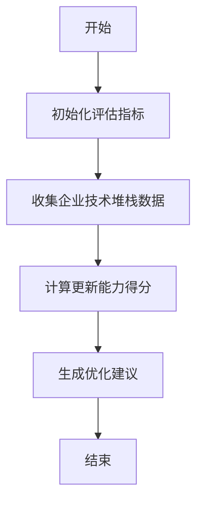
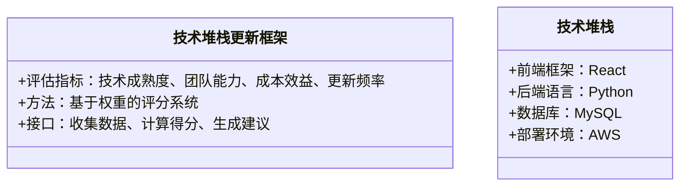
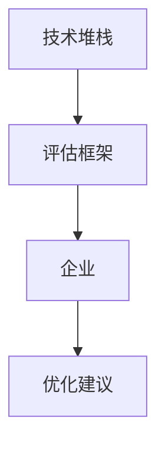
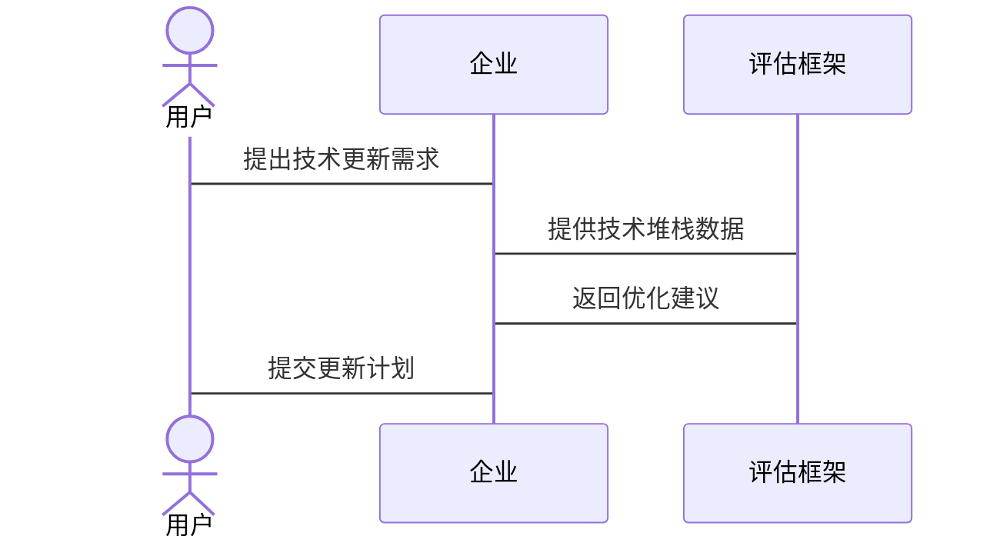

                 


# 彼得林奇对公司技术堆栈更新能力的评估框架

## 关键词：技术堆栈、更新能力、彼得林奇、评估框架、投资理念

## 摘要：本文基于彼得林奇的投资评估理念，构建了一套适用于公司技术堆栈更新能力的评估框架。通过分析技术堆栈的核心概念、评估指标和更新能力的关键因素，结合实际案例，详细阐述了如何利用该框架进行技术评估和优化。本文还提供了具体的算法实现、系统架构设计和项目实战代码，帮助读者更好地理解和应用该框架。

---

## 第一部分：彼得林奇对公司技术堆栈更新能力的评估框架概述

### 第1章：背景介绍：公司技术堆栈更新能力的重要性

#### 1.1 技术堆栈更新能力的定义与背景
- **1.1.1 技术堆栈的定义**  
  技术堆栈是指企业在开发和运营过程中所依赖的一系列技术工具、框架和平台的组合，包括前端、后端、数据库、开发工具、部署环境等。一个高效的技术堆栈能够提高开发效率、降低维护成本并支持业务的持续增长。

- **1.1.2 技术堆栈更新能力的背景与意义**  
  随着技术的快速发展，企业需要不断更新其技术堆栈以保持竞争力。然而，技术堆栈的更新并非易事，涉及技术选型、团队适应性、成本控制等多个方面。如何科学地评估技术堆栈的更新能力，成为企业在数字化转型中面临的重要挑战。

- **1.1.3 彼得林奇投资理念与技术堆栈更新的关联**  
  彼得林奇是著名投资家，他的投资理念强调对企业的基本面分析、管理层能力和竞争优势的评估。我们将他的投资理念类比到技术堆栈的更新能力评估中，通过分析企业的技术优势、团队能力和更新策略，为企业提供技术决策的支持。

#### 1.2 问题背景与目标
- **1.2.1 技术堆栈更新中的常见问题**  
  技术堆栈更新可能面临以下问题：  
  1. 技术选型盲目，缺乏对业务需求的深入分析。  
  2. 更新过程中出现技术债务，影响系统性能和维护成本。  
  3. 团队能力不足，无法有效推进更新计划。  

- **1.2.2 评估技术堆栈更新能力的目标**  
  通过构建评估框架，帮助企业识别技术堆栈的优劣势，制定合理的更新策略，降低技术风险，提升技术竞争力。

- **1.2.3 评估框架的边界与外延**  
  本框架的边界包括技术堆栈的核心组件（如前端框架、后端语言、数据库）和更新过程中的关键环节（如需求分析、技术选型、实施计划）。其外延则延伸至企业战略、团队能力和业务目标的匹配。

#### 1.3 核心概念与框架介绍
- **1.3.1 技术堆栈更新的核心要素**  
  技术堆栈更新能力由以下几个核心要素构成：  
  1. **技术成熟度**：现有技术的稳定性和可靠性。  
  2. **团队能力**：团队的技术能力和学习能力。  
  3. **成本效益**：技术更新的成本与收益比。  
  4. **更新频率**：企业对技术更新的响应速度。  

- **1.3.2 评估框架的组成与结构**  
  评估框架包括以下几个部分：  
  1. 评估指标：技术成熟度、团队能力、成本效益、更新频率。  
  2. 评估方法：基于权重的评分系统。  
  3. 优化建议：根据评估结果提出技术更新策略。  

- **1.3.3 框架的核心属性与特征对比**  
  通过对比不同技术堆栈的特征，帮助企业选择最适合的技术方案。

---

## 第二部分：核心概念与联系

### 第2章：技术堆栈更新能力的核心概念原理

#### 2.1 技术堆栈更新能力的原理分析
- **2.1.1 技术堆栈更新的核心驱动力**  
  技术堆栈更新的核心驱动力包括业务需求的变化、技术的进步和竞争对手的技术优势。

- **2.1.2 技术堆栈更新的生命周期模型**  
  技术堆栈的更新可以分为以下几个阶段：  
  1. **需求分析阶段**：明确更新目标和范围。  
  2. **技术选型阶段**：选择适合的新技术或工具。  
  3. **实施阶段**：逐步替换旧技术并优化系统。  
  4. **评估阶段**：验证更新效果并总结经验。  

- **2.1.3 技术堆栈更新能力的评估维度**  
  从技术、团队、成本和效率四个维度进行评估。

#### 2.2 核心概念属性特征对比
- **2.2.1 技术堆栈更新能力的属性分析**  
  通过对比不同技术堆栈的属性，如性能、可扩展性、可维护性等，帮助企业选择最优的技术方案。

- **2.2.2 不同技术堆栈的特征对比**  
  以下是一个对比表格：

  | 技术堆栈 | 性能 | 可扩展性 | 可维护性 |
  |----------|------|----------|----------|
  | Stack A  | 高   | 中       | 高       |
  | Stack B  | 中   | 高       | 中       |
  | Stack C  | 低   | 低       | 低       |

- **2.2.3 评估框架的属性与特征矩阵**  
  通过矩阵分析技术堆栈的优劣势，制定更新策略。

#### 2.3 ER实体关系图架构
```mermaid
erDiagram
    actor 投资者 {
        <属性> 评估指标
        <属性> 更新能力
        <属性> 技术栈
    }
    actor 企业 {
        <属性> 业务需求
        <属性> 技术能力
        <属性> 更新计划
    }
    actor 评估框架 {
        <属性> 评估标准
        <属性> 更新策略
        <属性> 优化建议
    }
    投资者 --> 企业 : 提供资金支持
    企业 --> 评估框架 : 采用评估框架
    评估框架 -->抽屉关系-->抽屉关系
```

---

## 第三部分：算法原理讲解

### 第3章：评估框架的算法原理

#### 3.1 算法原理概述
- **3.1.1 评估框架的算法选择**  
  本文采用基于权重的评分系统，结合层次分析法（AHP）进行评估。

- **3.1.2 算法的核心思想**  
  通过对各个评估指标赋予不同的权重，计算每个指标的得分，并最终得出技术堆栈更新能力的综合评分。

- **3.1.3 算法的适用场景**  
  适用于需要对技术堆栈进行定量评估的企业。

#### 3.2 算法流程图


#### 3.3 算法实现代码
```python
def assess_technology_stack(technology_stack):
    # 初始化评估指标
    metrics = ['技术成熟度', '团队能力', '成本效益', '更新频率']
    scores = {}
    
    # 计算每个指标的得分
    for metric in metrics:
        scores[metric] = calculate_score(technology_stack, metric)
    
    # 根据权重计算综合得分
    weights = {'技术成熟度': 0.4, '团队能力': 0.3, '成本效益': 0.2, '更新频率': 0.1}
    total_score = sum(scores[metric] * weights[metric] for metric in metrics)
    
    return total_score

def calculate_score(technology_stack, metric):
    # 根据具体指标计算得分
    pass
```

#### 3.4 数学公式
- **技术堆栈更新能力的综合得分公式**  
  $$ \text{总得分} = \sum (\text{指标得分} \times \text{权重}) $$

---

## 第四部分：系统分析与架构设计方案

### 第4章：系统分析与架构设计

#### 4.1 问题场景介绍
- 以一家电商公司为例，其当前技术堆栈面临性能瓶颈，需要进行更新。

#### 4.2 系统功能设计


#### 4.3 系统架构设计


#### 4.4 系统接口设计
- **输入接口**：收集企业技术堆栈数据。  
- **输出接口**：生成优化建议报告。  

#### 4.5 系统交互设计


---

## 第五部分：项目实战

### 第5章：项目实战：电商系统技术堆栈更新能力评估

#### 5.1 环境安装
- 安装Python、Jupyter Notebook、数据库等工具。

#### 5.2 核心代码实现
```python
def calculate_technology_stack_score(technology_stack):
    # 初始化评估指标
    metrics = ['技术成熟度', '团队能力', '成本效益', '更新频率']
    scores = {}
    
    # 计算每个指标的得分
    for metric in metrics:
        scores[metric] = calculate_score(technology_stack, metric)
    
    # 根据权重计算综合得分
    weights = {'技术成熟度': 0.4, '团队能力': 0.3, '成本效益': 0.2, '更新频率': 0.1}
    total_score = sum(scores[metric] * weights[metric] for metric in metrics)
    
    return total_score

def calculate_score(technology_stack, metric):
    # 根据具体指标计算得分
    pass
```

#### 5.3 代码应用解读与分析
- **代码解读**：上述代码展示了如何对电商系统的技术堆栈进行评分。通过计算每个指标的得分，并结合权重得出综合得分，帮助企业判断技术堆栈的更新能力。

#### 5.4 实际案例分析
- 以某电商公司为例，评估其当前技术堆栈的更新能力，并提出优化建议。

#### 5.5 项目小结
- 总结项目实施过程中的经验教训，并提出改进建议。

---

## 第六部分：总结与展望

### 第6章：总结与展望

#### 6.1 最佳实践 tips
- 定期评估技术堆栈的更新能力。  
- 根据企业实际情况选择合适的技术方案。  
- 加强团队技术能力的培养。  

#### 6.2 小结
- 本文基于彼得林奇的投资理念，构建了一套技术堆栈更新能力的评估框架，为企业技术决策提供了科学依据。

#### 6.3 注意事项
- 技术评估需结合企业实际需求。  
- 更新过程中需注重团队协作与沟通。  

#### 6.4 拓展阅读
- 推荐阅读《彼得林奇选股术》和《技术债务：从概念到管理》。

---

通过以上框架，我们可以系统地评估和优化公司的技术堆栈更新能力，为企业在数字化转型中提供有力支持。

