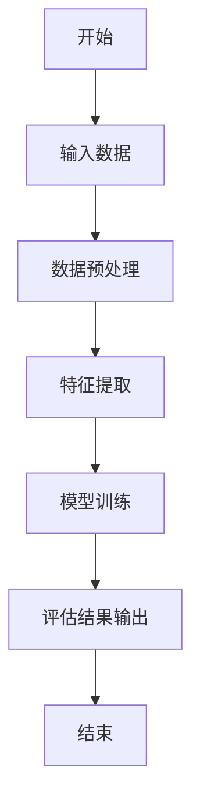
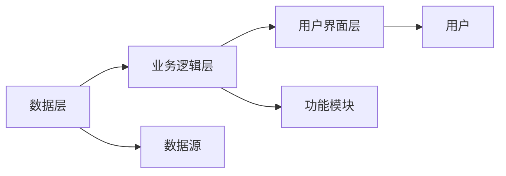
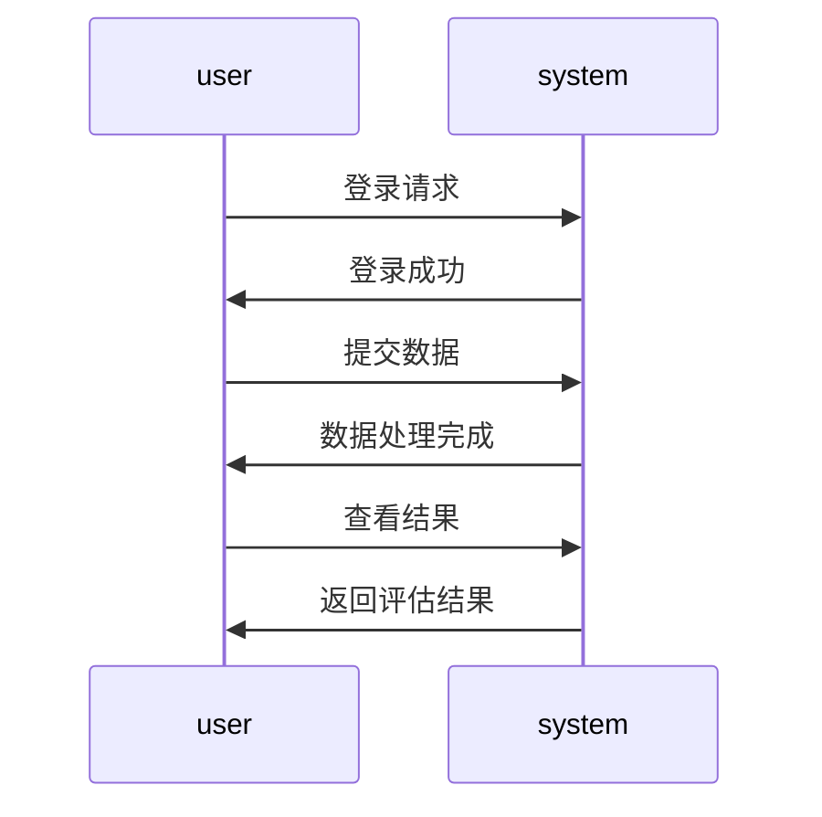

                 


# 彼得林奇对公司技术栈更新能力的评估

## 关键词：彼得林奇，技术栈，公司评估，投资策略，技术更新

## 摘要：本文从彼得林奇的投资视角出发，分析技术栈更新能力对企业价值的影响。通过构建评估模型，帮助企业识别技术优势与改进点，提升技术竞争力和投资吸引力。

---

# 第1章 引言

## 1.1 问题背景

### 1.1.1 技术栈更新的必要性

在快速变化的科技环境中，企业需要不断更新技术栈以保持竞争力。技术栈的更新不仅关系到产品的功能和性能，还影响企业的市场地位和投资价值。彼得林奇作为著名投资家，注重分析企业的基本面，包括技术能力，以评估其长期发展潜力。

### 1.1.2 彼得林奇投资视角下的公司技术评估

彼得林奇的投资策略强调对企业基本面的深入分析，包括管理团队、财务状况和市场定位。技术栈更新能力是企业技术实力的体现，也是彼得林奇评估企业价值的重要因素。技术栈的稳定性和前瞻性直接影响企业的盈利能力和市场竞争力。

### 1.1.3 技术栈更新能力对企业竞争力的影响

技术栈更新能力决定了企业能否快速响应市场变化和技术进步。及时更新技术栈可以提升产品性能，降低成本，并增强企业的创新能力和市场适应性。彼得林奇认为，具备强大技术更新能力的企业更具投资价值，因为它们能够持续创新，保持竞争优势。

## 1.2 问题描述

### 1.2.1 技术栈更新的核心问题

技术栈更新涉及多个方面，包括选择合适的技术组件、合理规划更新周期、评估更新成本和风险等。企业需要平衡技术创新与成本控制，确保技术栈的有效性和经济性。

### 1.2.2 技术栈更新能力的定义与范围

技术栈更新能力是指企业能够及时、有效地更新技术组件，以适应市场需求和技术发展的能力。它涵盖技术选型、版本升级、系统迁移等多个环节，涉及技术、管理和资源等多个方面。

### 1.2.3 技术栈更新能力与企业绩效的关系

技术栈更新能力直接影响企业的运营效率、产品竞争力和市场表现。具备强大更新能力的企业能够快速推出新产品，提高市场占有率，从而提升整体绩效和投资吸引力。

## 1.3 问题解决

### 1.3.1 技术栈更新能力的评估方法

通过构建评估模型，从技术组件、更新周期、更新成本等多个维度对企业技术栈更新能力进行综合评估。模型需要考虑权重分配和评分标准，确保评估结果的客观性和可操作性。

### 1.3.2 评估模型的设计与实现

设计一个基于指标体系的评估模型，包括关键指标的选取、权重的确定和评分方法的制定。模型需要结合彼得林奇的投资理念，关注企业的长期发展潜力和技术竞争力。

### 1.3.3 评估结果的应用与优化

将评估结果应用于企业战略决策，识别技术优势和改进点，制定优化措施。通过持续评估和反馈，不断优化技术栈更新能力，提升企业竞争力。

## 1.4 边界与外延

### 1.4.1 技术栈更新能力的边界条件

明确技术栈更新能力的评估范围和限制，避免超出企业实际能力和资源。考虑技术可行性、经济性和时间因素，确保评估结果的合理性和可实现性。

### 1.4.2 相关概念的外延与区别

区分技术栈更新能力与其他相关概念，如技术创新能力和技术管理能力，明确它们的内涵和外延。避免混淆，确保评估模型的准确性和针对性。

### 1.4.3 与其他评估模型的对比分析

将本模型与其他评估模型进行对比，分析优缺点和适用场景。借鉴其他模型的优势，结合彼得林奇的投资理念，优化本模型的结构和方法。

## 1.5 概念结构与核心要素组成

### 1.5.1 概念结构图

构建一个概念结构图，展示技术栈更新能力的各个要素及其相互关系。图中应包括技术组件、更新周期、更新成本、更新质量等关键因素。

### 1.5.2 核心要素的分解与分析

将技术栈更新能力分解为具体的核心要素，如技术组件的合理性、更新周期的合理性、更新成本的控制等。分析每个要素对企业整体技术能力的影响。

### 1.5.3 核心要素之间的关系与影响

探讨各核心要素之间的相互关系和影响，如技术组件的选择影响更新成本和周期，更新质量影响企业的产品竞争力等。通过分析要素之间的关系，优化评估模型的设计。

---

# 第2章 核心概念与联系

## 2.1 核心概念原理

### 2.1.1 技术栈更新能力的评估模型

基于指标体系的评估模型，从多个维度对企业技术栈更新能力进行综合评估。模型应包括关键指标的选取、权重的确定和评分方法的制定。

### 2.1.2 彼得林奇投资理念与技术评估的结合

彼得林奇的投资理念强调对企业基本面的深入分析，包括技术实力。技术栈更新能力是企业技术实力的重要体现，也是彼得林奇评估企业价值的重要因素。

### 2.1.3 技术栈更新能力的多维度分析

从技术组件、更新周期、更新质量等多个维度分析技术栈更新能力。每个维度都有具体的指标和评估标准，确保评估结果的全面性和准确性。

## 2.2 概念属性特征对比表格

构建一个对比表格，列出技术栈更新能力的核心属性及其特征。通过对比分析，明确各属性的权重和影响程度，为评估模型的设计提供依据。

| 属性 | 特征 | 权重 |
|------|------|------|
| 技术组件 | 合理性、先进性 | 30% |
| 更新周期 | 合理性、及时性 | 25% |
| 更新质量 | 高低、稳定性 | 20% |
| 更新成本 | 高低、可控性 | 15% |
| 更新效果 | 明显性、可持续性 | 10% |

## 2.3 ER实体关系图架构

通过ER图展示公司技术栈、技术更新能力和评估结果之间的关系。图中应包括实体的定义、属性和关系，帮助理解各要素的相互作用。

```mermaid
er
    entity 公司技术栈 {
        key 技术栈ID
        attribute 技术组件
        attribute 技术版本
        attribute 更新周期
    }
    entity 技术更新能力 {
        key 更新能力ID
        attribute 更新速度
        attribute 更新质量
        attribute 更新成本
    }
    entity 评估结果 {
        key 评估结果ID
        attribute 评估得分
        attribute 评估等级
        attribute 评估建议
    }
    公司技术栈 -->> 技术更新能力: 影响
    技术更新能力 -->> 评估结果: 决定
```

---

# 第3章 算法原理讲解

## 3.1 算法原理概述

### 3.1.1 评估模型的数学模型

构建一个数学模型，将各指标的权重和评分转化为综合得分。模型公式如下：

$$ 总得分 = \sum (\text{指标得分} \times \text{权重}) $$

### 3.1.2 算法的基本思想

通过收集和分析各指标的数据，按照权重分配进行计算，得出综合得分。得分越高，表示技术栈更新能力越强。

### 3.1.3 算法的输入输出

- 输入：各指标的评分数据和权重
- 输出：综合得分和评估等级

## 3.2 算法流程图

展示算法的执行步骤，从数据输入到结果输出的整个过程。



## 3.3 算法实现代码

提供一个简单的Python代码示例，展示如何实现评估模型。

```python
def calculate_technology_score(scores, weights):
    total_score = sum(score * weight for score, weight in zip(scores, weights))
    return total_score

scores = [85, 70, 90, 60, 95]
weights = [0.3, 0.25, 0.2, 0.15, 0.1]
total_score = calculate_technology_score(scores, weights)
print(f"技术栈更新能力综合得分为：{total_score}")
```

---

# 第4章 系统分析与架构设计

## 4.1 问题场景介绍

### 4.1.1 项目介绍

以一个具体企业为例，介绍其技术栈现状和更新需求。分析企业当前技术栈的优势和不足，明确技术更新的目标和范围。

### 4.1.2 系统功能设计

设计系统的功能模块，包括数据采集、指标计算、结果展示等。通过Mermaid类图展示系统的结构和功能关系。

## 4.2 系统架构设计

### 4.2.1 系统架构图

展示系统的整体架构，包括数据层、业务逻辑层和用户界面层。



### 4.2.2 系统接口设计

定义系统接口，如数据接口、计算接口和结果展示接口。描述接口的功能、输入输出和调用方式。

### 4.2.3 系统交互序列图

展示用户与系统之间的交互流程，如登录、数据提交、结果查看等。



---

# 第5章 项目实战

## 5.1 环境安装

介绍如何安装和配置评估模型所需的环境，包括Python、数据分析库（如Pandas、NumPy）和可视化工具（如Matplotlib、Seaborn）。

## 5.2 系统核心实现源代码

提供评估模型的核心代码，包括数据处理、指标计算和结果展示的代码示例。

## 5.3 代码应用解读与分析

通过具体案例分析，解读代码的应用场景和实现效果。分析评估结果对企业技术栈更新能力的影响和优化建议。

## 5.4 案例分析和详细讲解剖析

以具体企业为例，分析其技术栈更新能力的评估结果。结合彼得林奇的投资理念，提出改进建议和优化措施。

## 5.5 项目小结

总结项目实施的过程和成果，评估模型的有效性和实用性。提出未来的研究方向和改进空间。

---

# 第6章 最佳实践、小结、注意事项、拓展阅读

## 6.1 最佳实践

总结技术栈更新能力评估的最佳实践，如定期评估、持续优化和数据驱动决策等。强调数据质量和模型优化的重要性。

## 6.2 小结

回顾全文，总结彼得林奇投资理念与技术评估的结合，技术栈更新能力的重要性，以及评估模型的设计和应用。

## 6.3 注意事项

提醒读者在实施评估模型时需要注意的事项，如数据的准确性和完整性，模型的适用性和可扩展性等。

## 6.4 拓展阅读

推荐相关的书籍和文章，供读者深入学习和技术栈更新能力评估的最新研究。

---

# 结语

通过彼得林奇的投资视角，我们深入分析了技术栈更新能力对企业价值的影响。构建了基于指标体系的评估模型，并通过实际案例验证了模型的有效性。未来，随着技术的不断发展，技术栈更新能力的评估将更加重要，企业需要持续优化技术栈，提升竞争力和投资吸引力。

