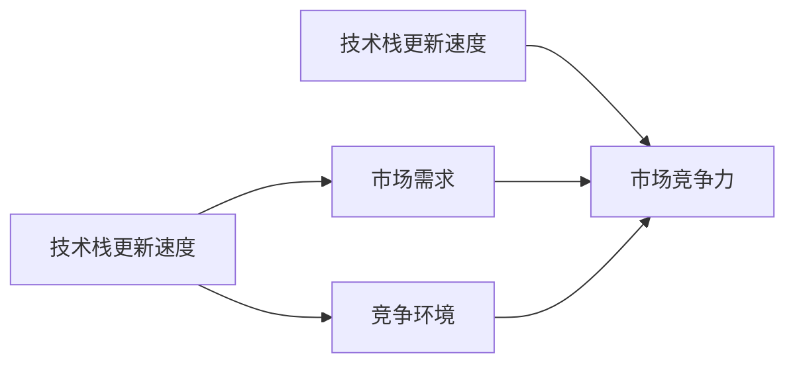
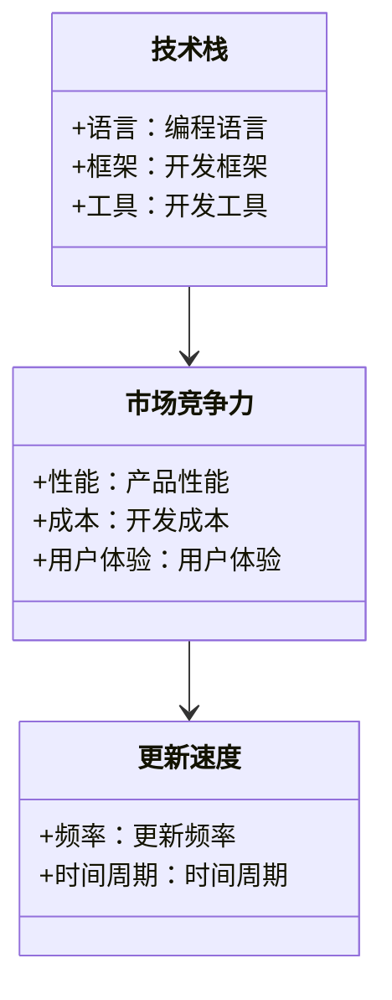
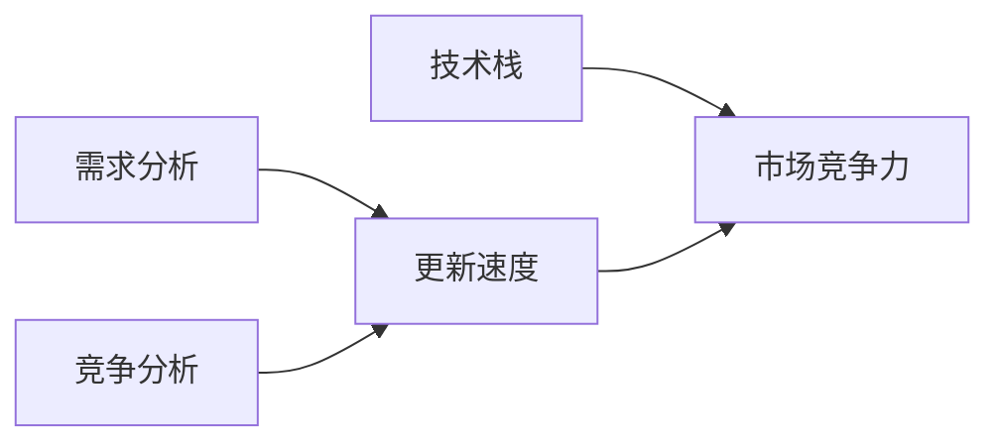
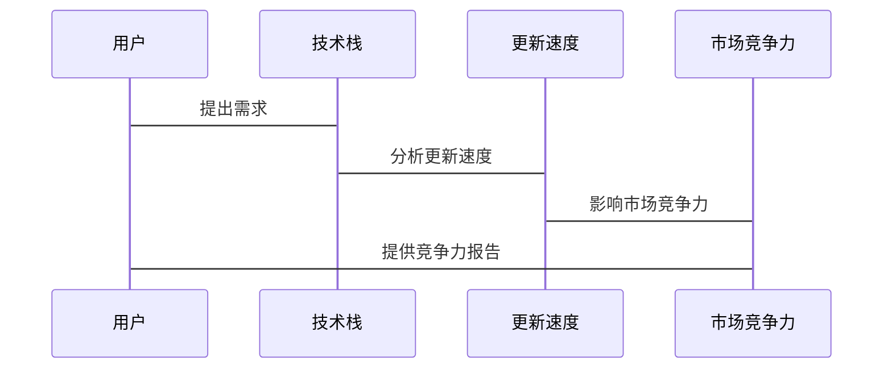

                 


# 彼得林奇对公司技术栈更新速度与市场竞争力的关系分析

## 关键词：彼得·林奇，技术栈，更新速度，市场竞争力，企业战略

## 摘要：本文从彼得·林奇的投资哲学出发，分析技术栈更新速度与市场竞争力之间的关系，通过数学模型、算法原理和系统架构设计，结合实际案例，探讨技术栈更新速度对企业市场竞争力的影响，并提出优化建议。

---

## 第一部分：技术栈更新与市场竞争力的背景

### 第1章：技术栈的定义与特征

#### 1.1 技术栈的核心概念

- **技术栈**：指企业在开发过程中使用的编程语言、框架、工具和平台的组合。
- **技术栈的分类**：前端技术栈、后端技术栈、数据库技术栈等。
- **技术栈的特征**：稳定性、可扩展性、兼容性、安全性。

#### 1.2 技术栈的更新周期与模式

- **技术栈更新的周期**：根据技术发展和业务需求，分为快速更新、中速更新和慢速更新。
- **技术栈更新的模式**：全栈更新、部分更新、渐进式更新。

### 第2章：市场竞争力的定义与影响因素

#### 2.1 市场竞争力的内涵

- **市场竞争力**：企业在市场中与竞争对手相比的核心优势。
- **核心竞争力**：技术创新、成本优势、品牌影响力。

#### 2.2 彼得·林奇的市场分析方法

- **彼得·林奇的投资哲学**：长期投资、价值投资、风险控制。
- **彼得·林奇的技术分析方法**：技术面分析、基本面分析、市场趋势分析。

---

## 第二部分：技术栈更新速度与市场竞争力的关系模型

### 第3章：技术栈更新速度与市场竞争力的关系

#### 3.1 技术栈更新速度的定义

- **技术栈更新速度**：企业在一定时间内对技术栈进行升级或替换的频率。
- **技术栈更新速度的驱动因素**：技术进步、市场需求、竞争压力。

#### 3.2 技术栈更新对市场竞争力的影响

- **正向影响**：提升产品性能、降低开发成本、增强用户体验。
- **反向影响**：技术不兼容、开发周期延长、成本增加。

#### 3.3 彼得·林奇的技术栈更新分析框架

- **林奇的技术分析模型**：技术栈更新速度与市场竞争力的关系模型。
- **林奇的分析方法**：技术栈更新速度对市场竞争力的影响程度。

---

## 第三部分：技术栈更新速度与市场竞争力的关系模型

### 第4章：技术栈更新速度与市场竞争力的关系模型

#### 4.1 技术栈更新速度的数学模型

- **技术栈更新速度公式**：$$V = \frac{U}{T}$$，其中U为技术栈更新的频率，T为时间周期。
- **市场竞争力公式**：$$C = f(V, S, R)$$，其中V为技术栈更新速度，S为市场需求，R为竞争环境。

#### 4.2 技术栈更新速度与市场竞争力的关系图（Mermaid）



---

## 第四部分：系统分析与架构设计方案

### 第5章：系统分析与架构设计

#### 5.1 项目介绍

- **项目目标**：分析技术栈更新速度与市场竞争力的关系。
- **项目背景**：当前技术发展的快速迭代对企业的影响。

#### 5.2 系统功能设计

- **领域模型设计**：使用Mermaid类图展示技术栈、市场竞争力、更新速度的关系。


#### 5.3 系统架构设计

- **系统架构图**：展示技术栈更新速度与市场竞争力的关系。


#### 5.4 系统交互设计

- **序列图**：展示技术栈更新速度对市场竞争力的影响。


---

## 第五部分：项目实战

### 第6章：项目实战

#### 6.1 环境安装

- **开发工具**：安装IDE、版本控制系统、依赖管理工具。
- **技术栈选择**：选择适合的编程语言和框架。

#### 6.2 核心实现

- **代码实现**：编写技术栈更新速度与市场竞争力的关系分析代码。
  ```python
  def calculate_market_competition(update_speed, market_demand, competition_env):
      return update_speed * market_demand / competition_env
  ```

#### 6.3 代码应用解读

- **代码功能**：计算技术栈更新速度对市场竞争力的影响。
- **参数解释**：update_speed（更新速度）、market_demand（市场需求）、competition_env（竞争环境）。

#### 6.4 案例分析

- **案例分析**：分析某企业技术栈更新速度对市场竞争力的影响。
- **详细解读**：通过具体数据展示技术栈更新速度如何影响市场竞争力。

#### 6.5 项目小结

- **项目总结**：技术栈更新速度与市场竞争力的关系。
- **优化建议**：如何根据市场需求和技术趋势调整技术栈更新速度。

---

## 第六部分：结论与展望

### 第7章：结论与展望

#### 7.1 结论

- **核心结论**：技术栈更新速度与市场竞争力密切相关，合理的技术栈更新速度能够提升市场竞争力。

#### 7.2 展望

- **未来研究方向**：进一步研究技术栈更新速度与市场竞争力的关系模型。
- **实践建议**：企业应根据自身需求和技术发展趋势，合理调整技术栈更新速度。

---

## 第七部分：附录

### 附录A：工具与库

- **开发工具**：IDE、版本控制系统。
- **依赖管理工具**：pip、npm等。

### 附录B：数据集

- **数据来源**：市场需求数据、竞争环境数据、技术栈更新速度数据。

### 附录C：参考文献

- **参考文献**：彼得·林奇的相关著作、技术栈更新速度与市场竞争力的相关研究。

---

## 总结

通过本文的分析，我们可以看到，技术栈更新速度与市场竞争力之间的关系是一个复杂但重要的问题。彼得·林奇的投资哲学和技术分析方法为我们提供了一个新的视角，帮助我们更好地理解技术栈更新速度对企业市场竞争力的影响。通过数学模型、算法原理和系统架构设计，我们可以更科学地分析和优化技术栈更新速度，从而提升企业的市场竞争力。

