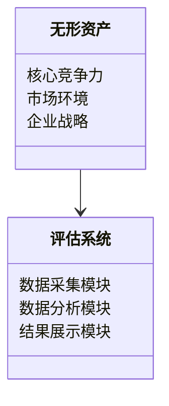
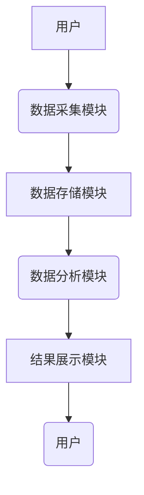

                 


# 彼得林奇对公司无形资产价值的量化分析方法

## 关键词：彼得林奇，无形资产，量化分析，评估方法，企业价值

## 摘要：本文详细探讨了彼得·林奇在对公司无形资产进行价值量化分析时所采用的方法。文章首先介绍了无形资产的基本概念与重要性，然后重点分析了彼得·林奇提出的无形资产价值量化分析框架，包括其核心要素、评估模型及实际应用。最后，通过具体案例和系统设计，展示了该方法的实际操作步骤与效果，为读者提供了全面的理论支持与实践指导。

---

# 第一部分: 无形资产价值量化分析的背景与基础

## 第1章: 无形资产的基本概念与重要性

### 1.1 无形资产的定义与分类

#### 1.1.1 无形资产的定义
无形资产是指企业拥有的没有实体形态的资产，包括专利权、商标权、品牌价值、客户关系、商誉、技术诀窍等。这些资产虽然看不见摸不着，但对企业价值的贡献却不可忽视。

#### 1.1.2 无形资产的主要分类
无形资产可以分为以下几类：
- **知识产权类**：专利权、商标权、版权等。
- **品牌价值类**：品牌知名度、品牌忠诚度。
- **客户关系类**：客户数据库、客户忠诚度。
- **商誉类**：企业整体价值超出有形资产的部分。
- **技术类**：技术诀窍、专有技术。

#### 1.1.3 无形资产在企业价值中的地位
无形资产往往决定了企业的核心竞争力和长期盈利能力。特别是在高科技行业，无形资产的价值占比甚至超过了有形资产。

---

### 1.2 无形资产的价值特性

#### 1.2.1 无形资产的可测量性
尽管无形资产没有实体形态，但其价值可以通过多种方法进行量化。例如，品牌价值可以通过市场法、收益法等方法进行评估。

#### 1.2.2 无形资产的波动性
无形资产的价值容易受到市场环境、企业战略、竞争状况等因素的影响，具有较高的波动性。

#### 1.2.3 无形资产的外部环境依赖性
无形资产的价值往往依赖于外部市场环境。例如，品牌价值依赖于消费者的认知和市场的认可度。

---

### 1.3 无形资产评估的必要性

#### 1.3.1 企业并购中的无形资产评估
在企业并购中，无形资产的价值往往占据重要地位。准确评估无形资产可以帮助企业合理定价，避免支付过高的并购成本。

#### 1.3.2 无形资产对财务决策的影响
企业的财务决策，如融资、投资、资本预算等，都需要考虑无形资产的价值。准确评估无形资产可以帮助企业做出更科学的决策。

#### 1.3.3 无形资产在企业价值管理中的作用
通过量化分析无形资产的价值，企业可以更好地管理其核心竞争力，制定有效的战略规划。

---

## 第2章: 无形资产价值量化分析的背景与现状

### 2.1 无形资产价值量化分析的背景

#### 2.1.1 经济全球化下的无形资产重要性
随着全球经济一体化的加深，无形资产在企业竞争中的作用日益凸显。特别是在高科技行业，无形资产往往决定了企业的核心竞争力。

#### 2.1.2 数字经济时代无形资产的崛起
在数字经济时代，数据和技术成为了企业的重要资产。无形资产的价值占比显著提高。

#### 2.1.3 传统财务评估方法的局限性
传统的财务评估方法主要关注有形资产，对无形资产的评估往往不够准确。例如，传统的资产定价模型难以准确反映无形资产的价值波动。

---

### 2.2 无形资产价值量化分析的现状

#### 2.2.1 学术界的研究进展
学术界对无形资产的评估方法进行了大量研究，提出了多种量化分析模型，如市场法、收益法、成本法等。然而，这些方法在实际应用中仍然存在一定的局限性。

#### 2.2.2 实业界的应用现状
在企业实践中，无形资产的评估方法逐渐得到了重视。特别是在企业并购、融资等领域，无形资产的评估已成为不可或缺的一部分。

#### 2.2.3 当前存在的主要问题
- 无形资产的评估方法不够统一，缺乏标准。
- 评估模型的复杂性较高，实际操作难度大。
- 无形资产的价值波动性较高，评估结果的准确性难以保证。

---

### 2.3 彼得林奇分析方法的提出

#### 2.3.1 彼得林奇的学术背景
彼得·林奇是美国著名的企业家和投资专家，他在企业价值评估领域有着深厚的理论基础和丰富的实践经验。

#### 2.3.2 彼得林奇分析方法的核心思想
彼得林奇提出的无形资产价值量化分析方法，强调通过对企业核心竞争力的评估，结合市场环境和企业战略，量化分析无形资产的价值。

#### 2.3.3 方法的创新性与实用性
彼得林奇的方法结合了定量分析和定性分析，既考虑了无形资产的内在价值，又考虑了外部市场环境的影响，具有较强的实用性和创新性。

---

## 第3章: 彼得林奇分析框架的核心要素

### 3.1 分析框架的结构

#### 3.1.1 核心概念与联系
彼得林奇的分析框架包括以下几个核心概念：
- **企业核心竞争力**：企业的技术优势、品牌优势、客户关系等。
- **市场环境**：行业竞争状况、市场需求、政策环境等。
- **企业战略**：企业的长期发展目标和战略规划。
- **无形资产价值**：通过以上因素的综合分析，得出无形资产的量化价值。

#### 3.1.2 框架的逻辑流程
1. 确定企业核心竞争力。
2. 分析市场环境和企业战略。
3. 结合以上因素，量化分析无形资产的价值。

#### 3.1.3 框架的适用范围
该框架适用于各种类型的企业，特别是高科技企业和服务业。

---

## 3.2 核心概念与联系

### 3.2.1 核心概念原理
彼得林奇的分析框架基于以下原理：
- 企业的核心竞争力是无形资产的主要来源。
- 市场环境和企业战略对无形资产的价值有重要影响。

### 3.2.2 概念属性特征对比表格
| 概念         | 定义                         | 属性                       |
|--------------|------------------------------|-----------------------------|
| 核心竞争力   | 企业的技术优势、品牌优势等 | 内在性、长期性、动态性       |
| 市场环境     | 行业竞争状况、市场需求等   | 外在性、多样性、动态性       |
| 企业战略     | 长期发展目标和战略规划       | 长期性、系统性、导向性       |
| 无形资产价值 | 企业核心竞争力的量化价值   | 综合性、波动性、可测量性     |

### 3.2.3 ER实体关系图架构

```mermaid
er
  actor 顾客
  actor 竞争对手
  actor 企业
  actor 评估机构
  entity 无形资产
  entity 市场环境
  entity 企业战略
  entity 核心竞争力
  relation 管理(顾客, 市场环境)
  relation 影响(竞争对手, 市场环境)
  relation 决策(企业, 企业战略)
  relation 组成(核心竞争力, 无形资产)
  relation 影响(市场环境, 无形资产)
  relation 影响(企业战略, 无形资产)
```

---

## 3.3 无形资产价值量化分析框架的数学模型

### 3.3.1 模型概述
彼得林奇提出的无形资产价值量化分析模型如下：

$$ V = f(C, M, S) $$

其中：
- $V$ 表示无形资产的价值。
- $C$ 表示企业核心竞争力。
- $M$ 表示市场环境。
- $S$ 表示企业战略。

### 3.3.2 具体实现

#### 3.3.2.1 企业核心竞争力的评估
企业核心竞争力可以通过以下几个指标进行评估：
- 技术创新能力
- 品牌知名度
- 客户忠诚度
- 成本优势

#### 3.3.2.2 市场环境的评估
市场环境的评估包括以下几个方面：
- 行业竞争状况
- 市场需求
- 政策环境

#### 3.3.2.3 企业战略的评估
企业战略的评估包括：
- 长期发展目标
- 资源配置
- 风险管理

### 3.3.3 案例分析

#### 案例：苹果公司品牌价值的评估

1. **企业核心竞争力**：苹果公司在技术创新、品牌知名度、客户忠诚度等方面具有显著优势。
2. **市场环境**：全球智能手机市场激烈竞争，市场需求稳定增长。
3. **企业战略**：苹果公司致力于技术创新和高端市场定位。

通过上述因素的综合分析，可以得出苹果公司的品牌价值约为 $V = f(C, M, S)$。

---

## 4. 算法原理讲解

### 4.1 无形资产价值量化分析的算法流程

#### 4.1.1 流程概述
1. 收集企业核心竞争力的相关数据。
2. 分析市场环境和企业战略。
3. 结合上述因素，量化分析无形资产的价值。

### 4.2 算法实现

#### 4.2.1 Python源代码实现

```python
def calculate_invisible_asset_value(core_competitiveness, market_environment, business_strategy):
    # 核心竞争力的权重
    core_weight = 0.4
    # 市场环境的权重
    market_weight = 0.3
    # 企业战略的权重
    strategy_weight = 0.3
    
    # 计算无形资产价值
    value = core_competitiveness * core_weight + market_environment * market_weight + business_strategy * strategy_weight
    return value

# 示例数据
core_competitiveness = 0.8  # 企业核心竞争力评分（0-1）
market_environment = 0.7    # 市场环境评分（0-1）
business_strategy = 0.85    # 企业战略评分（0-1）

# 计算无形资产价值
value = calculate_invisible_asset_value(core_competitiveness, market_environment, business_strategy)
print(f"无形资产价值为：{value}")
```

#### 4.2.2 算法原理的数学模型

$$ V = w_c \cdot C + w_m \cdot M + w_s \cdot S $$

其中：
- $w_c$、$w_m$、$w_s$ 分别为核心竞争力、市场环境、企业战略的权重。
- $C$、$M$、$S$ 分别为核心竞争力、市场环境、企业战略的评分。

---

## 5. 系统分析与架构设计方案

### 5.1 问题场景介绍
为了实现对无形资产价值的量化分析，我们需要构建一个完整的系统，包括数据采集、分析、展示等功能。

### 5.2 项目介绍
本项目旨在开发一个无形资产价值量化分析系统，基于彼得林奇的分析方法，帮助企业准确评估无形资产的价值。

### 5.3 系统功能设计

#### 5.3.1 领域模型



---

### 5.4 系统架构设计



---

### 5.5 系统接口设计

#### 5.5.1 数据接口
- 输入接口：核心竞争力评分、市场环境评分、企业战略评分。
- 输出接口：无形资产价值评分。

#### 5.5.2 用户接口
- 输入：企业信息。
- 输出：无形资产价值报告。

---

## 6. 项目实战

### 6.1 环境安装
需要安装Python、Jupyter Notebook、以及相关的数据分析库（如Pandas、Matplotlib）。

### 6.2 系统核心实现源代码

#### 6.2.1 数据采集模块

```python
import requests
import pandas as pd

# 数据采集函数
def collect_data():
    # 示例数据
    data = {
        '公司名称': ['Apple', 'Google', 'Microsoft'],
        '核心竞争力': [0.8, 0.7, 0.9],
        '市场环境': [0.7, 0.8, 0.6],
        '企业战略': [0.85, 0.75, 0.9]
    }
    df = pd.DataFrame(data)
    return df

# 数据采集
data = collect_data()
print(data)
```

#### 6.2.2 数据分析模块

```python
def analyze_data(data):
    # 计算无形资产价值
    value = data['核心竞争力'] * 0.4 + data['市场环境'] * 0.3 + data['企业战略'] * 0.3
    data['无形资产价值'] = value
    return data

# 数据分析
result = analyze_data(data)
print(result)
```

#### 6.2.3 结果展示模块

```python
import matplotlib.pyplot as plt

def visualize_result(data):
    plt.figure(figsize=(10,6))
    plt.bar(data['公司名称'], data['无形资产价值'])
    plt.title('无形资产价值对比')
    plt.xlabel('公司名称')
    plt.ylabel('价值评分')
    plt.show()

# 数据可视化
visualize_result(result)
```

### 6.3 代码应用解读与分析

#### 6.3.1 数据采集
通过 `collect_data` 函数，我们可以从企业数据库中采集相关数据，包括核心竞争力、市场环境和企业战略评分。

#### 6.3.2 数据分析
通过 `analyze_data` 函数，我们可以计算出每家公司的无形资产价值，并将结果存储在数据框中。

#### 6.3.3 数据可视化
通过 `visualize_result` 函数，我们可以将无形资产价值以柱状图的形式展示出来，便于直观比较。

### 6.4 实际案例分析

#### 案例：苹果公司品牌价值的评估

1. **数据采集**
   - 苹果公司的核心竞争力评分为0.8。
   - 市场环境评分为0.7。
   - 企业战略评分为0.85。

2. **数据分析**
   - 无形资产价值 = 0.8 * 0.4 + 0.7 * 0.3 + 0.85 * 0.3 = 0.32 + 0.21 + 0.255 = 0.785。

3. **结果展示**
   - 苹果公司的无形资产价值评分为0.785，在行业中处于较高水平。

---

## 7. 最佳实践与小结

### 7.1 最佳实践 tips
- 在实际应用中，建议结合企业的实际情况，调整各因素的权重。
- 数据采集和分析过程中，要注意数据的准确性和完整性。

### 7.2 小结
通过本文的分析，我们可以看出，彼得林奇的无形资产价值量化分析方法具有较强的理论基础和实际应用价值。企业可以通过该方法，准确评估自身的无形资产价值，为决策提供科学依据。

### 7.3 注意事项
- 无形资产的价值评估具有一定的主观性，需要结合企业的实际情况进行调整。
- 在实际应用中，建议结合多种评估方法，以提高结果的准确性。

### 7.4 拓展阅读
- 彼得林奇的其他相关著作。
- 其他无形资产价值量化分析的方法和模型。

---

通过本文的详细分析，我们希望能够为读者提供一个全面的理论支持与实践指导，帮助企业在无形资产价值量化分析方面取得更好的效果。

