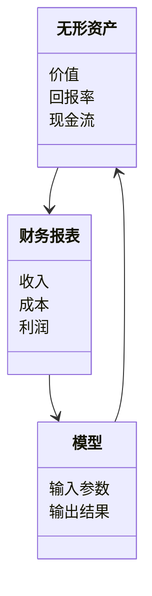

                 


# 彼得林奇对公司无形资产回报率的分析

> 关键词：彼得林奇，无形资产，回报率，投资分析，企业价值

> 摘要：本文深入分析了彼得·林奇对公司无形资产回报率的分析方法，探讨了其理论基础、评估模型和实际应用。通过详细阐述无形资产的定义、分类、评估方法以及彼得·林奇的分析框架，本文为投资者提供了实用的分析工具和方法。

---

## 第1章: 彼得·林奇与无形资产回报率概述

### 1.1 彼得·林奇的背景与投资理念

彼得·林奇是美国著名投资专家，曾任富达麦哲伦基金的经理，以管理大规模基金并取得卓越业绩而闻名。他的投资理念注重基本面分析，尤其是对公司无形资产的关注。他认为，无形资产是企业长期竞争优势的核心，能够为企业创造超额利润。

#### 1.1.1 彼得·林奇的生平简介

- **早年经历**：彼得·林奇于1949年出生在美国马萨诸塞州，曾在波士顿学院学习英语，后转学到耶鲁大学，并获得英语文学学士学位。
- **职业历程**：1974年加入富达投资，担任基金经理，管理麦哲伦基金，使其规模从1800万美元增长至140亿美元。
- **投资风格**：注重价值投资，偏好具有强大竞争优势和持续盈利能力的企业。

#### 1.1.2 彼得·林奇的投资哲学

彼得·林奇强调长期投资和深入研究企业基本面。他认为，投资者应关注企业的核心竞争力，尤其是无形资产的价值，因为这些资产能够为企业带来持续的收益。

#### 1.1.3 无形资产在投资中的重要性

无形资产包括专利、商标、品牌、客户关系、商誉等，这些资产难以量化，但对企业的市场地位和盈利能力具有重要影响。

---

### 1.2 无形资产的定义与分类

#### 1.2.1 无形资产的定义

无形资产是指企业拥有或控制的，没有实物形态的长期资产，通常包括知识产权、品牌价值、客户关系等。

#### 1.2.2 无形资产的主要分类

1. **知识产权**：专利、商标、版权。
2. **品牌价值**：强大的品牌能够为企业带来溢价收益。
3. **客户关系**：长期客户关系的价值。
4. **商誉**：企业整体价值超过有形净资产的部分。

#### 1.2.3 无形资产与有形资产的区别

| 特性 | 无形资产 | 有形资产 |
|------|-----------|-----------|
| 存在形式 | 抽象 | 实物 |
| 计量方式 | 难以量化 | 可以量化 |
| 生命周期 | 可能更长 | 受物理磨损影响 |

---

### 1.3 无形资产回报率的核心概念

#### 1.3.1 无形资产回报率的定义

无形资产回报率是指企业通过无形资产创造的收益与其投入的无形资产价值之间的比率。

#### 1.3.2 无形资产回报率的计算公式

$$\text{无形资产回报率} = \frac{\text{无形资产带来的收益}}{\text{无形资产的账面价值}}$$

#### 1.3.3 无形资产回报率的分析意义

- 评估无形资产的盈利能力。
- 识别企业的核心竞争力。
- 为投资决策提供依据。

---

### 1.4 彼得·林奇的分析框架

#### 1.4.1 林奇分析模型的构成

林奇的分析模型包括以下几个关键部分：

1. **核心竞争力分析**：评估企业的竞争优势。
2. **财务指标分析**：关注ROE、ROA等指标。
3. **无形资产评估**：分析企业的品牌、专利等无形资产价值。
4. **管理层能力评估**：评估管理层的决策能力和战略规划。

#### 1.4.2 林奇分析模型的步骤

1. **识别核心竞争力**：找出企业的独特优势。
2. **评估财务健康状况**：分析财务指标。
3. **评估无形资产价值**：计算无形资产回报率。
4. **评估管理层能力**：考察管理层的过往表现。

---

## 第2章: 无形资产的评估与分析方法

### 2.1 无形资产的评估方法

#### 2.1.1 市场法

市场法是通过比较类似企业的交易价格来评估无形资产价值的一种方法。

- **步骤**：收集类似企业的交易数据，计算目标企业的倍数。
- **公式**：$$\text{目标企业价值} = \text{可比企业平均倍数} \times \text{目标企业关键指标}$$

#### 2.1.2 收益法

收益法是通过预测未来现金流来评估资产价值的方法。

- **步骤**：预测未来现金流，折现计算现值。
- **公式**：$$\text{现值} = \sum_{t=1}^{n} \frac{\text{现金流}}{(1 + r)^t}$$

#### 2.1.3 成本法

成本法是通过计算资产的重置成本来评估其价值。

- **步骤**：估算重建相同资产的成本。
- **公式**：$$\text{资产价值} = \text{重置成本} \times \text{成新率}$$

---

### 2.2 无形资产回报率的计算公式

#### 2.2.1 净收益法

- **公式**：$$\text{净收益法} = \frac{\text{净利润}}{\text{无形资产价值}}$$

#### 2.2.2 投资回报率法

- **公式**：$$\text{投资回报率法} = \frac{\text{净收益}}{\text{初始投资}}$$

#### 2.2.3 股东权益法

- **公式**：$$\text{股东权益法} = \frac{\text{股东权益}}{\text{无形资产价值}}$$

---

### 2.3 彼得·林奇的分析技巧

#### 2.3.1 关键指标识别

- **核心指标**：ROE、ROA、净利率。
- **辅助指标**：研发投入、员工增长率。

#### 2.3.2 数据来源与处理

- **数据来源**：企业财务报表、行业报告。
- **数据处理**：清洗、标准化、建模。

#### 2.3.3 风险因素分析

- **行业风险**：市场竞争、政策变化。
- **企业风险**：管理不善、技术落后。

---

### 2.4 实际案例分析

#### 2.4.1 案例背景介绍

以苹果公司为例，分析其品牌价值和专利价值对回报率的影响。

#### 2.4.2 案例分析步骤

1. **数据收集**：苹果的品牌价值和专利数量。
2. **计算回报率**：$$\text{品牌价值回报率} = \frac{\text{品牌收入}}{\text{品牌价值}}$$
3. **分析结果**：品牌价值对苹果的盈利能力贡献显著。

---

## 第3章: 彼得·林奇的无形资产回报率评估模型

### 3.1 模型的构建与原理

#### 3.1.1 模型的基本假设

- 企业无形资产的价值可以通过其带来的收益进行评估。
- 企业经营环境稳定，无重大突发事件。

#### 3.1.2 模型的输入变量

- 无形资产价值。
- 未来现金流预测。
- 折现率。

#### 3.1.3 模型的输出结果

- 无形资产回报率。
- 投资价值评估。

---

### 3.2 模型的数学公式

#### 3.2.1 净现值公式

$$\text{净现值} = \sum_{t=1}^{n} \frac{\text{现金流}}{(1 + r)^t} - \text{初始投资}$$

#### 3.2.2 内部收益率公式

$$\text{内部收益率} = r \text{ 满足 } \sum_{t=1}^{n} \frac{\text{现金流}}{(1 + r)^t} = 0$$

#### 3.2.3 投资回收期公式

$$\text{投资回收期} = \frac{\text{初始投资}}{\text{年现金流}}$$

---

### 3.3 模型的实现步骤

#### 3.3.1 数据收集与整理

- 收集企业的财务报表。
- 获取行业研究报告。

#### 3.3.2 数据分析与处理

- 清洗数据。
- 建立模型参数。

#### 3.3.3 结果验证与优化

- 对比实际回报率。
- 调整模型参数。

---

## 第4章: 无形资产回报率的系统分析与架构设计

### 4.1 系统分析框架

#### 4.1.1 问题场景介绍

- 企业需要评估无形资产的价值。
- 投资者需要分析企业的回报率。

#### 4.1.2 领域模型设计（Mermaid类图）



#### 4.1.3 系统架构设计（Mermaid架构图）


---

## 第5章: 项目实战与最佳实践

### 5.1 项目实战

#### 5.1.1 环境安装

- 安装Python和相关库（如pandas、numpy）。

#### 5.1.2 核心实现源代码

```python
import pandas as pd

def calculate_roi(assets, revenue):
    return revenue / assets

assets = 1000000
revenue = 500000
roi = calculate_roi(assets, revenue)
print(f"无形资产回报率: {roi}")
```

#### 5.1.3 代码应用解读与分析

- 输入资产价值和收入。
- 计算回报率。
- 输出结果。

---

### 5.2 最佳实践 tips

1. **数据准确性**：确保数据来源可靠。
2. **模型选择**：根据实际情况选择合适的评估方法。
3. **持续监控**：定期更新模型参数和数据。

---

## 第6章: 总结与展望

### 6.1 总结

彼得·林奇的无形资产回报率分析方法为投资者提供了有效的工具，帮助识别企业的核心竞争力和长期价值。

### 6.2 展望

随着人工智能和大数据技术的发展，无形资产的评估方法将更加精准和多样化。

---

## 参考文献

1. 彼得·林奇. 《彼得·林奇的成功投资策略》
2. 财务报表分析相关书籍

---

通过以上结构和内容，本文全面分析了彼得·林奇的无形资产回报率分析方法，为投资者和企业提供了实用的分析工具和策略。

