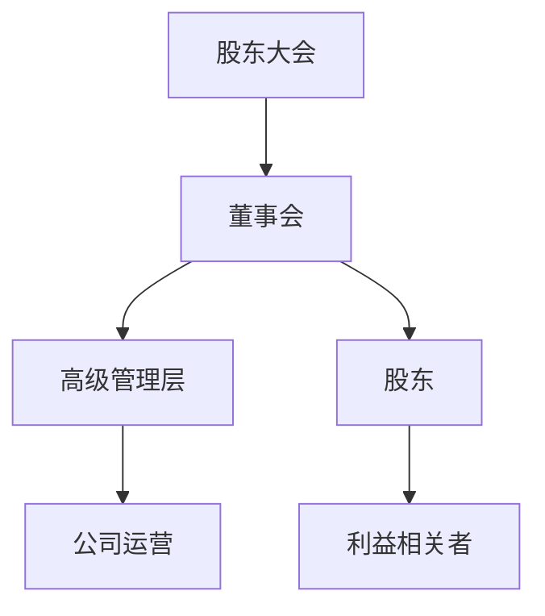

                 

# 彼得林奇对公司治理的要求

> 关键词：公司治理、彼得·林奇、投资决策、风险管理、董事会结构

> 摘要：本文探讨了彼得·林奇对公司治理的要求，分析了其对公司投资决策的影响，提供了评估与风险管理的策略，并通过实际案例说明了其治理标准的应用。

---

## 第一部分：公司治理的基础

### 第1章：公司治理的基本概念

#### 1.1 公司治理的定义与重要性
公司治理是确保公司有效运作和股东利益得到保护的机制。它涉及董事会、管理层和股东之间的关系，是公司长期成功的关键。

#### 1.2 公司治理的主要参与者
- **董事会**：负责监督公司战略和管理。
- **高级管理层**：执行董事会的决策。
- **股东与利益相关者**：提供资金并关注公司表现。

### 第2章：公司治理的结构与原则

#### 2.1 公司治理的结构
- **股东大会**：最高决策机构。
- **董事会**：执行股东大会的决策。
- **高级管理层**：具体执行公司运营。

#### 2.2 公司治理的原则
- **透明性**：确保信息对称。
- **责任制**：明确责任和问责。
- **利益相关者保护**：平衡不同利益相关者的权益。

---

## 第二部分：彼得·林奇的公司治理要求

### 第3章：彼得·林奇的治理标准

#### 3.1 董事会结构
- **独立性**：董事会成员应独立于管理层，避免利益冲突。
- **多样性**：董事会成员应来自不同背景，提供多元视角。

#### 3.2 高级管理层的责任
- **诚信与道德**：高管应以诚信为本，避免短期行为。
- **专业能力**：具备行业经验和管理能力。

### 第4章：股东权利与公司治理

#### 4.1 股东的基本权利
- **表决权**：参与重大决策。
- **监督权**：监督公司运营。
- **收益权**：获得合理分红。

#### 4.2 股东在公司治理中的角色
- **股东 activism**：积极行使权利，推动公司改进。
- **长期利益**：关注公司长期发展，而非短期收益。

---

## 第三部分：公司治理与投资决策

### 第5章：公司治理对投资决策的影响

#### 5.1 良好的公司治理如何影响投资决策
- **提高投资信心**：良好的治理结构使投资者更信任公司。
- **降低投资风险**：有效的治理能减少公司陷入危机的风险。
- **提升投资回报**：优秀治理通常伴随更高的股东价值。

### 第6章：彼得·林奇的投资标准与公司治理

#### 6.1 彼得·林奇的投资哲学
- **长期投资**：避免短期波动，关注长期价值。
- **价值投资**：寻找被市场低估的公司。
- **风险控制**：通过良好治理降低投资风险。

#### 6.2 公司治理在投资决策中的权重
- **重要性**：彼得·林奇认为治理是投资决策的关键因素。
- **评估标准**：通过治理结构、高管能力和股东权利评估公司。
- **改进措施**：建议公司加强治理结构，提升透明度。

---

## 第四部分：公司治理的评估与风险管理

### 第7章：公司治理的评估方法

#### 7.1 评估公司治理的框架
- **治理结构评估**：分析董事会结构和职责。
- **治理过程评估**：评估决策过程的透明度和责任。
- **治理结果评估**：通过公司绩效判断治理效果。

### 第8章：公司治理中的风险管理

#### 8.1 风险管理与公司治理的关系
- **风险管理的重要性**：有效的治理能降低公司面临的风险。
- **公司治理在风险管理中的作用**：通过监督和制衡机制减少风险。

#### 8.2 具体风险的管理策略
- **董事会风险管理**：定期评估风险，制定应对策略。
- **高级管理层风险管理**：确保高管具备风险管理能力。
- **股东风险管理**：通过股东 activism 提高风险管理意识。

---

## 第五部分：案例分析

### 第9章：彼得·林奇的经典投资案例

#### 9.1 成功案例分析
- **案例一**：某公司因良好的治理结构被林奇选中，成为其投资组合中的成功案例。
- **案例二**：分析林奇如何通过治理评估避免投资失败。

---

## 第六部分：投资者的实践

### 第10章：投资者的实践指南

#### 10.1 公司治理的评估工具
- 使用治理评分系统和指数工具评估公司。

#### 10.2 风险管理策略
- 制定风险管理计划，关注治理风险。

### 第11章：总结与展望

#### 11.1 彼得·林奇的贡献
- 彼得·林奇通过强调公司治理，为投资决策提供了新的视角。

#### 11.2 未来展望
- 公司治理将更加重要，投资者需持续关注治理动态。

---

## 结语

彼得·林奇的公司治理要求为投资者提供了宝贵的指导，强调治理结构、高管责任和股东权利的重要性。通过有效的治理，投资者可以降低风险，提升回报。未来，公司治理将继续演变，投资者需不断学习和适应，以抓住投资机会。

---

## 图表与公式

### 图表部分

### 公式部分

$$
\text{投资回报} = \text{公司治理质量} \times \text{公司绩效}
$$

---

通过以上结构，文章详细探讨了彼得·林奇的公司治理要求，结合理论和案例，为投资者提供了实用的指导。

