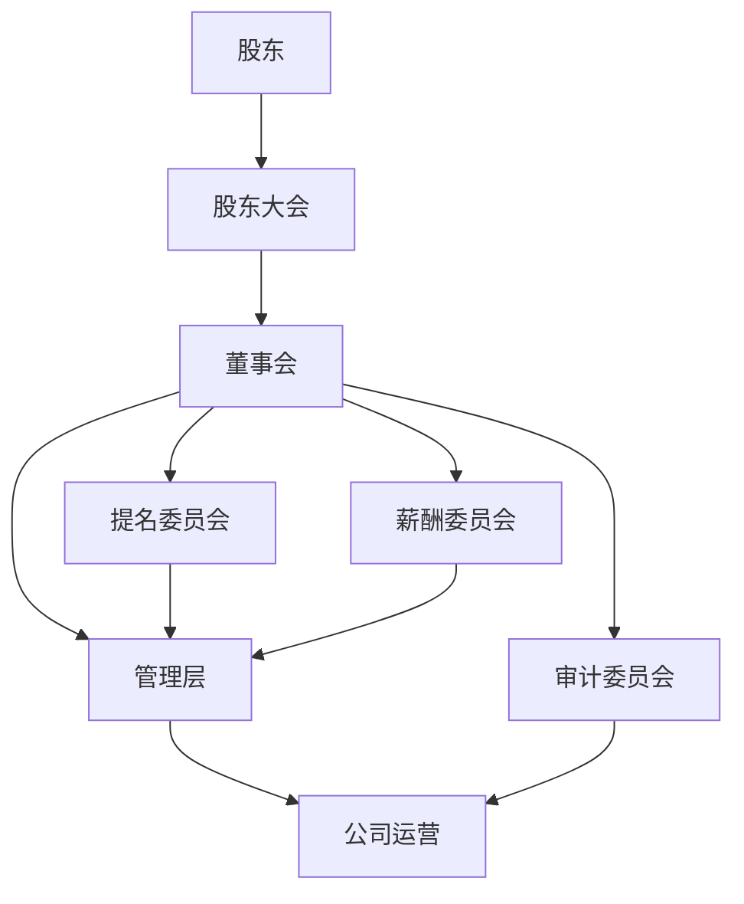
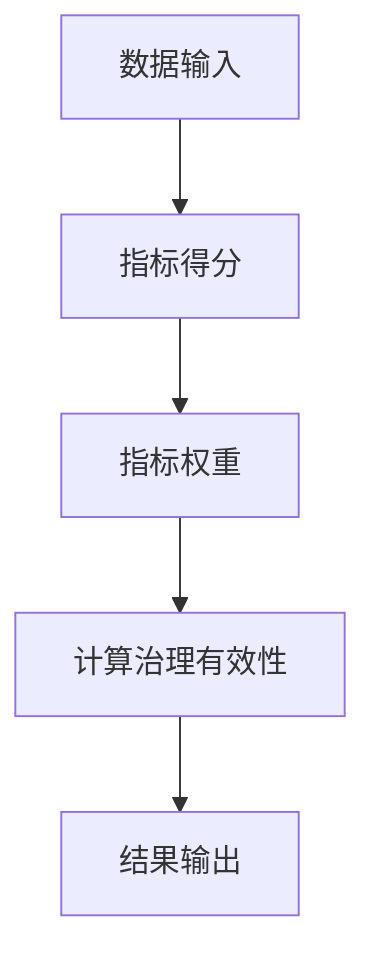
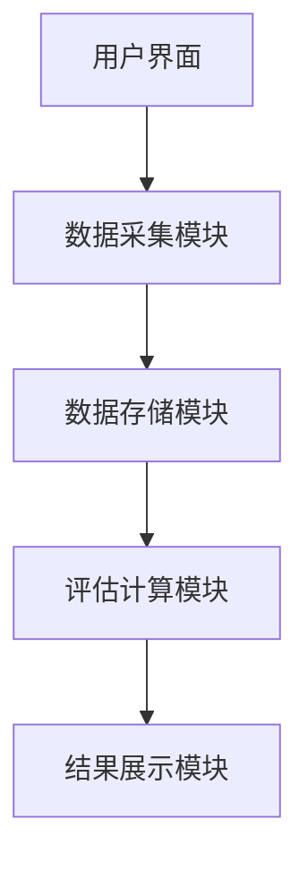
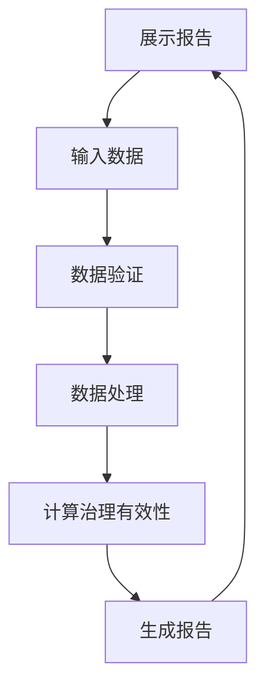

                 


# 彼得林奇对公司治理结构有效性的评估

> **关键词**：公司治理、彼得林奇、有效性评估、投资者视角、治理结构、评估指标、股东权益

> **摘要**：本文从投资者视角分析彼得·林奇对公司治理结构有效性的评估方法，探讨公司治理的核心要素及其对投资价值的影响。通过构建评估模型和系统架构，结合实际案例，提供详细的评估指标和最佳实践建议。

---

## 第一部分：背景介绍

### 第1章：公司治理结构的背景与概念

#### 1.1 公司治理的定义与特征

- **1.1.1 公司治理的定义**
  - 公司治理是确保公司有效运作、实现股东价值最大化的制度安排，涵盖董事会、管理层和利益相关者的权利与责任分配。
  
- **1.1.2 公司治理的核心特征**
  - 制衡性：防止权力滥用，确保各利益相关者权益。
  - 透明性：信息对称，增强信任。
  - 效率性：优化资源配置，提升公司绩效。

- **1.1.3 公司治理的边界与外延**
  - 公司治理不仅涉及内部管理，还包括与外部利益相关者的互动，如股东、债权人、客户和监管机构。

#### 1.2 公司治理结构的历史发展

- **1.2.1 传统公司治理模式**
  - 股东至上主义，董事会主要负责监督管理层，较少介入日常运营。

- **1.2.2 现代公司治理的演变**
  - 从“代理成本”理论出发，强调董事会的独立性和多样性，引入外部董事和独立董事。

- **1.2.3 当前公司治理的主要趋势**
  - ESG（环境、社会、治理）成为重要考量因素，利益相关者资本主义兴起。

#### 1.3 投资者视角下的公司治理重要性

- **1.3.1 投资者与公司治理的关系**
  - 投资者作为公司的重要利益相关者，通过股东大会、董事会等渠道影响公司治理。

- **1.3.2 公司治理对投资价值的影响**
  - 有效的公司治理能够降低代理成本，提升公司绩效，增强投资者信心。

- **1.3.3 投资者如何通过治理结构实现收益**
  - 投资者通过参与治理结构，如董事会席位、股东投票权，影响公司战略和决策。

---

### 第2章：公司治理结构的有效性评估

#### 2.1 评估的有效性背景

- 公司治理结构的有效性直接影响企业的长期价值和投资者的回报。
- 彼得·林奇作为价值投资的倡导者，强调公司治理在投资决策中的重要性。

---

## 第二部分：核心概念与联系

### 第2章：公司治理的核心要素与联系

#### 2.1 公司治理的核心要素分析

- **2.1.1 股东权利与义务**
  - 股东拥有投票权、知情权、分红权等权利，需履行出资义务，遵守公司章程。

- **2.1.2 董事会结构与职责**
  - 董事会负责制定战略，监督管理层，确保公司合规运营。

- **2.1.3 高管团队的激励机制**
  - 激励机制将高管利益与公司绩效绑定，提升管理效率。

#### 2.2 利益相关者的分析与平衡

- **2.2.1 利益相关者的权益平衡机制**
  - 公司治理需平衡股东、债权人、管理层、客户等多方利益，避免冲突。

- **2.2.2 利益相关者的动态变化**
  - 公司治理结构需适应利益相关者的变化，确保灵活性和适应性。

#### 2.3 公司治理结构与功能的实体关系图



---

## 第三部分：算法原理讲解

### 第3章：公司治理结构有效性的评估指标与模型

#### 3.1 评估指标的选择

- **股东权利保护指标**
  - 股东投票权、股东大会召开频率、股东提案权等。

- **董事会独立性与多样性**
  - 独立董事比例、董事会成员的性别和背景多样性。

- **高管激励与绩效挂钩**
  - 激励措施的类型（股票期权、奖金）与绩效考核指标的关联性。

#### 3.2 评估模型的构建与应用

- **模型假设**
  - 公司治理结构的有效性与企业绩效正相关。
  - 各评估指标对整体有效性的影响程度不同。

- **评估公式**
  $$\text{治理有效性} = \sum (\text{指标权重} \times \text{指标得分})$$

- **指标权重的确定**
  - 使用因子分析法或专家评分法确定各指标的权重。

#### 3.3 算法实现与代码示例

```python
import pandas as pd

# 假设数据为公司治理指标的得分
data = {
    '公司名称': ['公司A', '公司B', '公司C'],
    '股东权利保护': [8, 7, 9],
    '董事会独立性': [6, 8, 7],
    '高管激励': [5, 6, 8]
}

df = pd.DataFrame(data)

# 定义各指标的权重
weights = {
    '股东权利保护': 0.4,
    '董事会独立性': 0.3,
    '高管激励': 0.3
}

# 计算治理有效性
df['治理有效性'] = df.apply(lambda x: 
    weights['股东权利保护'] * x['股东权利保护'] +
    weights['董事会独立性'] * x['董事会独立性'] +
    weights['高管激励'] * x['高管激励'], axis=1)

print(df)
```

#### 3.4 算法流程图



---

## 第四部分：系统分析与架构设计

### 第4章：公司治理结构有效性的评估系统设计

#### 4.1 系统功能设计

- **功能模块**
  - 数据采集模块：收集公司治理指标数据。
  - 评估计算模块：根据模型计算治理有效性。
  - 结果展示模块：生成可视化报告。

#### 4.2 系统架构设计



#### 4.3 系统接口设计

- **输入接口**
  - 公司名称、治理指标数据。
  
- **输出接口**
  - 治理有效性评分、可视化报告。

#### 4.4 系统交互流程图



---

## 第五部分：项目实战

### 第5章：公司治理结构评估的项目实现

#### 5.1 环境安装与配置

- **工具安装**
  - 安装Python、Pandas、Mermaid工具。

- **数据来源**
  - 使用公开的公司治理数据，如证监会披露的信息。

#### 5.2 核心代码实现

```python
import pandas as pd
import matplotlib.pyplot as plt

# 数据加载
df = pd.read_csv('governance_data.csv')

# 模型计算
def calculate_governance_effectiveness(row):
    return row['股东权利保护'] * 0.4 + row['董事会独立性'] * 0.3 + row['高管激励'] * 0.3

df['治理有效性'] = df.apply(calculate_governance_effectiveness, axis=1)

# 可视化
plt.figure(figsize=(10,6))
plt.hist(df['治理有效性'], bins=10, alpha=0.7)
plt.xlabel('治理有效性评分')
plt.ylabel('公司数量')
plt.title('公司治理有效性分布')
plt.show()
```

#### 5.3 案例分析与结果解读

- **案例分析**
  - 公司A的治理有效性得分为7.2，属于良好水平。
  - 公司B的治理有效性得分为6.8，需改进。
  - 公司C的治理有效性得分为8.1，表现优异。

---

## 第六部分：最佳实践与小结

### 第6章：评估的有效性总结与投资者建议

#### 6.1 评估的有效性总结

- **评估的有效性**
  - 公司治理结构的有效性评估为投资者提供了决策依据，帮助识别高价值投资标的。

#### 6.2 投资者视角的建议

- **投资者建议**
  - 在投资决策中，优先考虑公司治理结构良好的企业。
  - 关注董事会独立性和高管激励机制，评估其与公司绩效的关联性。

#### 6.3 未来研究方向

- **研究方向**
  - 结合ESG因素，进一步完善公司治理评估模型。
  - 开发动态评估工具，适应利益相关者的动态变化。

---

## 附录

### 术语表

- **公司治理**：确保公司有效运作的制度安排。
- **治理有效性**：公司治理结构实现目标的程度。
- **利益相关者**：与公司相关的各方，包括股东、债权人等。

### 数据来源

- 公司治理数据：来自公开披露文件和监管报告。
- 指标数据：标准化评估数据。

### 工具安装指南

- **Mermaid**：安装Markdown编辑器支持，配置绘图工具。

---

通过以上结构和内容，读者可以系统地理解彼得·林奇对公司治理结构有效性的评估方法，掌握实际应用中的关键指标和工具，从而在投资决策中做出明智的选择。

