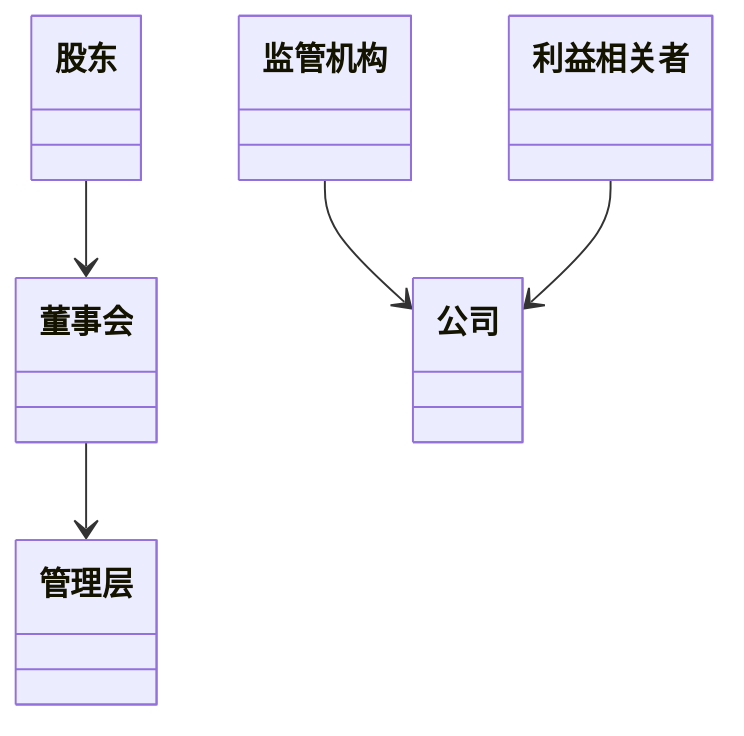
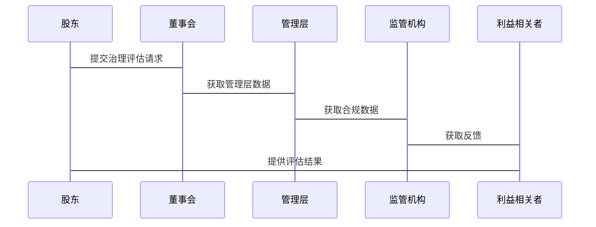

                 


# 彼得林奇对公司治理结构的要求

> 关键词：彼得·林奇，公司治理，投资理念，董事会，管理层，股东权益

> 摘要：本文深入分析了彼得·林奇对公司治理结构的要求，探讨了公司治理的核心要素、评估方法及其实现方式，结合实际案例，详细讲解了如何通过技术手段评估和优化公司治理结构。

---

# 第一部分: 公司治理结构与彼得·林奇投资理念的背景介绍

## 第1章: 公司治理结构的核心概念

### 1.1 公司治理的基本定义与要素

#### 1.1.1 公司治理的定义
公司治理是指通过一系列制度、政策和机制来确保公司有效运作、保护利益相关者权益的过程。它涉及董事会、管理层、股东、监管机构等多个主体之间的关系。

#### 1.1.2 公司治理的核心要素
公司治理的核心要素包括：
- **董事会**：负责制定公司战略和监督管理层。
- **管理层**：执行公司日常运营和战略。
- **股东**：拥有公司所有权，参与重大决策。
- **监管机构**：确保公司合规运作。

#### 1.1.3 公司治理的边界与外延
公司治理的边界在于其影响范围，通常包括公司内部管理、股东权益保护和外部监管。其外延则涉及企业社会责任、风险管理等方面。

### 1.2 彼得·林奇的投资理念与公司治理

#### 1.2.1 彼得·林奇的投资哲学
彼得·林奇是美国著名的基金经理，他强调长期投资和基本面分析。他认为，公司治理是决定公司长期价值的关键因素之一。

#### 1.2.2 林奇对公司治理的关注点
林奇关注以下公司治理要素：
- 董事会的独立性。
- 管理层的道德和能力。
- 股东权益的保护。

#### 1.2.3 公司治理结构对企业价值的影响
良好的公司治理能提升企业透明度、降低风险，从而提高企业价值。

## 第2章: 公司治理结构的核心要素与属性对比

### 2.1 公司治理结构的要素分析

#### 2.1.1 股东
股东是公司治理的核心主体之一，拥有决策权和监督权。

#### 2.1.2 董事会
董事会负责制定公司战略和监督管理层，是公司治理的关键机构。

#### 2.1.3 高级管理层
管理层负责日常运营，直接影响公司的执行效率和风险控制。

#### 2.1.4 监管机构与利益相关者
监管机构确保公司合规，利益相关者包括员工、客户等，影响公司治理的外部环境。

### 2.2 核心要素的属性对比

| 要素       | 职责与属性 |
|------------|------------|
| 股东       | 所有权、决策权、监督权 |
| 董事会     | 制定战略、监督管理层、独立性 |
| 管理层     | 执行战略、日常运营、效率与风险 |
| 监管机构   | 监督合规、确保透明度 |
| 利益相关者 | 提供反馈、影响公司决策 |

### 2.3 公司治理结构的ER实体关系图

```mermaid
er
    actor 股东
    actor 董事会
    actor 高级管理层
    actor 监管机构
    actor 利益相关者
    entity 公司
    entity 股权结构
    entity 治理政策
    entity 合同与协议
    股东 --> 股权结构
    董事会 --> 治理政策
    高级管理层 --> 治理政策
    监管机构 --> 合同与协议
    利益相关者 --> 公司
```

---

# 第二部分: 公司治理结构的评估与实现

## 第3章: 公司治理结构的评估方法

### 3.1 公司治理评估的指标体系

#### 3.1.1 财务指标
- 市盈率（P/E）：股价与每股收益的比率。
- 净资产收益率（ROE）：衡量公司盈利能力。
- 负债比率：评估公司财务风险。

#### 3.1.2 管理层评估指标
- 管理层稳定性：高管变动频率。
- 管理层决策能力：历史决策的正确性。

#### 3.1.3 董事会评估指标
- 独立董事比例：董事会中独立董事的数量。
- 董事会会议频率：董事会召开的次数和质量。

### 3.2 财务指标分析

#### 3.2.1 市盈率公式
市盈率 = 股价 / 每股收益

#### 3.2.2 净资产收益率公式
ROE = 净利润 / 平均净资产

#### 3.2.3 负债比率公式
负债比率 = 总负债 / 总资产

### 3.3 管理层质量评估

#### 3.3.1 管理层稳定性
- 数据来源：公司公告、新闻报道。
- 分析方法：计算高管变动频率。

#### 3.3.2 管理层决策能力
- 数据来源：公司历史财务数据。
- 分析方法：对比公司实际表现与管理层承诺。

### 3.4 董事会独立性评估

#### 3.4.1 独立董事比例
- 数据来源：公司治理报告。
- 分析方法：计算独立董事占董事会的比例。

#### 3.4.2 董事会会议频率
- 数据来源：公司公告。
- 分析方法：统计董事会会议次数。

## 第4章: 公司治理结构的算法实现

### 4.1 算法原理讲解

#### 4.1.1 数据获取与预处理
- 数据来源：公司财务报表、治理报告。
- 数据清洗：处理缺失值、异常值。

#### 4.1.2 指标计算
- 计算市盈率、ROE等财务指标。
- 计算管理层和董事会的评估指标。

#### 4.1.3 评估与排序
- 根据指标对公司在治理结构方面进行评分和排序。

### 4.2 算法实现的代码示例

```python
import pandas as pd

# 数据预处理
df = pd.read_csv('governance.csv')
df.dropna(inplace=True)

# 计算市盈率
df['市盈率'] = df['股价'] / df['每股收益']

# 计算净资产收益率
df['ROE'] = df['净利润'] / df['平均净资产']

# 计算负债比率
df['负债比率'] = df['总负债'] / df['总资产']

# 管理层稳定性评估
df['管理层稳定性'] = 1 - (df['高管变动次数'] / df['高管总数'])

# 董事会独立性评估
df['独立董事比例'] = df['独立董事数量'] / df['董事会总人数']

# 根据评分排序
df['治理评分'] = df['市盈率'] * 0.3 + df['ROE'] * 0.3 + df['负债比率'] * 0.2 + df['独立董事比例'] * 0.2
df = df.sort_values('治理评分', ascending=False)
```

### 4.3 数学模型与公式

#### 4.3.1 市盈率计算公式
$$ P/E = \frac{\text{股价}}{\text{每股收益}} $$

#### 4.3.2 净资产收益率计算公式
$$ ROE = \frac{\text{净利润}}{\text{平均净资产}} $$

#### 4.3.3 治理评分公式
$$ \text{治理评分} = 0.3 \times P/E + 0.3 \times ROE + 0.2 \times \text{负债比率} + 0.2 \times \text{独立董事比例} $$

---

# 第三部分: 系统分析与架构设计

## 第5章: 公司治理结构的系统分析

### 5.1 问题场景介绍

#### 5.1.1 问题背景
分析和优化公司治理结构，确保公司合规、高效运作。

#### 5.1.2 项目目标
开发一个公司治理结构评估系统，帮助投资者评估公司治理质量。

### 5.2 系统功能设计

#### 5.2.1 领域模型


#### 5.2.2 系统架构设计


#### 5.2.3 系统接口设计
- API接口：GET /governance/rating
- 数据格式：JSON

### 5.3 系统交互设计



---

# 第四部分: 项目实战

## 第6章: 项目实战与案例分析

### 6.1 环境安装与配置

#### 6.1.1 安装Python与相关库
```bash
pip install pandas requests matplotlib
```

#### 6.1.2 数据获取
从公开数据源获取公司治理数据，如CSV格式。

### 6.2 核心代码实现

#### 6.2.1 数据预处理
```python
import pandas as pd

df = pd.read_csv('governance.csv')
df = df.dropna()
```

#### 6.2.2 计算指标
```python
df['市盈率'] = df['股价'] / df['每股收益']
df['ROE'] = df['净利润'] / df['平均净资产']
df['负债比率'] = df['总负债'] / df['总资产']
df['独立董事比例'] = df['独立董事数量'] / df['董事会总人数']
df['治理评分'] = 0.3 * df['市盈率'] + 0.3 * df['ROE'] + 0.2 * df['负债比率'] + 0.2 * df['独立董事比例']
```

#### 6.2.3 可视化分析
```python
import matplotlib.pyplot as plt

plt.bar(df['公司名称'], df['治理评分'])
plt.xticks(rotation=45)
plt.xlabel('公司名称')
plt.ylabel('治理评分')
plt.title('公司治理评分分布')
plt.show()
```

### 6.3 案例分析与总结

#### 6.3.1 实际案例分析
以某公司为例，分析其治理结构，计算治理评分，对比行业平均水平。

#### 6.3.2 项目总结
通过技术手段评估公司治理结构，为投资者提供数据支持，帮助做出更明智的投资决策。

---

# 第五部分: 最佳实践与总结

## 第7章: 最佳实践与小结

### 7.1 小结

- 公司治理结构是决定企业长期价值的关键因素。
- 彼得·林奇的投资理念强调了治理结构的重要性。
- 通过技术手段评估治理结构，能为投资者提供有力支持。

### 7.2 注意事项

- 数据来源的可靠性影响评估结果。
- 指标权重需根据实际情况调整。
- 结合多维度分析，避免单一指标误导。

### 7.3 拓展阅读

- 彼得·林奇的《投资最重要的事情》。
- 公司治理相关的学术文献。

---

通过本文的详细分析和实战指导，读者可以深入了解彼得·林奇对公司治理结构的要求，并通过技术手段实现对公司治理的评估与优化。

