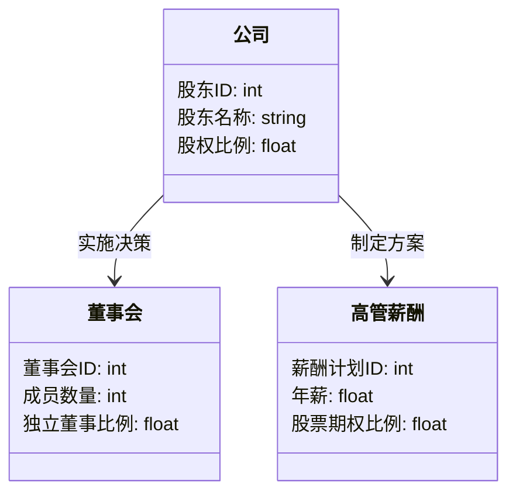

                 


# 彼得林奇对公司治理结构的评估标准

## 关键词：彼得·林奇，公司治理，评估标准，董事会结构，高管薪酬，股权结构，投资评估

## 摘要：本文深入探讨了彼得·林奇对公司治理结构的评估标准，分析了其核心概念、算法原理、系统架构设计，并通过实际案例展示了如何应用这些标准进行投资决策。文章结构清晰，内容丰富，结合图表和代码示例，帮助读者全面理解公司治理结构的重要性及其对投资的影响。

---

## 第一部分: 公司治理结构与彼得·林奇的评估标准概述

### 第1章: 公司治理结构的基本概念

#### 1.1 公司治理的基本定义与核心要素

##### 1.1.1 公司治理的定义与内涵

公司治理是确保公司有效运作和长期发展的管理机制。它涉及股东、董事会、高管、利益相关者和公司之间的关系。良好的公司治理能够优化资源配置、降低风险、提升企业绩效。

##### 1.1.2 公司治理结构的核心要素

公司治理结构由以下几个核心要素组成：

1. **股权结构**：股东的持股比例和类型，决定股东的权力和责任。
2. **董事会结构**：董事会的组成、职责和独立性，确保战略制定和监督。
3. **高管薪酬机制**：高管的薪酬设计，激励与绩效挂钩。
4. **透明度与披露**：公司信息公开程度，影响投资者信任。
5. **风险管理与内部控制**：公司防范和应对风险的机制。

##### 1.1.3 公司治理与企业绩效的关系

公司治理结构直接影响企业绩效。有效的治理能够提升管理效率、降低代理成本，从而为企业创造更多价值。

#### 1.2 彼得·林奇与投资评估标准

##### 1.2.1 彼得·林奇的投资者背景与投资理念

彼得·林奇是美国著名的投资经理，管理过麦哲伦基金，以长期投资和深入研究著称。他强调基本面分析，关注企业的财务状况和管理能力。

##### 1.2.2 林奇对公司治理的关注点

林奇认为，公司治理是评估企业的重要标准。他关注董事会的独立性、高管的激励机制、股权结构的合理性等。

##### 1.2.3 林奇评估标准的理论基础

林奇的评估标准基于公司治理的效率和透明度，强调管理层的问责制和股东的权益保护。

---

### 第2章: 彼得·林奇评估标准的核心概念

#### 2.1 公司治理结构的优缺点对比

##### 2.1.1 股权结构的优缺点

- **优点**：集中控制，决策高效；分散风险，吸引多元化投资。
- **缺点**：可能导致控股股东滥用权力，利益冲突。

##### 2.1.2 董事会结构的优缺点

- **优点**：提供专业建议，监督管理层；多元化视角，降低决策风险。
- **缺点**：可能增加管理复杂性，独立董事成本高昂。

##### 2.1.3 高管薪酬机制的优缺点

- **优点**：激励高管与公司利益一致；提升绩效，促进企业发展。
- **缺点**：可能导致过度冒险，短期目标优先。

#### 2.2 核心概念原理与联系

##### 2.2.1 公司治理结构的ER实体关系图

```mermaid
er
    entity 公司 {
        key 股东ID
        attribute 股东名称, 股权比例
    }
    entity 董事会 {
        key 董事会ID
        attribute 董事会成员数量, 独立董事比例
    }
    entity 高管薪酬 {
        key 薪酬计划ID
        attribute 年薪, 股票期权比例
    }
    公司 --> 董事会: 实施董事会决策
    公司 --> 高管薪酬: 制定高管薪酬方案
```

---

## 第3章: 彼得·林奇评估标准的算法原理

### 3.1 评估模型的流程与步骤

#### 3.1.1 数据采集与清洗

从财务报表、新闻报道、监管文件中收集数据，清洗无效或错误数据。

#### 3.1.2 指标计算与分析

计算ROE、ROA、负债率等指标，分析公司财务健康状况。

#### 3.1.3 评估结果的分类与判断

根据指标结果，将公司治理结构分为优秀、良好、一般、较差四个等级。

### 3.2 算法原理的Python实现

#### 3.2.1 数据处理代码

```python
import pandas as pd
import numpy as np

# 示例数据
data = {
    '公司名称': ['公司A', '公司B', '公司C'],
    'ROE': [0.15, 0.1, 0.2],
    'ROA': [0.05, 0.03, 0.08],
    '负债率': [0.4, 0.5, 0.3]
}

df = pd.DataFrame(data)

# 计算公司治理评分
def governance_score(row):
    roe_weight = 0.4
    roa_weight = 0.3
    leverage_weight = 0.3
    score = row['ROE'] * roe_weight + row['ROA'] * roa_weight + (1 - row['负债率']) * leverage_weight
    return score

df['治理评分'] = df.apply(governance_score, axis=1)
print(df)
```

#### 3.2.2 评估结果分类

```python
分类结果：
治理评分 >= 0.7: 优秀
0.5 <= 治理评分 < 0.7: 良好
0.3 <= 治理评分 < 0.5: 一般
治理评分 < 0.3: 较差
```

---

## 第4章: 数学模型与公式分析

### 4.1 核心数学模型

林奇的评估标准可以表示为一个加权评分系统：

$$
\text{治理评分} = \alpha \times \text{ROE} + \beta \times \text{ROA} + \gamma \times (1 - \text{负债率})
$$

其中，$\alpha = 0.4$，$\beta = 0.3$，$\gamma = 0.3$。

### 4.2 公式解读

- **ROE（净资产收益率）**：衡量公司盈利能力，权重较高。
- **ROA（资产回报率）**：衡量资产使用效率，权重中等。
- **负债率**：衡量财务风险，权重中等。

---

## 第5章: 系统分析与架构设计

### 5.1 问题场景介绍

假设我们有一个包含多家公司的数据集，需要评估每家公司的治理结构。

### 5.2 系统功能设计

#### 5.2.1 领域模型Mermaid类图



### 5.3 系统架构设计

#### 5.3.1 系统架构Mermaid图


---

## 第6章: 项目实战

### 6.1 环境安装

安装必要的Python库：

```bash
pip install pandas numpy matplotlib
```

### 6.2 核心代码实现

```python
import pandas as pd
import numpy as np

# 示例数据
data = {
    '公司名称': ['A', 'B', 'C'],
    'ROE': [0.15, 0.1, 0.2],
    'ROA': [0.05, 0.03, 0.08],
    '负债率': [0.4, 0.5, 0.3]
}

df = pd.DataFrame(data)

# 定义评估函数
def evaluate_governance(row):
    roe = row['ROE']
    roa = row['ROA']
    leverage = row['负债率']
    score = 0.4 * roe + 0.3 * roa + 0.3 * (1 - leverage)
    if score >= 0.7:
        return '优秀'
    elif 0.5 <= score < 0.7:
        return '良好'
    elif 0.3 <= score < 0.5:
        return '一般'
    else:
        return '较差'

# 应用评估函数
df['评估结果'] = df.apply(evaluate_governance, axis=1)
print(df)
```

### 6.3 实际案例分析

以公司A为例：

- ROE = 15%，ROA = 5%，负债率 = 40%
- 计算得分：0.4*0.15 + 0.3*0.05 + 0.3*(1-0.4) = 0.06 + 0.015 + 0.18 = 0.255
- 评估结果：一般

---

## 第7章: 最佳实践与小结

### 7.1 小结

彼得·林奇的评估标准通过关注公司治理的核心要素，帮助投资者识别优质企业。本文通过理论分析、算法设计和实战案例，详细展示了如何应用这些标准进行投资决策。

### 7.2 注意事项

- 数据质量影响评估结果，需确保数据来源可靠。
- 不同行业可能需要调整权重，需根据实际情况进行调整。
- 定期更新数据和模型，以适应市场变化。

### 7.3 拓展阅读

建议阅读《彼得·林奇的投资哲学》和《公司治理与企业绩效》等书籍，深入了解相关理论和实践。

---

## 结语

通过本文的分析，读者可以掌握彼得·林奇的公司治理评估标准，并在实际投资中灵活运用。希望本文能为您提供有价值的见解和方法，助您在投资领域取得成功。

