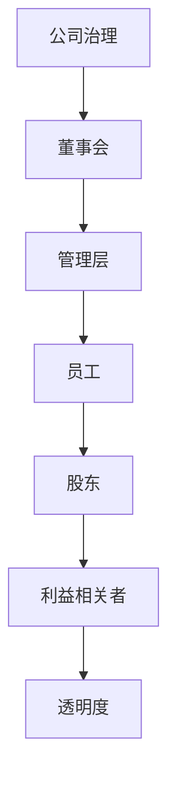

                 


# 彼得林奇对公司治理透明度的要求

## 关键词：公司治理，透明度，彼得·林奇，投资决策，企业价值

## 摘要：  
彼得·林奇作为投资界的传奇人物，强调透明度在公司治理中的重要性。本文将详细探讨透明度对公司治理的影响，分析彼得·林奇提出的透明度要求，及其对投资决策和企业价值的具体影响。通过理论分析和实际案例，本文将深入解读透明度的核心概念、衡量标准、提升策略，并结合数学模型和系统架构，为读者提供全面的理解和实践指导。

---

## 第一章: 公司治理透明度的背景与重要性

### 1.1 公司治理的基本概念  
公司治理是确保公司有效运作、实现股东价值最大化的制度安排。其核心在于明确董事会、管理层和利益相关者的角色与责任。  

#### 1.1.1 公司治理的定义  
公司治理是公司内部权力分配、决策制定和监督控制的机制。它涵盖了董事会结构、高管职责、股东权利等方面。  

#### 1.1.2 公司治理的核心要素  
- 董事会：作为公司治理的核心，董事会负责监督公司战略、财务和管理层的表现。  
- 高管团队：负责日常运营和战略执行。  
- 股东：拥有公司股权，享有收益分配和投票权。  
- 利益相关者：包括员工、客户、供应商和监管机构。  

#### 1.1.3 公司治理的演进历程  
从传统的股东至上主义到利益相关者资本主义，公司治理的理念不断演变。现代公司治理更加注重透明度、问责制和可持续发展。  

### 1.2 透明度的定义与内涵  
透明度是公司治理的关键原则之一，指公司向股东、投资者和其他利益相关者公开信息的意愿和能力。  

#### 1.2.1 透明度的定义  
透明度是公司信息的公开性、准确性和及时性的体现。它是建立信任和责任感的基石。  

#### 1.2.2 透明度的核心属性  
- **公开性**：公司必须主动披露关键信息，避免隐瞒或误导。  
- **准确性**：信息必须真实反映公司的财务状况和经营成果。  
- **及时性**：公司应及时发布信息，确保利益相关者能够及时做出决策。  

#### 1.2.3 透明度与公司治理的关系  
透明度是公司治理的润滑剂。高透明度的公司更容易获得投资者的信任，从而降低融资成本，提升企业价值。  

### 1.3 彼得·林奇与透明度的关联  
彼得·林奇是美国著名投资经理，以其在富达基金的卓越表现闻名。他强调透明度在投资决策中的重要性，认为透明的公司治理是长期投资成功的关键。  

#### 1.3.1 彼得·林奇的背景介绍  
彼得·林奇是富达投资集团的前董事长，以其在股票投资领域的卓越表现著称。他倡导基本面分析和长期投资策略，注重公司的财务健康和管理团队的透明度。  

#### 1.3.2 彼得·林奇对透明度的关注  
林奇认为，透明的公司治理能够帮助投资者更好地评估公司的风险和潜力。他特别关注公司的财务报表、管理层决策和股东沟通的透明性。  

#### 1.3.3 透明度与企业价值的关系  
透明度高的公司更容易获得投资者的信任，从而在市场中享有更高的估值。林奇的研究表明，透明度与企业价值呈正相关关系。  

---

## 第二章: 透明度的核心概念与联系

### 2.1 透明度的核心原理  
透明度的实现依赖于公司内部和外部的信息共享机制。公司需要建立有效的信息披露流程，确保信息的准确性和及时性。  

#### 2.1.1 透明度的实现机制  
- **信息收集**：公司内部生成的关键信息，如财务数据、经营计划等。  
- **信息处理**：通过内部审核和合规检查，确保信息的准确性和完整性。  
- **信息共享**：通过定期报告、股东大会和投资者沟通会等形式，向利益相关者披露信息。  

#### 2.1.2 透明度的衡量标准  
透明度的衡量标准包括定量和定性指标。定量指标如信息披露的及时性和完整性，定性指标如信息的可理解性和可比性。  

#### 2.1.3 透明度的动态性分析  
透明度不是一成不变的，它受到公司内外部环境的影响。例如，行业监管政策的变化或公司战略调整可能会影响透明度的实现。  

### 2.2 透明度与公司治理的实体关系图  



从上图可以看出，透明度贯穿于公司治理的各个环节，是连接公司内部和外部利益相关者的桥梁。  

### 2.3 透明度的属性特征对比表  

| 属性       | 特征 |
|------------|------|
| 信息共享   | 公开性、及时性、准确性 |
| 决策过程   | 可见性、参与性、可追溯性 |
| 问责机制   | 明确性、可执行性、公平性 |

---

## 第三章: 透明度的算法原理与数学模型

### 3.1 透明度评估的算法原理  

#### 3.1.1 信息收集与处理  
透明度评估的第一步是收集公司相关的财务数据、管理层决策记录和股东沟通资料。这些数据需要经过清洗和预处理，确保其准确性和一致性。  

#### 3.1.2 评估指标计算  
透明度评估通常基于多个指标，如信息披露的完整性、及时性和可理解性。  

#### 3.1.3 透明度评分  
通过加权计算各指标的得分，得出透明度的综合评分。  

### 3.2 透明度评分的数学模型  

透明度评分公式如下：  
$$  
透明度评分 = \sum_{i=1}^{n} w_i \cdot x_i  
$$  
其中，$w_i$ 是指标权重，$x_i$ 是指标得分。  

例如，假设信息披露完整性占40%，及时性占30%，可理解性占30%。某公司的得分为：  
$$  
透明度评分 = 0.4 \times 0.9 + 0.3 \times 0.8 + 0.3 \times 0.7 = 0.36 + 0.24 + 0.21 = 0.81  
$$  

### 3.3 透明度提升的优化算法  

#### 3.3.1 问题场景介绍  
假设某公司透明度评分为0.6，希望通过优化公司治理结构和信息披露机制，提升透明度评分至0.8。  

#### 3.3.2 算法步骤  
1. **分析透明度低的原因**：如信息披露不及时、管理层决策不透明等。  
2. **制定改进措施**：如增加定期信息披露、优化董事会结构等。  
3. **模拟评分提升**：通过调整权重和指标得分，预测透明度评分的提升效果。  

#### 3.3.3 算法实现  

```python
def calculate_transparency_score(weights, scores):
    return sum(w * s for w, s in zip(weights, scores))

# 示例
weights = [0.4, 0.3, 0.3]
scores = [0.9, 0.8, 0.7]
score = calculate_transparency_score(weights, scores)
print(score)  # 输出：0.81
```

---

## 第四章: 提升公司治理透明度的策略

### 4.1 制定透明的决策流程  
公司应建立透明的决策流程，确保管理层的决策过程公开透明。例如，董事会会议记录和决策依据应向股东公开。  

### 4.2 建立有效的信息披露机制  
公司应制定定期的信息披露计划，确保财务报表、重大事件和战略规划的及时披露。  

### 4.3 加强内部和外部监督  
公司应建立内部审计部门和外部审计机构，确保信息披露的真实性和完整性。  

---

## 第五章: 结论与展望

### 5.1 总结  
彼得·林奇的透明度要求为公司治理提供了重要的指导。透明的公司治理不仅能够提升企业价值，还能增强投资者的信任和信心。  

### 5.2 未来展望  
随着数字化技术的发展，公司治理透明度的实现将更加智能化和高效化。例如，区块链技术可以用于确保信息的不可篡改性和透明性。  

### 5.3 最佳实践 Tips  
- 定期进行透明度评估，发现问题并及时改进。  
- 加强利益相关者的沟通，建立双向的信息共享机制。  
- 培养透明文化，从管理层到员工都重视透明度的重要性。  

---

通过以上分析，我们可以看到，彼得·林奇对公司治理透明度的要求不仅是一个理论问题，更是一个实践问题。只有通过持续的努力和优化，公司才能在透明度方面做到真正意义上的提升。

