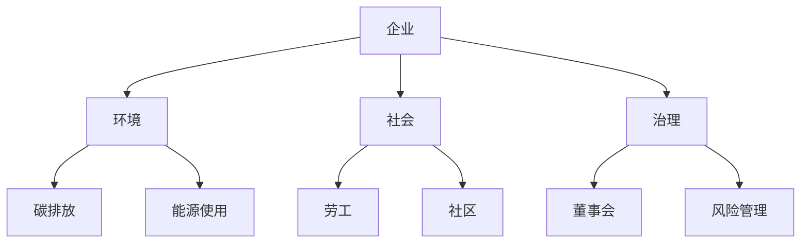
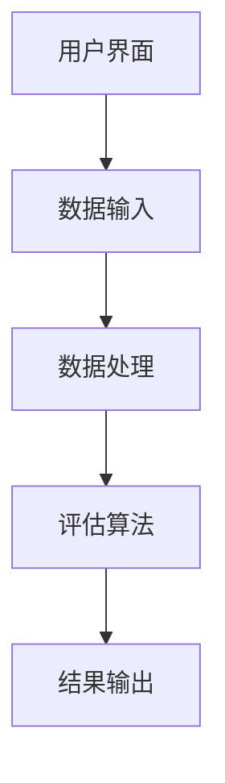
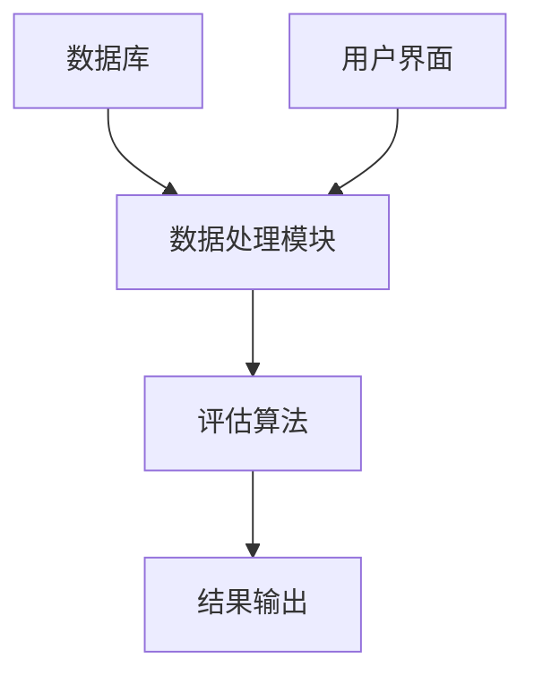
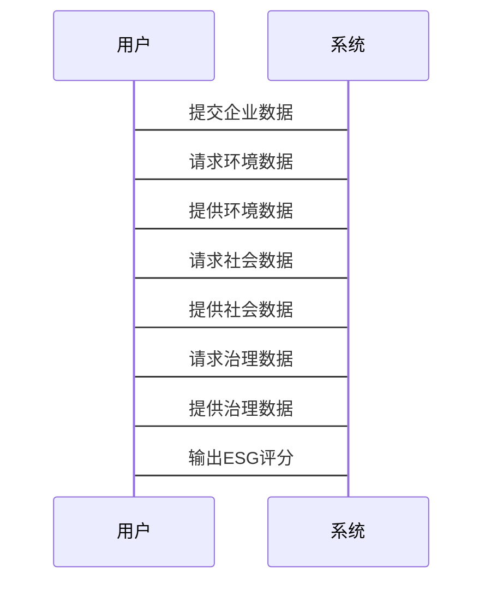

                 


# 彼得林奇对公司环境社会治理(ESG)报告的质量评估

> 关键词：ESG报告，质量评估，彼得林奇，环境社会治理，投资策略

> 摘要：本文详细探讨了彼得林奇在对公司环境社会治理(ESG)报告进行质量评估时的方法和策略。通过分析ESG的核心概念、评估算法、数学模型、系统架构以及实际案例，本文为读者提供了从理论到实践的全面指南，帮助投资者和企业更好地理解和应用ESG评估。

---

# 第一部分: 公司环境社会治理(ESG)报告的质量评估背景介绍

## 第1章: 公司环境社会治理(ESG)报告的基本概念

### 1.1 什么是ESG
ESG（Environmental, Social, Governance）是指企业在环境、社会和公司治理方面的表现。这三方面共同构成了企业的可持续发展能力，是投资者评估企业价值的重要指标。

- **环境（Environmental）**：包括企业的碳排放、能源使用效率、环保合规性等。
- **社会（Social）**：涉及企业对员工权益的保护、社区关系、产品安全等方面。
- **治理（Governance）**：关注企业的董事会结构、高管薪酬、风险管理等内部管理机制。

### 1.2 ESG报告的重要性
ESG报告不仅是企业履行社会责任的体现，也是投资者做出明智决策的重要依据。通过ESG报告，投资者可以评估企业在可持续发展方面的表现，从而做出更符合长期利益的投资决策。此外，ESG评估也是推动全球可持续发展目标的重要工具。

### 1.3 彼得林奇的ESG评估方法
彼得林奇是著名投资家，他的投资策略以基本面分析著称。他强调企业治理、管理层素质和财务健康状况。在ESG评估中，他注重企业治理结构、管理层决策透明度以及企业对环境和社会问题的应对能力。他的方法注重长期价值，而非短期收益。

---

## 第2章: 彼得林奇与ESG评估的结合

彼得林奇的投资策略强调对企业基本面的深入分析，而ESG评估为企业基本面提供了新的维度。他通过分析企业的ESG表现，进一步筛选出具备长期增长潜力的企业。

- **企业治理**：彼得林奇关注董事会结构和高管激励机制，确保管理层的利益与股东利益一致。
- **环境表现**：他关注企业在环保方面的投入和合规性，认为这反映了企业的社会责任感和长期发展潜力。
- **社会影响**：彼得林奇认为，企业对社会的贡献体现了其社会价值，也是企业声誉的重要组成部分。

---

# 第二部分: ESG报告质量评估的核心概念与联系

## 第3章: ESG核心概念的原理与联系

### 3.1 ESG三要素的内在联系
ESG的三个维度相互关联，共同影响企业的整体表现。例如，良好的环境表现（如减少碳排放）可以提升企业的社会声誉，从而增强投资者对企业的信任。同时，高效的公司治理能够确保环境和社会目标的有效实施。

### 3.2 ESG与企业价值的关系
企业ESG表现与其市场价值密切相关。研究表明，ESG表现优异的企业通常具有更高的股价稳定性，且在危机中的抗风险能力更强。彼得林奇认为，长期来看，ESG表现优秀的企业更有可能实现可持续增长，从而为投资者带来超额收益。

### 3.3 ESG与企业风险管理的关联
良好的ESG表现能够降低企业的经营风险。例如，有效的环境管理可以减少环保罚款，而优秀的社会表现可以提升品牌形象，降低声誉风险。彼得林奇在评估企业时，特别关注这些潜在风险因素，认为它们对企业长期价值有重要影响。

---

## 第4章: ESG评估的指标体系

### 4.1 环境指标
- **碳排放**：企业单位产出的碳排放量及其减排目标。
- **能源使用效率**：单位能源消耗产出的产品数量。
- **环境合规性**：企业是否遵守环保法规，是否有环保记录。

### 4.2 社会指标
- **劳工权益**：员工工资、工作条件、劳动权益保护。
- **社区关系**：企业在社区中的贡献，如公益捐赠、社区参与。
- **产品安全与社会责任**：产品是否符合安全标准，是否履行社会责任。

### 4.3 治理指标
- **董事会结构**：董事会成员的多样性、独立董事比例。
- **高管薪酬与股权激励**：高管的薪酬结构是否合理，股权激励是否有效绑定高管利益。
- **内部审计与风险管理**：企业是否建立了完善的内部审计机制和风险管理流程。

---

## 第5章: ESG评估的实体关系图

以下是一个简化的ESG实体关系图，展示了企业与其环境、社会、治理三个维度的关系：



---

# 第三部分: ESG报告质量评估的算法原理

## 第6章: ESG评分算法概述

### 6.1 ESG评分的基本原理
ESG评分通常基于对企业的环境、社会和治理表现的综合评估。彼得林奇的ESG评估方法结合了定量分析和定性分析，确保评估结果的客观性和全面性。

#### 6.1.1 层次分析法（AHP）
层次分析法是一种常用的决策分析方法，适用于多指标综合评价。以下是其基本步骤：

1. **确定决策目标**：明确评估的目标，例如评估企业的ESG表现。
2. **构建层次结构**：将评估目标分解为多个子目标，例如环境、社会、治理三个维度。
3. **建立判断矩阵**：根据专家意见，确定各子目标的相对重要性。
4. **计算权重**：通过一致性检验，计算各子目标的权重。
5. **计算综合评分**：根据各子目标的权重和评分，计算综合评分。

#### 6.1.2 彼得林奇ESG评分模型
彼得林奇的ESG评分模型结合了定量和定性因素，以下是一个简化的模型：

$$ \text{ESG评分} = w_e \times \text{环境得分} + w_s \times \text{社会得分} + w_g \times \text{治理得分} $$

其中，$w_e$、$w_s$、$w_g$分别是环境、社会、治理三个维度的权重。

---

## 第7章: ESG评估的数学模型

### 7.1 加权评分模型
以下是加权评分模型的具体公式：

$$ \text{总评分} = \sum_{i=1}^{n} w_i \times s_i $$

其中，$w_i$是第$i$个维度的权重，$s_i$是第$i$个维度的评分。

### 7.2 层次分析法权重计算

层次分析法的权重计算通常涉及一致性检验和特征值计算。以下是简化步骤：

1. **构建判断矩阵**：根据专家意见，构建各维度的重要性的判断矩阵。
2. **计算特征值和特征向量**：通过数学方法计算判断矩阵的最大特征值及其对应的特征向量。
3. **一致性检验**：验证判断矩阵的一致性，确保评估结果的有效性。
4. **计算权重**：将特征向量标准化，得到各维度的权重。

---

## 第8章: ESG评估的系统架构设计

### 8.1 系统功能设计
以下是一个ESG评估系统的功能模块图：



### 8.2 系统架构设计
以下是系统的架构图：



### 8.3 接口设计与交互流程
以下是一个典型的用户与系统交互流程：



---

## 第9章: ESG评估的项目实战

### 9.1 环境数据收集与处理
以下是环境数据处理的Python代码示例：

```python
import pandas as pd

# 读取环境数据
env_data = pd.read_csv('environment.csv')

# 计算碳排放强度
env_data['碳排放强度'] = env_data['碳排放'] / env_data['产量']

# 输出结果
print(env_data.head())
```

### 9.2 社会数据与治理数据分析
以下是社会和治理数据的分析代码：

```python
import pandas as pd

# 读取社会数据
social_data = pd.read_csv('social.csv')

# 读取治理数据
governance_data = pd.read_csv('governance.csv')

# 计算综合评分
social_data['社会评分'] = social_data[['劳工权益', '社区关系']].mean(axis=1)
governance_data['治理评分'] = governance_data[['董事会结构', '风险管理']].mean(axis=1)

# 输出结果
print(social_data.head())
print(governance_data.head())
```

---

## 第10章: 总结与注意事项

### 10.1 总结
彼得林奇的ESG评估方法为企业提供了全面的质量评估框架。通过结合定量和定性分析，投资者可以更准确地评估企业的可持续发展能力。

### 10.2 注意事项
- **数据来源**：确保数据的准确性和可靠性。
- **模型选择**：根据实际情况选择合适的评估模型。
- **持续更新**：ESG评估需要结合最新的行业动态和法规要求。

### 10.3 拓展阅读
- 《投资之道》——彼得林奇
- 《ESG投资指南》——全球可持续发展委员会

---

通过以上步骤，我们可以系统地理解和应用彼得林奇的ESG评估方法，为企业和社会创造更大的价值。

