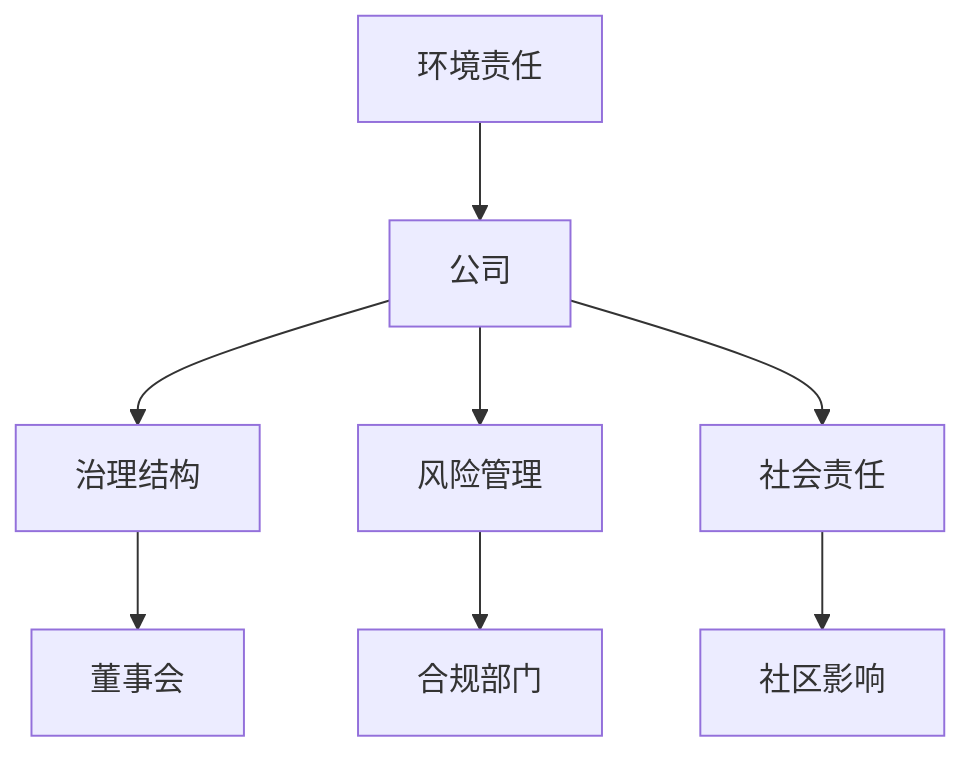
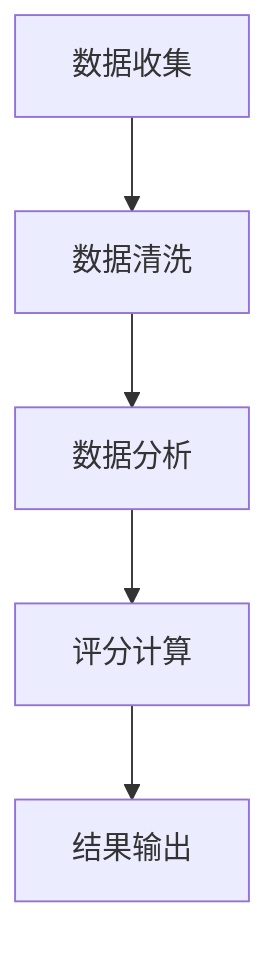
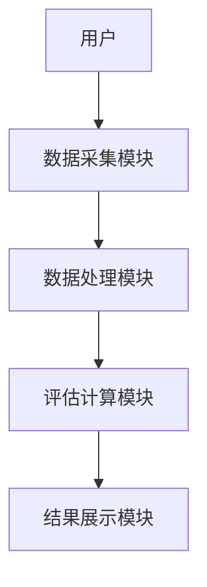
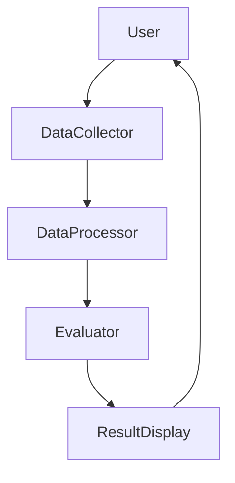

                 


# 彼得林奇对公司环境责任的评估

## 关键词：环境责任，彼得林奇，投资评估，ESG，风险管理

## 摘要：本文从投资分析的角度，系统地探讨了彼得林奇如何对公司环境责任进行评估。通过分析环境责任的核心概念、评估方法、系统设计、实际案例和最佳实践，本文详细阐述了环境责任对公司投资价值的影响，为投资者提供了科学的评估框架和实践指导。

---

# 第一部分：公司环境责任评估的背景与概念

## 第1章：公司环境责任的定义与重要性

### 1.1 环境责任的定义
- **环境责任的基本概念**：环境责任是指企业在其经营活动中对环境产生的影响所应承担的责任，包括减少污染、节约资源、遵守环保法规等方面。
- **环境责任的核心要素**：环境责任包括企业对环境的影响（如碳排放、资源消耗）、社会责任（如员工健康、社区影响）以及治理结构（如董事会对环境事务的监督）。
- **环境责任与企业可持续发展的关系**：环境责任是企业实现可持续发展的重要组成部分，直接影响企业的长期竞争力和品牌形象。

### 1.2 公司环境责任的重要性
- **对企业形象的影响**：良好的环境责任表现能够提升企业的社会形象，增强品牌价值。
- **对投资价值的影响**：环境责任优秀的企业通常具有更低的合规风险和更高的长期盈利能力，吸引更多的投资者。
- **对风险管理的作用**：环境责任评估能够帮助企业识别潜在的环境风险，提前采取措施降低风险。

### 1.3 环境责任评估的背景与现状
- **环境责任评估的起源与发展**：随着全球环保意识的增强，环境责任评估逐渐成为企业治理的重要部分。
- **当前环境责任评估的主要方法**：包括定量分析（如碳排放计算）和定性分析（如政策符合性评估）。
- **环境责任评估的全球趋势**：全球范围内，越来越多的投资者将环境责任作为投资决策的重要因素。

---

## 第2章：环境责任评估的核心概念与框架

### 2.1 环境责任评估的框架
- **环境、社会和治理（ESG）框架**：ESG是环境责任评估的重要工具，包括环境（E）、社会（S）和治理（G）三个维度。
- **环境责任评估的三要素**：排放、资源利用和合规性。
- **环境责任评估的维度与层次**：从微观（企业内部）到宏观（行业、国家）的多层次评估。

### 2.2 环境责任与财务表现的关系
- **环境责任对财务绩效的影响**：良好的环境责任表现通常与更高的利润率和更低的合规成本相关。
- **环境责任与股价波动的关联**：环境责任优秀的企业在市场波动中表现更稳定。
- **环境责任与长期投资回报的关系**：长期来看，环境责任表现优异的企业具有更高的投资回报。

### 2.3 环境责任评估的边界与外延
- **环境责任评估的范围界定**：包括企业的直接排放、供应链中的环境影响等。
- **环境责任与社会责任的区分**：环境责任是社会责任的一部分，但更关注环境保护。
- **环境责任评估的行业差异**：不同行业的环境责任评估重点有所不同，例如制造业关注碳排放，而金融行业关注绿色投资。

---

## 第3章：环境责任评估的核心要素与属性对比

### 3.1 核心概念原理
- **环境责任的量化方法**：通过碳足迹计算、能源消耗数据等方法量化企业的环境影响。
- **环境责任的定性评估标准**：包括政策符合性、环境管理体系建设等。
- **环境责任的综合评估模型**：结合定量和定性方法，构建综合评估模型。

### 3.2 核心概念属性特征对比
| 属性       | 环境责任 | 社会责任 | 治理责任 |
|------------|----------|----------|----------|
| 评估重点   | 环境影响 | 社会影响 | 治理结构 |
| 数据来源   | 环境数据 | 社会数据 | 治理数据 |
| 评估工具   | 碳足迹工具 | 社会影响评估工具 | 治理评分工具 |

### 3.3 ER实体关系图


---

## 第4章：环境责任评估的算法原理与数学模型

### 4.1 算法原理
- **环境责任评估算法的基本原理**：通过收集企业的环境数据，运用数学模型进行量化分析。
- **核心算法步骤**：
  1. 数据收集：获取企业的环境数据，如碳排放、能源消耗等。
  2. 数据清洗：处理缺失值和异常值。
  3. 数据分析：运用统计方法和机器学习算法进行分析。
  4. 评分计算：根据分析结果，对企业环境责任进行评分。

### 4.2 算法流程图


### 4.3 数学模型
- **碳排放评分公式**：
  $$ \text{碳排放评分} = \frac{\text{企业碳排放}}{\text{行业平均碳排放}} \times 100 $$
- **能源消耗评分公式**：
  $$ \text{能源消耗评分} = \frac{\text{企业能源消耗}}{\text{行业平均能源消耗}} \times 100 $$

### 4.4 代码实现
```python
import pandas as pd
import numpy as np

# 数据收集与清洗
data = pd.read_csv('environment_data.csv')
data = data.dropna()  # 删除缺失值
data['carbon_emission'] = data['carbon_emission'].apply(lambda x: x if x > 0 else 0)

# 数据分析
carbon_mean = data['carbon_emission'].mean()
energy_mean = data['energy_consumption'].mean()

# 评分计算
data['carbon_score'] = data['carbon_emission'] / carbon_mean * 100
data['energy_score'] = data['energy_consumption'] / energy_mean * 100

# 结果输出
print(data[['carbon_score', 'energy_score']].head())
```

---

## 第5章：环境责任评估的系统分析与架构设计

### 5.1 项目介绍
- **项目目标**：构建一个环境责任评估系统，帮助投资者快速评估企业的环境责任表现。

### 5.2 系统功能设计
- **功能模块**：
  1. 数据采集模块：收集企业的环境数据。
  2. 数据处理模块：清洗和预处理数据。
  3. 评估计算模块：运用算法进行环境责任评分。
  4. 结果展示模块：可视化评估结果。

### 5.3 系统架构设计


### 5.4 系统交互设计


---

## 第6章：环境责任评估的项目实战

### 6.1 环境数据收集与处理
- **环境数据来源**：企业公开报告、政府数据、第三方机构数据。
- **数据清洗示例**：
  ```python
  data = pd.read_csv('environment_data.csv')
  data.drop_duplicates()  # 删除重复数据
  data['year'] = pd.to_numeric(data['year'], errors='coerce')  # 转换年份格式
  ```

### 6.2 评估计算与结果分析
- **碳排放评分计算**：
  ```python
  carbon_mean = data['carbon_emission'].mean()
  data['carbon_score'] = data['carbon_emission'] / carbon_mean * 100
  ```
- **结果分析**：
  $$ \text{平均碳排放评分} = \frac{\sum \text{carbon_score}}{n} $$

### 6.3 实际案例分析
- **案例：假设一家制造企业的碳排放数据如下**：
  | 年份 | 碳排放（吨） |
  |------|--------------|
  | 2020 | 100          |
  | 2021 | 120          |
  | 2022 | 110          |
  - **计算行业平均碳排放**：假设行业平均为 115 吨。
  - **计算评分**：
    $$ \text{2020年评分} = \frac{100}{115} \times 100 = 86.96 $$
    $$ \text{2021年评分} = \frac{120}{115} \times 100 = 104.35 $$
    $$ \text{2022年评分} = \frac{110}{115} \times 100 = 95.65 $$

### 6.4 项目小结
- **项目总结**：通过实际案例分析，验证了环境责任评估模型的有效性。
- **注意事项**：数据来源的准确性和模型的适用性是关键。

---

## 第7章：环境责任评估的最佳实践与小结

### 7.1 最佳实践
- **数据质量控制**：确保数据的准确性和完整性。
- **模型优化**：根据实际情况调整模型参数，提高评估精度。
- **持续监测**：定期更新数据，跟踪企业的环境责任表现。

### 7.2 投资建议
- **关注ESG评分**：选择ESG评分较高的企业进行投资。
- **分散投资风险**：通过多样化投资降低环境责任相关风险。

### 7.3 未来展望
- **技术进步**：人工智能和大数据技术将进一步提升环境责任评估的精度和效率。
- **政策支持**：政府政策的引导和激励将推动环境责任评估的普及。

### 7.4 小结
- 本文系统地介绍了彼得林奇对公司环境责任的评估方法，结合理论和实践，为投资者提供了科学的评估框架和实践指导。

---

## 参考文献
1. 彼得·林奇著，《彼得林奇投资学》
2. 国际环境治理组织，《环境责任评估指南》
3. 环境保护署，《企业环境责任报告》

---

通过本文的分析，读者可以全面理解彼得林奇的环境责任评估方法，并在实际投资中加以应用。

