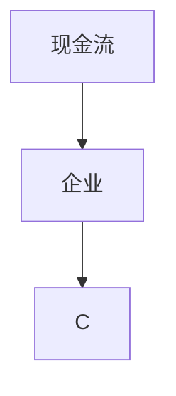
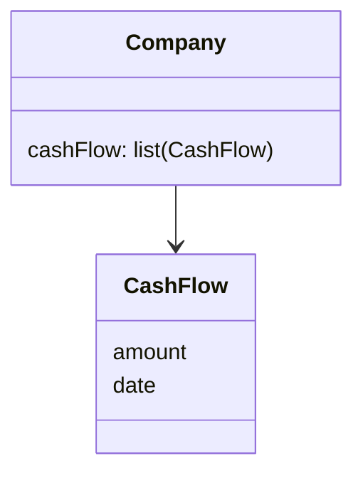
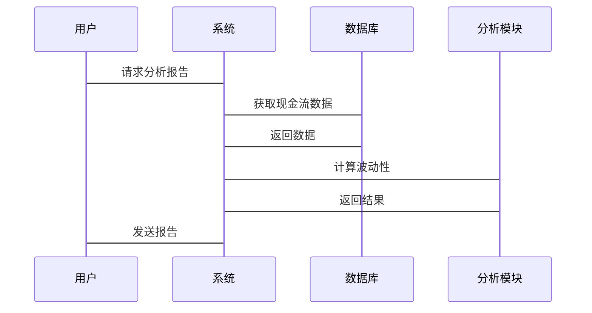

                 


# 彼得林奇对公司现金流波动性的分析

## 关键词：现金流波动性，彼得·林奇，投资分析，企业价值，风险管理

## 摘要：本文深入分析了彼得·林奇对公司现金流波动性的研究，探讨了现金流波动性在投资决策中的重要性，详细阐述了现金流波动性的度量方法，结合企业价值模型，分析了现金流波动性对企业财务健康和投资策略的影响。通过实际案例，展示了如何利用现金流波动性分析进行投资决策优化。

---

# 第1章: 公司现金流波动性分析的背景与重要性

## 1.1 现金流波动性的定义与特征

### 1.1.1 现金流波动性的定义
现金流波动性是指公司在一定时期内现金流的变化程度，反映了企业经营状况的稳定性。高波动性意味着现金流变化剧烈，低波动性则表示现金流相对稳定。

### 1.1.2 现金流波动性的核心特征
- **周期性**：现金流波动可能受经济周期影响。
- **季节性**：某些行业现金流波动具有季节性特征。
- **突发性**：如突发事件可能导致现金流骤减或激增。

### 1.1.3 现金流波动性与企业价值的关系
现金流波动性直接影响企业价值，高波动性可能增加投资风险，降低企业估值。

## 1.2 彼得·林奇的现金流分析框架

### 1.2.1 彼得·林奇的投资者背景与投资理念
彼得·林奇是著名投资专家，主张通过基本面分析寻找优质投资标的，特别关注现金流状况。

### 1.2.2 现金流在投资分析中的重要性
现金流是企业运营的核心，直接影响偿债能力和扩张能力。

### 1.2.3 彼得·林奇现金流分析的核心思想
现金流分析是评估企业财务健康的重要指标，波动性分析帮助识别潜在风险。

## 1.3 现金流波动性分析的现实意义

### 1.3.1 现金流波动性对企业财务健康的影响
现金流波动大可能影响企业的偿债能力，增加财务风险。

### 1.3.2 现金流波动性与企业风险控制
通过分析现金流波动性，企业可以制定更稳健的财务策略，降低风险。

### 1.3.3 现金流波动性对投资决策的价值
现金流波动性分析帮助投资者评估风险，优化投资组合。

## 1.4 本章小结
现金流波动性是企业财务健康的重要指标，彼得·林奇的分析框架提供了有效的投资工具，帮助识别风险和机会。

---

# 第2章: 现金流波动性的核心概念与联系

## 2.1 现金流波动性的度量方法

### 2.1.1 现金流波动性的标准差与方差
标准差衡量现金流偏离平均值的程度，方差是标准差的平方。

### 2.1.2 现金流波动性的最大回撤
最大回撤是指现金流从峰值到最低点的跌幅，反映潜在损失。

### 2.1.3 现金流波动性的VaR（在险价值）模型
VaR是一定置信水平下可能的最大损失，用于评估风险。

## 2.2 现金流波动性与企业价值模型的联系

### 2.2.1 现金流波动性与DCF模型的关系
DCF模型基于未来现金流的现值，波动性影响预测的准确性。

### 2.2.2 现金流波动性对企业估值的影响
波动性大可能导致估值不确定性增加，影响企业价值。

### 2.2.3 现金流波动性与企业成长性的结合
结合成长性和波动性，可以更全面评估企业的投资价值。

## 2.3 现金流波动性分析的ER实体关系图



---

# 第3章: 现金流波动性分析的算法原理

## 3.1 现金流波动性分析的数学模型

### 3.1.1 时间序列分析模型
ARIMA模型用于预测现金流波动性，通过自相关函数和偏相关函数确定参数。

### 3.1.2 机器学习模型
随机森林和XGBoost等模型可以捕捉非线性关系，提高预测精度。

## 3.2 现金流波动性分析的实现步骤

### 3.2.1 数据收集与预处理
收集历史现金流数据，处理缺失值和异常值。

### 3.2.2 特征工程
提取时间特征、统计特征，构建特征向量。

### 3.2.3 模型训练与评估
使用训练数据训练模型，评估模型性能，调整参数优化预测效果。

## 3.3 现金流波动性分析的代码实现

### 3.3.1 时间序列分析代码
```python
import pandas as pd
from statsmodels.tsa.arima.model import ARIMA

# 数据加载
data = pd.read_csv('cash_flow.csv')

# 模型训练
model = ARIMA(data, order=(5,1,0))
model_fit = model.fit()

# 预测
forecast = model_fit.forecast(steps=5)
print(forecast)
```

### 3.3.2 机器学习模型代码
```python
from sklearn.ensemble import RandomForestRegressor
from sklearn.metrics import mean_absolute_error

# 特征矩阵和目标向量
X = data[['revenue', 'profit']]
y = data['cash_flow']

# 模型训练
model = RandomForestRegressor(n_estimators=100)
model.fit(X, y)

# 预测
y_pred = model.predict(X)
print(mean_absolute_error(y, y_pred))
```

---

# 第4章: 现金流波动性分析的系统分析与架构设计

## 4.1 系统功能设计

### 4.1.1 领域模型类图


### 4.1.2 系统架构设计
```
+----------------+       +----------------+
|                |       |                |
|   数据库层      |       |   应用层        |
|                |       |                |
+----------------+       +----------------+
                  |
                  v
                网络层
```

### 4.1.3 接口设计
- 数据接口：提供API获取现金流数据。
- 分析接口：提供API进行波动性分析。

## 4.2 系统交互设计

### 4.2.1 交互流程


---

# 第5章: 现金流波动性分析的项目实战

## 5.1 环境安装

### 5.1.1 安装Python
```bash
python --version
pip install numpy pandas scikit-learn
```

## 5.2 核心代码实现

### 5.2.1 数据加载与预处理
```python
import pandas as pd
data = pd.read_csv('cash_flow.csv')
data = data.dropna()
```

### 5.2.2 特征工程
```python
from sklearn.preprocessing import StandardScaler
scaler = StandardScaler()
X_scaled = scaler.fit_transform(X)
```

### 5.2.3 模型训练
```python
from sklearn.ensemble import RandomForestRegressor
model = RandomForestRegressor()
model.fit(X_scaled, y)
```

## 5.3 案例分析

### 5.3.1 数据可视化
```python
import matplotlib.pyplot as plt
plt.plot(data['date'], data['cash_flow'])
plt.xlabel('时间')
plt.ylabel('现金流')
plt.show()
```

### 5.3.2 结果分析
预测结果与实际数据对比，评估模型准确性。

---

# 第6章: 现金流波动性分析的最佳实践

## 6.1 最佳实践 Tips

### 6.1.1 数据质量
确保数据准确，处理缺失值和异常值。

### 6.1.2 模型选择
根据数据特点选择合适的模型，可能需要结合多种方法。

## 6.2 小结
现金流波动性分析是投资决策的重要工具，合理应用模型和方法，可以提高分析准确性。

## 6.3 注意事项

### 6.3.1 数据依赖性
模型结果依赖数据质量，需谨慎处理。

### 6.3.2 模型局限性
模型无法预测不可预见的事件，需结合实际情况使用。

## 6.4 拓展阅读

### 6.4.1 推荐书籍
- 《彼得·林奇的投资哲学》
- 《时间序列分析与应用》

### 6.4.2 推荐博客
- 彼得·林奇投资博客
- 金融科技技术博客

---

# 第7章: 案例分析：彼得·林奇如何分析现金流波动性

## 7.1 案例背景介绍

### 7.1.1 公司概况
以某制造公司为例，分析其现金流波动性。

## 7.2 数据收集与处理

### 7.2.1 数据来源
从财务报表获取过去5年的现金流数据。

## 7.3 数据分析与建模

### 7.3.1 计算标准差与方差
```python
import numpy as np
std = np.std(data['cash_flow'])
variance = np.var(data['cash_flow'])
```

## 7.4 结果解读与投资决策

### 7.4.1 结果解读
高波动性可能影响投资决策，需谨慎评估。

## 7.5 投资策略调整

### 7.5.1 投资组合优化
根据波动性调整投资组合，降低整体风险。

---

# 第8章: 总结与展望

## 8.1 本章总结
现金流波动性分析是投资决策的重要工具，彼得·林奇的方法提供了有效的分析框架。

## 8.2 未来展望
随着技术进步，现金流波动性分析将更加精准，为投资决策提供更有力支持。

---

# 参考文献

- 彼得·林奇著述
- 相关学术论文
- 相关技术文档

---

通过以上详细的内容，文章系统地介绍了彼得·林奇的现金流波动性分析方法，结合理论与实践，提供了丰富的案例和代码示例，帮助读者深入理解并应用这一分析方法。

