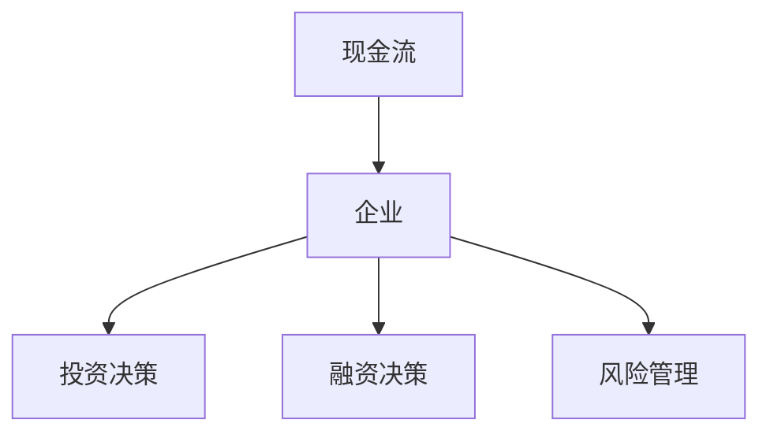
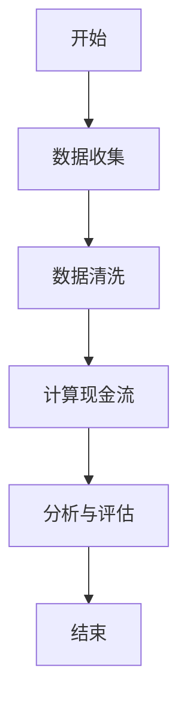

                 

# 彼得林奇对公司现金流的重视

## 关键词：现金流，彼得林奇，企业价值，投资决策，风险管理，DCF模型

## 摘要：现金流是企业财务健康的核心指标，彼得林奇强调其在投资决策中的重要性。本文深入探讨现金流的定义、分析方法、与企业价值的关系，结合案例分析和系统架构，提供现金流管理的最佳实践。

---

# 第一部分：现金流的定义与重要性

## 第1章：现金流的定义与重要性

### 1.1 现金流的定义与内涵
现金流是企业在一定时期内现金的流入和流出情况，反映了企业的财务状况和经营能力。现金流分为经营活动、投资活动和筹资活动三类，分别对应企业日常运营、投资扩展和融资活动。

### 1.2 现金流的重要性
现金流是企业生存和发展的基石，直接影响企业的偿债能力和扩张能力。彼得林奇认为，现金流充裕的企业更能抵御市场波动和经济衰退。

### 1.3 现金流的来源与类型
经营活动现金流来自企业日常业务，投资活动现金流来自资产投资，筹资活动现金流来自债务和股权融资。每种现金流类型对企业价值有不同的影响。

---

## 第2章：现金流分析的核心概念与联系

### 2.1 现金流分析的原理
现金流分析是评估企业财务健康的重要工具，通过分析现金流入和流出，评估企业的盈利能力和流动性。

### 2.2 现金流与企业价值的关系
现金流是企业价值的核心驱动因素，DCF模型通过贴现未来现金流计算企业价值。彼得林奇强调DCF模型在评估企业内在价值中的作用。

### 2.3 DCF模型的数学公式
$$ \text{企业价值} = \sum_{t=1}^{n} \frac{\text{现金流}_t}{(1 + r)^t} $$
其中，\( r \) 是贴现率，\( t \) 是时间。

### 2.4 现金流分析的ER实体关系图

---

# 第二部分：现金流分析与企业价值

## 第3章：现金流分析的算法原理

### 3.1 现金流分析的算法流程图

### 3.2 现金流分析的数学模型
现金流分析包括趋势分析、比率分析和质量分析。趋势分析考察现金流的变化趋势，比率分析计算如现金流量比率，质量分析评估现金流的来源和风险。

### 3.3 现金流分析的案例
以苹果公司为例，分析其经营活动现金流的来源和投资活动现金流的使用情况，评估其财务健康状况。

---

## 第4章：现金流与企业价值的关系

### 4.1 现金流的内在价值
现金流的内在价值是未来现金流的现值，DCF模型是计算内在价值的核心工具。

### 4.2 现金流的外在价值
市场对现金流的预期影响股票价格，彼得林奇强调市场情绪和预期对现金流估值的影响。

### 4.3 现金流与企业价值的数学关系
$$ \text{内在价值} = \frac{\text{现金流}}{r} $$
其中，\( r \) 是贴现率。

---

## 第5章：现金流风险管理与投资策略

### 5.1 现金流风险管理
现金流风险管理包括识别风险源、量化风险和制定应对策略。彼得林奇建议通过多元化投资和风险对冲来管理现金流风险。

### 5.2 投资策略
现金流分析是投资决策的基础，彼得林奇强调寻找现金流稳定、增长性强的企业进行投资。

### 5.3 现金流预测与投资决策
现金流预测是投资决策的关键，彼得林奇建议结合市场环境和企业基本面进行现金流预测。

---

# 第三部分：总结与展望

## 第6章：总结与展望

### 6.1 现金流的重要性
现金流是企业财务健康的核心指标，现金流充裕的企业更具投资价值。

### 6.2 投资策略建议
投资者应重视现金流分析，选择现金流稳定、增长性强的企业进行投资。

### 6.3 进一步阅读
推荐阅读彼得林奇的《投资之道》和《选股的艺术》，深入理解现金流在投资中的重要性。

---

## 关键词总结
现金流，DCF模型，企业价值，投资决策，风险管理，彼得林奇

---

## 致谢
感谢读者的耐心阅读，希望本文能帮助您更好地理解彼得林奇对公司现金流的重视，并在投资决策中有所帮助。

