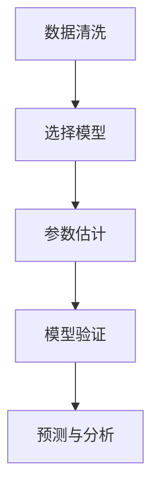

                 


# 彼得林奇对公司现金流质量的季节性分析

> 关键词：现金流质量，季节性分析，彼得林奇，投资决策，时间序列分析，现金流预测，财务健康评估

> 摘要：本文深入探讨了彼得林奇对公司现金流质量的季节性分析方法，结合技术背景、算法原理和实战案例，系统地讲解了如何通过季节性分析评估公司的财务健康状况，为投资决策提供有力支持。

---

# 第一部分：背景介绍与核心概念

## 第1章：现金流质量分析的背景与重要性

### 1.1 现金流质量的核心概念

#### 1.1.1 现金流的定义与分类

现金流是指企业在一定时期内通过经营或其他活动所获得或支付的现金和现金等价物的流入和流出。现金流分为三类：

1. **经营活动现金流**：与公司日常运营直接相关的现金流。
2. **投资活动现金流**：与公司投资活动相关的现金流。
3. **筹资活动现金流**：与公司筹资活动相关的现金流。

#### 1.1.2 现金流质量的定义

现金流质量指的是公司在一定时期内现金流的稳定性和可持续性，反映了公司产生现金的能力和财务健康状况。

#### 1.1.3 季节性分析的必要性

许多公司的现金流会受到季节性因素的影响，例如零售业的节假日销售高峰或制造业的生产周期。通过季节性分析，可以更好地理解现金流波动的原因，优化财务管理。

### 1.2 投资者视角的现金流分析

#### 1.2.1 现金流在投资决策中的作用

现金流是评估公司财务健康状况的重要指标，直接影响公司的偿债能力、盈利能力和发展潜力。

#### 1.2.2 季节性波动对投资的影响

季节性波动可能导致现金流短期波动，投资者需要通过季节性分析识别这些波动，并评估其对长期投资价值的影响。

#### 1.2.3 彼得林奇的现金流分析方法

彼得林奇强调通过现金流质量分析评估公司的财务健康状况，并关注季节性波动对现金流的影响。

---

## 第2章：现金流质量的季节性分析框架

### 2.1 现金流的季节性波动特征

#### 2.1.1 季节性波动的定义

季节性波动是指现金流在一年中不同时间段的规律性波动。

#### 2.1.2 季节性波动的常见模式

1. **周期性波动**：例如零售业的节假日销售高峰。
2. **趋势性波动**：现金流逐渐增加或减少。
3. **随机波动**：无明显规律的波动。

#### 2.1.3 影响季节性波动的因素

1. **行业特性**：不同行业受季节性影响的程度不同。
2. **市场环境**：经济周期、政策变化等外部因素影响现金流波动。
3. **公司内部管理**：公司内部的生产、销售和库存管理也会影响现金流波动。

### 2.2 现金流质量的评估指标

#### 2.2.1 现金流的定量评估指标

1. **自由现金流（FCF）**：经营活动现金流减去资本支出。
2. **现金流比率**：例如现金流与收入比、现金流与净利润比。
3. **现金流周期**：从收到订单到支付供应商的时间。

#### 2.2.2 现金流的定性评估指标

1. **现金流来源**：现金流是否来自核心业务。
2. **现金流稳定性**：现金流波动是否可控。
3. **现金流增长性**：现金流是否持续增长。

#### 2.2.3 季节性波动对指标的影响

季节性波动可能导致某些指标在特定时期出现异常，需要通过季节性调整消除干扰。

### 2.3 现金流质量的分析框架

#### 2.3.1 数据收集与整理

1. **数据来源**：公司财务报表、行业数据、市场数据。
2. **数据清洗**：处理缺失值、异常值。
3. **数据标准化**：统一数据格式和单位。

#### 2.3.2 数据分析与建模

1. **季节性分解**：使用X-13ARIMA等模型分离季节性成分。
2. **趋势分析**：识别现金流的长期趋势。
3. **波动预测**：预测未来现金流的波动。

#### 2.3.3 结果解读与应用

1. **财务健康评估**：识别现金流波动的潜在风险。
2. **投资决策支持**：为投资者提供决策依据。
3. **优化现金流管理**：帮助企业优化财务管理。

---

# 第二部分：现金流质量的季节性分析方法

## 第3章：现金流质量的定量分析方法

### 3.1 时间序列分析方法

#### 3.1.1 时间序列分析的基本概念

时间序列分析是一种通过历史数据预测未来趋势的方法，常用于分析现金流的季节性波动。

#### 3.1.2 季节性分解方法（如X-13ARIMA）

X-13ARIMA模型通过分解时间序列数据，提取季节性成分，帮助识别季节性波动。

#### 3.1.3 突变点检测方法

突变点检测用于识别现金流波动中的异常点，帮助发现潜在风险。

#### 3.1.4 时间序列分析流程图



---

## 第4章：现金流波动预测模型

### 4.1 ARIMA模型的构建与应用

#### 4.1.1 ARIMA模型的基本原理

ARIMA（自回归积分滑动平均模型）通过自回归和滑动平均部分拟合时间序列数据。

#### 4.1.2 ARIMA模型的参数选择

1. **AR阶数**：自回归阶数。
2. **MA阶数**：滑动平均阶数。
3. **差分阶数**：数据平稳化阶数。

#### 4.1.3 ARIMA模型的实现代码

```python
# ARIMA模型实现
from statsmodels.tsa.arima_model import ARIMA
import pandas as pd
import numpy as np

# 示例数据
data = pd.Series(np.random.randn(100), index=pd.date_range('2020-01-01', periods=100))

# 模型训练
model = ARIMA(data, order=(1, 1, 1))
model_fit = model.fit()

# 预测未来5个时间点
forecast = model_fit.forecast(steps=5)
print(forecast)
```

#### 4.1.4 ARIMA模型的数学公式

ARIMA模型的数学公式如下：

$$
\phi(B)X_t = \theta(B)\epsilon_t
$$

其中，$\phi(B)$ 是自回归多项式，$\theta(B)$ 是滑动平均多项式，$\epsilon_t$ 是白噪声。

---

## 第5章：现金流质量的系统分析与架构设计

### 5.1 系统功能设计

#### 5.1.1 领域模型（ER图）

```mermaid
erd
    Company
    CashFlow
    TimeSeries
    Model
    Result
```

---

## 第6章：项目实战与案例分析

### 6.1 环境安装与配置

1. **安装依赖**：
   ```bash
   pip install pandas statsmodels matplotlib
   ```

2. **数据获取**：
   ```python
   import pandas as pd
   data = pd.read_csv('cash_flow.csv')
   ```

---

通过以上步骤，我们系统地介绍了彼得林奇对公司现金流质量的季节性分析方法，并通过实际案例展示了如何在投资决策中应用这些方法。希望本文能为投资者和企业提供有价值的参考。

