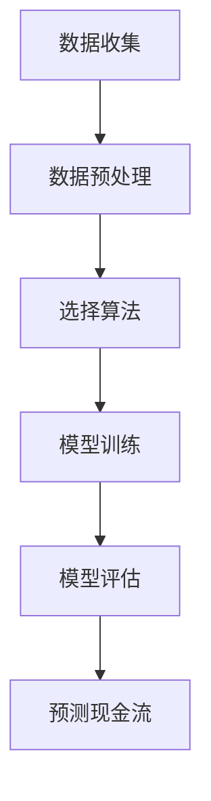
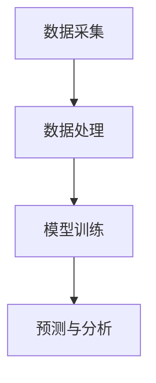
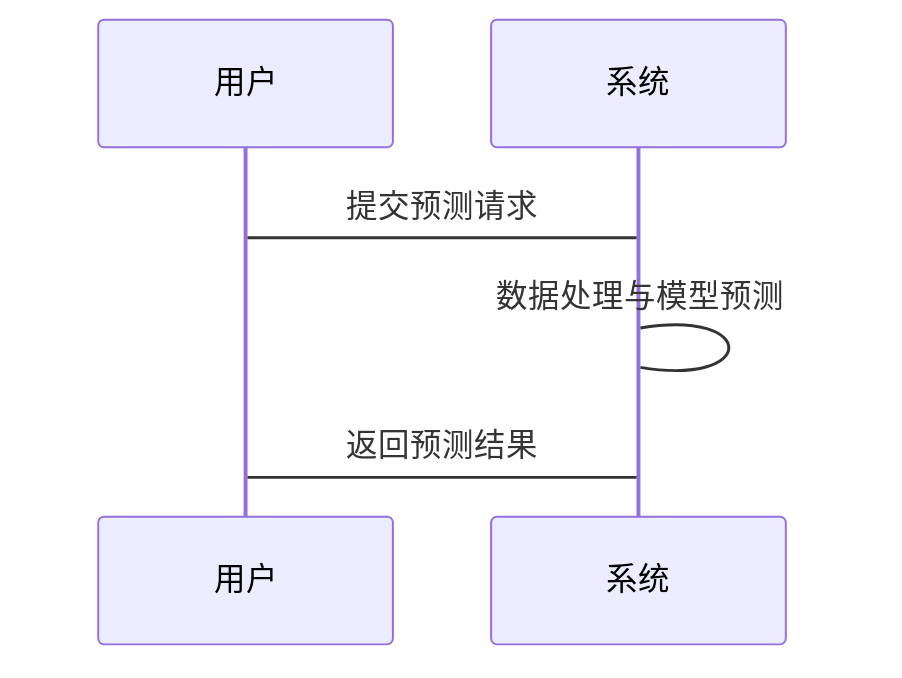

                 


# 彼得林奇对公司现金流预测准确性与股价表现关系的研究

## 关键词：现金流预测，股价表现，彼得·林奇，投资策略，财务分析

## 摘要：本文探讨了现金流预测准确性与股价表现之间的关系，结合彼得·林奇的投资策略，分析了现金流预测在投资决策中的重要性，并通过实际案例和算法模型展示了如何利用现金流预测准确性来优化投资决策，为投资者提供了实用的见解和策略。

---

# 目录大纲结构：

## 第一部分: 背景介绍

### 第1章: 现金流预测与股价表现的基本概念

#### 1.1 现金流预测的定义与重要性

- 现金流预测的定义
  - 现金流的来源与类型
  - 现金流预测的时间范围
- 现金流预测在投资中的重要性
  - 现金流预测如何影响投资决策
  - 现金流预测在公司估值中的作用
- 现金流预测的边界与外延
  - 预测的局限性
  - 预测结果的应用场景

#### 1.2 股价表现的定义与影响因素

- 股价表现的定义
  - 股价波动的原因
  - 股价与公司基本面的关系
- 影响股价表现的主要因素
  - 公司财务状况
  - 宏观经济环境
  - 市场情绪与投资者预期

#### 1.3 彼得·林奇研究背景

- 彼得·林奇的投资理念
  - 价值投资的核心思想
  - 林奇对现金流预测的重视
- 现金流预测在林奇投资策略中的地位
  - 现金流预测如何帮助发现被低估的股票
  - 现金流预测在投资组合管理中的作用

---

## 第二部分: 现金流预测准确性与股价表现的关系

### 第2章: 现金流预测准确性的影响因素

#### 2.1 现金流预测的准确性定义

- 现金流预测误差的计算方法
  - 绝对误差与相对误差
  - 平均绝对误差（MAE）与均方误差（MSE）
- 现金流预测准确性的评价指标
  - R平方值（R²）
  - 预测与实际的拟合程度

#### 2.2 影响现金流预测准确性的主要因素

- 公司内部因素
  - 财务管理政策
  - 业务模式的稳定性
- 宏观经济环境
  - 经济周期的影响
  - 利率与通货膨胀
- 市场情绪与投资者预期
  - 市场情绪对股价的影响
  - 投资者预期与现金流预测的关系

#### 2.3 现金流预测准确性与股价表现的关系

- 高预测准确性对股价的正面影响
  - 稳定的现金流预测如何增强投资者信心
  - 高预测准确性如何推动股价上涨
- 低预测准确性对股价的负面影响
  - 不确定性对股价波动的影响
  - 预测误差如何引发股价调整
- 现金流预测准确性与股价表现的综合分析
  - 预测准确性如何影响股价的长期走势
  - 如何通过现金流预测优化投资组合

---

## 第三部分: 现金流预测的算法原理

### 第3章: 现金流预测的算法与实现

#### 3.1 现金流预测的算法原理

- 现金流预测的常用算法
  - 线性回归
  - 时间序列分析（ARIMA）
  - 支持向量回归（SVR）
- 算法选择与适用场景
  - 根据数据特征选择合适的算法
  - 线性回归与非线性回归的区别

#### 3.2 现金流预测的流程图



#### 3.3 现金流预测的Python实现

```python
import pandas as pd
from sklearn.linear_model import LinearRegression

# 数据加载
data = pd.read_csv('cash_flow.csv')

# 特征与目标分离
X = data[['revenue', 'expenses']]
y = data['cash_flow']

# 模型训练
model = LinearRegression()
model.fit(X, y)

# 预测现金流
predicted_cash_flow = model.predict(X)
```

#### 3.4 现金流预测的数学模型

- 线性回归模型
  $$ y = \beta_0 + \beta_1 x + \epsilon $$
  - $y$：现金流
  - $x$：相关预测变量（如收入、支出）
  - $\beta_0$，$\beta_1$：回归系数
  - $\epsilon$：误差项

#### 3.5 现金流预测的案例分析

- 某公司的现金流预测案例
  - 数据来源与预处理
  - 模型训练与评估
  - 预测结果与实际现金流的对比分析

---

## 第四部分: 系统分析与架构设计

### 第4章: 现金流预测系统的架构设计

#### 4.1 系统功能设计

- 问题场景介绍
  - 现金流预测系统的应用场景
  - 系统需要解决的主要问题
- 系统功能模块
  - 数据采集模块
  - 数据处理模块
  - 模型训练模块
  - 预测与分析模块

#### 4.2 系统架构设计



#### 4.3 接口设计与交互流程

- API接口设计
  - 数据接口
  - 模型接口
  - 结果接口
- 交互流程图



---

## 第五部分: 项目实战

### 第5章: 现金流预测项目的实战分析

#### 5.1 环境搭建与数据准备

- 环境安装
  - Python环境配置
  - 库的安装（pandas, scikit-learn）
- 数据来源与预处理
  - 数据清洗
  - 特征工程

#### 5.2 现金流预测系统的实现

- 核心代码实现
  ```python
  from sklearn.metrics import mean_absolute_error

  # 训练模型
  model.fit(X_train, y_train)

  # 预测与评估
  y_pred = model.predict(X_test)
  mae = mean_absolute_error(y_test, y_pred)
  print(f"MAE: {mae}")
  ```

#### 5.3 案例分析与结果解读

- 某公司现金流预测案例
  - 数据输入与处理
  - 模型训练与预测
  - 结果分析与解释

#### 5.4 项目小结

- 项目总结
  - 系统的功能实现
  - 预测的准确性评估
  - 系统的优势与改进空间

---

## 第六部分: 最佳实践

### 第6章: 现金流预测与投资策略的最佳实践

#### 6.1 小结

- 本文的主要内容回顾
  - 现金流预测的定义与重要性
  - 彼得·林奇研究的启示
  - 算法与系统实现的要点

#### 6.2 投资者的注意事项

- 现金流预测的局限性
  - 数据质量的影响
  - 模型假设的限制
- 如何结合其他因素进行投资决策
  - 结合财务报表分析
  - 考虑宏观经济环境

#### 6.3 拓展阅读

- 推荐书籍与文章
  - 彼得·林奇的著作
  - 现金流预测的最新研究
  - 数据科学与投资策略的相关文献

---

## 结语

现金流预测准确性与股价表现的关系是投资决策中的重要课题。通过本文的分析，我们了解了现金流预测的定义、影响因素及其与股价表现的关系，结合彼得·林奇的研究，展示了如何通过算法与系统实现优化投资决策。希望本文能为投资者和数据科学家提供有价值的参考与启发。

