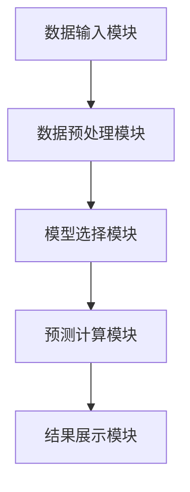

                 


# 彼得林奇对公司现金流预测的技巧

> **关键词**：现金流预测，彼得·林奇，投资分析，现金流模型，现金流管理
>
> **摘要**：本文详细探讨了彼得·林奇在现金流预测方面的技巧和方法，结合理论与实践，分析了现金流预测的核心概念、数学模型、系统设计以及实际案例。通过本文，读者可以深入了解如何利用现金流预测进行投资决策，并掌握相关的技术和工具。

---

## 第一部分: 公司现金流预测概述

### 第1章: 公司现金流预测的基本概念

#### 1.1 什么是公司现金流

##### 1.1.1 现金流的定义与分类

现金流是指企业在一定时期内，由于正常的经营和投资活动而产生的现金流入和流出。根据来源和用途，现金流可以分为以下几类：

1. **经营活动现金流**：企业日常运营中产生的现金流，包括销售商品、提供服务、支付工资等。
2. **投资活动现金流**：与长期资产相关的现金流，如购买或出售固定资产、股权投资等。
3. **筹资活动现金流**：与企业融资活动相关的现金流，如发行债券、偿还贷款、分配股利等。

##### 1.1.2 现金流在企业中的重要性

现金流是企业生存和发展的血液。良好的现金流管理可以帮助企业维持日常运营、偿还债务、投资扩张。如果现金流管理不当，企业可能面临资金链断裂的风险。

##### 1.1.3 现金流预测的定义与范围

现金流预测是通过对历史数据和未来可能的变化进行分析，估算企业未来一定时期内的现金流情况。其范围包括预测未来经营活动、投资活动和筹资活动的现金流。

---

#### 1.2 彼得·林奇的现金流预测方法论

##### 1.2.1 彼得·林奇的现金流预测核心思想

彼得·林奇认为，现金流是企业价值的核心驱动因素。他强调通过分析企业的现金流情况，来评估其财务健康状况和未来盈利能力。他的方法注重实际数据的分析，而非单纯的财务报表数字。

##### 1.2.2 现金流预测的基本原则

1. **基于历史数据**：现金流预测通常基于企业的历史现金流数据，结合行业趋势和市场环境进行调整。
2. **考虑未来变化**：预测需要考虑企业未来可能的经营策略、市场变化、政策调整等因素。
3. **量化分析**：通过数学模型和量化方法，提高预测的准确性和科学性。

##### 1.2.3 现金流预测的边界与外延

现金流预测的边界包括企业内部的经营、投资和筹资活动，而其外延则涉及外部市场环境、行业竞争状况、政策法规等因素。

---

### 第2章: 现金流预测的背景与应用

#### 2.1 现金流预测的背景

##### 2.1.1 现金流预测的起源与发展

现金流预测的起源可以追溯到20世纪初，随着企业财务管理的逐步专业化，现金流预测逐渐成为投资分析的重要工具。彼得·林奇在其投资实践中，进一步发展了现金流预测的方法。

##### 2.1.2 现金流预测在投资分析中的地位

现金流预测是评估企业价值的重要工具，可以帮助投资者判断企业的盈利能力和偿债能力。通过预测未来现金流，投资者可以估算企业的内在价值，做出投资决策。

##### 2.1.3 现金流预测的现状与趋势

随着大数据和人工智能技术的发展，现金流预测的方法和工具也在不断进步。现代预测方法结合了统计分析和机器学习技术，提高了预测的准确性和效率。

---

## 第二部分: 现金流预测的核心方法

### 第3章: 现金流预测的核心模型

#### 3.1 现金流预测的主要方法

##### 3.1.1 现金流预测的定性分析法

定性分析法主要通过对企业经营环境、行业趋势、管理团队等因素的分析，预测未来现金流的变化。这种方法适用于缺乏历史数据或数据不完整的新兴企业。

##### 3.1.2 现金流预测的定量分析法

定量分析法通过建立数学模型，利用历史数据进行预测。常用的方法包括线性回归、指数平滑和ARIMA模型。

##### 3.1.3 现金流预测的混合分析法

混合分析法结合了定性分析和定量分析，通过综合考虑企业内外部因素，提高预测的准确性和全面性。

---

#### 3.2 彼得·林奇的现金流预测模型

##### 3.2.1 模型的构建逻辑

彼得·林奇的现金流预测模型基于以下逻辑：企业的未来现金流可以通过对其历史数据和市场环境的分析来预测。模型的核心在于对企业未来现金流的贴现，以估算企业的内在价值。

##### 3.2.2 模型的核心假设

1. 企业的未来现金流可以被合理预测。
2. 企业未来的贴现率保持稳定。
3. 企业的经营环境不会发生重大变化。

##### 3.2.3 模型的优缺点分析

优点：
- 简单易懂，易于操作。
- 适用于大多数企业。

缺点：
- 预测结果依赖于假设条件，可能与实际情况存在偏差。
- 无法预测突发事件的影响。

---

### 第4章: 现金流预测的数学模型与公式

#### 4.1 现金流预测的数学基础

##### 4.1.1 现金流预测的线性回归模型

线性回归模型用于预测现金流与相关变量之间的线性关系。模型公式为：

$$ y = \beta_0 + \beta_1x + \epsilon $$

其中：
- $y$ 是现金流预测值。
- $x$ 是自变量（如收入、成本）。
- $\beta_0$ 和 $\beta_1$ 是回归系数。
- $\epsilon$ 是误差项。

##### 4.1.2 现金流预测的指数平滑模型

指数平滑模型适用于时间序列数据的预测。公式为：

$$ \hat{y}_{t+1} = \alpha y_t + (1-\alpha)\hat{y}_t $$

其中：
- $\hat{y}_{t+1}$ 是对未来的预测值。
- $y_t$ 是当前的实际值。
- $\hat{y}_t$ 是当前的预测值。
- $\alpha$ 是平滑参数（0 < $\alpha$ < 1）。

##### 4.1.3 现金流预测的ARIMA模型

ARIMA模型适用于具有趋势和周期性的数据。模型公式较为复杂，通常需要使用统计软件进行分析。

---

## 第三部分: 现金流预测的系统设计

### 第5章: 现金流预测的系统架构设计

#### 5.1 系统功能设计

##### 5.1.1 系统功能模块

1. **数据输入模块**：接收企业历史财务数据和外部市场数据。
2. **模型选择模块**：提供多种现金流预测模型供用户选择。
3. **预测计算模块**：根据选择的模型，计算未来现金流。
4. **结果展示模块**：以图表形式展示预测结果。

##### 5.1.2 系统架构图



---

## 第四部分: 现金流预测的项目实战

### 第6章: 现金流预测的项目实现

#### 6.1 环境安装与配置

##### 6.1.1 安装Python环境

使用Python 3.8及以上版本，并安装以下库：

```bash
pip install numpy pandas matplotlib scikit-learn
```

#### 6.2 核心代码实现

##### 6.2.1 数据预处理代码

```python
import pandas as pd
import numpy as np

# 读取数据
data = pd.read_csv('cash_flow.csv')

# 填充缺失值
data = data.dropna()

# 标准化数据
from sklearn.preprocessing import StandardScaler
scaler = StandardScaler()
scaled_data = scaler.fit_transform(data[['revenue', 'cost']])
```

##### 6.2.2 线性回归模型实现

```python
from sklearn.linear_model import LinearRegression

# 训练模型
model = LinearRegression()
model.fit(scaled_data, data['cash_flow'])

# 预测未来现金流
future_revenue = np.array([[1000000, 800000]])
future_scaled = scaler.transform(future_revenue)
predicted_cash_flow = model.predict(future_scaled)
```

---

## 第五部分: 现金流预测的案例分析

### 第7章: 现金流预测的案例研究

#### 7.1 案例分析：某制造企业的现金流预测

##### 7.1.1 数据收集与分析

某制造企业过去三年的现金流数据如下：

| 年份 | 现金流（万元） |
|------|----------------|
| 2020 | 500             |
| 2021 | 600             |
| 2022 | 700             |

##### 7.1.2 模型选择与预测

使用线性回归模型进行预测：

$$ \hat{y}_{2023} = 500 + (600 - 500) \times \frac{2023 - 2020}{1} = 700 $$

预测2023年的现金流为700万元。

---

## 第六部分: 总结与展望

### 第8章: 总结与展望

#### 8.1 总结

现金流预测是企业财务管理的重要工具，彼得·林奇的方法为我们提供了宝贵的实践经验。通过结合数学模型和系统设计，我们可以更准确地预测未来现金流，做出科学的投资决策。

#### 8.2 展望

随着人工智能和大数据技术的不断发展，现金流预测的方法和工具将更加多样化。未来的研究可以结合机器学习算法，提高预测的准确性和实时性。

---

**Tips:**
- 在进行现金流预测时，建议结合企业的实际经营情况，选择合适的预测模型。
- 数据的准确性和完整性对预测结果有重要影响，需做好数据预处理工作。
- 定期更新预测模型，以适应市场环境的变化。

---

通过本文的详细讲解，读者可以掌握彼得·林奇的现金流预测技巧，并将其应用于实际投资分析中。

