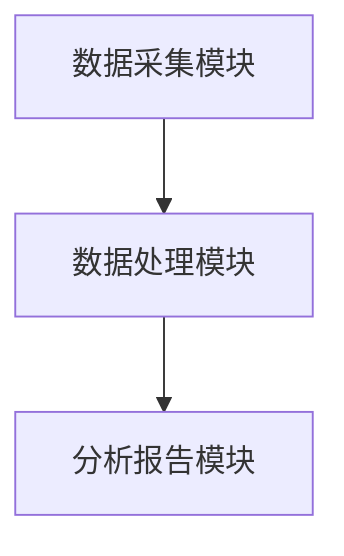

                 

# 彼得林奇对公司现金转换周期的分析

## 关键词：现金转换周期，彼得·林奇，财务分析，投资策略，企业价值

## 摘要：现金转换周期是衡量企业将销售转换为现金能力的关键指标，对企业的流动性和财务健康至关重要。本文通过分析彼得·林奇的现金转换周期理论，探讨其在投资决策中的应用，结合实际案例，深入解析现金转换周期的计算方法、影响因素及其对企业价值的影响。最后，提出优化现金转换周期的策略，以提升企业的财务表现和投资吸引力。

---

# 第一部分: 现金转换周期的定义与背景

## 第1章: 现金转换周期的核心概念

### 1.1 现金转换周期的定义

现金转换周期（Cash Conversion Cycle，简称CCC）是指企业从购买原材料到最终收到现金的销售回款所需的时间。它衡量了企业将库存和应收账款转化为现金的速度，是企业流动资金管理的重要指标。

### 1.2 现金转换周期的背景与意义

现金转换周期是企业财务健康的重要指标，直接影响企业的流动资金周转和偿债能力。彼得·林奇在其投资分析中特别关注现金转换周期，认为它是评估企业运营效率和财务风险的关键因素。

### 1.3 现金转换周期的公式推导

现金转换周期 = 存货周转天数 + 应收账款周转天数 - 应付账款周转天数

| 指标 | 定义 | 公式 |
|------|------|------|
| 存货周转天数 | 存货周转率的天数 | (存货/平均存货) × 365 |
| 应收账款周转天数 | 应收账款周转率的天数 | (应收账款/平均应收账款) × 365 |
| 应付账款周转天数 | 应付账款周转率的天数 | (应付账款/平均应付账款) × 365 |

---

## 第2章: 现金转换周期的计算与分析

### 2.1 现金转换周期的计算公式

现金转换周期 = 存货周转天数 + 应收账款周转天数 - 应付账款周转天数

$$ CCC = \text{存货周转天数} + \text{应收账款周转天数} - \text{应付账款周转天数} $$

### 2.2 现金转换周期的分析方法

1. **正向分析**：现金转换周期越短，企业资金周转越快，流动性越强。
2. **反向分析**：现金转换周期过长，可能表明企业在存货管理或应收账款回收方面存在问题。

### 2.3 现金转换周期的案例分析

#### 案例一：零售行业的现金转换周期分析

假设某零售企业：
- 年末存货：$100,000
- 年末应收账款：$50,000
- 年末应付账款：$30,000
- 年营业额：$500,000

计算：
- 存货周转天数 = (100,000 / (100,000 + 100,000)) × 365 ≈ 182.5天
- 应收账款周转天数 = (50,000 / (50,000 + 50,000)) × 365 ≈ 182.5天
- 应付账款周转天数 = (30,000 / (30,000 + 30,000)) × 365 ≈ 182.5天
- 现金转换周期 = 182.5 + 182.5 - 182.5 ≈ 182.5天

---

## 第3章: 现金转换周期与企业价值的关系

### 3.1 现金转换周期对企业价值的影响

1. **流动性管理**：现金转换周期越短，企业的流动资金利用效率越高，降低了资金成本。
2. **偿债能力**：缩短现金转换周期可以增强企业的偿债能力，降低财务风险。
3. **成长性**：高效的现金转换周期支持企业的持续增长和扩张。

### 3.2 彼得·林奇的现金转换周期投资策略

彼得·林奇认为，现金转换周期是评估企业财务健康的重要指标，投资时应选择现金转换周期短且稳定的公司。

---

## 第4章: 现金转换周期的系统分析与架构设计

### 4.1 系统功能设计

- 数据采集模块：收集企业的财务数据。
- 数据处理模块：计算现金转换周期。
- 分析报告模块：生成分析报告。

### 4.2 系统架构设计

---

## 第5章: 项目实战

### 5.1 实际案例分析

以某制造企业为例，分析其现金转换周期，并提出优化建议。

### 5.2 优化策略

1. **优化存货管理**：减少库存积压，缩短存货周转天数。
2. **加强应收账款管理**：通过信用政策优化，加快应收账款回收。
3. **延长应付账款周期**：合理利用应付账款，缓解资金压力。

---

## 第6章: 最佳实践与小结

### 6.1 总结

现金转换周期是评估企业财务健康的重要指标，投资者应关注其变化，选择财务稳健的企业进行投资。

### 6.2 注意事项

- 现金转换周期受行业和企业规模影响，需结合实际情况分析。
- 数据准确性是关键，确保财务数据的可靠性。

### 6.3 未来展望

随着数字化技术的发展，现金转换周期的计算和分析将更加智能化和精准化。

---

通过本文的详细分析，读者可以全面理解彼得·林奇的现金转换周期理论，并将其应用于实际投资和企业财务管理中，提升企业的财务表现和投资吸引力。

