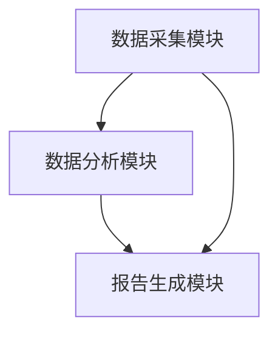
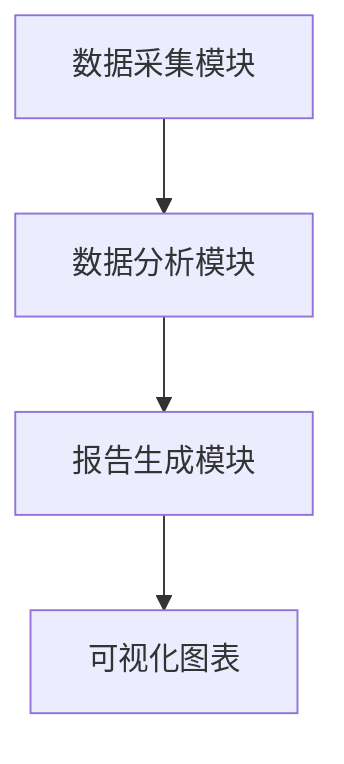

                 


# 彼得林奇对公司盈利质量的分析

## 关键词：盈利质量，彼得林奇，财务分析，投资策略，企业价值

## 摘要：  
彼得·林奇是全球最著名的投资专家之一，他在对公司盈利质量的分析中提出了许多独特的方法和见解。本文将详细分析彼得·林奇的盈利质量分析框架，探讨其核心指标、数学模型、系统架构以及实际应用。通过对盈利质量的深入剖析，我们将帮助读者更好地理解如何从财务数据中挖掘投资价值，从而做出更明智的投资决策。

---

## 第一部分：盈利质量分析的背景与核心概念

### 第1章：盈利质量分析的背景与重要性

#### 1.1 盈利质量的基本概念
- **1.1.1 盈利质量的定义**  
  盈利质量是指企业在一定时期内实现的净利润与营业收入之间的关系，反映了企业的盈利能力和财务健康状况。  
- **1.1.2 盈利质量与企业价值的关系**  
  盈利质量是衡量企业价值的重要指标，高盈利质量意味着企业能够持续创造利润，从而为股东带来更高的回报。  
- **1.1.3 盈利质量分析的必要性**  
  通过分析盈利质量，投资者可以识别企业的盈利能力是否稳定，是否存在潜在的风险或机会。

#### 1.2 彼得·林奇的分析框架
- **1.2.1 彼得·林奇的投资理念**  
  彼得·林奇主张长期投资，注重企业的基本面分析，尤其是盈利能力和成长性。  
- **1.2.2 盈利质量在林奇分析体系中的地位**  
  在林奇的分析体系中，盈利质量是判断企业投资价值的核心指标之一。他特别关注企业的净利润率和资产周转率。  
- **1.2.3 林奇的盈利质量评价标准**  
  林奇认为，企业的净利润率应高于行业平均水平，且具有持续增长的趋势。

### 第2章：盈利质量的核心指标与分析方法

#### 2.1 盈利质量的核心指标
- **2.1.1 净利润与每股收益**  
  净利润是企业一定时期内实现的最终利润，每股收益（EPS）则是净利润与总股本的比值，反映了每股的盈利能力。  
- **2.1.2 营业利润率与净利率**  
  营业利润率是企业营业收入与营业成本的比值，净利率是净利润与营业收入的比值。两者共同反映了企业的盈利效率。  
- **2.1.3 资产周转率与ROE**  
  资产周转率衡量了企业资产的使用效率，ROE（净资产收益率）则反映了企业利用股东资金创造利润的能力。

#### 2.2 盈利质量的分析方法
- **2.2.1 财务报表分析法**  
  通过分析资产负债表、利润表和现金流量表，提取关键财务指标进行评估。  
- **2.2.2 同行业比较法**  
  将企业的财务指标与同行业公司进行对比，识别其在行业中的相对位置。  
- **2.2.3 趋势分析法**  
  分析企业在不同时间周期内的财务指标变化趋势，判断其盈利质量是否稳定或改善。

### 第3章：盈利质量分析的数学模型与公式

#### 3.1 盈利质量的核心公式
- 净利润计算公式：  
  $$ \text{净利润} = \text{营业收入} - \text{营业成本} - \text{税金及附加} - \text{销售费用} - \text{管理费用} - \text{研发费用} $$  
- 净资产收益率（ROE）计算公式：  
  $$ \text{ROE} = \frac{\text{净利润}}{\text{净资产}} $$  
- 营业利润率计算公式：  
  $$ \text{营业利润率} = \frac{\text{营业收入} - \text{营业成本}}{\text{营业收入}} \times 100\% $$  

#### 3.2 盈利质量评估模型
- 盈利质量指数计算公式：  
  $$ \text{盈利质量指数} = \left( \frac{\text{净利润增长率} + \text{ROE} + \text{营业利润率}}{3} \right) \times 100\% $$  

### 第4章：盈利质量分析的系统架构设计

#### 4.1 系统功能设计
- 数据采集模块：收集企业的财务报表数据。  
- 数据分析模块：计算各项财务指标并进行趋势分析。  
- 报告生成模块：生成盈利质量分析报告，提供可视化图表和投资建议。  

#### 4.2 系统架构设计  


---

## 第二部分：盈利质量分析的算法原理

### 第5章：盈利质量分析的算法原理

#### 5.1 盈利质量分析的具体方法
- 趋势分析法：通过时间序列分析，判断企业的盈利质量是否稳定或改善。  
- 行业比较法：将企业的财务指标与同行业公司进行对比，识别其相对优势或劣势。  

#### 5.2 算法实现
- 使用Python进行数据处理和分析，代码示例如下：  
```python
import pandas as pd

# 读取财务数据
df = pd.read_csv('financial_data.csv')

# 计算净利润率
net_profit_margin = df['净利润'] / df['营业收入']

# 计算ROE
roe = df['净利润'] / df['净资产']

# 可视化
import matplotlib.pyplot as plt
plt.plot(net_profit_margin, label='净利润率')
plt.plot(roe, label='ROE')
plt.legend()
plt.show()
```

---

## 第三部分：盈利质量分析的数学模型

### 第6章：盈利质量分析的数学模型

#### 6.1 盈利质量指数的计算
- 根据前面的公式，结合企业的实际财务数据，计算盈利质量指数，判断其盈利质量的优劣。  
  $$ \text{盈利质量指数} = \left( \frac{\text{净利润增长率} + \text{ROE} + \text{营业利润率}}{3} \right) \times 100\% $$  

#### 6.2 盈利质量指数的解读
- 盈利质量指数越高，表示企业的盈利质量越好，投资价值越高。  

---

## 第四部分：盈利质量分析的系统架构与实现

### 第7章：盈利质量分析的系统架构设计

#### 7.1 系统功能设计
- 数据采集模块：从财务报表中提取关键数据。  
- 数据分析模块：计算各项财务指标并生成可视化图表。  
- 报告生成模块：输出盈利质量分析报告，提供投资建议。  

#### 7.2 系统架构图


---

## 第五部分：盈利质量分析的项目实战

### 第8章：盈利质量分析的项目实战

#### 8.1 项目背景
- 通过分析某企业的财务数据，评估其盈利质量，判断其投资价值。  

#### 8.2 环境安装
- 安装Python和相关库（Pandas、Matplotlib）。  

#### 8.3 核心代码实现
```python
import pandas as pd
import matplotlib.pyplot as plt

# 读取数据
df = pd.read_csv('financial_data.csv')

# 计算指标
df['净利润率'] = df['净利润'] / df['营业收入']
df['ROE'] = df['净利润'] / df['净资产']

# 可视化
plt.figure(figsize=(10, 6))
plt.plot(df['净利润率'], label='净利润率')
plt.plot(df['ROE'], label='ROE')
plt.legend()
plt.title('盈利质量分析')
plt.xlabel('年份')
plt.ylabel('比率')
plt.show()
```

#### 8.4 实际案例分析
- 通过具体案例，展示如何利用上述方法分析企业的盈利质量，并得出投资建议。  

---

## 第六部分：盈利质量分析的最佳实践

### 第9章：盈利质量分析的最佳实践

#### 9.1 小结
- 盈利质量是投资决策的重要依据，需结合多种指标和方法进行综合分析。  

#### 9.2 注意事项
- 数据来源需可靠，分析方法需合理，结果需结合行业背景和市场环境进行解读。  

#### 9.3 拓展阅读
- 推荐阅读彼得·林奇的相关书籍，深入理解其投资理念和分析方法。  

---

## 结语  
通过对彼得·林奇盈利质量分析方法的深入探讨，我们不仅掌握了具体的分析指标和方法，还了解了如何将这些方法应用于实际投资决策中。希望本文能够为读者在投资分析和企业价值评估方面提供有价值的参考。

